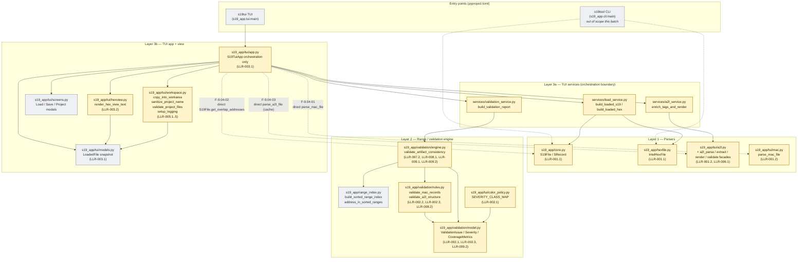
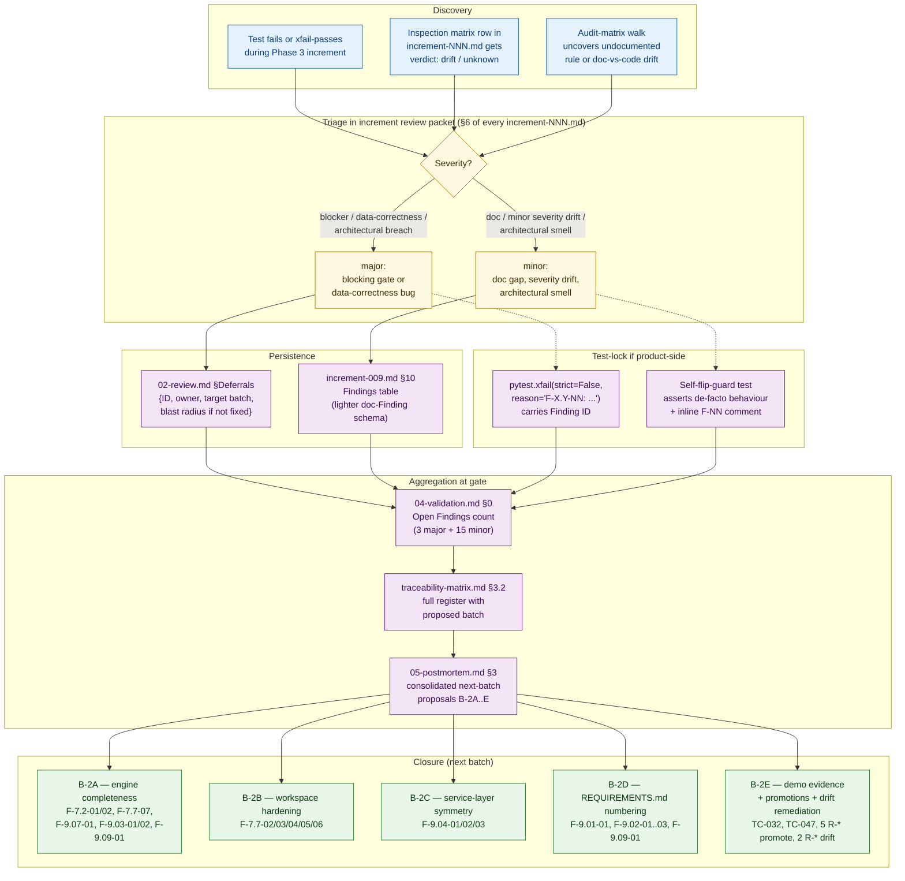

# Architecture diagrams — s19_app — Batch 2026-05-05-batch-01

This document collects the three reference diagrams for the audit batch:

1. **System architecture** — the three-layer codebase (parsers → range/validation engine → TUI services + view), with audit targets highlighted.
2. **V-model dev-flow sequence** — how the 6 phases flowed in this batch, including the iter 2 → iter 3 rollback when the security blockers were found and the increment 1 → 1.5 follow-up.
3. **Finding flow** — how a Finding moves through the system from discovery (test xfail or inspection matrix) to next-batch closure plan.

All three are Mermaid source. Render in any GitHub Markdown viewer or any Mermaid-aware IDE.

Source data:

- [`CLAUDE.md`](../../../CLAUDE.md) §Architecture — three-layer model.
- [`01-requirements.md`](../../01-requirements.md) §1.2 Scope — audit targets per layer.
- [`05-postmortem.md`](../../05-postmortem.md) §0 — phase / iteration summary.
- [`02-review.md`](../../02-review.md) §Deferrals — Finding flow output point.
- [`03-increments/increment-001.md` … `increment-009.md`](../../03-increments) — increment cadence.

---

## 1. System architecture

The three layers of `s19_app`. Yellow nodes are the files this audit batch touched (read or modified). Grey nodes are dependent layers cited but not directly audited (renderers, screens). Service-layer routing is the structural anchor for LLR-003.1; the three documented bypasses (F-9.04-01/02/03) are drawn as dashed arrows to make the orchestration deviations explicit.



**Reading the diagram.**

- **Solid arrows** = routed call (the orchestration contract holds).
- **Dashed red arrows** = documented bypass (`app.py` reaches into a parser layer directly, captured as a Finding). All three are minor-severity and are queued for batch B-2C (service-layer symmetry).
- **Yellow nodes** = files modified or audited in this batch.
- **Grey nodes** = supporting infrastructure cited but not the audit's primary target.

---

## 2. V-model dev-flow sequence

How the 6 phases flowed in this batch, including the iter 2 → iter 3 rollback (security blockers force return to Phase 1) and the increment 1 → 1.5 follow-up (test rename after LLR-005.3 product change broke a pre-existing test by-design). Source: [`05-postmortem.md` §0](../../05-postmortem.md).

```mermaid
sequenceDiagram
    autonumber
    participant User as User<br/>(Javier)
    participant P1 as Phase 1<br/>Requirements
    participant P2 as Phase 2<br/>Review
    participant P3 as Phase 3<br/>Implementation
    participant P4 as Phase 4<br/>Validation
    participant P5 as Phase 5<br/>Post-mortem
    participant P6 as Phase 6<br/>Docs

    User->>P1: dev-flow-init: audit batch
    Note over P1: Iter 1 — initial draft<br/>6 US, top-down HLRs

    P1->>P2: 01-requirements.md iter 1
    Note over P2: architect / qa / security<br/>parallel review

    P2-->>P1: ITERATE — security blockers S-001/S-002<br/>+ user-prompted US-001/002 expansion

    Note over P1: Iter 2 — add HLR-007/008/009<br/>(scope grow)

    P1->>P2: 01-requirements.md iter 2
    Note over P2: Iter 2 review<br/>S-001/S-002 still mis-routed in HLR-005

    P2-->>P1: ITERATE — security rollback<br/>(S-001 destination containment,<br/>S-002 symlink/junction)

    Note over P1: Iter 3 — split LLR-005<br/>into 5.1..5.5; add Finding schema;<br/>add LLR-002.3 message scrubbing

    P1->>P2: 01-requirements.md iter 3 (final)
    P2->>P3: 02-review.md APPROVED<br/>4 majors → §Deferrals

    Note over P3: 9 increments

    P3->>P3: Increment 1 — LLR-005.3<br/>(closes S-001/S-002 inline)
    P3->>P3: Increment 1.5 — test rename<br/>(workspace tightening broke pre-existing test by-design)
    P3->>P3: Increment 2 — snapshot harness + per-class fixtures
    P3->>P3: Increment 3 — LLR-002.3 message scrubbing
    P3->>P3: Increment 4 — LLR-002.1 round-trip (16 tests)
    P3->>P3: Increment 5 — LLR-007.2 co-emission (8 classes; F-7.2-01/02 raised)
    P3->>P3: Increment 6 — LLR-007.4 panel render (8 snapshots)
    P3->>P3: Increment 7 — LLR-005/006/003 sweep (38 tests; F-7.7-02..07 raised)
    P3->>P3: Increment 8 — LLR-009.1/2 determinism + coverage
    P3->>P3: Increment 9 — 9 inspection matrices (doc-only; F-9.* raised)

    Note over P3: Suite 173 → 259<br/>(+86 tests, 0 unexpected fails, 3 documented xfail)

    P3->>P4: 9 increment packets + code/tests
    Note over P4: 60 TCs evaluated<br/>49 pass / 11 gap / 0 fail / 3 xfail

    P4-->>P5: VERDICT = gap<br/>(pass-with-known-gaps)

    Note over P5: Architect + qa-reviewer<br/>parallel retrospective

    P5->>User: Recommend close batch<br/>+ open B-2A as follow-up

    User->>P6: APPROVE — close batch
    P6->>P6: traceability-matrix.md<br/>functionality.md<br/>diagrams/architecture.md
    P6->>User: Phase 6 complete →<br/>/dev-flow-sync-en after merge
```

**Reading the diagram.**

- The two `P2-->>P1: ITERATE` arrows mark the rollbacks: iter 1→2 (user-prompted scope expansion) and iter 2→3 (security-blocker driven rebuild). Per [`05-postmortem.md` §1.D](../../05-postmortem.md), the iter 2→3 rollback was the avoidable one; the architectural lesson — "every HLR that names a module must cite the public-function enumeration that produced it" — is the carry into batch 2.
- Increment 1 → 1.5 is shown as a sub-step inside Phase 3 because 1.5 was a tactical follow-up: the LLR-005.3 product change tightened `copy_into_workarea` and broke a pre-existing test by-design. 1.5 was the gated rename that restored green CI without expanding scope.
- The 3 documented `xfail` decorators sit on tests added in increments 5 (TC-062.a, F-7.2-01), 6 (TC-065.a, F-7.2-01), and 7 (TC-052, F-7.7-07). Each is a green test today that becomes a closure tripwire for the corresponding follow-up batch.
- Phase 6 (this artefact) is the final gate before `/dev-flow-sync-en` uploads the batch to the Obsidian vault.

---

## 3. Finding flow

How a single Finding propagates from discovery through the artefact set to a next-batch closure plan. The flow has two main entry points (test xfail vs. inspection matrix), one persistence point (`02-review.md` §Deferrals for majors), and one closure point (the next batch's `01-requirements.md` seed).



**Reading the diagram.**

- A Finding's discovery channel determines its initial register: a `xfail`-driven Finding is paired with a `pytest.xfail(strict=False, reason="F-NN-NN ...")` decorator (test-lock pattern); an inspection-matrix-driven Finding lives only in the audit matrix until triage.
- Severity decides which register (Phase 4 gate file vs. increment §10). Majors **must** carry the full schema `{ID, owner, target batch, blast radius if not fixed}`; this satisfies `01-requirements.md` §5.3 acceptance criterion. Minors use a lighter schema in `increment-009.md` §10.
- The test-lock layer (xfail / self-flip-guard) is critical: it keeps the suite green AND surfaces the gap as a tripwire that closes naturally when the product fix lands.
- Closure is **always in the next batch**, never inline — the per-increment ≤5-files cap makes inline closure of cross-cutting Findings impractical, and the carry-forward register in `02-review.md` §Deferrals + `traceability-matrix.md` §3.2 is the requirements seed for batch 2.

---

## 4. Diagram-source maintenance notes

- **Format.** All three blocks use Mermaid source — render client-side. No build step, no rendered images checked into git, no extra dev dependencies (per the Phase 6 hard constraint).
- **Single source of truth.** This file is the only diagram artefact for the batch. Any future diagram (e.g. an ADR-specific call graph) should be added as a new section in this file or in a clearly-named sibling under `06-docs/diagrams/` — do NOT scatter `.mmd` source files across the increments.
- **Updating after batch 2.** When B-2A closes F-7.2-01, the dashed-bypass arrow in §1 stays (it is an architectural fact at audit time). The `xfail` annotations in §2 and §3 should be updated to "closed in batch 2" with the increment ID. The closure boxes in §3 should turn green / get strikethrough text once their Findings are crossed off.
- **Validation.** Render in any GitHub Markdown view to verify the syntax. The diagrams use only Mermaid `flowchart` and `sequenceDiagram` features — no plugins, no client-config injection.
