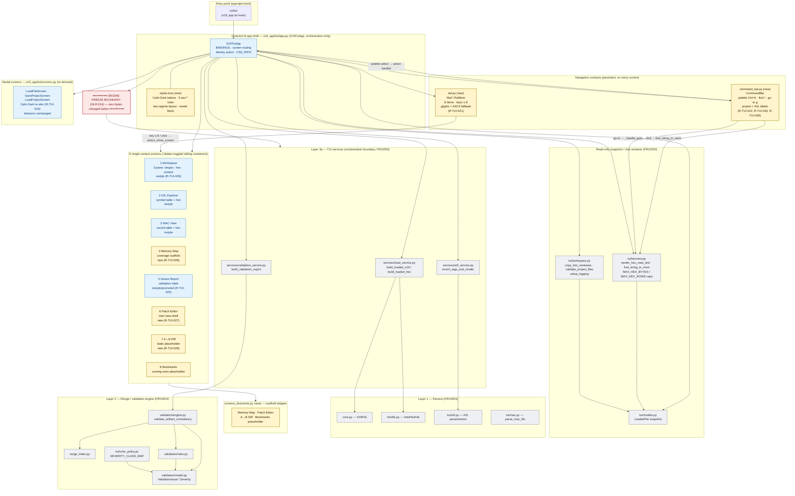
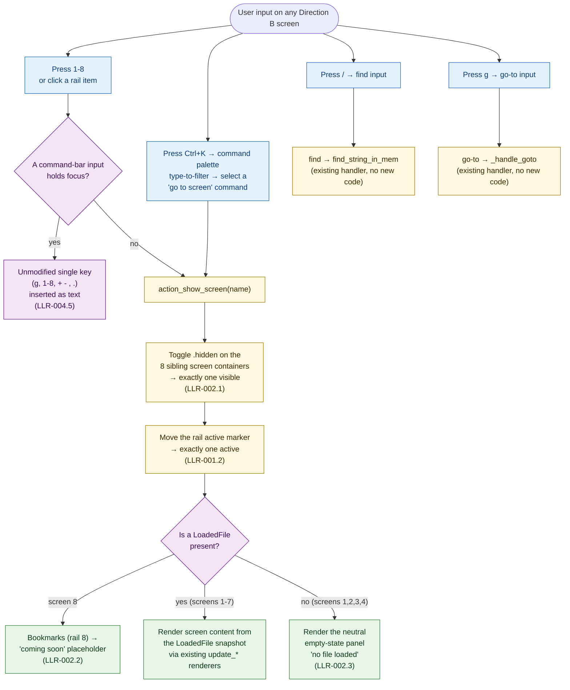
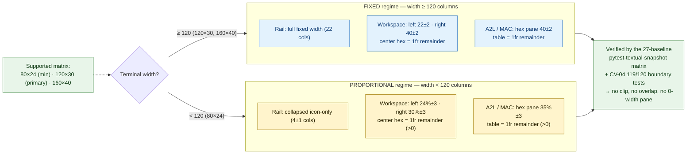

# Architecture diagrams — s19_app — Batch 2026-05-20-batch-02 (Direction B restyle)

This document collects the reference diagrams for the Direction B "Rail + Command" view-layer restyle:

1. **Direction B TUI architecture** — the app shell (rail + command bar + 8 `.hidden`-toggled screen containers) sitting on top of the **frozen** engine/services layer, with the view-layer / engine boundary drawn explicitly.
2. **Screen-routing flow** — how a rail key / palette / command-bar input moves the user between the eight screens.
3. **Two-regime responsive layout** — how the 120-column breakpoint switches the pane-width regime.

All diagrams are Mermaid source — render in any GitHub Markdown viewer or Mermaid-aware IDE. No build step, no rendered images checked into git, no extra dev dependency (Phase 6 hard constraint).

Source data:

- [`CLAUDE.md`](../../../CLAUDE.md) §Architecture — the three-layer model.
- [`01-requirements.md`](../../01-requirements.md) §2.1 (product perspective), §3 (screen inventory), §6 (`R-*` traceability).
- [`03-increments/increment-plan.md`](../../03-increments/increment-plan.md) — the new-module split and the `.hidden`-toggle decision.
- [`04-validation.md`](../../04-validation.md) §2 — the engine-freeze verification.

---

## 1. Direction B TUI architecture

The Direction B restyle adds a **view layer** (yellow) on top of an unchanged engine. The dashed horizontal line is the **freeze boundary**: nothing below it changed this batch — the Phase 4 `git diff main` over all seven frozen modules is empty (HLR-014). The restyle introduces three new modules (`rail.py`, `command_bar.py`, `screens_directionb.py`) plus the extracted `styles.tcss`, all consuming the existing `LoadedFile` snapshot and `tui/services/` exactly as the pre-batch view code did.

**Reading the diagram.**

- **Yellow nodes** = new this batch (`rail.py`, `command_bar.py`, `screens_directionb.py`, `styles.tcss`, the four new scaffold screens).
- **Blue nodes** = restyled — re-laid-out in `app.py` / `screens.py`, same data wiring.
- **Grey nodes below the red boundary** = the frozen engine/services layer — zero bytes changed (verified by `git diff main`, [`04-validation.md`](../../04-validation.md) §2).
- The command bar's find/go-to inputs route to the **existing** `find_string_in_mem` / `_handle_goto` handlers — no new search or address-parsing code was added (LLR-004.6 / LLR-004.2, security finding S-1).
- The eight screens are **sibling containers toggled by the `.hidden` CSS class**, not `push_screen` stacks — this reuses the pre-batch view-toggle mechanism (LLR-002.1) and keeps the persistent command bar / footer and the existing `query_one` test harness intact.

---

## 2. Screen-routing flow

How the user moves between the eight screens. Every path ends at `action_show_screen`, which toggles `.hidden` on the eight sibling containers so exactly one is visible, and moves the rail's single active marker.

**Reading the diagram.**

- Rail key, click and the command palette all converge on `action_show_screen` — there is one routing path, not three.
- The `inputFocus` gate is the LLR-004.5 suppression rule: while a command-bar input has focus, an unmodified single key (`g`, `1`–`8`, `+ - , .`) is typed as text and **does not** navigate; modified keys (`Ctrl+K`, `Ctrl+D`) still fire.
- After routing, the `fileLoaded` gate decides between real content and the neutral empty-state panel — activating Workspace / A2L Explorer / MAC View / Memory Map with no file shows the empty state, never an error or a blank pane.
- Bookmarks (screen 8) always routes to the "coming soon" placeholder regardless of load state — its persistence logic is deferred.

---

## 3. Two-regime responsive layout

The 120-column breakpoint that governs pane widths (HLR-007 / LLR-007.1 / LLR-008.1 / LLR-009.1 / LLR-010.1). This closes the A-03 contradiction between the fixed 84-column chrome and the 80×24 minimum.

**Reading the diagram.**

- The same screen renders in either regime depending purely on terminal width — there is one layout, width-responsive, not two layouts.
- In the proportional regime the rail **collapses to an icon-only 4-column strip** so the side panes plus rail never sum past the 80-column minimum; the center hex pane always receives a strictly positive `1fr` remainder.
- The numeric tolerances (`±2` columns, `±3` percentage points) absorb border/padding rounding without permitting layout drift; both regimes are asserted as numbers by TC-017 / TC-019 / TC-021, not by inspection.
- The 27 SVG baselines (24 restyled-screen cells + 3 scaffold cells) plus the two CV-04 boundary tests are the automated layout-drift guard.

---

## 4. Diagram-source maintenance notes

- **Format.** All blocks use Mermaid source — render client-side. No build step, no rendered images, no extra dev dependency.
- **Single source of truth.** This file is the diagram artefact for the batch archive. The **living** canonical diagram is the repo-root [`docs/diagrams/architecture.md`](../../../../docs/diagrams/architecture.md), seeded this batch — keep that one current as `s19_app` evolves; this batch-archive copy is a point-in-time snapshot of the Direction B restyle.
- **Updating after the next batch.** When the deferred patch/diff/bookmark logic lands, the "scaffold" / "placeholder" labels on screens 6/7/8 in §1 should be updated and the freeze boundary re-drawn (a logic batch will touch the engine). Until then, the freeze boundary in §1 is an accurate architectural fact for batch-02.
- **Validation.** Render in any GitHub Markdown view to verify syntax. The diagrams use only Mermaid `flowchart` features — no plugins, no client-config injection.
