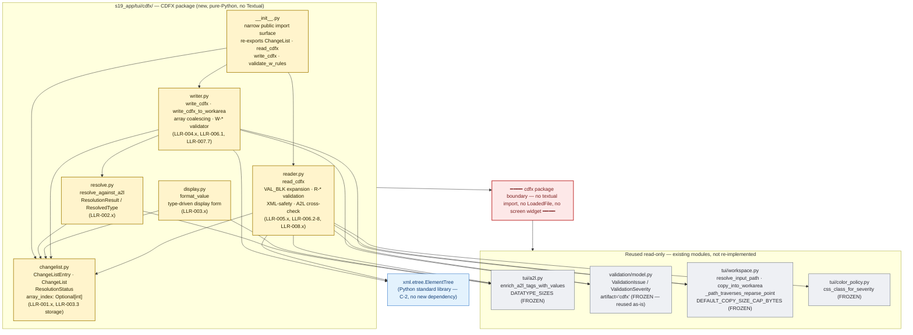
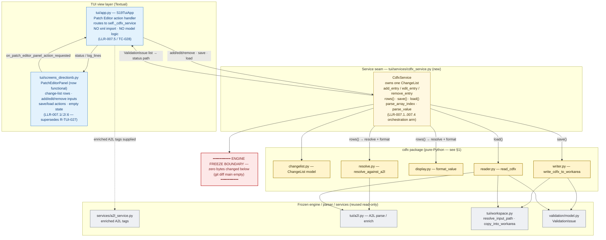

# Architecture diagrams — s19_app — Batch 2026-05-21-batch-03 (functional Patch Editor + ASAM CDFX)

This document collects the reference diagrams for the functional Patch Editor + ASAM CDFX (`.cdfx`) read/write feature:

1. **The `s19_app/tui/cdfx/` package** — the six-module CDFX package, its internal structure, and its **boundary**: pure Python (`xml.etree.ElementTree` only), no Textual import.
2. **Patch Editor → `cdfx_service` → `cdfx` package flow** — how a Patch Editor action reaches the CDFX handler through the service seam, and how the engine stays frozen below.
3. **CDFX read/write data flow** — the write path (change-list → coalesce → `.cdfx`) and the read path (`.cdfx` → safety gate → parse → expand → change-list).

All diagrams are Mermaid source — render in any GitHub Markdown viewer or Mermaid-aware IDE. No build step, no rendered images checked into git, no extra dev dependency (Phase 6 hard constraint).

Source data:

- [`CLAUDE.md`](../../../CLAUDE.md) §Architecture — the three-layer model.
- [`01-requirements.md`](../../01-requirements.md) §2.1 (product perspective), §3 (HLR), §4 (LLR), §6.2 (design decisions).
- [`03-increments/increment-plan.md`](../../03-increments/increment-plan.md) — the package split (§A.0) and the 11-increment sequence.
- [`04-validation.md`](../../04-validation.md) §2 — the engine-freeze verification.
- [`design-input/cdfx-research.md`](../../design-input/cdfx-research.md) — the CDFX structure and the `W-*`/`R-*` rule set (§7).

---

## 1. The `s19_app/tui/cdfx/` package

Batch-03 adds the **CDFX package** (gold) — a six-module data-processing layer that sits beside the parsers (`parsers → engine → tui`), keeping all XML serialize/parse logic out of `app.py`. The package is **pure Python**: it imports only the standard library (`xml.etree.ElementTree`, `dataclasses`, `enum`, `typing`) plus the existing `validation.model` and, for resolution, `tui/a2l.py` and `tui/workspace.py` — **no Textual import**. The dashed line is the package boundary: the `cdfx` package never imports `textual` and never touches a `LoadedFile` or a screen widget.

**Reading the diagram.**

- **Gold nodes** = the six new `cdfx` package modules. The split is one concern per module (model · resolution · display · writer · reader) plus the `__init__.py` import surface.
- The dependency direction inside the package is strict: `changelist.py` is the leaf (pure data, no other `cdfx` import); `resolve.py`, `display.py`, `writer.py` and `reader.py` depend on `changelist.py`; `writer.py` additionally uses `resolve.py`'s resolved-type metadata.
- **Blue** = the standard library — `writer.py` and `reader.py` use `xml.etree.ElementTree` only, satisfying constraint C-2 (no new runtime dependency).
- **Grey nodes below the red boundary** = existing modules reused **read-only**: `tui/a2l.py` (the enriched A2L pipeline for resolution), `validation/model.py` (the `ValidationIssue` model — reused as-is, `artifact="cdfx"` passed as a string, no model edit), `tui/workspace.py` (path resolution + work-area containment + the 256 MB cap), `tui/color_policy.py` (severity → `sev-*` class).
- The red boundary is the **no-Textual** rule: the `cdfx` package is fully unit-testable without an app instance — it never imports `textual`, never reads a `LoadedFile`, never touches a screen widget. The Textual coupling lives one layer up, in `cdfx_service.py` and the Patch Editor screen (§2).

---

## 2. Patch Editor → `cdfx_service` → `cdfx` package flow

How a Patch Editor action reaches the CDFX handler. The `CdfxService` seam (`tui/services/cdfx_service.py`) is the single boundary between the Textual view layer and the pure-Python `cdfx` package — it mirrors the existing `a2l_service` pattern so `app.py` and the screen stay presentational and carry no XML / model logic (constraint C-8, LLR-007.5). The dashed red line is the **engine freeze boundary**: nothing below it changed this batch (`git diff main` empty over all six engine modules).

**Reading the diagram.**

- **Blue** = the Textual view layer. The Patch Editor screen (`PatchEditorPanel`) emits an action message; `app.py`'s handler routes it to `self._cdfx_service`. `app.py` holds **only** UI-state wiring — there is no `xml.etree.ElementTree` import and no `write_cdfx` / `read_cdfx` / `validate_w_rules` call in `app.py` (verified by inspection, TC-028).
- **Yellow** = the `CdfxService` seam — the single module that knows both worlds. It owns one `ChangeList`, maps the screen's text inputs to model calls (`parse_array_index` turns an empty index field into a `None`-index scalar entry; `parse_value` parses the typed value), and shapes the `cdfx` package's results into display rows and status lines for the screen.
- **Gold** = the `cdfx` package (the six modules of §1) — reached only through the service.
- **Grey nodes below the red boundary** = the frozen engine / parser layer. The CDFX feature consumes the enriched A2L tags and `workspace.py` helpers read-only; it changed zero bytes of any engine module. The `ValidationIssue` model is reused as-is.
- The return path is symmetric: every CDFX `ValidationIssue` (write-side `W-*` / read-side `R-*`) flows back through the service to `app.py`'s status path and onto the Patch Editor's status / `log_lines`.

---

## 3. CDFX read/write data flow

The two CDFX data paths. **Write** turns a change-list into a `.cdfx`; **read** turns a `.cdfx` back into a change-list. The two are inverses — coalesce-on-write (LLR-004.9) then expand-on-read (LLR-005.6) reproduces the `(parameter_name, array_index)` key set exactly, so a write→read cycle is lossless (verified end-to-end by the TC-024 round-trip).

```mermaid
flowchart TB
    subgraph writepath["WRITE path — write_cdfx / write_cdfx_to_workarea (LLR-004.x, LLR-007.7)"]
        wIn(["ChangeList — resolved entries<br/>keyed (parameter_name, array_index)"])
        wResolve["Each entry resolved against the A2L<br/>RESOLVED entries are writable"]
        wExclude["Exclude unresolved / index-out-of-range<br/>→ one W-INSTANCE-EXCLUDED per entry"]
        wGroup["Group writable entries by parameter_name<br/>(first-appearance order)"]
        wSparse{"Integer-index group<br/>contiguous zero-based 0..N-1?"}
        wReject["Reject the whole group<br/>→ one W-ARRAY-SPARSE, no SW-INSTANCE<br/>(never gap-fill)"]
        wCoalesce["Coalesce array group → one VAL_BLK SW-INSTANCE<br/>one VG of ascending positional V<br/>None-index → scalar VALUE/BOOLEAN (V) or ASCII (VT)"]
        wBackbone["Emit MSRSW backbone<br/>CATEGORY=CDF20 · SW-INSTANCE-TREE chain<br/>+ 'Created with s19_app CDF 2.0 Writer' note"]
        wEmpty{"Zero writable entries?"}
        wEmptyIssue["+ one W-EMPTY-CHANGELIST<br/>(backbone-only .cdfx still valid)"]
        wContain["Resolve target under .s19tool/workarea/<br/>reject reparse-point traversal · dedup-suffix<br/>(reuse copy_into_workarea guards)"]
        wOut(["well-formed UTF-8 .cdfx file<br/>+ ValidationIssue list"])
    end

    subgraph readpath["READ path — read_cdfx (LLR-005.x, LLR-006.x, LLR-008.x)"]
        rIn(["user-supplied .cdfx path or bytes"])
        rResolvePath["Resolve path via workspace.resolve_input_path<br/>unresolvable → one R-XML-PARSE, no file opened"]
        rSize{"On-disk size ≤ 256 MB?"}
        rSizeReject["one R-XML-PARSE — never parsed into memory"]
        rSafe{"DOCTYPE / <!ENTITY> present?<br/>nesting depth within bound?"}
        rSafeReject["one R-XML-PARSE — no entity expanded<br/>no external file read"]
        rParse["ElementTree parse — namespace-tolerant<br/>local-name match, {uri} stripped"]
        rBackbone["Locate MSRSW + SW-INSTANCE-TREE backbone<br/>SW-INSTANCE search scoped to the backbone"]
        rExpand["Per SW-INSTANCE: expand by CATEGORY<br/>VAL_BLK VG of N V → N entries (name,0..N-1)<br/>VALUE/BOOLEAN → one scalar (array_index=None)<br/>ASCII → one string (array_index=None)"]
        rRules["Apply R-* structural rules<br/>+ R-VERSION-UNKNOWN tolerance<br/>+ R-CATEGORY-UNSUPPORTED read-only"]
        rCross["If an A2L is loaded: cross-check<br/>R-NAME-NOT-IN-A2L · R-ARRAY-LEN-MISMATCH"]
        rOut(["ChangeList + ValidationIssue list<br/>(collect-don't-abort — never raises)"])
    end

    wIn --> wResolve --> wExclude --> wGroup --> wSparse
    wSparse -- "no (sparse)" --> wReject --> wEmpty
    wSparse -- "yes" --> wCoalesce --> wBackbone --> wEmpty
    wEmpty -- "yes" --> wEmptyIssue --> wContain
    wEmpty -- "no" --> wContain
    wContain --> wOut

    rIn --> rResolvePath --> rSize
    rSize -- "no" --> rSizeReject --> rOut
    rSize -- "yes" --> rSafe
    rSafe -- "unsafe" --> rSafeReject --> rOut
    rSafe -- "safe" --> rParse --> rBackbone --> rExpand --> rRules --> rCross --> rOut

    classDef ioNode fill:#e8f5e9,stroke:#2e7d32,color:#0e3a13
    classDef stepNode fill:#fff4cc,stroke:#a07a00,color:#2a2200
    classDef gateNode fill:#f3e5f5,stroke:#6a1b9a,color:#3a0d52
    classDef rejectNode fill:#fde8e8,stroke:#c43a3a,color:#7a1d1d

    class wIn,wOut,rIn,rOut ioNode
    class wResolve,wExclude,wGroup,wCoalesce,wBackbone,wContain,rResolvePath,rParse,rBackbone,rExpand,rRules,rCross stepNode
    class wSparse,wEmpty,rSize,rSafe gateNode
    class wReject,wEmptyIssue,wSizeReject,rSizeReject,rSafeReject rejectNode
```

**Reading the diagram.**

- **Green** = the change-list / file inputs and outputs.
- **WRITE path.** The writer never raises — every excluded entry, sparse array group and empty change-list becomes a `ValidationIssue` alongside a still-valid `.cdfx`. The two decision gates are the **sparse-array rule** (reject, never gap-fill — a calibration-safety decision: gap-filling would write a value the engineer never entered) and the **zero-writable-entries rule** (`W-EMPTY-CHANGELIST`). The final step resolves the target under `.s19tool/workarea/` reusing the existing `workspace.py` containment guards.
- **READ path.** Three gates run **before** any parsing — path resolution, the 256 MB size cap, and the `DOCTYPE`/entity + nesting-depth safety check — so an unresolvable, oversized or malicious `.cdfx` is rejected as one `R-XML-PARSE` issue with the file never loaded into memory and no entity ever expanded. After the gates, parsing is namespace-tolerant and the `SW-INSTANCE` search is scoped to the backbone (so a crafted out-of-tree instance is not absorbed). Expansion is the read-side inverse of the writer's coalescing.
- **The inverse property.** A `VAL_BLK` written from *N* coalesced array-element entries re-expands to exactly those *N* keyed entries; a `None`-index scalar/string survives as `array_index is None`. This is what makes the write→read cycle lossless — the property the TC-024 round-trip pins.
- **Collect-don't-abort.** Every reject node on both paths produces a `ValidationIssue` rather than an exception; the reader returns `(ChangeList, issues)` and never raises on malformed input.

---

## 4. Diagram-source maintenance notes

- **Format.** All blocks use Mermaid source — render client-side. No build step, no rendered images, no extra dev dependency.
- **Single source of truth.** This file is the diagram artefact for the batch-03 archive. The **living** canonical diagram is the repo-root [`docs/diagrams/architecture.md`](../../../../docs/diagrams/architecture.md) — keep that one current as `s19_app` evolves; this batch-archive copy is a point-in-time snapshot of the CDFX / Patch Editor feature.
- **Updating after the next batch.** When the deferred apply-to-image / undo-redo logic lands, the "(now functional)" label on the Patch Editor and the §3 write path will need extending (an apply path will touch the firmware image). Until then, the engine-freeze boundary in §1 and §2 is an accurate architectural fact for batch-03.
- **Validation.** Render in any GitHub Markdown view to verify syntax. The diagrams use only Mermaid `flowchart` features — no plugins, no client-config injection.
