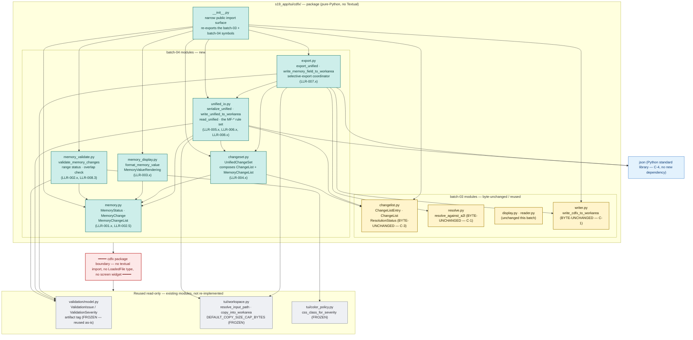

# Architecture diagrams — s19_app — Batch 2026-05-21-batch-04 (memory-value editing + unified change-set + selective export)

This document collects the reference diagrams for the memory-value editing + unified change-set + selective-export feature:

1. **The extended `s19_app/tui/cdfx/` package** — the six new batch-04 modules added beside the batch-03 CDFX modules, the internal dependency structure, and the package **boundary**: pure Python (`json` only), no Textual import.
2. **Patch Editor → `cdfx_service` → `cdfx` package flow** — how a Patch Editor memory-change action reaches the `cdfx` package through the extended service seam, and how the engine and the batch-03 CDFX writer stay frozen below.
3. **Unified-file write/read + selective-export data flow** — the unified-file write path, the unified-file read path (with the `MF-*` gates), and the selective-export split into a CDFX file plus a memory-field JSON file.

All diagrams are Mermaid source — render in any GitHub Markdown viewer or Mermaid-aware IDE. No build step, no rendered images checked into git, no extra dev dependency (Phase 6 hard constraint).

Source data:

- [`CLAUDE.md`](../../../../CLAUDE.md) §Architecture — the three-layer model.
- [`01-requirements.md`](../../01-requirements.md) §2.1 (product perspective), §3 (HLR), §4 (LLR), §6.2 (design decisions).
- [`03-increments/increment-plan.md`](../../03-increments/increment-plan.md) — the module-placement decision (§A) and the 9-increment sequence.
- [`04-validation.md`](../../04-validation.md) §2 — the engine-freeze + batch-03-byte-unchanged verification.
- The batch-03 archive diagrams: [`.dev-flow/2026-05-21-batch-03/06-docs/diagrams/architecture.md`](../../../2026-05-21-batch-03/06-docs/diagrams/architecture.md).

---

## 1. The extended `s19_app/tui/cdfx/` package

Batch-04 adds **six new modules** (teal) to the existing `s19_app/tui/cdfx/` package — a peer addition beside the batch-03 CDFX modules (gold), not a new architectural layer. The new modules form the memory-change model + unified change-set + unified-file I/O + selective-export coordinator. Like the batch-03 modules they are **pure Python**: they import only the standard library (`json`, `dataclasses`, `enum`, `typing`) plus the existing `validation.model`, `tui/workspace.py`, `tui/color_policy.py` and — for selective export — the **byte-unchanged** batch-03 `writer.py` / `resolve.py`. The dashed red line is the package boundary: the `cdfx` package never imports `textual` and never touches a `LoadedFile` *type* or a screen widget. (The loaded-image *ranges* reach `memory_validate.py` as a plain `(start, end)` list passed in by the service — the package does not import `models.py`.)

**Reading the diagram.**

- **Teal nodes** = the six new batch-04 modules. The split is one concern per module (memory model · memory validation · memory display · unified container · unified-file I/O · selective export).
- **Gold nodes** = the batch-03 CDFX modules. `changelist.py`, `resolve.py` and `writer.py` are **byte-unchanged** this batch (constraints C-1, C-3) — `changeset.py` composes `changelist.py`, `export.py` calls `writer.py` and `resolve.py`, none of them is modified. `__init__.py` is edited (re-exports only).
- The dependency direction is strict: `memory.py` is a leaf (pure data, no other `cdfx` import); `memory_validate.py`, `memory_display.py` and `changeset.py` depend on `memory.py`; `unified_io.py` depends on `changeset.py`; `export.py` depends on `changeset.py`, `unified_io.py` and the batch-03 `writer.py` / `resolve.py`.
- **Blue** = the standard library — `unified_io.py` and `export.py` use `json` only, satisfying constraint C-4 (no new runtime dependency). Unlike the batch-03 XML path, `json` has no entity-expansion / DOCTYPE attack surface.
- **Grey nodes below the red boundary** = existing modules reused **read-only**: `validation/model.py` (the `ValidationIssue` model, reused as-is with a free-form `artifact` string tag), `tui/workspace.py` (path resolution + work-area containment + the 256 MB cap), `tui/color_policy.py` (severity → `sev-*` class).
- The red boundary is the **no-Textual** rule: the `cdfx` package is fully unit-testable without an app instance. The Textual coupling lives one layer up, in `cdfx_service.py` and the Patch Editor screen (§2).

---

## 2. Patch Editor → `cdfx_service` → `cdfx` package flow

How a Patch Editor memory-change action reaches the `cdfx` package. The `CdfxService` seam (`tui/services/cdfx_service.py`) is **extended** — it gains memory-change operations and unified save / load / export beside its existing batch-03 parameter-change operations — and stays the single boundary between the Textual view layer and the pure-Python `cdfx` package, so `app.py` and the screen stay presentational and carry no JSON / model logic (constraint C-7, LLR-009.2). The dashed red line is the **engine + batch-03-CDFX freeze boundary**: nothing below it changed this batch (`git diff main` empty over all six engine modules; `writer.py` / `resolve.py` SHA-256-pinned byte-unchanged).

```mermaid
flowchart TB
    subgraph tui["TUI view layer (Textual)"]
        app["tui/app.py — S19TuiApp<br/>on_patch_editor_panel_action_requested<br/>routes add/edit/remove_memory · save/load_unified · export<br/>to self._cdfx_service<br/>NO json import · NO model logic (TC-027)"]
        patch["tui/screens_directionb.py<br/>PatchEditorPanel (extended)<br/>memory-change rows · address + new-bytes inputs<br/>add/edit/remove · save/load/export-selective controls<br/>batch-03 parameter controls survive (RK-5)"]
    end

    subgraph svc["Service seam — tui/services/cdfx_service.py (extended)"]
        cdfxsvc["CdfxService<br/>owns one UnifiedChangeSet<br/>add/edit/remove_memory_change · memory_rows()<br/>save_unified · load_unified · export_selective<br/>(+ the batch-03 parameter-change ops, unchanged)"]
    end

    subgraph pkg["cdfx package (pure-Python — see §1)"]
        memory["memory.py — MemoryChangeList"]
        memvalidate["memory_validate.py — validate_memory_changes"]
        memdisplay["memory_display.py — format_memory_value"]
        changeset["changeset.py — UnifiedChangeSet"]
        unifiedio["unified_io.py — write/read unified file"]
        export["export.py — export_unified"]
        b03cdfx["writer.py / resolve.py<br/>(batch-03 — BYTE-UNCHANGED)"]
    end

    freeze["━━━ ENGINE + batch-03-CDFX FREEZE — zero bytes changed below (git diff main empty; writer/resolve SHA-256-pinned) ━━━"]

    subgraph frozen["Frozen — reused read-only"]
        a2lsvc["services/a2l_service.py<br/>enriched A2L tags (for export-time re-resolution)"]
        loadsvc["services/load_service.py + models.py<br/>LoadedFile.ranges snapshot"]
        workspace["tui/workspace.py<br/>resolve_input_path · copy_into_workarea"]
        valmodel["validation/model.py — ValidationIssue"]
    end

    patch -->|"on_patch_editor_panel_action_requested"| app
    app -->|"add/edit/remove_memory · save/load_unified · export"| cdfxsvc
    cdfxsvc --> changeset
    cdfxsvc --> memory
    cdfxsvc -->|"memory_rows() → validate + format"| memvalidate
    cdfxsvc -->|"memory_rows() → validate + format"| memdisplay
    cdfxsvc -->|"save_unified / load_unified"| unifiedio
    cdfxsvc -->|"export_selective"| export
    export --> b03cdfx
    cdfxsvc -->|"ValidationIssue list → status path"| app
    app -->|"status / log_lines"| patch

    cdfxsvc --> freeze
    cdfxsvc -.->|"loaded-image ranges supplied"| loadsvc
    cdfxsvc -.->|"enriched A2L tags supplied"| a2lsvc
    unifiedio --> workspace
    export --> workspace
    unifiedio --> valmodel
    export --> valmodel
    memvalidate --> valmodel

    classDef viewNode fill:#e3f2fd,stroke:#1565c0,color:#0d3a73
    classDef svcNode fill:#fff8e1,stroke:#a07a00,color:#3a2900
    classDef pkgNew fill:#cdeeea,stroke:#1f7a6e,stroke-width:1.5px,color:#0d3a34
    classDef pkgOld fill:#fff4cc,stroke:#a07a00,stroke-width:1.5px,color:#2a2200
    classDef frozenNode fill:#eef0f4,stroke:#5b6473,color:#2a2a30
    classDef boundaryNode fill:#fde8e8,stroke:#c43a3a,stroke-width:2px,color:#7a1d1d

    class app,patch viewNode
    class cdfxsvc svcNode
    class memory,memvalidate,memdisplay,changeset,unifiedio,export pkgNew
    class b03cdfx pkgOld
    class a2lsvc,loadsvc,workspace,valmodel frozenNode
    class freeze boundaryNode
```

**Reading the diagram.**

- **Blue** = the Textual view layer. The Patch Editor screen (`PatchEditorPanel`) emits an action message; `app.py`'s handler routes it to `self._cdfx_service`. `app.py` holds **only** UI-state wiring — there is no `import json` for the change-set feature and no `serialize_unified` / `read_unified` / `export_unified` call in `app.py` (verified by inspection, TC-027). The batch-03 parameter-change rows and controls **survive** intact (RK-5, asserted by `test_tc032_memory_and_parameter_rows_coexist`).
- **Yellow** = the **extended** `CdfxService` seam — the single module that knows both worlds. It now owns one `UnifiedChangeSet` (the parameter `ChangeList` + the `MemoryChangeList`), maps the screen's address / new-bytes inputs to memory-change model calls, and shapes the `cdfx` package's results into display rows and status lines.
- **Teal** = the new batch-04 `cdfx` modules; **gold** = the byte-unchanged batch-03 `writer.py` / `resolve.py`, reached only by `export.py`.
- **Grey nodes below the red boundary** = the frozen engine / service layer. The memory-change validator consumes the `LoadedFile.ranges` snapshot read-only; the selective export consumes the enriched A2L tags read-only for the export-time re-resolution. The `ValidationIssue` model is reused as-is. The batch-03 CDFX writer/resolver are SHA-256-pinned byte-unchanged.
- The return path is symmetric: every `ValidationIssue` (memory-validation warning, `MF-*` rule violation, per-half export issue) flows back through the service to `app.py`'s status path and onto the Patch Editor's status / `log_lines`.

---

## 3. Unified-file write/read + selective-export data flow

The three batch-04 data paths. **Write** turns a `UnifiedChangeSet` into one unified JSON file; **read** turns a unified JSON file back into a `UnifiedChangeSet`; **selective export** splits a `UnifiedChangeSet` into a CDFX `.cdfx` file (parameter half) plus a memory-field JSON file (memory half). All three are collect-don't-abort — every fault becomes a `ValidationIssue`, the only intentional raise is `MemoryChange.__post_init__`'s construction-time `ValueError`.

```mermaid
flowchart TB
    subgraph writepath["UNIFIED WRITE — serialize_unified / write_unified_to_workarea (LLR-005.x)"]
        wIn(["UnifiedChangeSet<br/>parameter ChangeList + MemoryChangeList"])
        wSerialize["serialize_unified → JSON document<br/>format-id 's19app-unified-changeset' · version '1.0'<br/>parameter half (ChangeListEntry fields)<br/>memory half = array of objects (address int field)"]
        wTemp["Serialize to .s19tool/workarea/temp/<br/>(staged transient file)"]
        wContain["copy_into_workarea → resolve under .s19tool/workarea/<br/>reject reparse-point traversal · dedup-suffix"]
        wOSErr{"OSError on staged write?"}
        wIssue["one MF-WRITE-CONTAINMENT ValidationIssue<br/>(no raise — S57-02 closure)"]
        wOut(["unified .json file + ValidationIssue list"])
    end

    subgraph readpath["UNIFIED READ — read_unified (LLR-006.x, LLR-008.x)"]
        rIn(["user-supplied unified-file path"])
        rResolvePath{"resolve_input_path succeeds?"}
        rPathReject["one MF-PATH-UNRESOLVED — no file opened"]
        rSize{"On-disk size ≤ 256 MB?"}
        rSizeReject["one MF-SIZE-CAP — never loaded into memory"]
        rParse{"json.load OK?<br/>(catches JSONDecodeError AND RecursionError)"}
        rParseReject["one MF-JSON-PARSE — empty change-set"]
        rShape{"Recognised parameter + memory halves?"}
        rShapeReject["one MF-BAD-STRUCTURE — empty change-set, no KeyError"]
        rRules["Per-entry MF-* rules + version tolerance<br/>MF-NO-ADDRESS · MF-EMPTY-BYTES · MF-BYTE-RANGE<br/>MF-VERSION-UNKNOWN (info, continue)"]
        rCeiling["Decoded-structure ceiling<br/>entry count ≤ 100 000 · run length ≤ 1 048 576<br/>breach → MF-ENTRY-LIMIT, drop offender, keep rest"]
        rOut(["UnifiedChangeSet + ValidationIssue list<br/>(collect-don't-abort — never raises)"])
    end

    subgraph exportpath["SELECTIVE EXPORT — export_unified (LLR-007.x)"]
        eIn(["UnifiedChangeSet + loaded A2L tags"])
        eResolve["Re-resolve the parameter ChangeList<br/>via batch-03 resolve_against_a2l<br/>no A2L → unresolved result + one info issue (no raise)"]
        eCdfx["write_cdfx_to_workarea (batch-03 — UNCHANGED)<br/>→ .cdfx file (parameter half)"]
        eMem["write_memory_field_to_workarea<br/>→ memory-field .json (memory half, array-of-objects)"]
        eCombine["Combine issues · tag artifact<br/>param-half / memory-half<br/>(halves export independently)"]
        eOut(["two distinct work-area files:<br/>.cdfx + memory-field .json<br/>+ combined ValidationIssue list"])
    end

    wIn --> wSerialize --> wTemp --> wContain --> wOSErr
    wOSErr -- "yes" --> wIssue --> wOut
    wOSErr -- "no" --> wOut

    rIn --> rResolvePath
    rResolvePath -- "no" --> rPathReject --> rOut
    rResolvePath -- "yes" --> rSize
    rSize -- "no" --> rSizeReject --> rOut
    rSize -- "yes" --> rParse
    rParse -- "no" --> rParseReject --> rOut
    rParse -- "yes" --> rShape
    rShape -- "no" --> rShapeReject --> rOut
    rShape -- "yes" --> rRules --> rCeiling --> rOut

    eIn --> eResolve --> eCdfx
    eResolve --> eMem
    eCdfx --> eCombine
    eMem --> eCombine
    eCombine --> eOut

    classDef ioNode fill:#e8f5e9,stroke:#2e7d32,color:#0e3a13
    classDef stepNode fill:#cdeeea,stroke:#1f7a6e,color:#0d3a34
    classDef gateNode fill:#f3e5f5,stroke:#6a1b9a,color:#3a0d52
    classDef rejectNode fill:#fde8e8,stroke:#c43a3a,color:#7a1d1d

    class wIn,wOut,rIn,rOut,eIn,eOut ioNode
    class wSerialize,wTemp,wContain,rRules,rCeiling,eResolve,eCdfx,eMem,eCombine stepNode
    class wOSErr,rResolvePath,rSize,rParse,rShape gateNode
    class wIssue,rPathReject,rSizeReject,rParseReject,rShapeReject rejectNode
```

**Reading the diagram.**

- **Green** = the change-set / file inputs and outputs.
- **UNIFIED WRITE.** The writer serializes the `UnifiedChangeSet` to JSON — a format-id + version header, the parameter half as plain `ChangeListEntry` fields, the memory half as an **array of objects** with `address` as an integer field (never a JSON object key — DD-10). It writes to `.s19tool/workarea/temp/` first then calls the **unchanged** `copy_into_workarea` to place the file under `.s19tool/workarea/` — reusing the batch-03 containment guards (reparse-point rejection, dedup-suffix). A staged-write `OSError` becomes one `MF-WRITE-CONTAINMENT` issue (the increment-9 S57-02 closure), never an escaping exception.
- **UNIFIED READ.** Five gates run in order, each a collect-don't-abort reject point: path resolution (`MF-PATH-UNRESOLVED`), the 256 MB on-disk size cap (`MF-SIZE-CAP`, applied **before** `json.load`), the JSON parse (`MF-JSON-PARSE` — the `except` clause catches `RecursionError`, a `RuntimeError`, as well as `JSONDecodeError`), the structural-shape check (`MF-BAD-STRUCTURE`, **before** any half is indexed so no `KeyError` escapes), then the per-entry `MF-*` rules and the decoded-structure ceiling (`MF-ENTRY-LIMIT` — entry count ≤ 100 000, single run length ≤ 1 048 576; on a breach the offender is dropped and the rest kept). An unknown version is `MF-VERSION-UNKNOWN` info-level and parsing continues. The reader returns `(UnifiedChangeSet, issues)` and never raises.
- **SELECTIVE EXPORT.** The coordinator first **re-resolves** the parameter half against the loaded A2L through the batch-03 `resolve_against_a2l` path (with no A2L it produces an unresolved result and one info issue, never a raise). It then feeds the freshly-computed `ResolutionResult` to the **unchanged** batch-03 `write_cdfx_to_workarea` for the `.cdfx`, and writes the memory half as a separate memory-field JSON file. The two halves export **independently** — a fault in one does not block the other; every issue is tagged on its `ValidationIssue.artifact` field (`param-half` / `memory-half`). The result is exactly **two distinct** work-area files, never merged.
- **The unified file is the working-document format; the CDFX file is the hand-off format.** A unified-file write→read cycle is lossless (the TC-025 round-trip pins it — exact float `==`, exact ordered byte runs). Selective export is one-way: it splits the unified change-set into the two artefacts each downstream consumer expects.

---

## 4. Diagram-source maintenance notes

- **Format.** All blocks use Mermaid source — render client-side. No build step, no rendered images, no extra dev dependency.
- **Single source of truth.** This file is the diagram artefact for the batch-04 archive. The **living** canonical diagram is the repo-root [`docs/diagrams/architecture.md`](../../../../docs/diagrams/architecture.md) — keep that one current as `s19_app` evolves; this batch-archive copy is a point-in-time snapshot of the memory-value editing / unified-change-set feature.
- **Updating after the next batch.** When the deferred apply-to-image / undo-redo logic lands, the §3 unified-write path and a new apply path will need extending (an apply path will touch the firmware image — currently the memory-change model is recorded intent only). Until then, the engine + batch-03-CDFX freeze boundary in §1 and §2 is an accurate architectural fact for batch-04.
- **Validation.** Render in any GitHub Markdown view to verify syntax. The diagrams use only Mermaid `flowchart` features — no plugins, no client-config injection.
