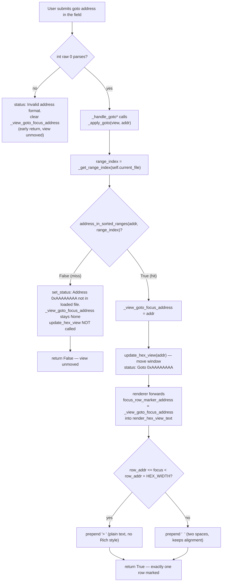

# US-03 — Goto input → membership check → status (miss) or focus + marker (hit)

Covers HLR-003 / LLR-003.1–003.5. All three `_handle_goto*` handlers route through the shared `_apply_goto(view, addr)` helper, which does the binary-search membership check and decides between the miss path (status only, view unmoved) and the hit path (set focus + render the `> ` marker).

**Notes**
- `LoadedFile` exposes `ranges`; the membership index is resolved through the cached `_get_range_index(...)`, not a raw `sorted_ranges` attribute.
- The marker carries no Rich `style=`, no `sev-*` class, and no color — it cannot collide with validation severity colors or the search/MAC byte highlights.
