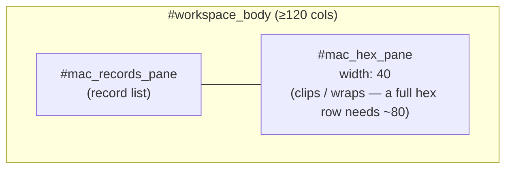
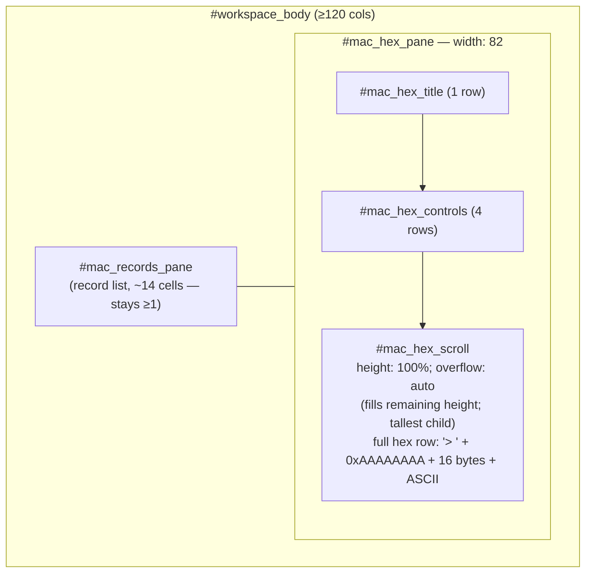

# US-02 — MAC two-pane layout, before → after (≥120-column regime)

Covers HLR-002 / LLR-002.1–002.4. Only the comfortable (≥120-column) regime changed; the narrow (<120-column) proportional regime is byte-identical.

## Before — `#mac_hex_pane { width: 40 }` (clips a full hex row)

## After — `#mac_hex_pane { width: 82 }` + `#mac_hex_scroll { height: 100% }`

**Invariants:** at terminal width 120 the hex pane measures ≥ 82 cells and the records pane ≥ 1 cell; the `#mac_hex_scroll` height equals the pane height minus the title (1) and controls (4) and is the tallest child of the pane.
