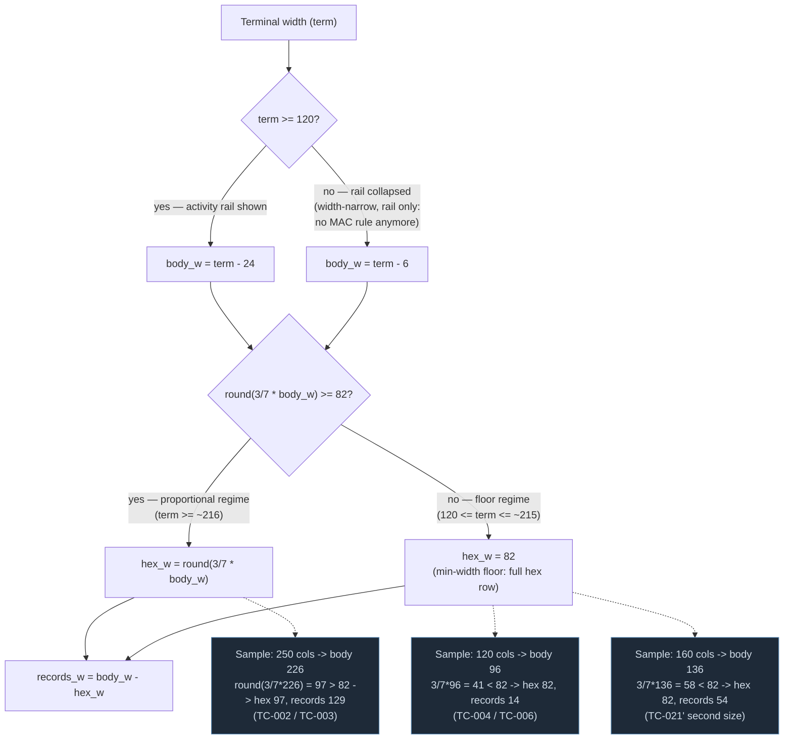

# Diagram — MAC View width-resolution model — Batch 2026-06-09-batch-06

How the MAC View resolves its two pane widths from the terminal width under the batch-06 proportional+floor model (`s19_app/tui/styles.tcss`: `#mac_records_pane 4fr`, `#mac_hex_pane 3fr; min-width: 82`). The activity rail determines `body_w`; the hex pane takes the larger of its proportional share and the 82-cell full-row floor; the records pane absorbs the rest. Sample points are the three measured widths from `04-validation.md` (TC-002/003 at 250, TC-004/006 at 120) plus the intermediate 160-col case.

