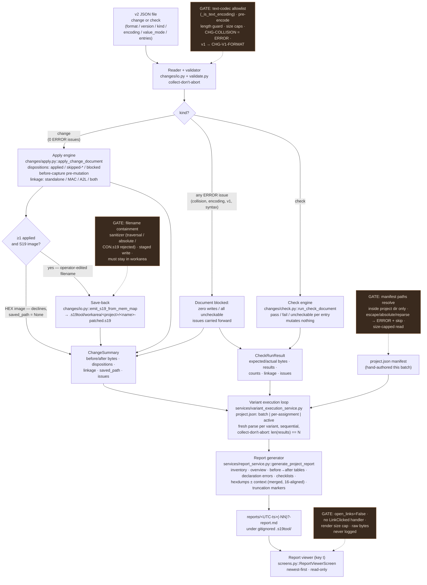

# Diagram — change/check → execution → report flow — Batch 2026-06-10-batch-07

How a v2 JSON document flows through the batch-07 system, from file on disk to rendered report. One reader serves both document kinds (`changes/io.py` + `validate.py`); the `kind` field routes to the apply engine (`changes/apply.py`) or the check engine (`changes/check.py`); their result objects (`ChangeSummary` / `CheckRunResult`, the canonical C-6 contract — each carrying its document's declaration faults in `issues`) are the **only** inputs the execution and report layers consume. The variant execution service (`services/variant_execution_service.py`) drives the loop over N variants per the hand-authored `project.json`; the report generator (`services/report_service.py`) writes the timestamped Markdown; the viewer (`screens.py::ReportViewerScreen`, key `t`) renders it read-only. Dashed callouts mark the security gates verified in Phase 4.

