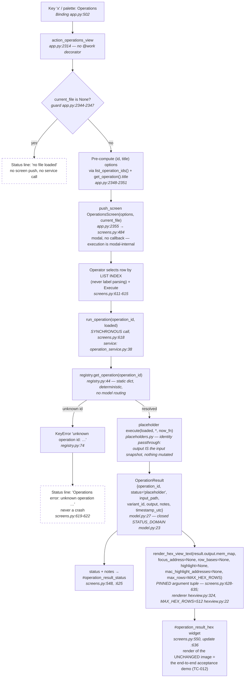

# Operations flow — batch 2026-06-11-batch-08

> TUI operations pipeline: key `x` → guard → `OperationsScreen` → `run_operation` service → registry → placeholder `execute` → `OperationResult` → status/notes + pinned hex render.
> Anchors grep-verified 2026-06-11 against HEAD (34fc43a). Guard rails annotated below the diagram.

## Guard rails (enforced, not advisory)

| Rail | Mechanism | Evidence |
|------|-----------|----------|
| **No reverse imports** | `s19_app/tui/operations/*` and `operation_service.py` import no Textual modules and no view modules (`app`/`screens`, absolute or relative form). The view imports the service — never the reverse. | Widened LLR-003.2 probe (TC-008): 0 hits, regime-correct positive/negative controls on record (04-validation §2.1-2.2) |
| **No I/O — probe P11** | The operations package + service contain zero filesystem calls (`open(`, `write_text`, `write_bytes`, `mkdir`, `shutil`, `os.remove`, `emit_s19_from_mem_map`). Load-bearing: this is what justifies synchronous UI-thread execution. | P11 probe: 0 hits on targets; positive control 7 hits on `changes/io.py` (04-validation §2.3) |
| **Service-only execution** | No direct `.execute(` call exists in `app.py` or `screens.py`; the sole execution route is `run_operation` through its injectable resolver seam. | Probe P8: 0 hits (04-validation §3 criterion 5); seam substitution proven in TC-011 |
| **Pinned render args** | The result hex render uses EXACTLY the pinned tuple with `max_rows=MAX_HEX_ROWS` (binding row cap, not default-only); the existing app call site with focus/highlight state is deliberately NOT this shape. | Inspection of `screens.py:628-635` (04-validation §2.4); TC-012 independent-baseline equality |
| **Sync execution + R-6 migration note** | Execution is synchronous on the UI thread — 0 `@work` decorators on HLR-004 paths. Valid ONLY while placeholders do no I/O and no parsing (LLR-004.4 declares itself INVALIDATED by real work). The fill-in batch MUST migrate to the `execute_scope` thread-worker pattern (`app.py:1489` baseline) and add per-execution confirmation + path sanitization for any side-effectful operation. | 04-validation §2.5; risk R-6, `01-requirements.md` §6.3 |
