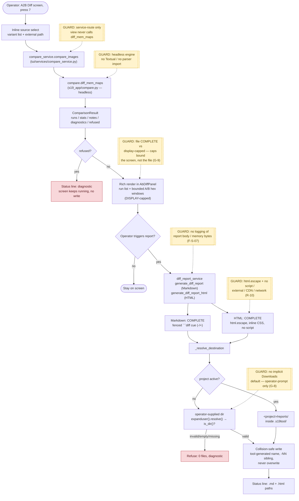

# Compare flow — A↔B Diff (US-006, batch-09)

End-to-end path from the operator's inline source selection in the A↔B Diff
screen to the collision-safe write of the complete diff report. Guard-rail
callouts (dashed nodes) mark the decisions that keep the feature layered, safe,
and honest.

## Legend

- **Solid nodes** — the runtime flow.
- **Dashed yellow callouts** — guard rails enforced by tests/inspections this
  batch (service-route only, headless engine, file-complete-vs-display-capped
  per G-9, HTML safety per R-10, no-Downloads-default per G-8, no-logging per
  F-S-07).
- **Red nodes** — refusal terminals: no file is written and a diagnostic is
  surfaced; the screen keeps running.

> The report file is always COMPLETE; only the on-screen render is capped
> (`REPORT_MAX_TOTAL_BYTES` / the 128-region cap relocated to the display path).
> The compare engine is parser-free and Textual-free, making it the reusable
> substrate batch-10 verify-on-save will consume.
