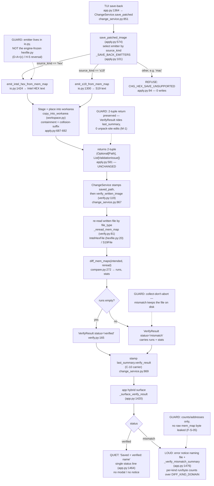

# Diagram — Save + Verify-on-Save Flow (batch-10)

> The end-to-end path from a TUI save-back to the hybrid quiet/loud verify surface.
> Covers US-008 (Intel HEX emitter + save-back) and US-009 (verify-on-save).
> Guard-rail callouts are dashed notes; every node cites its implementation site.

## Legend / guard-rail rationale

| # | Guard rail | Why it matters |
|---|------------|----------------|
| GR1 | Emitter placed in `s19_app/tui/changes/io.py` (next to `emit_s19_from_mem_map`), **not** `hexfile.py`. | `hexfile.py` is in `_ENGINE_PATHS` (git-frozen vs `main`); writing there trips three engine-frozen guards. `io.py` is unfrozen and not package-root → zero guards tripped. (D-A reversal, operator R2 / H-5.) |
| GR2 | `save_patched_image` keeps its 2-tuple return `(Optional[Path], List[ValidationIssue])`. | The `VerifyResult` rides `ChangeService.last_summary.verify_result` — a back-compatible carrier — so all 5 existing 2-tuple unpack sites stay valid with zero edits (M-1 / C-10). |
| GR3 | The mismatch summary reports per-kind **run/byte counts** and addresses only. | `VerifyResult` carries `DiffRun` (addresses) + `DiffStats` (counts) — never raw byte values — so no image content leaks into a TUI notification (F-S-05). |
| GR4 | A mismatch does **not** delete or suppress the written file. | Collect-don't-abort: the operator requested the save; the file is kept so it can be inspected, and the loud notice tells them not to trust it (HLR-004 / LLR-003.3). |
