# Manifest write + verify-on-write flow — Batch 2026-06-14-batch-11

> US-010 — write `project.json` from the tool + verify-on-write. Save -> serialize (escape-refusal branch) -> atomic-replace write (containment-check branch) -> verify (canonical re-read -> compare -> drift/issues) -> TUI quiet/loud surfacing.
> Guard-rail callouts are annotated inline: escape-refusal (LLR-001.5), containment checks + atomic `os.replace` no-dedup (M-1 / M-2), canonical-name re-read + reader-issues=>mismatch (M-1 / R-1).

```mermaid
flowchart TD
    A["TUI project save<br/>_handle_save_dialog (app.py:3443)"] --> B["_write_and_verify_manifest<br/>(app.py:3539) — orchestration only"]
    B --> C{"_variant_set present?"}
    C -- "no (empty/failed save)" --> Z0["no manifest write<br/>(return)"]
    C -- "yes" --> D["write_project_manifest<br/>(manifest_writer.py:370)"]

    %% --- SERIALIZE + escape-refusal branch (LLR-001.5) ---
    D --> E["serialize_manifest<br/>(manifest_writer.py:224)"]
    E --> F{"any batch/assignments entry<br/>absolute OR escapes project_root?<br/>_reject_unsafe_entry (:178)"}
    F -- "yes — REFUSE" --> G["return (None, [MANIFEST-WRITE-ESCAPE finding])<br/>write NOTHING (:308)"]
    F -- "no — clean" --> H["build 4-key envelope + json.dumps<br/>{schema_version, active_variant, batch, assignments} (:319)"]

    %% --- WRITE: containment-check + atomic replace (M-1 / M-2) ---
    H --> I["stage bytes under .s19tool/workarea/temp/<br/>(:457, :461)"]
    I --> J{"_check_destination_contained<br/>(manifest_writer.py:322)<br/>workarea root + is_relative_to + no reparse point"}
    J -- "fails / OSError" --> K["return (None, [MANIFEST-WRITE-CONTAINMENT finding])<br/>no raise — collect-don't-abort (:465)"]
    J -- "contained" --> L["atomic os.replace(staged, project_dir/project.json)<br/>fixed name, NO dedup (:463)"]
    L --> M["remove staged temp file<br/>finally: staged.unlink() (:472)"]

    %% --- write outcome routed back to handler ---
    G --> N{"written is None?<br/>(app.py:3581)"}
    K --> N
    M --> O["written = project_dir/project.json<br/>(:464)"]
    N -- "yes" --> P["LOUD error notice<br/>'Manifest write failed' + finding messages<br/>(app.py:3583-3590)"]
    O --> Q["verify_written_manifest<br/>(manifest_writer.py:580) — app.py:3592"]

    %% --- VERIFY: canonical re-read + compare (M-1 / R-1) ---
    Q --> R["re-read CANONICAL name<br/>read_project_manifest(project_dir) -> project_dir/project.json (:647-649)"]
    R --> S{"manifest is None?<br/>(file absent)"}
    S -- "yes" --> T["MISMATCH: drift = all 3 fields<br/>written_path=None (:651-656)"]
    S -- "no" --> U["resolve intent vs re-read in C-1 canonical form<br/>_resolve_intended_entries (:543); compare key-wise (:665-671)"]
    U --> V{"drift empty AND<br/>re-read issues empty?<br/>(:673-677)"}
    V -- "drift OR reader issues" --> W["MANIFEST_MISMATCH (:486)<br/>drift = [active_variant?/batch?/assignments?]<br/>+ reader issues (R-1)"]
    V -- "all match, 0 issues" --> X["MANIFEST_VERIFIED (:481)"]

    %% --- TUI surfacing: quiet vs loud ---
    T --> Y["_surface_manifest_verify_result<br/>(app.py:3595)"]
    W --> Y
    X --> Y
    Y --> Y1{"status?"}
    Y1 -- "verified" --> Y2["QUIET: status 'Project saved + manifest verified'<br/>no notice (app.py:3628-3630)"]
    Y1 -- "mismatch" --> Y3["LOUD: error notice naming drift keys +<br/>PLAIN-text reader issue messages (app.py:3637-3643)"]

    %% --- guard-rail callouts ---
    F -. "LLR-001.5 — escape-refusal:<br/>reuse reader predicate, no 2nd impl" .-> F
    J -. "M-2 — reuse copy_into_workarea<br/>containment CHECKS only" .-> J
    L -. "M-1 — atomic os.replace at fixed name,<br/>NOT the dedup body (no project_1.json)" .-> L
    R -. "M-1 — re-read by CANONICAL name,<br/>never the path the writer returned" .-> R
    V -. "R-1 — reader issues => MISMATCH<br/>even if surviving keys match" .-> V

    classDef refuse fill:#7f1d1d,stroke:#fca5a5,color:#fff;
    classDef ok fill:#14532d,stroke:#86efac,color:#fff;
    classDef neutral fill:#1e293b,stroke:#94a3b8,color:#fff;
    class G,K,P,T,W,Y3 refuse;
    class X,Y2,O,M ok;
    class A,B,D,E,H,I,L,Q,R,U,Y neutral;
```

---

## Legend

| Symbol | Meaning |
|--------|---------|
| Rectangle | A step / call (with `file:line` of the implementing symbol). |
| Diamond | A decision / branch point. |
| Dotted self-loop | A **guard-rail callout** annotating the branch it points at. |
| Red node | A refusal / failure / loud-mismatch outcome (`MANIFEST-WRITE-ESCAPE`, `MANIFEST-WRITE-CONTAINMENT`, mismatch, error notice). |
| Green node | A success outcome (`MANIFEST_VERIFIED`, written path, quiet status). |
| Grey node | A normal pipeline step. |

**Guard-rails on the flow:**
- **Escape-refusal (LLR-001.5)** — `serialize_manifest` refuses an absolute / project-escaping `batch`/`assignments` entry BEFORE any bytes are produced, reusing the reader's `_resolve_manifest_entry` predicate (no second path-safety implementation), returning `(None, [finding])`.
- **Containment checks + atomic no-dedup write (M-1 / M-2)** — the write stages to `temp/`, re-runs `copy_into_workarea`'s containment CHECKS against the destination, then does an atomic `os.replace` at the FIXED `project.json` name. It never routes through the dedup body, so a re-save overwrites in place (two saves -> one file) instead of producing `project_1.json`.
- **Canonical-name re-read (M-1)** — verify re-reads `project_dir / project.json` (the canonical fixed name), never the path the writer returned, so a stray suffixed file can never produce a false verify.
- **Reader-issues => mismatch (R-1)** — any non-empty re-read `issues` list forces `MANIFEST_MISMATCH` even when the compared keys match, so a write the reader silently degrades is surfaced, not falsely verified.

**Anchors:** all `file:line` references are grep-verified on the current worktree (see `traceability-matrix.md` §7). The handler is `_write_and_verify_manifest` (`app.py:3539`) — note `04-validation.md` named it `_persist_project_manifest`; the diagram uses the real implemented name.
