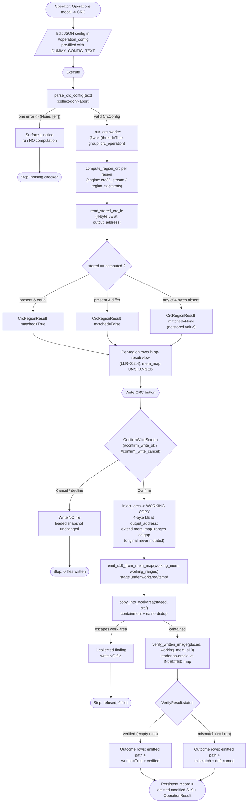

# CRC check + operator-confirmed write flow — batch-12 (CRC_F2)

> Phase 6 diagram (docs-writer). Covers BOTH paths: the non-mutating **check** (US-011) and the operator-confirmed **write/inject** (US-012). Symbols verified against `s19_app/tui/operations/crc.py`, `crc_config.py`, and `screens.py` (2026-06-17).

## Guard-rails (callout)

- **No write without confirmation.** The inject path runs only after an explicit per-execution **Confirm** on `ConfirmWriteScreen` (`screens.py:502`, buttons `#confirm_write_ok` / `#confirm_write_cancel`). Decline → 0 files, loaded snapshot untouched (LLR-003.4 / TC-124).
- **Check never mutates.** The check path reads `mem_map` only; `output.mem_map == input.mem_map` is asserted (LLR-002.2). Inject works on a fresh working copy — the originally loaded `mem_map`/`ranges` are never mutated (LLR-003.1).
- **Contained write path only.** The emit is staged under `.s19tool/workarea/temp/` and placed via `copy_into_workarea`, which enforces the real containment seam (`is_relative_to(workarea_root)` + reparse-point check) and name-dedups on collision. A target outside the work area is a collected finding with no file written — collect-don't-abort (LLR-003.2 / `test_write_outside_workarea_collects_finding_and_writes_no_file`).
- **Reader-as-oracle, not self-compare.** Verify re-reads the emitted S19 with the production parser and diffs against the **injected** working copy (the same map handed to `emit_s19_from_mem_map`), so `verified` proves the round-trip; a corrupted write yields `mismatch` with non-empty diff runs (LLR-003.3 / TC-123).
- **Frozen engine reused import-only.** `range_index`, `emit_s19_from_mem_map`, `verify_written_image`, and the workspace containment helpers are imported, never edited; `test_engine_unchanged.py` is CLEAR.
- **Worker-thread, not UI-thread (R-6).** CRC compute runs on `@work(thread=True, group="crc_operation")` (`_run_crc_worker`, `screens.py:878`); a stale/superseded worker result is dropped via the dispatch token, not surfaced over a newer error.

*UTF-8, no BOM. Phase 6 (docs-writer).*
