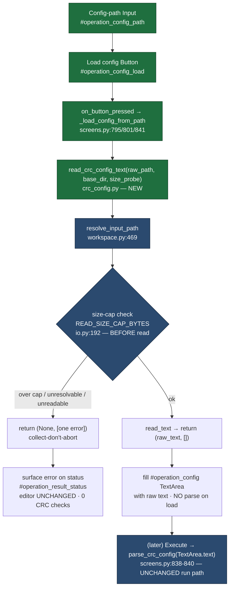
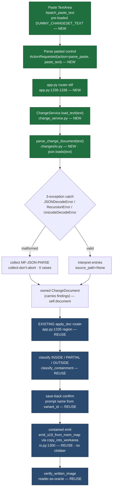

# Batch-13 flow diagrams — s19_app

> **Audience:** engineering / reviewers.
> **Purpose:** show the two shipped flows and, for US-014, mark which nodes are NEW batch-13 code vs REUSED (already-shipped) write path.
> Source: `01-requirements.md` §4 (LLR-013.x / LLR-014.x), `04-validation.md`.

---

## 1. CRC config-load flow (US-013 / HLR-013)

The Load button reads a config file's **raw text** into the editable config view. On fault it surfaces an error and runs no check. The CRC run path is unchanged — Execute still parses the editor text.

**Legend:** green = NEW batch-13 code · blue = reused existing substrate. The dummy `DUMMY_CONFIG_TEXT` (`crc_config.py:47`) stays pre-loaded whenever no file is loaded or a fault occurs.

---

## 2. Paste-changeset flow (US-014 / HLR-014)

The paste field (pre-loaded with the FAKE `DUMMY_CHANGESET_TEXT`) is parsed into the owned `ChangeDocument` via the NEW string seam, then handed to the **existing** apply / containment / verify / save-back path — no new write surface.

**Legend:** green = NEW batch-13 code · blue = REUSED already-shipped write path (verified unchanged vs `febd843` — 0 new write code paths, LLR-014.3 standing gate). `read_change_document` is refactored to delegate to `parse_change_document` (`call_count == 1`), so the file-read path and the paste path share one interpretation seam.
