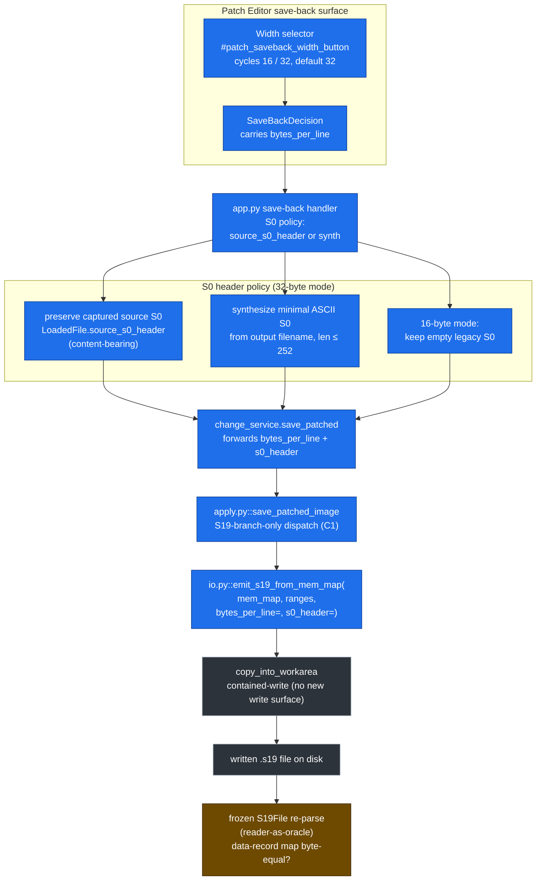

# batch-14 Save-Path Flow (US-015)

> Phase 6 artifact. Owner: `docs-writer`. **Audience:** engineers reviewing the
> US-015 save path. **Purpose:** show how the 16/32 Width selection and the S0
> header policy thread from the shipped Patch Editor save-back surface down to the
> emitter and back through the frozen reader-as-oracle.
>
> **Legend:** **NEW** = added/changed in batch-14 · **REUSED** = pre-existing,
> consumed unchanged · **FROZEN** = engine-frozen module (0 edits this batch).

## Save path: Width selector → emission → re-parse oracle

## Capture seam (load side — feeds the preserve leg)

## Notes

- The only new write delta is the `bytes_per_line` / `s0_header` threading; the
  contained-write itself (`copy_into_workarea`) is **REUSED** unchanged — no new
  write surface (`R-S19-SAVE-REUSE-001`).
- Dispatch is **S19-branch-only** (C1): the Intel-HEX save path never sees the
  S19-only `bytes_per_line` kwarg, verified by
  `test_tc220b_hex_save_unaffected_by_s19_only_kwargs`.
- The S0 capture is **read-only** against the frozen reader — `build_loaded_s19`
  scans `S19File.records`; no edit to `core.py`. The whole 7-path frozen set has
  **0 diffs vs main** (`test_tc027_*` / `test_tc031_*` / `test_tc032_*`).
- The reader-as-oracle re-parse is the data-integrity gate for both widths
  (data-record map byte-equal, 0 errors): `test_tc216_*` (32) / `test_tc217_*`
  (16), with the non-vacuous negative control `test_tc218_*`.
