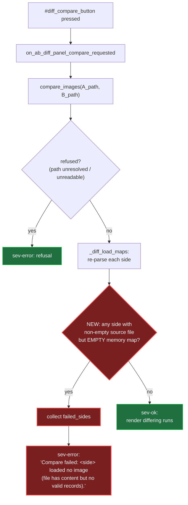

# Batch 2026-06-24-batch-15 — A<->B Diff compare flow (US-016)

> Fixed compare handler: a side whose source file has content but maps to an empty image is now caught and surfaced as a RED `sev-error`, instead of slipping through as a GREEN `sev-ok` verdict. New / changed nodes are marked with the `changed` class.

**Caption:** The new load-failure decision (red nodes) sits between the existing refusal check and the existing `sev-ok` render path, so a non-empty file that maps to nothing is reported by name instead of passing as a clean compare.
