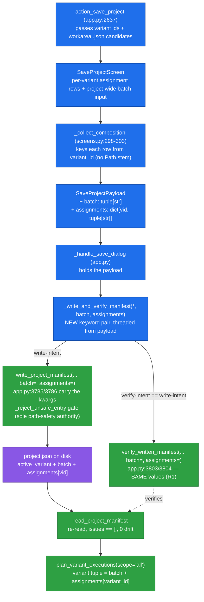
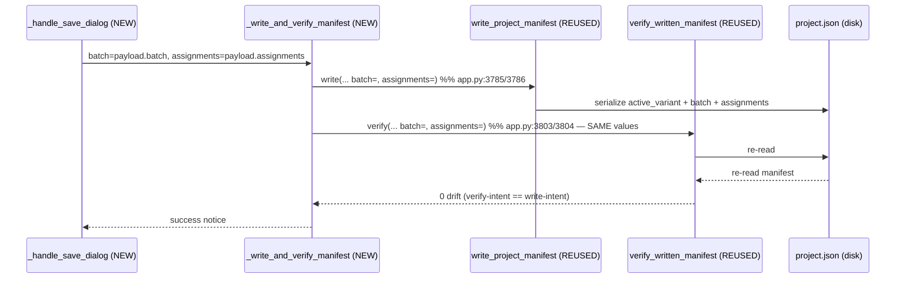
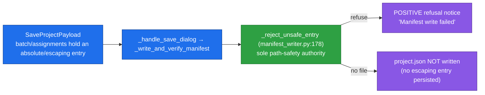
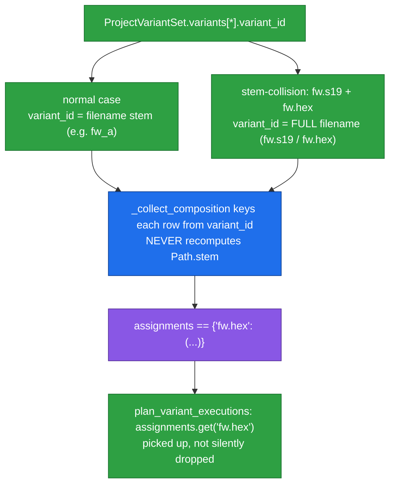

# Flow Diagrams — Per-variant File-Assignment at Project Save (US-017)

**Batch:** `2026-06-25-batch-16`. Closes batch-11 SCOPE-1.

**Legend:**
- **NEW** (batch-16) — the UI rows, the `SaveProjectPayload.batch`/`assignments` fields, and the handler threading (`_write_and_verify_manifest(*, batch, assignments)`).
- **REUSED** (substrate, edit-free) — the writer / verifier / reader / consumer that already accepted `batch`/`assignments` (`manifest_writer.py`, `variant_execution_service.py`); these are consumed unchanged. **0 engine-frozen edits.**

---

## 1. Save path — assignment → manifest → consumer

The **NEW** path (blue) is the SCOPE-1 closure: the assignment UI → payload fields → handler threading. Everything green (writer/verifier/reader/consumer) is **REUSED** substrate, edit-free. `project.json` (purple) is the observed deliverable.

---

## 2. Write-intent == verify-intent (R1 invariant)

If write-intent and verify-intent differed, `verify_written_manifest` would report spurious drift (open risk R1). TC-302/303 asserts `verify_calls[-1] == write_calls[-1]` for both `batch` and `assignments`.

---

## 3. Refusal path — escaping entry (security boundary)

The UI's workarea restriction is convenience; `_reject_unsafe_entry` is the **enforcement point**, now reached end-to-end through the handler. AT-017.4 asserts the refusal notice is present AND `project.json` is not written.

---

## 4. `variant_id` keying — stem-collision (D-KEY)

A recomputed `Path.stem` on a colliding pair would key both variants to `fw`, and the consumer's `assignments.get(variant_id)` would silently drop the assignment. AT-017.5 proves the full-filename round-trip and pickup.

---

## NEW vs REUSED summary

| Element | Status | Where |
|---------|--------|-------|
| Per-variant assignment rows + project-wide batch input | **NEW** | `SaveProjectScreen` (`screens.py`) |
| `_collect_composition` (keys from `variant_id`) | **NEW** | `screens.py:298-303` |
| `SaveProjectPayload.batch` / `.assignments` fields | **NEW** | `screens.py` (default-empty) |
| `_write_and_verify_manifest(*, batch, assignments)` threading | **NEW** | `app.py` (write `:3785/3786`, verify `:3803/3804`) |
| `action_save_project` passes variant ids + candidates | **NEW** | `app.py:2637` |
| `write_project_manifest` / `_reject_unsafe_entry` | **REUSED** (edit-free) | `manifest_writer.py` |
| `verify_written_manifest` / `read_project_manifest` | **REUSED** (edit-free) | `manifest_writer.py` / `variant_execution_service.py` |
| `plan_variant_executions` consumer | **REUSED** (edit-free) | `variant_execution_service.py:526` |

**0 engine-frozen edits; writer + consumer substrate edit-free** (`git diff --name-only origin/main` over both = empty, per `04-validation.md` STEP 3.4).
