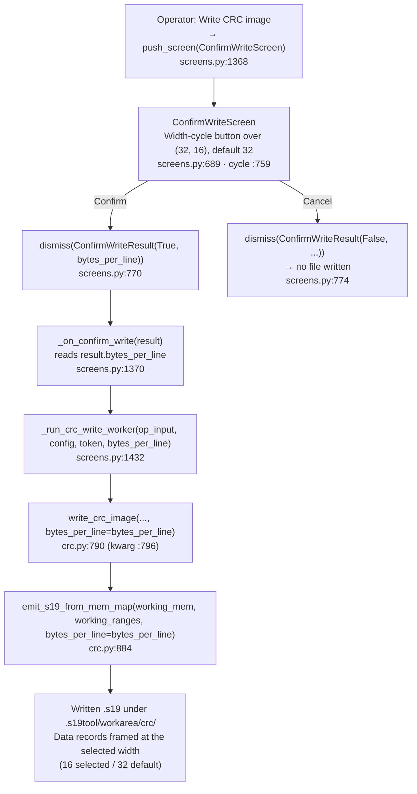
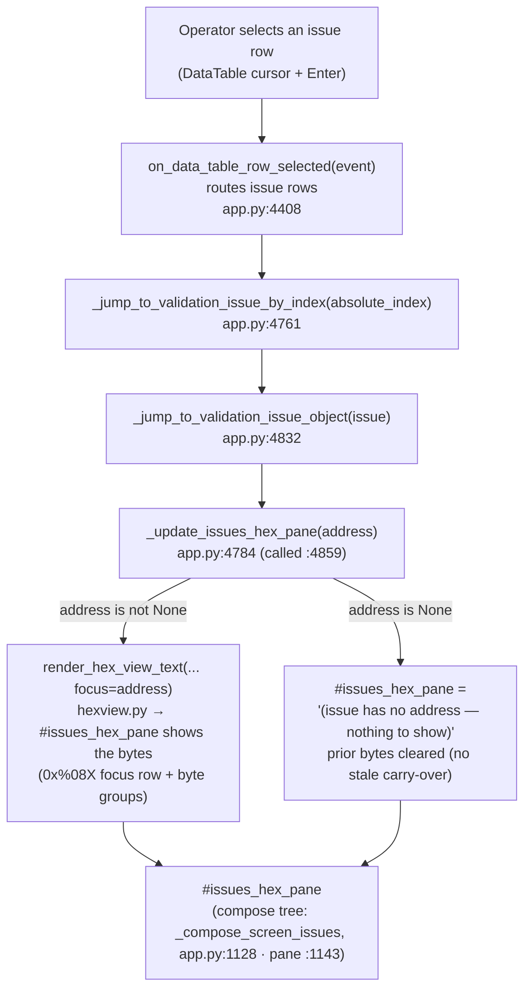
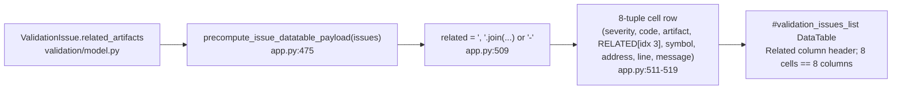

# Batch-17 flow diagrams — s19_app

> Phase 6 artifact. Accurate to the shipped tree (symbols + file:line grep-verified). Companion to `06-docs/functionality.md`.

---

## 1. CRC write — operator-selected record width threading (US-019)

The operator's width choice (16/32) is captured on the modal and carried through the worker into the emitter, so the data records in the written `.s19` are framed at the selected width.

> The `bytes_per_line` kwarg already existed at `emit_s19_from_mem_map` (in the frozen-adjacent `changes/io.py`), so that file was **not** edited. The S0-header policy stays `s0_header=None` on the CRC path (US-019 keeps US-015's S0 synthesis out of scope).

---

## 2. Issues screen — row select → hex pane render (US-020a)

Selecting an issue row resolves the `ValidationIssue` and renders the bytes at its address into the on-screen hex pane; an address-less issue shows a placeholder and clears any prior bytes.

> `on_data_table_row_selected` (`app.py:4408`) only routes — it is untouched. The render site is `_jump_to_validation_issue_object`, where the three pre-existing cross-screen hex updates already live; `_update_issues_hex_pane` is additive (the no-address placeholder + clear is the net-new behavior).

---

## 3. Issues list — Related cell composition (US-020b)

The Related column is built once when the issue payload is precomputed, then rendered by the DataTable; the cell tuple stays index-aligned with severity styles and the column count.

> Pure formatting over existing fields — no new validation logic. The 7→8 tuple widening keeps the cell array index-aligned with the per-row severity styles (contract-touch identity check: tuple width 8 == column count 8).
