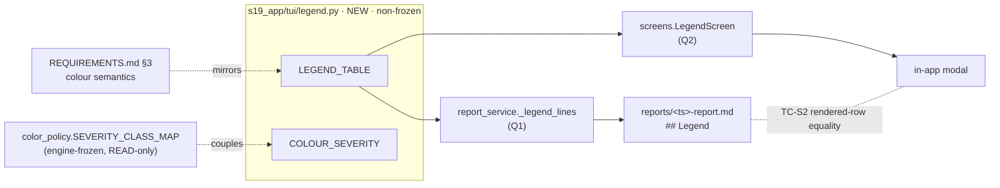
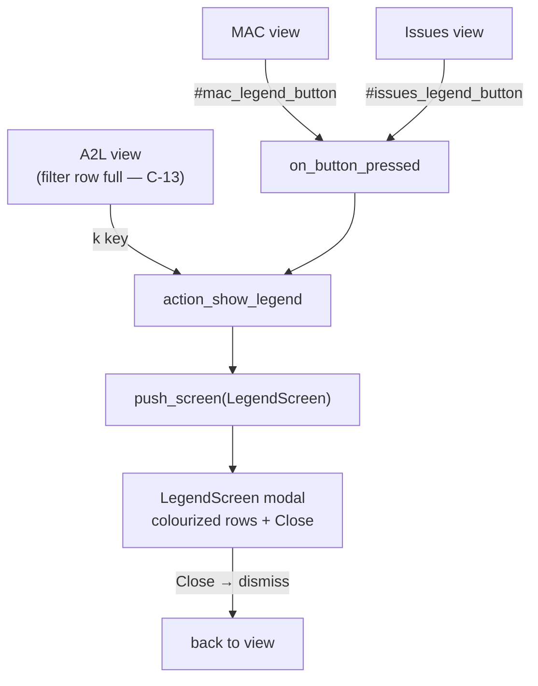
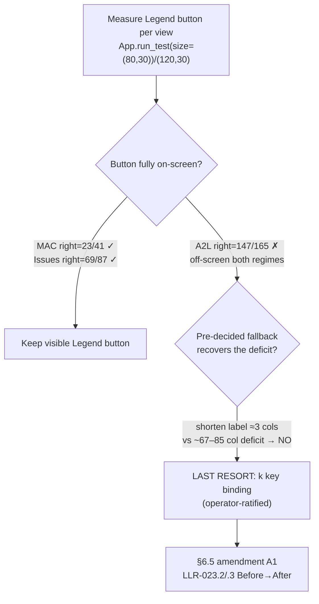

# Diagrams — batch-18 (Feature #11 legend)

## 1. Single source → two surfaces

```mermaid
flowchart LR
    REQ["REQUIREMENTS.md §3<br/>colour semantics"] -.mirrors.-> LT
    SCM["color_policy.SEVERITY_CLASS_MAP<br/>(engine-frozen, READ-only)"] -.couples.-> CS
    subgraph legend.py [s19_app/tui/legend.py · NEW · non-frozen]
        LT["LEGEND_TABLE"]
        CS["COLOUR_SEVERITY"]
    end
    LT --> RL["report_service._legend_lines<br/>(Q1)"]
    LT --> LS["screens.LegendScreen<br/>(Q2)"]
    RL --> RPT["reports/&lt;ts&gt;-report.md<br/>## Legend"]
    LS --> MODAL["in-app modal"]
    RPT -. TC-S2 rendered-row equality .- MODAL
```

## 2. Q2 in-app entry points → modal

```mermaid
flowchart TD
    A2L["A2L view<br/>(filter row full — C-13)"] -->|k key| ASL
    MAC["MAC view"] -->|#mac_legend_button| OBP
    ISS["Issues view"] -->|#issues_legend_button| OBP
    OBP["on_button_pressed"] --> ASL["action_show_legend"]
    ASL --> PUSH["push_screen(LegendScreen)"]
    PUSH --> M["LegendScreen modal<br/>colourized rows + Close"]
    M -->|Close → dismiss| BACK["back to view"]
```

## 3. C-13 geometry decision (Phase-3 measurement → §6.5 A1)

```mermaid
flowchart TD
    M["Measure Legend button per view<br/>App.run_test(size=(80,30))/(120,30)"] --> Q{Button fully on-screen?}
    Q -->|MAC right=23/41 ✓<br/>Issues right=69/87 ✓| KEEP["Keep visible Legend button"]
    Q -->|A2L right=147/165 ✗<br/>off-screen both regimes| DEF{Pre-decided fallback<br/>recovers the deficit?}
    DEF -->|shorten label ≈3 cols<br/>vs ~67–85 col deficit → NO| KEY["LAST RESORT: k key binding<br/>(operator-ratified)"]
    KEY --> AMEND["§6.5 amendment A1<br/>LLR-023.2/.3 Before→After"]
```
