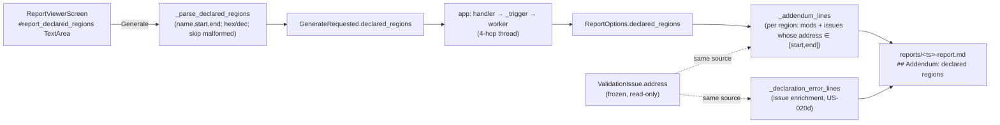
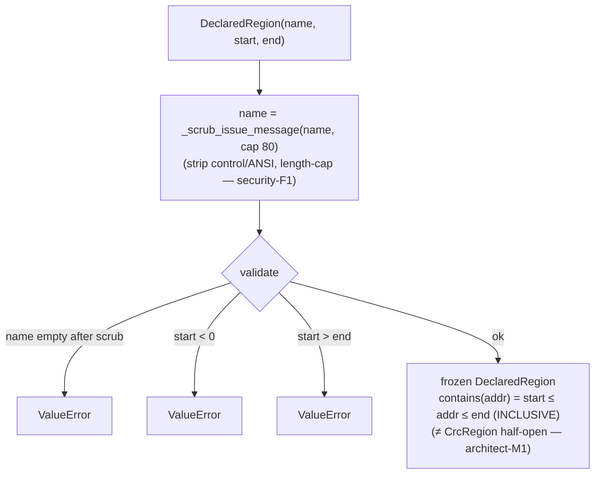
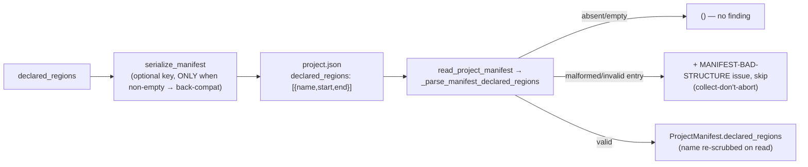

# Diagrams — batch-19 (Feature #10 issues-report addendum)

## 1. Declared region: dialog → report addendum (US-020c)

## 2. DeclaredRegion construction (security-F1 + bounds)

## 3. Persistence roundtrip (US-020c, LLR-026.1)

