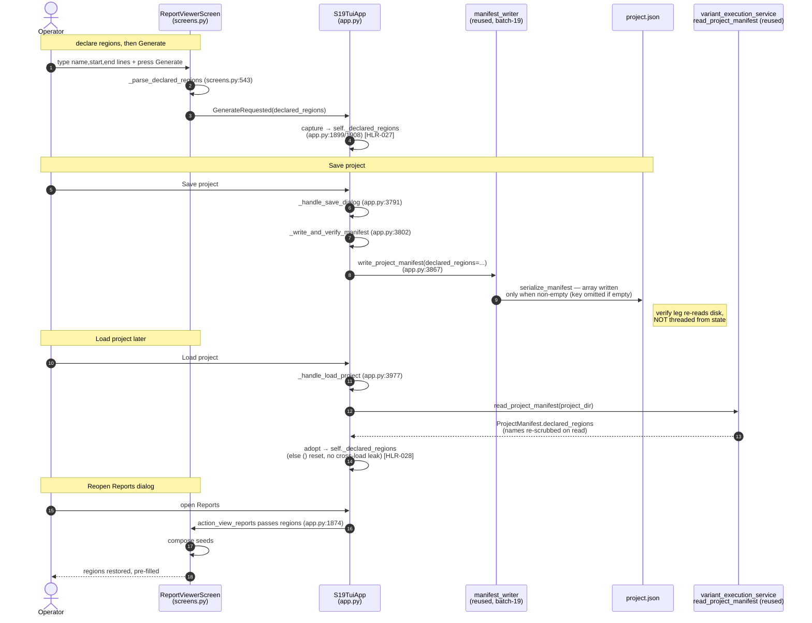
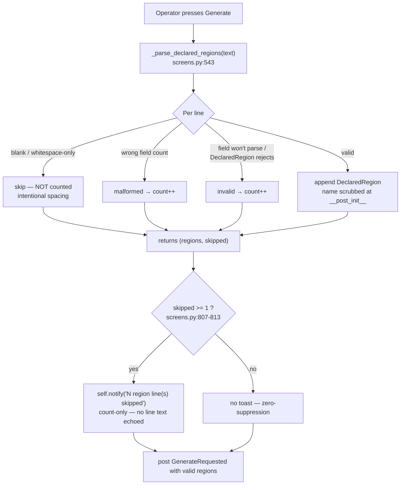

# Batch-20 flows — declared-region round-trip + skip-count

> Mermaid diagrams for the D-1 (save/load round-trip) and D-2 (malformed-line skip count) flows.
> Node labels carry the verified `file:line` seams from the final tree.

## (a) D-1 — declared-region round-trip (dialog → capture → save → project.json → load → seed)

## (b) D-2 — skip-count flow (parse → count → notify with zero-suppression)

> Notes
> - In (a) the **capture** happens on Generate, not on keystroke — a region typed but never Generated is never saved (AT-027b).
> - In (a) the **verify** leg of save re-reads the on-disk manifest and is intentionally not threaded from `self._declared_regions` (TC-027.1).
> - In (b) malformed and invalid are **mutually exclusive** per line; blank lines never increment the count (AT-029c); the notify text is count-only so unscrubbed operator input is never echoed (LLR-029.3).
