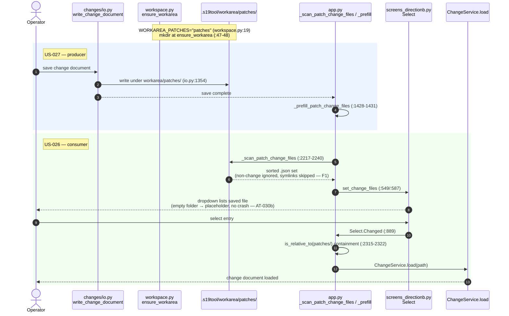
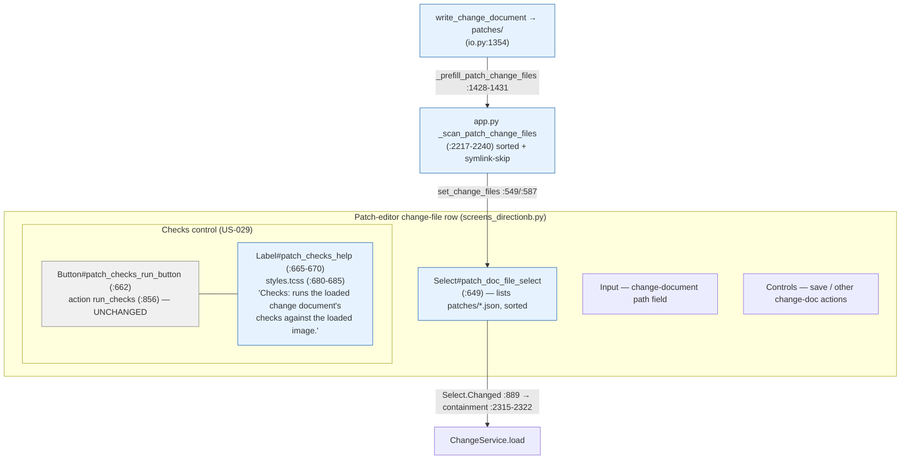

# Diagrams — s19_app TUI — Batch 2026-06-29-batch-21

Feature #8 patch-editor, slice 1. Two views:
(a) the save → `patches/` → scan → select → load round-trip (the C-12 producer→consumer chain);
(b) the patch-editor change-file row components.

---

## (a) Save → patches-folder → dropdown-scan → select → load (US-027 producer → US-026 consumer)

The C-12 chain: the **producer** (`write_change_document`) writes into `patches/`; the **consumer** (patch-screen dropdown) observes that handler-produced artifact — never a same-values direct write. AT-030a is the through-surface GATE over exactly this round-trip.

**Node coverage on this flow:** AT-030a (GATE, full round-trip), AT-030a-R2 (save-while-open prefill), AT-030b (empty placeholder), AT-030c (directly-dropped file loadable), F1 (symlink skipped), TC-030 (scan returns sorted `.json` set), AT-031a/b + TC-031 (save lands in `patches/`, distinct).

---

## (b) Patch-editor change-file row — component / data view

**Legend:** blue = added/changed this batch (dropdown, Checks help Label, scan, save-placement); grey = existing wiring left intact (Checks button id + `run_checks` action). The Checks Label is static explanatory text with no action wiring of its own.
