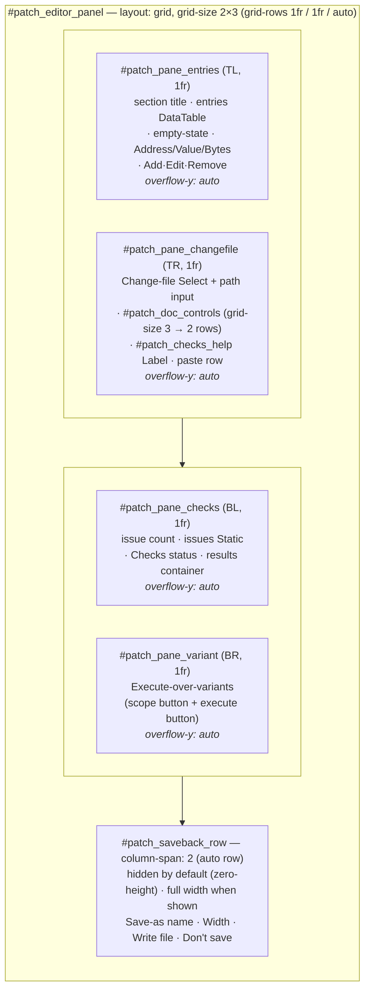
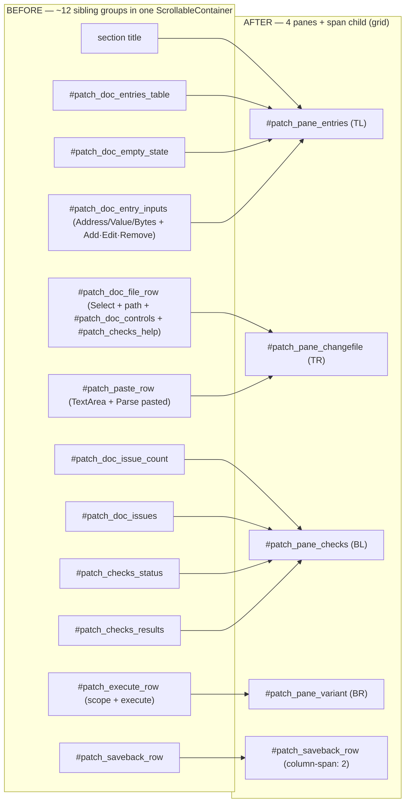

# Batch-22 flows — Patch Editor 4-pane 2×2 split

> Phase 6 diagrams for feature #8 slice 2 (US-030 / HLR-033). Both diagrams are faithful to the final-tree seams: `s19_app/tui/screens_directionb.py` (`compose`, `:627`/`:663`/`:706`/`:717`/`:734`) and `s19_app/tui/styles.tcss` (`:560` grid, `:570` per-pane overflow, `:582` span, `:690` button-grid).

## (a) 2×2 grid layout — `#patch_editor_panel`

`layout: grid; grid-size: 2 3; grid-columns: 1fr 1fr; grid-rows: 1fr 1fr auto`. The two `1fr` rows hold the four panes; the `auto` third row holds the full-width, `column-span: 2`, normally-hidden save-back prompt.

**Notes**
- Each `#patch_pane_*` scrolls vertically and independently (`overflow-y: auto; overflow-x: hidden`, styles.tcss `:570`) — scroll moved off the panel and onto the panes.
- The save-back row is **not a fifth pane**: it is a direct grid child spanning both columns in the `auto` row, so it never squeezes the `1fr` panes while hidden.
- Measured content width: **70 cols @80 / 92 cols @120** → ~35 cols/pane at 80 (C-13 budget clears).

## (b) Reparent mapping — ~12 flat compose groups → 4 panes

Each pre-existing group is moved **wholesale** into its pane; no inner `patch_*` id is renamed or reordered (the property AT-033c guards).

**Seam anchors (final tree)**
- `#patch_pane_entries` yielded @ `screens_directionb.py:627`
- `#patch_pane_changefile` @ `:663` (contains `#patch_doc_controls`, now `grid-size: 3`, styles.tcss `:690`)
- `#patch_pane_checks` @ `:706`
- `#patch_pane_variant` @ `:717`
- `#patch_saveback_row` span child @ `:734` (CSS `column-span: 2` @ styles.tcss `:582`)
