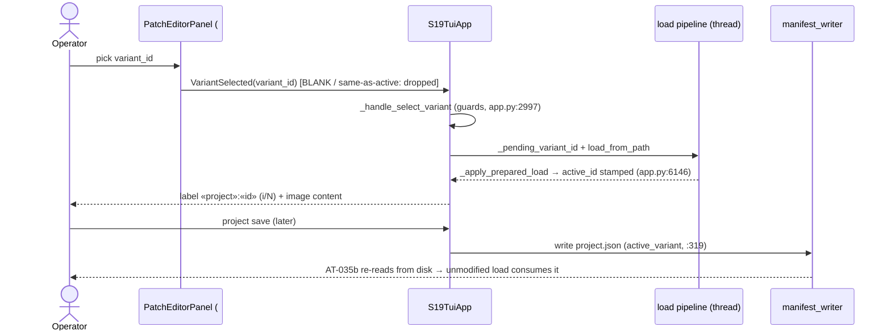

# 01 — Requirements — 2026-07-01-batch-23

> **Batch objective:** #8 patch-editor overhaul — FINAL story. **US-028: inline variant dropdown** in the patch editor's Variant pane (`#patch_pane_variant`, created batch-22): switch the project's active variant without leaving the patch editor; the switch is observable (active image + project label) and persists as the manifest `active_variant` on the next project save.
>
> Language: **en** · Flow: `/dev-flow` · Branch: `claude/batch-23-us028` off `origin/main c6f75aa` (RC-1 PASS).

---

## 2.5 Context (verified at intake — file:line cited)

- **Current switch surface (modal only):** `action_select_variant` → `SelectVariantScreen` → `_handle_select_variant(variant_id)` (`s19_app/tui/app.py:2997`) → guards (cancel / no set / unknown id / missing file) → stamps `_pending_variant_id` (`app.py:3049`) → `load_from_path` (threaded pipeline). `_apply_prepared_load` stamps `self._variant_set.active_id = pending_variant` (`app.py:6146`).
- **Persistence path (exists, batch-16):** `s19_app/tui/services/manifest_writer.py:319` serializes `"active_variant": variant_set.active_id` into `project.json` on project save; drift-check re-reads it (`manifest_writer.py:684`; same module — all later `manifest_writer.py` shorthand refers to this path, per Phase-2 F-5).
- **Target pane:** `#patch_pane_variant` (`screens_directionb.py:717-733`) currently holds one group: "Execute over variants" label + Scope/Execute buttons (`#patch_execute_row`). Bottom-right cell of the batch-22 2×2 grid.
- **Proven in-pane dropdown precedent (US-026, batch-21):** `Select#patch_doc_file_select` in the Change-file pane — options rescanned on show, `Select.Changed` handler routes to a service. Conventions to mirror, not re-invent.
- **Engine-frozen set:** untouched by this story (pane + app wiring only: `screens_directionb.py`, `app.py`, `styles.tcss` if needed — all outside the frozen set).

## 2.6 Story intake & refinement (Phase 0)

### US-028 — Inline variant dropdown (the last #8 story)

> As an engineer patching a multi-variant project, I can switch the active variant from a dropdown **inside the patch editor's Variant pane**, so I can flip variants mid-patch-workflow without leaving the editor; the switch takes effect on the loaded image and project label, and is recorded as the manifest `active_variant` the next time I save the project.

**INVEST:**
- **I**ndependent — YES. Last open #8 story; no dependency on other open work. Touches the Variant pane + app wiring only.
- **N**egotiable — placement/label/empty-state behavior (see open questions).
- **V**aluable — YES. Today a variant flip = leave editor → modal → return; multi-variant patch loops (execute-scope, save-back per variant) pay that round-trip repeatedly.
- **E**stimable — YES. Mirrors the US-026 dropdown pattern; activation reuses `_handle_select_variant` wholesale (verified above). 1–2 increments.
- **S**mall — YES. Net-new `Select` + options refresh + one `Select.Changed` route.
- **T**estable (black-box) — YES:
  - **AC-1 (switch through the surface):** Given a loaded multi-variant project, when the user picks a **non-default** variant in the patch editor's dropdown (C-10: drive off the default), the active variant observably changes — project label shows `«project»:«chosen_id» (i/N)` and the loaded image content is the chosen variant's.
  - **AC-2 (persist, output-then-consume — C-12):** After switching via the dropdown and saving the project through the shipped save flow, re-reading the **handler-written** `project.json` from disk yields `active_variant == chosen_id`, and a subsequent project load through the unmodified load path activates that variant.
  - **AC-3 (negative/guard):** With no project / a single-variant project, the dropdown does not offer a false affordance (exact behavior = open question Q1) and never crashes or clears the loaded state.

**Classification: `READY`** — pending the two DoR design decisions below (both negotiable, neither blocks testability).

### DoR decisions (RESOLVED at gate, 2026-07-01 — operator)

- **Q1 — Empty/degenerate state → (a) disabled + placeholder.** The dropdown is always present; with no project or <2 variants it is disabled with a placeholder — no false affordance, stable pane geometry (mirrors the `Select.NULL` convention).
- **Q2 — Persistence semantics → persist-on-save.** The switch updates the in-memory `active_id` via the existing pipeline; `project.json` is written only by the existing save flow (batch-16). **No new disk-write surface is introduced by this story.** The C-12 AT proves the full chain: dropdown switch → shipped save → re-read handler-written manifest → unmodified load consumes it.

### C-13 flag (geometry) — RESOLVED: MEASURED at Phase-0 close (2026-07-01)

Pilot probe (temp pytest test, run + deleted): `#patch_pane_variant` content_region = **35 × 3 rows @80×24**, **46 × 6 @120×30**. Existing execute group ≈4 rows + new Select group ≈3–4 rows → deficit ≈5 rows @80×24, ≈2 @120×30. Deficit-matched rung (C-13.1) already shipped: batch-22 per-pane `overflow-y: auto` (unbounded vertical recovery). Design consequence encoded as **LLR-035.2**: variant group composes ABOVE `#patch_execute_row`. Residual `assumed — verify in Phase 3`: exact closed-Select row cost (A-1, with sacrificial-Label contingency).

### Out of scope

- Per-variant patch assignments UI (manifest `assignments` editing — batch-16 shipped read/execute; editing is not this story).
- Any change to the modal `SelectVariantScreen` (stays; the dropdown is an additional surface).
- #12 (before/after report, entropy viewer, reconcile) — separate batch.

---

## 3. High-level requirements (HLR)

> EARS statements; `shall` is normative and appears only inside HLR/LLR statements. All new symbols are either cited `file:line` (grep-verified 2026-07-01) or flagged `NEW — created in Phase 3`.

### HLR-035 — Inline variant switch from the patch editor's Variant pane
- **Traceability:** US-028
- **Statement:** When the operator picks a variant in the patch editor's Variant-pane dropdown (`Select#patch_variant_select`, `NEW — created in Phase 3`, hosted in `#patch_pane_variant`, `screens_directionb.py:717-733`), the system shall activate that variant through the existing activation pipeline (`_handle_select_variant`, `app.py:2997`) so that the loaded image content and the command-bar project label (`update_project_labels`, `app.py:7631`, format `«project»:«variant» (i/N)`, `app.py:7681-7684`) reflect the chosen variant, and shall record the chosen variant as manifest `active_variant` in `project.json` only on the next project save through the existing save flow (`manifest_writer.py:319`).
- **Rationale (informative):** Today a variant flip requires leaving the patch editor for the `SelectVariantScreen` modal; multi-variant patch loops pay that round-trip repeatedly. The dropdown is an additional surface over the SAME pipeline — no new activation logic, no new persistence surface (DoR Q2: persist-on-save only).
- **Validation:** `test` (Layer B acceptance + Layer A functional, decomposed in §4)
- **Executed verification:** `pytest tests/test_tui_patch_variant.py` (file path + node ids provisional-until-Phase-3 per V-5; `NEW — created in Phase 3`) — AT-035a/b/c + TC-035.1–.6.
- **Numeric pass threshold:** all AT/TC nodes pass; 0 failures; full suite regression 0 new failures vs `main`.
- **Priority:** high (last open #8 story)
- **Acceptance (black-box) — the user-verified outcome:**
  - **Observable outcome:** picking a non-default variant in the Variant pane changes the project label to `«project»:«chosen_id» (i/N)` and the rendered image content to the chosen variant's bytes; after a normal project save, `project.json` on disk carries `active_variant == chosen_id` and an unmodified project load activates that variant.
  - **Shipped surface:** the patch editor screen (rail item / `action_show_screen("patch")`, `app.py:3263`) → Variant pane dropdown → threaded load pipeline → command bar + hex view; persistence via the shipped project-save flow.
  - **Deliverable + observation:** (a) rendered command-bar label text + hex-view content (Pilot query of rendered text). Hosting note (Phase-2 R-1 RESOLVED): the `CommandBar` is app-persistent (`#command_bar_slot` sibling of `#workspace_body`, `app.py:1014-1017`) — label observable with no navigation; the hex view lives on the workspace screen, so AT-035a observes it after `action_show_screen("workspace")` (legitimate user navigation). (b) handler-written `project.json` re-read from disk (file exists, non-empty, `active_variant` key equals chosen id).
  - **Acceptance tests (provisional per V-5):**
    - **AT-035a (C-10, switch-through-surface — GATE):** Pilot @ a ≥2-variant project whose variants differ at a probe address; drive the dropdown OFF the default to a non-default variant; assert the project label equals `«project»:«chosen» (i/N)` AND the hex view shows the chosen variant's probe bytes (and no longer the default's). References no internal symbol; fails if the switch silently no-ops.
    - **AT-035b (C-12, output-then-consume — GATE):** after an AT-035a-style dropdown switch, drive the SHIPPED project-save flow; re-read the HANDLER-WRITTEN `project.json` from disk and assert `active_variant == chosen_id`; then load the project through the unmodified load path in a fresh app instance and assert the chosen variant is active (label observation). A direct-write manifest test is permitted only as a guard, never as this gate.
    - **AT-035c (negative/guard):** (i) no project loaded → patch screen shows the dropdown present, disabled, with placeholder prompt; interaction does not crash and loaded state is untouched. (ii) single-variant project → same disabled/placeholder state; loaded image unchanged.
  - **Boundary catalog (QC-3):** ☑ empty — no project → AT-035c(i). ☑ boundary — exactly 1 variant → AT-035c(ii); exactly 2 variants (minimal multi) → AT-035a fixture. ☑ invalid — `Select.NULL` sentinel pick and re-selection of the already-active id → TC-035.4 (no activation fired). ☑ error — variant file missing on disk → reused guard (`app.py:3040-3043`) asserted in TC-035.4 (status message, no crash).

---

## 4. Low-level requirements (LLR)

> Decomposition of HLR-035. All Executed-verification file paths / `-k` selectors / node ids are provisional-until-Phase-3 (V-5). Geometry constants cite the batch-23 C-13 measurement (see regime note in LLR-035.2).

### LLR-035.1 — Variant Select composition in the Variant pane
- **Traceability:** HLR-035
- **Statement:** The `PatchEditorPanel.compose` tree (`screens_directionb.py:589`) shall include, inside `#patch_pane_variant` (`screens_directionb.py:717-733`), a variant group (`#patch_variant_row`, `NEW — created in Phase 3`) containing a `Label` and a `Select` with `id="patch_variant_select"` (`NEW — created in Phase 3`), constructed with `allow_blank=True`, a placeholder prompt, and `disabled=True` (first paint = no project → the LLR-035.5 invariant holds from construction; Phase-2 F-8), mirroring the US-026 construction (`Select#patch_doc_file_select`, `screens_directionb.py:666-671`); the dropdown shall be present in every panel instance regardless of project state (DoR Q1).
- **Validation:** `test (pilot)`
- **Executed verification:** `pytest tests/test_tui_patch_variant.py -k tc_035_1` (provisional; `NEW`).
- **Numeric pass threshold:** `query_one("#patch_variant_select", Select)` inside `#patch_pane_variant` returns exactly 1 widget with and without a project loaded; 0 failures.
- **Acceptance criteria:** dropdown exists on bare panel construction (no options handed yet — mirrors the US-026 bare-construction invariant, `screens_directionb.py:556-561`); no inner `patch_*` id in the pane is renamed or removed.

### LLR-035.2 — Top-of-pane composition order (C-13 geometry)
- **Traceability:** HLR-035
- **Statement:** The variant group (`#patch_variant_row`) shall be composed ABOVE `#patch_execute_row` (`screens_directionb.py:730`) inside `#patch_pane_variant`, such that the `Select` control renders within the pane's visible region without scrolling at 80×24, with the execute group scrolling below when the pane overflows.
- **Rationale (informative):** MEASURED 2026-07-01 via Pilot probe (batch-23 C-13 probe, `App.run_test(size=(80,24))` and `(120,30)`; regime: patch screen active, batch-22 2×2 grid `styles.tcss:560-568`, all four panes populated, save-back row hidden): `#patch_pane_variant` content_region = **35 wide × 3 rows @80×24** and **46 × 6 @120×30**. Existing execute group ≈ 4 rows; new Select group ≈ 3–4 rows; combined deficit ≈ 5 rows @80×24, ≈ 2 @120×30. The deficit-matched rung (C-13.1) is ALREADY SHIPPED: batch-22 gave each pane `overflow-y: auto` (`styles.tcss:570-577`) — unbounded vertical recovery — so the required design consequence is ordering, not resizing. Width is fine (35/46 vs a one-column Select). The exact closed-Select row cost (3 vs 4 rows incl. border) is `assumed — verify in Phase 3` (framework-behavior-verify, batch-22 lesson); if `Label + Select` exceeds 3 rows @80×24 the Label is the sacrificial element (the Select prompt carries the semantics), the Select is not.
- **Validation:** `test (pilot)`
- **Executed verification:** `pytest tests/test_tui_patch_variant.py -k tc_035_2` (provisional; `NEW`) — Pilot @ size=(80,24), pane `scroll_offset == 0`.
- **Numeric pass threshold:** `Select#patch_variant_select.region.y` (the control's FIRST row) lies within the pane's visible `content_region` at scroll offset 0 @80×24, and the group's `region.y` < `#patch_execute_row.region.y`; same assertions @120×30. (Tightened per Phase-2 qa MINOR-3 — a ≥1-row border-only overlap satisfies a weaker number without being operable.)
- **Acceptance criteria:** compose order = variant group first, execute group second; no change to `#patch_editor_panel` grid geometry (`grid-size: 2 3`, `styles.tcss:565-567`).

### LLR-035.3 — Options refresh + active preselection
- **Traceability:** HLR-035
- **Statement:** When the patch screen activates (`action_show_screen("patch")` branch, `app.py:3263-3264`, alongside `_prefill_patch_change_files`, `app.py:2242`) AND when the loaded variant set changes while the patch screen is shown (project load/close/variant-append completing — the trigger set per Phase-2 F-3), the app shall re-evaluate the dropdown: with N ≥ 2 variants it shall populate one `(variant_id, variant_id)` option per variant in `self._variant_set.variants` in model order (mirroring `_prefill_diff_variants`, `app.py:2164-2170`; model: `ProjectVariantSet`, `models.py:86-107`) via a panel populate method (`PatchEditorPanel.set_variants`, `NEW — created in Phase 3`, mirroring `set_change_files`, `screens_directionb.py:549`) and the dropdown value shall equal the current `variant_set.active_id`; with N < 2 or no project it shall call `set_variants([])` leaving the value at `Select.NULL` with the placeholder shown (LLR-035.5 owns the disabled invariant; N==1 gets NO preselection — Phase-2 F-2); and when a variant activation completes while the patch screen is shown, the displayed value shall reflect the new active id.
- **Verified framework note (Phase-2 F-4, textual 8.2.5):** `Select.set_options` RESETS the selection to BLANK (`_select.py:559-575`) and fires the watcher → every repopulate of a displaying Select emits `Changed(Select.NULL)` followed by `Changed(active_id)` after the value re-sync — the LLR-035.4 short-circuits are normative precisely to absorb this pair. Order constraint: the value assignment shall occur strictly AFTER `set_options` (assigning a value not in the options raises `InvalidSelectValueError`, `_select.py:594`).
- **Validation:** `test (pilot)`
- **Executed verification:** `pytest tests/test_tui_patch_variant.py -k tc_035_3` (provisional; `NEW`).
- **Numeric pass threshold:** with a 3-variant project, option list == the 3 ordered ids (exact sequence equality) and `Select.value == active_id` after activation and after a switch; with N==1 and with no project, option list is empty and `Select.value is Select.NULL` (F-2 alignment); 0 failures.
- **Acceptance criteria:** app-side populate only (panel owns no `_variant_set` access — mirrors the US-026 ownership split); N<2 populate leaves the blank-prompt state (no single-id preselection).

### LLR-035.4 — `Select.Changed` → `_handle_select_variant` routing (wholesale reuse)
- **Traceability:** HLR-035
- **Statement:** When `Select#patch_variant_select` fires `Select.Changed` with a concrete variant id, the panel shall post a message (`PatchEditorPanel.VariantSelected`, `NEW — created in Phase 3`, mirroring `ChangeFileSelected`, `screens_directionb.py:513-536` and the `on_select_changed` dispatch pattern `screens_directionb.py:898-934`), and the app handler (`on_patch_editor_panel_variant_selected`, `NEW — created in Phase 3`) shall route the id to `_handle_select_variant(variant_id)` (`app.py:2997`) unchanged — reusing its guards (None/cancel, no variant set `app.py:3025-3027`, unknown id `app.py:3036-3039`, missing file `app.py:3040-3043`) and its `_pending_variant_id` → `load_from_path` → `_apply_prepared_load` stamping (`app.py:3049-3050`, `app.py:6142-6146`) without duplicating any of them; if the changed value is `Select.NULL` or equals the current `variant_set.active_id`, then the handler chain shall fire no activation (no redundant reload, no echo loop from LLR-035.3's post-switch value sync).
- **Validation:** `test (integration)`
- **Executed verification:** `pytest tests/test_tui_patch_variant.py -k tc_035_4` (provisional; `NEW`).
- **Numeric pass threshold:** non-active pick → exactly 1 activation (pipeline invoked once); BLANK pick and same-as-active pick → 0 activations; missing-file variant pick → 0 loads + status message set + no exception; 0 failures.
- **Acceptance criteria:** no new activation/guard logic in the panel or handler beyond id-filtering and the same-value/BLANK short-circuit; `SelectVariantScreen` modal path untouched.

### LLR-035.5 — Disabled placeholder empty/degenerate state (DoR Q1)
- **Traceability:** HLR-035
- **Statement:** While no project is loaded or the current variant set holds fewer than 2 variants, the app shall keep `Select#patch_variant_select` disabled (framework-standard `Widget.disabled`; Textual core attribute — `assumed — verify in Phase 3` that disabling suppresses the overlay open) with its placeholder prompt shown; and interaction attempts in that state shall not raise and shall not alter the loaded file, project label, or variant set.
- **Validation:** `test (pilot)`
- **Executed verification:** `pytest tests/test_tui_patch_variant.py -k tc_035_5` (provisional; `NEW`).
- **Numeric pass threshold:** `disabled is True` in both degenerate fixtures (no project; single-variant project) and `disabled is False` with ≥2 variants; post-interaction state hash (label text, loaded path) unchanged; 0 exceptions.
- **Acceptance criteria:** the pane geometry is stable across enabled/disabled (Q1 rationale: no false affordance, no layout jump).

### LLR-035.6 — Persist-on-save only, no new disk-write surface (DoR Q2)
- **Traceability:** HLR-035
- **Statement:** The dropdown interaction shall introduce no disk write: the switch shall update only the in-memory `variant_set.active_id` via the existing pipeline (`app.py:6142-6146`), and `active_variant` shall reach `project.json` exclusively through the existing project-save serialization (`manifest_writer.py:319`, drift-check re-read `manifest_writer.py:684`).
- **Validation:** `test (integration)`
- **Executed verification:** `pytest tests/test_tui_patch_variant.py -k tc_035_6` (provisional; `NEW`) — dropdown switch WITHOUT save, then inspect the project dir.
- **Numeric pass threshold:** after switch and before save, `project.json` bytes are identical to pre-switch (or the file remains absent for an unsaved project): 0 bytes changed, 0 files created; the positive persist chain is AT-035b's gate.
- **Acceptance criteria:** no new writer call sites added by this story (inspection cross-check: `manifest_writer` call-site count vs `main` unchanged).

### LLR-035.7 — Switch-during-load integrity (Phase-2 security F2)
- **Traceability:** HLR-035
- **Statement:** When a variant pick arrives while a prior variant load is still in flight, the system shall guarantee that (a) the finally-rendered image content and the stamped `active_id`/label refer to the SAME variant, and (b) no file is created in the project directory by the interleaving — either by suppressing new picks while the "load" worker group is active (dropdown disabled/ignored during load) or by generation-checking the pending stamp (stamp `(variant_id, generation)` at dispatch, consume in `_apply_prepared_load` only on generation match; a cancellation check before the apply dispatch at `app.py:6506` is an acceptable equivalent).
- **Rationale (informative):** Security review F2 (MAJOR): `_pending_variant_id` is a single unguarded slot (`app.py:3049`, consumed `app.py:6138-6146`); `@work(exclusive=True)` cancels only cooperatively and `_start_load_worker` never checks `is_cancelled` before the apply dispatch (`app.py:6506`). A rapid pick-A-then-pick-B can stamp A's image as B, and B's apply (pending already consumed → `loaded.variant_id=None`) side-doors `_sync_loaded_file_to_project` (`app.py:6508-6509`, skip requires a known variant id `app.py:4250-4260`) into copying a phantom duplicate (`«stem»_1.s19`, collision suffix `workspace.py:303-312`) into the project dir and repointing `active_id` — which the next save persists. Pre-existing surface, materially amplified by an always-present inline Select (the modal made spamming impractical). Note: the LLR-035.4 same-as-active short-circuit compares against a STALE `active_id` during an in-flight load — the same mechanism absorbs the redundant re-pick of the in-flight id.
- **Validation:** `test (integration)`
- **Executed verification:** `pytest tests/test_tui_patch_variant.py -k tc_035_7` (provisional; `NEW`) — rapid double-switch case.
- **Numeric pass threshold:** after a rapid A→B double pick with workers completed: final label id == rendered content's variant AND 0 files created in the project directory AND `active_id` ∈ the original variant set; 0 exceptions.
- **Acceptance criteria:** whichever mechanism is chosen (suppress-while-loading or generation-check), the modal path (`SelectVariantScreen`) inherits it or is demonstrably unaffected; no change to the load pipeline's public contract.

---

## 5. Validation strategy

### 5.1 Methods

- **Layer B — acceptance (`AT-035a/b/c`):** Textual Pilot e2e (`App.run_test()`) + artifact-on-disk inspection, per §3 HLR-035 Acceptance block. AT-035b is the C-12 output-then-consume GATE; a direct-write manifest test may exist only as a guard.
- **Layer A — functional (`TC-035.1–.6`):** pytest, `test (pilot)` / `test (integration)` as labelled per LLR. Testing stack cross-check: pytest + Textual Pilot is the project's ratified, installed path (existing `tests/test_tui_*` Pilot suites; no new runtime introduced).
- All test file paths / selectors / node ids above are provisional-until-Phase-3 (V-5) and reconciled from the real tree at Phase 4.

### 5.2 Dual-traceability table

**Behavioral chain (black-box) — per user story:**

| US | Observable outcome | Shipped surface | Acceptance test | Observed? |
|----|--------------------|-----------------|-----------------|-----------|
| US-028 | Non-default variant switch visible on project label + image content | Patch editor Variant-pane dropdown → load pipeline → command bar + hex view | AT-035a | Phase 4 |
| US-028 | `active_variant == chosen_id` in handler-written `project.json`; unmodified load activates it | Shipped project-save flow → `project.json` on disk → shipped load path | AT-035b | Phase 4 |
| US-028 | No project / <2 variants → disabled placeholder, no crash, state intact | Patch editor Variant pane | AT-035c | Phase 4 |

**Functional chain (white-box) — per requirement:**

| Requirement | Method | Test Case | Notes |
|-------------|--------|-----------|-------|
| HLR-035 | test (pilot + integration) | AT-035a/b/c + TC-035.1–.6 | umbrella |
| LLR-035.1 | test (pilot) | TC-035.1 | compose presence |
| LLR-035.2 | test (pilot) | TC-035.2 | geometry @80×24 + @120×30 |
| LLR-035.3 | test (pilot) | TC-035.3 | options + preselection |
| LLR-035.4 | test (integration) | TC-035.4 | routing, guards reused, echo-loop suppression |
| LLR-035.5 | test (pilot) | TC-035.5 | Q1 disabled state |
| LLR-035.6 | test (integration) | TC-035.6 | Q2 no-write; positive persist = AT-035b |
| LLR-035.7 | test (integration) | TC-035.7 | switch-during-load race (security F2); rapid double-switch |

### 5.3 Batch acceptance criteria

- 100 % of LLR-035.1–.6 covered by ≥1 passing TC; US-028 covered by AT-035a/b/c passing (boundary + negative included per the QC-3 catalog).
- AT-035b passes as an output-then-consume chain (C-12): handler-written `project.json` re-read from disk, then consumed by the unmodified load path.
- 0 new failures in the full suite vs `main`; 0 diffs in the engine-frozen set (`tests/test_engine_unchanged.py` guard stays green).
- No requirement without a validation method; no `test` LLR without executed verification + numeric threshold.

---

## 6. Appendices

### 6.1 Assumptions and flagged items

| # | Item | Flag |
|---|------|------|
| A-1 | Closed Textual `Select` row cost (3 vs 4 rows incl. border) | `assumed — verify in Phase 3` (framework-behavior-verify; drives the LLR-035.2 sacrificial-Label contingency) |
| A-2 | `Widget.disabled` on `Select` suppresses the option overlay | `assumed — verify in Phase 3` (Textual core attribute; TC-035.5 proves it either way) |
| A-3 | All new symbols (`#patch_variant_row`, `Select#patch_variant_select`, `PatchEditorPanel.VariantSelected`, `PatchEditorPanel.set_variants`, `on_patch_editor_panel_variant_selected`) | `NEW — created in Phase 3` |
| A-4 | Test file `tests/test_tui_patch_variant.py`, all `-k` selectors and node ids | provisional-until-Phase-3 (V-5) |
| A-5 | `Select` same-value assignment emits no `Changed`; `set_options` resets selection to BLANK and fires the watcher; value-not-in-options raises `InvalidSelectValueError` | **VERIFIED 2026-07-01** against installed textual 8.2.5 (`_select.py:362` no `always_update`; `:559-575` reset; `:594` raise) — version-pinned; covered by the §6.3 framework-version risk row (Phase-2 F-1/F-4) |

**Supersession census (change-first):** planned edit set = `screens_directionb.py`, `app.py`, `styles.tcss` (only if a spacing rule is needed), new test file. (a) engine-frozen guards — none of the three are in `_ENGINE_PATHS` (frozen set per `tests/test_engine_unchanged.py`; all three were edited by batches 21/22 without tripping it). (b) structural/placement guards — no file moves (C-14 N/A), no new package-root module. (c) behavioral-placeholder guards — none reference the Variant pane. (d) SVG snapshot cells (batch-22 US-031) — the pane's widget tree changes, but those cells are **xfail-until-baseline** (no committed baseline), so no red; noted as a risk below. Census is best-effort + gate-confirmed (A-2 rule): the Inc1 gate run against the full suite is the completeness guarantee.

### 6.2 Design decisions + alternatives considered

**Chosen:** inline `Select` in the Variant pane routing wholesale to `_handle_select_variant` (Option B).
- **Option A — pane button reopening `SelectVariantScreen`:** rejected — keeps the modal round-trip the story exists to remove; near-zero geometry cost was its only advantage.
- **Option B — inline Select, reuse activation + persist-on-save (CHOSEN):** one new widget + one message + one routing handler; zero new activation/persistence logic; both failure surfaces (guards, save) are battle-tested code. Reversible (dropping the widget restores today's behavior; modal stays).
- **Option C — inline Select with immediate `project.json` write on switch:** rejected by DoR Q2 — introduces a new disk-write surface, breaks the single-writer invariant of the save flow, and turns every mis-click into a persisted state change.

**What would change the recommendation:** (a) a future requirement that variant switches must survive a crash without an explicit save would reopen Q2 and revive Option C (with a debounce + single-writer refactor); (b) if Phase-3 verification finds `Widget.disabled` does not suppress the Select overlay (A-2), LLR-035.5's mechanism shifts to option-emptying (`set_variants([])` keeps the blank prompt) while its observable contract stands; (c) if the closed Select costs >4 rows @80×24 (A-1), the Label is dropped per LLR-035.2's contingency.

**Cost/latency (checklist):** no LLM/service cost. Switch latency = the existing threaded variant-load latency (identical pipeline); no new budget introduced.

### 6.3 Open risks

| Risk | Class | Mitigation |
|------|-------|-----------|
| Echo loop: post-switch value sync (LLR-035.3) re-fires `Select.Changed` | operational | same-as-active short-circuit is normative in LLR-035.4 + TC-035.4 asserts 0 re-activations |
| @80×24 the combined pane content overflows (~5-row deficit) and the execute group needs scrolling | UX/operational | measured + accepted by design (C-13.1 rung shipped, `styles.tcss:575`); switch affordance stays above the fold (LLR-035.2) |
| Batch-22 SVG snapshot cells will need regeneration once baselines land (pane tree changes) | operational/CI | cells are xfail-until-baseline today — no red; note left for the baseline batch; regen only in the canonical CI env |
| Disabled-Select behavior differs across Textual versions | vendor/framework | A-2 flag + TC-035.5 pins observed behavior |
| Security/privacy | security | AMENDED at Phase-2 (security review): provenance/write-surface claims AUDITED AND HELD (scan-only provenance `workspace.py:360-365`; `copy_into_workarea` chokepoint stronger than a US-026-F1 analogue `workspace.py:268-299`; forged Select ids die at the unknown-id guard as lookup keys; no scrub needed — variant ids are filesystem-derived, existing sinks). BUT the original "no security-reviewer trigger" was INCOMPLETE: switch-during-load race found (F2 MAJOR) → normative LLR-035.7 + TC-035.7. Residual MINOR F1 (symlinked variant = dead dropdown option, fails safely, pre-existing in the modal too) → optional parity hardening logged to BACKLOG, NOT a US-028 requirement |

### 6.4 Phase-1 reconciliation log

Phase-2 cross-review folds (all body-first; parent HLR-035 re-read for each — no HLR statement change required):

| Decision ID | What changed | Parent HLR re-read? | Body edit landed? |
|---|---|---|---|
| P2-F1 | Same-value/`set_options` framework claims verified vs textual 8.2.5 + version-pinned (BLOCKER→resolved) | ✓ (no impact) | ✓ §6.1 A-5 + 01b citation |
| P2-F2 | LLR-035.3 value-sync scoped to N≥2; N<2 → `set_variants([])` + BLANK (removes .3↔.5 N==1 contradiction) | ✓ | ✓ .3 statement + threshold |
| P2-F3 | LLR-035.3 trigger set completed: patch-screen activation AND variant-set change while shown | ✓ | ✓ .3 statement |
| P2-F4 | Verified note: repopulate emits `Changed(Select.NULL)`+`Changed(active_id)`; `set_options` strictly before value assignment | ✓ | ✓ .3 note (cross-refs .4 short-circuits) |
| P2-SEC-F2 | NEW LLR-035.7 switch-during-load integrity + TC-035.7 (rapid double-switch); §6.3 security row amended | ✓ (fits HLR-035 "activate through the existing pipeline" — integrity of that activation) | ✓ §4 + §5.2 + §6.3 |
| P2-F8 | LLR-035.1: `disabled=True` at construction | ✓ | ✓ .1 statement |
| P2-qa-M3 | LLR-035.2 threshold tightened: Select's FIRST row visible at scroll 0 | ✓ | ✓ .2 threshold |
| P2-F5/F6 | `services/` path prefix; hex-view hosting note (R-1 resolved: label app-global `app.py:1014-1017`, hex needs workspace hop) | ✓ | ✓ §2.5 + §3 Acceptance |
| P2-qa-M1/F7 | 01b: canonical TC renumber + missing TC-035.1 (compose) / TC-035.6 (no-write) rows added | ✓ (01b only) | ✓ 01b §3 |

### 6.5 Requirement amendments (Before / After · Deleted / New)

Phase-3 implementation-surfaced amendments (body edited FIRST, then recorded here; parent HLR-035 re-read for each — no HLR statement change):

**A-6.5-1 (D-1) — blank-sentinel symbol correction (spec-wide).**
- **Before:** LLR-035.3 threshold / LLR-035.4 statement / QC-3 catalog / 01b plans named `Select.BLANK` as the blank sentinel.
- **After:** all occurrences read `Select.NULL` (8 replacements across 01-requirements + 01b).
- **Why:** on installed textual 8.2.5, `Select.BLANK` resolves to the inherited `Widget.BLANK` bool (`False`) and can never match a `NoSelection` value — verified live by the orchestrator AND independently by code-reviewer. The spec symbol was wrong; the CONTRACT (blank pick fires no activation) is unchanged. Deleted: none. New: none.
- **Re-derived TC/AT:** none needed — tests were authored against the real sentinel from the start (increment-1.md D-1). Side effect: the same bug existed in shipped US-026/AbDiff code → fixed by operator-deployed PRs #37/#38 (merged `a4ab8ba`/`f5f8111`), each with its own regression test.

**A-6.5-2 (D-2) — AT-035b drive amended to a pre-seeded sibling project.**
- **Before (01b §2 AT-035b step 2):** save into the SAME project `proj` that was loaded.
- **After:** save into pre-seeded sibling `proj2` (containing `a.s19`/`b.s19`).
- **Why:** re-saving the loaded project routes the active temp file through `copy_into_workarea` dedup → collision suffix `b_1.s19` → a *correct* implementation would fail the literal drive. All C-12 properties preserved (handler-written manifest over `{a, b}`, raw `json.loads`, counterfactual `"a"`-on-revert via the `a`/`a_1` collision, consume leg discriminating since `a` sorts first) — re-verified by code-reviewer. Deleted: none. New: none.

**A-6.5-3 (D-3) — TC-035.2 geometry assert conditional on compositor mapping.**
- **Before (LLR-035.2 acceptance reading):** `region.y` ordering assertable at both regimes.
- **After:** the `region.y` ordering is asserted wherever `#patch_execute_row` is compositor-mapped (always @120×30); @80×24 a fully-scrolled-out row reports a NULL region, so the compose-order structural assert carries the ordering there. The LLR's own threshold (Select's first row visible at scroll 0) is asserted at BOTH regimes unchanged.
- **Why:** Textual reports no region for unmapped widgets — a measurement fact, not a behavior change. Deleted: none. New: none.

### 6.6 Increment roadmap (proposed, ≤5 files each)

- **Inc1 (single increment expected):** `screens_directionb.py` (compose group + `set_variants` + `VariantSelected` + `on_select_changed` branch), `app.py` (populate on patch activation + `on_patch_editor_panel_variant_selected` + disabled-state management + post-switch value sync), `tests/test_tui_patch_variant.py` (AT-035a/b/c + TC-035.1–.6), `styles.tcss` (only if a spacing rule is required — else 3 files), REQUIREMENTS.md (§29 traceability row). = 4–5 files.
- **Contingency split** (only if Inc1 review flags size): Inc1a = compose + wiring + TC-035.1/.2/.4/.5; Inc1b = persistence chain AT-035b + TC-035.3/.6 + REQUIREMENTS.md.

---

## Architect evidence checklist (Phase 1)

- [x] Constraints stated explicitly — §2.5/§2.6 (DoR Q1/Q2 locked), engine-frozen set + ≤5-file budget restated in §6.1/§6.6.
- [x] At least 2 alternatives considered — §6.2 Options A/B/C.
- [x] Recommendation has rationale tied to constraints — §6.2 Option B: reuse `app.py:2997` pipeline + Q2 no-new-write.
- [x] Risks listed (operational, security, cost, lock-in) — §6.3 table (5 rows incl. security + framework/vendor).
- [x] Cost / latency estimated where relevant — §6.2: no LLM cost; switch latency == existing pipeline (no new budget).
- [x] Diagram included when flow is non-trivial — §6.2 mermaid sequence (switch → label/image → save → consume).
- [x] What would change the recommendation is stated — §6.2 Option C note (a future auto-persist requirement would reopen Q2) + §6.3 disabled-Select risk (framework change would revisit LLR-035.5 mechanism).
- [x] Two-layer requirements — §3 HLR-035 Acceptance block (AT-035a/b/c) + §5.2 BOTH chains (US→AT and US→HLR→LLR→TC).
