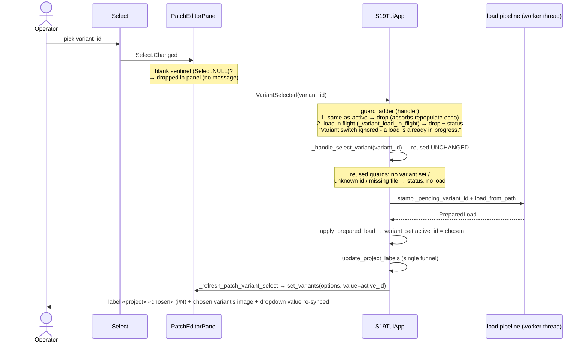
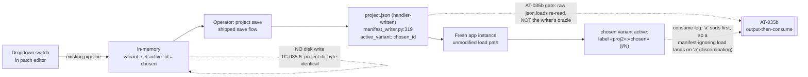

# Diagrams — Batch 2026-07-01-batch-23 (US-028 inline variant dropdown)

> Three views of the shipped behavior: (a) the switch sequence with its guard ladder, (b) the dropdown's state machine, (c) the C-12 persist-then-consume chain. Extends the §6.2 sequence diagram in 01-requirements.md with the guards and re-sync as implemented. All symbols cited in `functionality.md` §2 with file:line.

---

## (a) Switch sequence — pick → guards → threaded load → re-sync

---

## (b) Dropdown state machine

```mermaid
stateDiagram-v2
    [*] --> Disabled_NoProject : first paint (disabled=True at construction)

    Disabled_NoProject : No project — disabled,\nplaceholder "Variants in project", 0 options
    Disabled_Degenerate : N < 2 variants — disabled,\nplaceholder, 0 options, no preselection
    Enabled : N >= 2 — enabled,\noptions in model order, value = active_id
    InFlight : Load in flight — picks suppressed\n(status line; displayed value may lag)

    Disabled_NoProject --> Enabled : project load, N >= 2
    Disabled_NoProject --> Disabled_Degenerate : project load, N == 1
    Disabled_Degenerate --> Enabled : variant append reaches N == 2\n(refresh via update_project_labels tail)
    Enabled --> Disabled_Degenerate : project switch to N < 2
    Enabled --> Disabled_NoProject : project switch away / none
    Enabled --> InFlight : pick (activation dispatched)\nor any load starts
    InFlight --> Enabled : apply-finalize — active_id stamped,\nvalue self-heals to active_id
```

Notes: every transition into a populated state runs `set_options` **before** the value assignment (textual 8.2.5 resets the selection on `set_options` and emits `Changed(Select.NULL)` + `Changed(active_id)` — absorbed by the panel NULL filter and the same-as-active short-circuit). There is no project-close path in the codebase; state changes arrive via project load/switch and variant append, all funneled through `update_project_labels`.

---

## (c) C-12 persist chain — switch → save → project.json → fresh load consumes

The pre-existing direct-write consumer test (`test_variant_execution.py::test_load_project_honors_manifest_active_variant`) sits outside this chain as a **guard only** — it hand-writes the manifest, never touches the dropdown, and stays green under a reverted route, so it must never gate.
