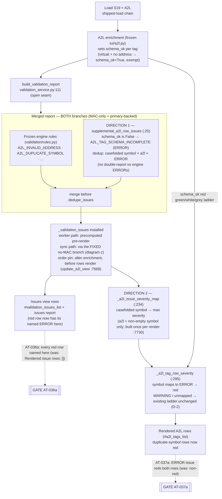
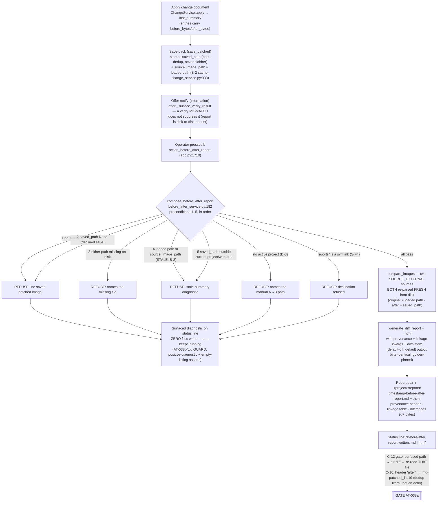
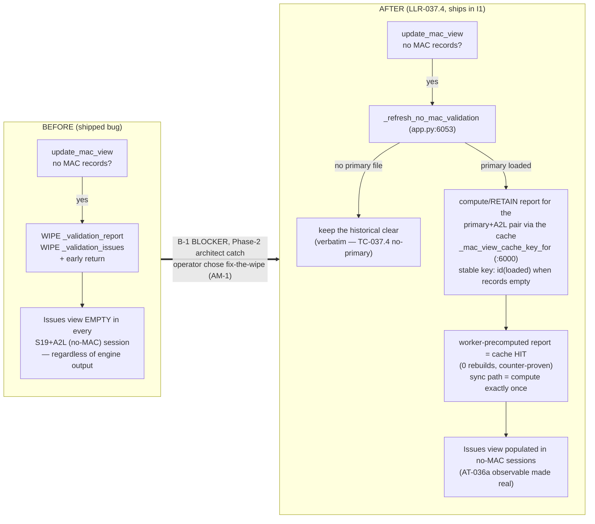

# Diagrams — Batch 2026-07-02-batch-24 (A2L↔Issues reconcile + before/after report)

> Three views of the shipped behavior: (a) the reconcile data flow with both directions annotated, (b) the before/after report chain with its refusal branches, (c) the no-MAC wipe fix before/after. All symbols cited in `functionality.md` §3 with re-verified file:line.

---

## (a) Reconcile data flow — tags → enrichment → supplemental rule → merged report → row-severity map → rendered rows

Direction 1 (red ⇒ issue) is the supplemental-rule branch feeding the Issues surface; direction 2 (issue ⇒ red) is the severity-map branch feeding row colour. Both read the SAME merged report, which is why the two surfaces can no longer disagree.

---

## (b) Before/after report chain — apply → save-back → offer → `b` → preconditions → compare → report pair

---

## (c) The no-MAC wipe fix (B-1 / LLR-037.4) — before vs after

Old behavior: every session without MAC records lost its validation report — the reconcile's Issues-side observable was unobservable, and the shipped product was broken in all no-MAC sessions.

Fixture-discipline note: the US-032/033 acceptance tests are deliberately **MAC-less** — adding a MAC record would sidestep the old wipe and green the ATs while the shipped bug persisted (the C-12-family masking class). The constraint travels inside the tests themselves.
