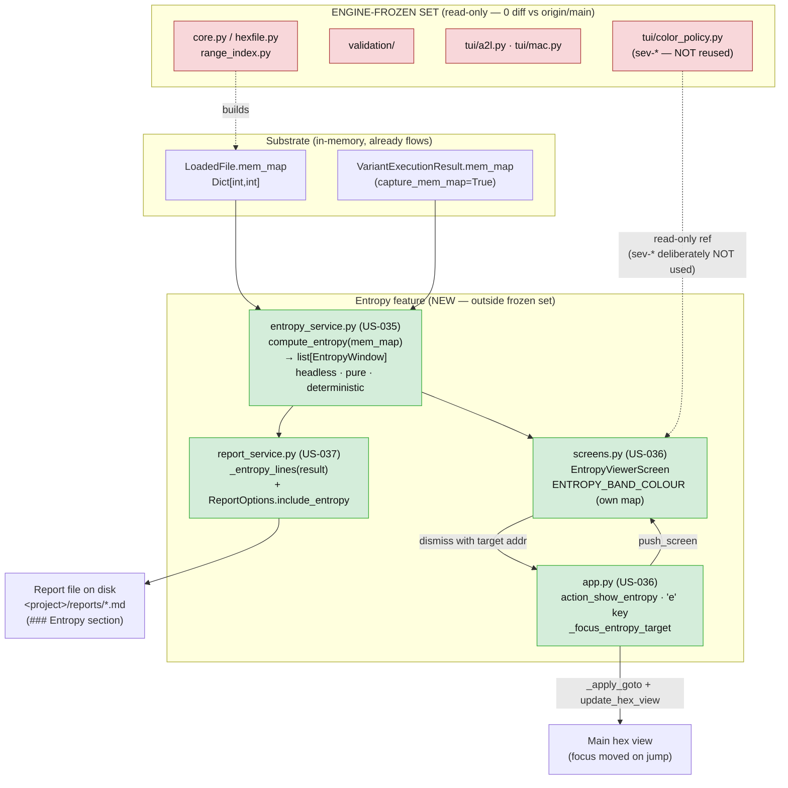
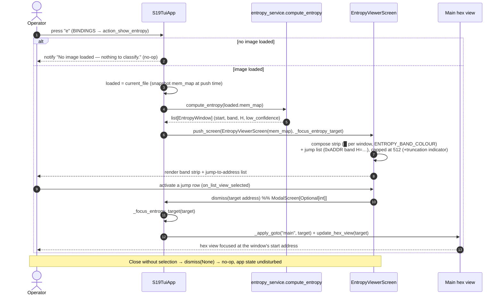
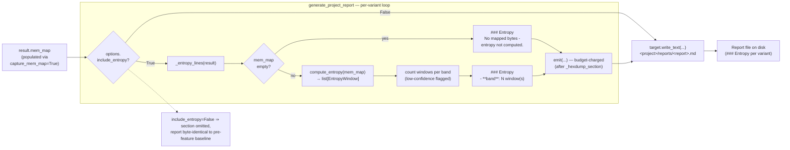

# Diagrams — Entropy / Data-Classification Viewer (batch-26, feature #12(b))

> Three Mermaid diagrams: (a) architecture, (b) US-036 viewer sequence, (c) US-037 report data-flow.
> **Engine-frozen boundary is drawn explicitly in (a) — all entropy code sits OUTSIDE it.**
> Facts sourced from the shipped code and `01-requirements.md` / `04-validation.md` (see `../traceability-matrix.md`).

---

## (a) Architecture — where `entropy_service` sits

`entropy_service.py` is a NEW, headless, pure-arithmetic module. It reads the same `LoadedFile.mem_map` / `VariantExecutionResult.mem_map` substrate the rest of the tool carries, and feeds two consumers: the report section (US-037) and the viewer modal (US-036). It lives entirely OUTSIDE the engine-frozen set — it derives ranges itself and imports no parser and no Textual symbol.

---

## (b) Sequence — US-036 viewer flow (`e` → modal → jump → focus)

Operator presses `e`; the app snapshots the loaded image's `mem_map` at push time, the modal renders the band strip + jump list, the operator activates a jump row, the modal dismisses **with the target address**, and the host moves the hex view there. No-image is a safe no-op.

---

## (c) Data flow — US-037 report section (`mem_map` → written report file)

Inside `generate_project_report`'s per-variant loop, when `include_entropy` is true, `_entropy_lines(result)` runs `compute_entropy` over the variant's `result.mem_map`, counts windows per band, and emits a band-summary section through the budget-charged `emit()` helper — after the hexdump. The lines land in the single report file written once at the end.

> **Read-back (validation, C-12):** the US-037 gate re-reads the WRITTEN file from disk and asserts the `### Entropy` heading + band lines are present under the variant — it never calls `_entropy_lines` directly (see `../traceability-matrix.md` §1b, `test_report_contains_entropy_section_on_disk`).
