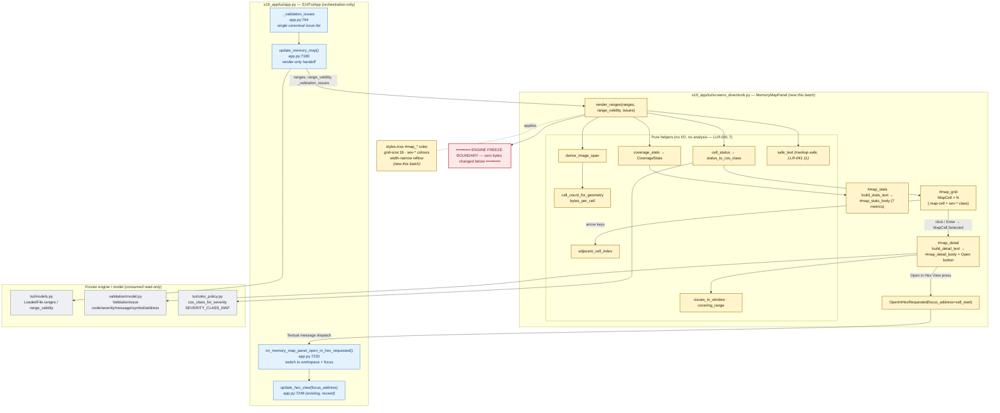
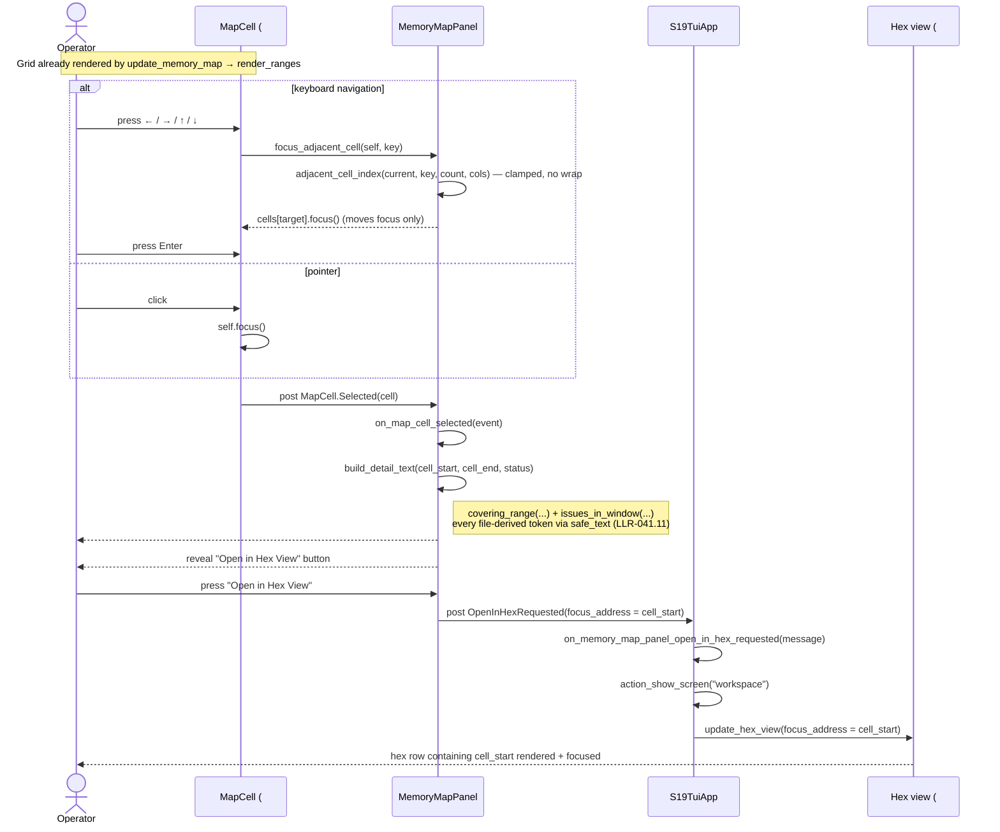
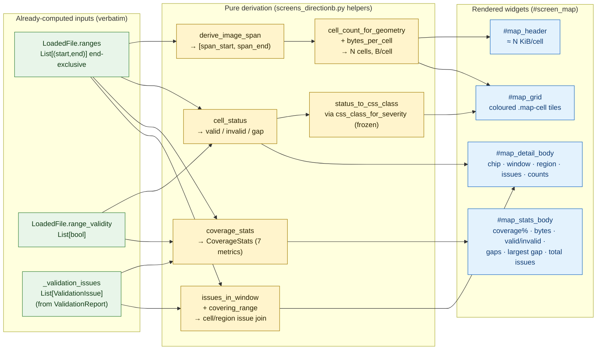

# Diagrams — Interactive Memory Map — s19_app — Batch 2026-07-06-batch-27

Reference diagrams for **R-TUI-041 — Interactive Memory-Map Minimap** (US-035 / US-036 / US-037).

1. **Component / architecture** — `S19TuiApp.update_memory_map` → `MemoryMapPanel.render_ranges` → grid cells / detail / stats, and the `OpenInHexRequested` message → app handler → `update_hex_view`, sitting on top of the **frozen** engine.
2. **Sequence** — operator selects a cell → detail renders → Open-in-Hex → hex view focuses `cell_start`.
3. **Data flow** — `LoadedFile.ranges`/`range_validity` + `_validation_issues` → `coverage_stats` / `cell_status` / `issues_in_window` → rendered widgets.

All blocks are **Mermaid source** — render in any GitHub Markdown viewer or Mermaid-aware IDE. No build step, no rendered images checked in, no extra dev dependency (Phase 6 hard constraint).

Source data:

- [`01-requirements.md`](../../01-requirements.md) §2.1 (product perspective), §3 (HLR), §4 (LLR), §6.2 (C-13 geometry budget), draft-time probe ledger (P-1..P-12).
- [`03-increments/increment-001.md`](../../03-increments/increment-001.md) / [`-002.md`](../../03-increments/increment-002.md) / [`-003.md`](../../03-increments/increment-003.md).
- [`04-validation.md`](../../04-validation.md) §2/§3 (real test nodes), §8 (engine-freeze verification).
- Code: `s19_app/tui/screens_directionb.py` (`MemoryMapPanel` + helpers), `s19_app/tui/app.py` (`update_memory_map` ~7180, `on_memory_map_panel_open_in_hex_requested` ~7220), `s19_app/tui/styles.tcss` (`#map_*` rules 529-617).

---

## 1. Component / architecture

The redesign lives entirely in the **view layer** (yellow). The dashed red line is the **engine-freeze boundary** — nothing below it changed this batch (`git diff main` empty over the seven frozen modules, [`04-validation.md`](../../04-validation.md) §8). The panel consumes the already-computed `LoadedFile` snapshot, the pre-computed `_validation_issues`, and the frozen `css_class_for_severity`; the Open-in-Hex jump reuses the existing `update_hex_view`.

**Reading the diagram.**

- **Yellow** = new/respecified this batch (`MemoryMapPanel`, its helpers, the `#map_*` widgets and CSS).
- **Blue** = existing `app.py` orchestration — `update_memory_map` gains **one** extra argument (`_validation_issues`) and there is **one** new handler; `update_hex_view` is reused verbatim.
- **Grey below the red line** = the frozen engine/model, consumed read-only. `css_class_for_severity` is the single source of truth for cell colours; `ValidationIssue` fields feed the detail pane; `LoadedFile` fields feed the grid and stats.
- The panel never renders hex itself — it posts `OpenInHexRequested` and the app owns the focus path (LLR-041.6).

---

## 2. Sequence — select a cell, then Open-in-Hex

The operator selects a cell, the detail pane renders, and the Open-in-Hex jump focuses the hex view at `cell_start`. This is the AT-036a / AT-036b path, observed black-box through `#map_detail` and `#hex_view`.

**Reading the diagram.**

- **Arrows move focus; `Enter` (or click) selects** — the two are deliberately separate so keyboard traversal never triggers a detail re-render on every hop.
- The detail pane is assembled by pure helpers over the panel's stored ranges/issues — no new analysis (LLR-041.7), all file-derived text markup-safe (LLR-041.11).
- Open-in-Hex is a **message**, not a direct call: the panel stays render-only and the app owns `update_hex_view`. The black-box proof (AT-036b) asserts the *rendered hex row* at `cell_start` appears — not a mock call.

---

## 3. Data flow — already-computed inputs → derived widgets

Everything the screen shows is derived by arithmetic on already-parsed values. No box in this diagram parses a file, computes coverage, or runs validation — those all happened upstream, before `update_memory_map` is called.

**Reading the diagram.**

- **Green** = the three already-computed inputs handed to `render_ranges` verbatim.
- **Yellow** = pure, side-effect-free derivation — the cell partition, the per-cell status, the coverage arithmetic, and the read-only issue join. The `span > 0` check inside the auto-scale / stats path is the single divide-by-zero guard.
- **Blue** = the four rendered widget bodies. Both `#map_stats_body` and `#map_detail_body` read the **same canonical** `_validation_issues` — never a re-derived count — so the "total issues" figure and the per-cell/region joins can never diverge.
- Cell colour flows only through `status_to_css_class` → `css_class_for_severity` (frozen); the panel hard-codes no severity value.

---

## 4. Diagram-source maintenance notes

- **Format.** All blocks are Mermaid source — render client-side. No build step, no rendered images, no extra dev dependency.
- **Point-in-time.** This file is the batch-archive diagram set for the R-TUI-041 minimap redesign. Line citations (`app.py:7180` etc.) are accurate as of this batch; re-verify if the app is refactored.
- **Freeze boundary.** The freeze boundary in §1 is an accurate architectural fact for batch-27 — `git diff main` over the seven frozen modules is empty. Re-draw it if a future engine batch changes what lives below the line.
- **Validation.** Render in any GitHub Markdown view to verify syntax. The diagrams use only Mermaid `flowchart` and `sequenceDiagram` features — no plugins, no client-config injection.
