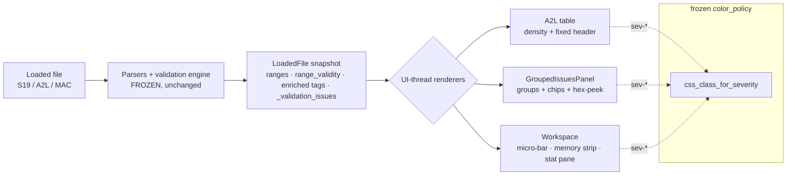
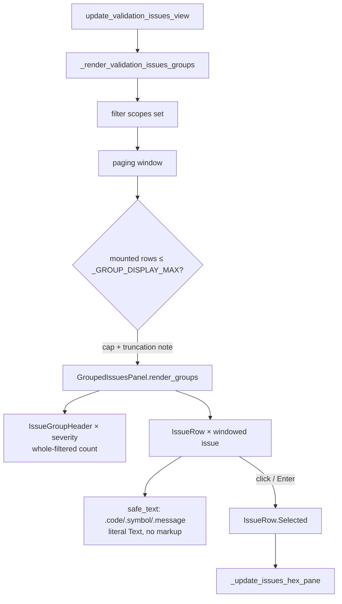

# Diagrams · batch-28

## 1. Render data-flow (render-only, engine untouched)

```mermaid
flowchart LR
  F[Loaded file<br/>S19 / A2L / MAC] --> P[Parsers + validation engine<br/>FROZEN, unchanged]
  P --> M[LoadedFile snapshot<br/>ranges · range_validity · enriched tags · _validation_issues]
  M --> R{UI-thread renderers}
  R --> A[A2L table<br/>density + fixed header]
  R --> I[GroupedIssuesPanel<br/>groups + chips + hex-peek]
  R --> W[Workspace<br/>micro-bar · memory strip · stat pane]
  subgraph policy[frozen color_policy]
    C[css_class_for_severity]
  end
  A -. sev-* .-> C
  I -. sev-* .-> C
  W -. sev-* .-> C
```

## 2. Issues grouped-view: bounded, markup-safe render

```mermaid
flowchart TD
  V[update_validation_issues_view] --> G[_render_validation_issues_groups]
  G --> FILT[filter scopes set] --> WIN[paging window]
  WIN --> CAP{mounted rows &le; _GROUP_DISPLAY_MAX?}
  CAP -->|cap + truncation note| RG[GroupedIssuesPanel.render_groups]
  RG --> H[IssueGroupHeader × severity<br/>whole-filtered count]
  RG --> ROW[IssueRow × windowed issue]
  ROW --> SAFE[safe_text: .code/.symbol/.message<br/>literal Text, no markup]
  ROW -->|click / Enter| SEL[IssueRow.Selected] --> PEEK[_update_issues_hex_pane]
```

## 3. /dev-flow path for this batch

```mermaid
flowchart LR
  P0[P0 DoR<br/>4 stories] --> P1a[P1 v1<br/>A2L-C/Issues-C/Wksp-B/MAC-B]
  P1a -->|operator re-selects| P1b[P1 v2 iterate<br/>A2L-A/Issues-B/Wksp-B/MAC drop]
  P1b --> P2[P2 review<br/>0 blockers · 8 majors folded]
  P2 --> P3[P3 · 4 increments<br/>+ HIGH-fix + 2 regressions caught by exit gate]
  P3 --> P4[P4 validation<br/>1126 pass · 0 fail]
  P4 --> P5[P5 post-mortem<br/>3 candidate controls]
  P5 --> P6[P6 docs] --> MG[commit · PR · review · merge]
```
