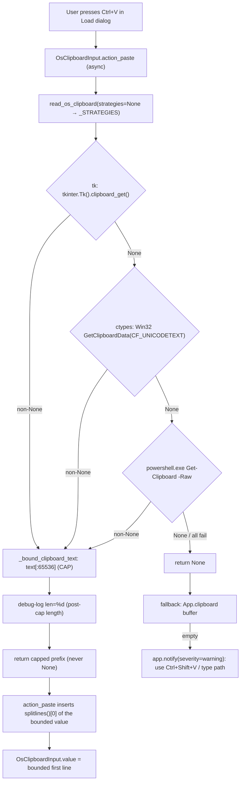
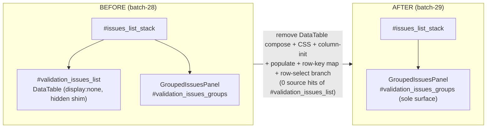
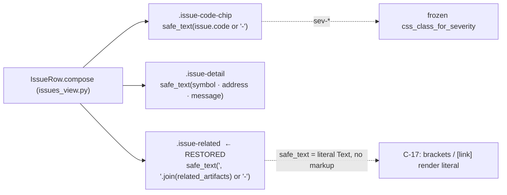
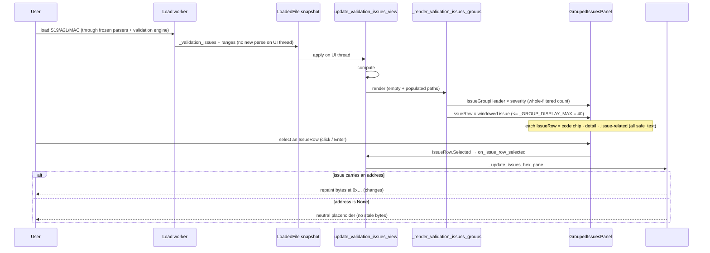

# Diagrams · batch-29 — clipboard read cap + Issues DataTable retirement

## 1. Clipboard cascade + read cap (US-042 · R-TUI-044)

The cascade order is unchanged (R-TUI-043); batch-29 adds the single `_bound_clipboard_text` funnel so
every layer's result is length-capped before it is logged, returned, or pasted.

**Note (R-044-1).** The cap is a bound on all *downstream* use. Each reader (tk/ctypes/PS) still
transiently materializes the full OS-clipboard string before `_bound_clipboard_text` applies — the true
source bound is the deferred, named-not-built LLR-044.6.

---

## 2. Issues screen: before → after (US-043 · extends R-TUI-042)

batch-28 left the legacy DataTable mounted as a `display:none` shim beside the grouped panel; batch-29
removes it so `GroupedIssuesPanel` is the sole surface.

### `IssueRow` node structure (after)

Each `IssueRow.compose` yields three `safe_text` (literal `rich.text.Text`) nodes. The `.issue-related`
node is restored in batch-29 (invisible since batch-28).

---

## 3. Load → issue → grouped render → hex peek (sequence)

Preserved end-to-end after the retirement: summary and paging never depended on the DataTable, and
selection still drives the hex peek through `on_issue_row_selected`.

