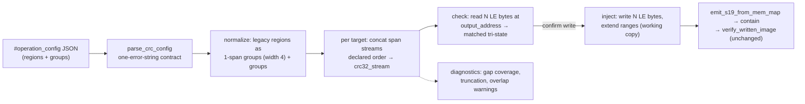

# 01 — Requirements DRAFT · batch-32 · CRC multi-region single-CRC groups (B-21, P1)

**BLUF.** One P1 feature from the baseline backlog (B-21): let the operator declare **groups** of
disjoint memory regions that are concatenated **in declared order** and fed through **one** CRC
computation, producing **one** CRC stored at **one** output address with a **configurable output byte
width** (little-endian). The current engine (`s19_app/tui/operations/crc.py`) computes one CRC per
region, each fixed at 4 LE bytes (`LE32_WIDTH = 4`, crc.py:48). Recommended schema: **a new top-level
`groups` key alongside the legacy `regions` key** (Option A below) — legacy configs parse and behave
byte-identically. 4 user stories (US-044..047 placeholder numbering) · 17 ATs · 2 proposed repo-level
requirement rows (`R-CRC-GROUP-001`, `R-CRC-WIDTH-001`). **0 engine-frozen modules touched** (all work
in `tui/operations/` + `tui/screens.py` + `tui/operations/model.py`, none in the frozen set).
4 open questions for the operator at the end.

Language: English. Route: full /dev-flow. Status: **DRAFT — pre-gate, Phase-2 (arch/qa/security) not run.**

---

## 1. Scope & context

### 1.1 Current behavior (code-verified)

| Fact | Evidence |
|------|----------|
| Config = global params + flat `regions: [{start, end, output_address}]`; every region carries its OWN output address | `crc_config.py:60-120` (`CrcRegion`, `CrcConfig`), `_build_config` crc_config.py:374-431 |
| One CRC **per region**: segments inside `[start,end)` (present bytes only, split on gaps, ascending) → one `crc32_stream` per region | `region_segments` crc.py:154-207, `compute_region_crc` crc.py:210-268, `compute_region_crcs` crc.py:271-324 |
| Storage codec is **fixed 4-byte little-endian** — explicitly "NOT parameterized" (§6.2 D-5) | `LE32_WIDTH` crc.py:46-48, `encode_le32`/`decode_le32` crc.py:327-388, `read_stored_crc_le` crc.py:391-442 |
| Check: per region, compute + read 4 LE bytes at `output_address`; `matched` tri-state (True/False/None-when-absent); never raises | `check_regions` crc.py:445-527 |
| Inject: working copy only (input never mutated); writes 4 bytes, extends/merges `ranges` when the output window is outside every loaded range | `inject_crcs` crc.py:632-729, `_extend_ranges` crc.py:584-629 |
| Write path: check → inject → `emit_s19_from_mem_map` → stage under `temp/` → `copy_into_workarea` (containment + no-overwrite dedup) → `verify_written_image` against the injected map; faults are collected findings | `write_crc_image` crc.py:790-916 |
| Config text comes from the raw-JSON `TextArea` `#operation_config` (pre-filled with `DUMMY_CONFIG_TEXT`), parsed on Execute via `parse_crc_config`; collect-don't-abort: every fault is `(None, [exactly one error string])` | screens.py:1225, :1452, :1742; `parse_crc_config` crc_config.py:311-371 |
| Result model: `CrcRegionResult {output_address, computed_crc, stored_value, matched, written}` on `OperationResult.crc_regions`, serialized by `to_json_dict` | model.py:131-178, :260, :335-346 |
| No overlap validation exists today; the committed dummy config places each `output_address` INSIDE its own region (0x0001FFFC ∈ [0x10000, 0x20000)) | `DUMMY_CONFIG_TEXT` crc_config.py:47-57 |

### 1.2 Files in scope (all NON-frozen)
- `s19_app/tui/operations/crc_config.py` — schema extension + validation.
- `s19_app/tui/operations/crc.py` — group compute, width-parameterized codec, check/inject.
- `s19_app/tui/operations/model.py` — result model extension (defaulted field).
- `s19_app/tui/screens.py` — result-row / notes surface (expected minimal).
- `examples/crc_config.example.json` + `DUMMY_CONFIG_TEXT` — format guidance update.
- Tests: `tests/test_crc_config.py`, `test_crc_engine.py`, `test_crc_operation.py`, `test_tui_crc_surface.py`.

**Engine-frozen set (READ-only, 0 diff target):** `core.py, hexfile.py, range_index.py, validation/,
tui/a2l.py, tui/mac.py, tui/color_policy.py`. The engine keeps using `range_index` primitives
import-only (crc.py:26), exactly as today.

---

## 2. Schema design — options considered

### Option A (RECOMMENDED): new top-level `groups` key alongside legacy `regions`

```json
{
  "polynomial": "0x04C11DB7",
  "init": "0xFFFFFFFF",
  "reverse": true,
  "final_xor": "0xFFFFFFFF",
  "regions": [
    { "start": "0x00010000", "end": "0x00020000", "output_address": "0x0001FFFC" }
  ],
  "groups": [
    {
      "regions": [
        { "start": "0x00030000", "end": "0x00034000" },
        { "start": "0x00040000", "end": "0x00042000" }
      ],
      "output_address": "0x00042000",
      "output_bytes": 4
    }
  ]
}
```

Rules: `regions` and `groups` are each optional, but **at least one must be present and non-empty**
(amends the current "`regions` must contain at least one region", crc_config.py:410-411 — see §6.5
amendment note). A group's inner `regions` entries carry `start`/`end` ONLY (no per-span
`output_address`). `output_bytes` is optional, default `4`, allowed set `{1, 2, 4, 8}`. All ints
accept hex-string-or-int via the existing `_parse_int`. A legacy-only file parses to a config whose
`groups` list is empty and behaves byte-identically to today.

### Option B (REJECTED): unified list, shape-discriminated entries
One `regions` list where an entry is either a legacy region (`{start,end,output_address}`) or a group
(`{regions:[...], output_address, output_bytes}`), discriminated by which keys are present.
- **Backward compat:** equal to A (legacy entries unchanged).
- **Validation simplicity:** worse. Shape-sniffing makes the single collected error string ambiguous —
  a legacy entry with a typo'd `output_address` is indistinguishable from a half-formed group, so the
  operator gets "region 2 is neither a region nor a group" instead of a precise field error. The
  current parser's charm is exactly one crisp error (`_build_config` raises KeyError/TypeError/ValueError
  with a named field, crc_config.py:374-431).
- **Operator ergonomics in the raw-JSON TextArea:** worse. Mixed-shape entries in one list are easy to
  mis-edit; a labeled `groups` block is self-documenting in the `DUMMY_CONFIG_TEXT` pre-fill.

### Option A′ (considered, folded into A): key name `crc_groups` instead of `groups`
The file is already a CRC config — the `crc_` prefix is redundant noise in the editor. `groups` chosen;
trivially reversible before code (rename is a one-line parse change + fixture sweep).

### Recommendation rationale (ties to constraints)
**Option A.** (1) Backward compat is structural, not behavioral: the legacy branch of the parser is
literally untouched, so `test_crc_config.py` / `test_crc_operation.py` stay green unmodified — the
strongest possible compat evidence. (2) Each key validates independently with the existing
one-error-string contract intact. (3) The JSON `TextArea` is the only editor (no structured form,
screens.py:1225) — a visually separated, labeled block is the most operator-forgiving shape there.
(4) Reversibility: adding a sibling key is a two-way door; a unified list (B) would be a wire-format
commitment that is painful to walk back once real configs exist.

**Internal model (preliminary, Phase-2 refines):** `CrcConfig` gains
`groups: list[CrcGroup] = field(default_factory=list)` (defaulted → every existing constructor call in
tests stays valid). `CrcGroup {spans: list[tuple[int,int]], output_address: int, output_bytes: int}`.
A normalization helper yields the unified evaluation sequence: **legacy regions (file order, as
single-span groups with `output_bytes=4`) then groups (file order)** — so check/inject/result code has
ONE loop, and legacy results keep their current list positions (first) for report stability.

---

## 3. Semantics (decided, with rationale)

| # | Decision | Rationale |
|---|----------|-----------|
| S-1 | **Concatenation order = declared order** of the group's `regions` list. Within each span, present bytes ascend (existing FR2). The group stream is `concat(span_1_bytes, span_2_bytes, ...)` digested by ONE `crc32_stream` call — equivalent to one non-resetting CRC state across spans (same argument as crc.py:220-227). NOT address-sorted across spans. | Matches the operator's "concatenated in declared order and processed as if contiguous". Address-sorting would silently break any firmware whose CRC tool orders regions non-monotonically. AT-045b pins order-sensitivity. |
| S-2 | **Duplicate/overlapping spans within a group are digested each time they appear** — no dedup, no error. | "As if contiguous" means the operator's declared byte stream is authoritative; documented, not policed. |
| S-3 | **Absent bytes inside a declared span: CRC covers present bytes only** (exact `region_segments` semantics, FR7 parity) **and a per-group coverage diagnostic note fires** ("group N: span [s,e) has K absent byte(s) — CRC covers present bytes only"). Legacy regions stay silent (today's behavior) unless Q4 flips. | Consistency with the shipped per-region engine and the collect-don't-abort culture. BUT a silent gap changes the stream length and makes the CRC diverge from any device tool that CRCs the full padded range — hence the mandatory diagnostic for groups. Escalation options (hard-fail / fill byte) are Q1. |
| S-4 | **Output width `output_bytes ∈ {1,2,4,8}`, little-endian** (existing convention, §6.2 D-5 direction). Stored/written value = the low `8*N` bits of the 32-bit CRC: `N=4` exact (today), `N=8` zero-extended high bytes, `N<4` **truncated low bytes + a truncation warning note**. Codec generalizes to `encode_le(value, width)` / `decode_le(data)`; `encode_le32`/`decode_le32` remain as fixed-4 wrappers (public API + KATs untouched). | "Specify the bytes" per operator. LE keeps one endianness rule tool-wide. Truncation is allowed-but-warned because some targets genuinely store CRC16-sized fields; the warning surfaces the weakened error detection. Width set is Q2. |
| S-5 | **Check:** compute group CRC over the pristine input `mem_map`; read `output_bytes` LE bytes at `output_address` (ANY absent byte → `stored_value=None`, `matched=None` — exact `read_stored_crc_le` contract generalized); tri-state `matched`. Never raises. | Direct generalization of crc.py:391-442 + :445-527. |
| S-6 | **Inject:** all CRCs are computed over the ORIGINAL input first, then all writes land on the working copy (today's check-then-inject pipeline, crc.py:866-868) — so one group's output write can never feed another group's input bytes within the same run. Writes `output_bytes` LE bytes; extends/merges `ranges` by `[out, out+N)` via `_extend_ranges`. Emission/containment/verify path (`write_crc_image`) unchanged. | Deterministic, order-independent computes; reuses the audited containment + verify seam untouched. |
| S-7 | **Overlap policy: warn, never block.** A warning note fires when a target's output window `[out, out+N)` intersects (a) any of its OWN input spans — self-referential CRC: inject invalidates the value just computed — or (b) any OTHER target's input span — that target's stored-vs-computed comparison becomes flash-order-dependent. | Blocking would break existing practice: the committed dummy config already places outputs inside their own regions (crc_config.py:53-54), so a hard error would reject today's canonical example. Collect-don't-abort. |
| S-8 | **Result model:** `CrcRegionResult` gains `output_bytes: int = 4` (defaulted field → all existing constructions and `to_json_dict` consumers stay valid); JSON report entries gain the key. Evaluation/result order per §2 (legacy first, then groups). | Minimal ripple; backward-compat pinned by AT-044a/AT-047d. |

### Flow (group path, check + confirm-write)



---

## 4. User stories & Definition of Ready (US-nnn placeholders, continuing from US-043)

**US-044 — config schema.** *As a firmware integrator, I want to declare groups of disjoint regions
with one output address and byte width in the same CRC config JSON, with my existing per-region
configs still valid unchanged, so I don't have to migrate anything to adopt the feature.* READY.
Observable through `parse_crc_config` return + end-to-end check/write results.

**US-045 — single-CRC group semantics.** *As a firmware integrator, I want the group CRC computed
over my regions concatenated in the order I declared, as if they were one contiguous block, so the
tool reproduces the multi-region CRC my flashing/build tool computes.* READY. Observable through
computed CRC values vs `zlib.crc32` oracles and vs manual `crc32_stream` concatenations.

**US-046 — configurable output width.** *As a firmware integrator, I want to specify how many bytes
(1/2/4/8, little-endian) the CRC occupies at the output address, so the stored field matches my
target's memory layout.* READY. Observable through bytes written into the emitted S19 and bytes read
on check.

**US-047 — check/inject surface.** *As an operator, I want check and confirm-write to handle groups
end-to-end — per-target verdicts, diagnostics, and the JSON report — so groups are first-class next
to legacy regions.* READY. Observable through result rows/notes, `to_json_dict`, and a re-read of the
emitted file (output-then-consume, C-12).

---

## 5. Acceptance (black-box) blocks — EARS ATs

Surface: `parse_crc_config` return · `check_regions`/`CrcOperation.execute` results and notes ·
`write_crc_image` result + re-read of the emitted S19 · `OperationResult.to_json_dict`.

### US-044 — schema + backward compat
| AT | EARS statement |
|----|----------------|
| **AT-044a** | When a config containing only the legacy `regions` key is parsed and executed (check AND confirm-write), the system shall produce results identical to current behavior — same `CrcRegionResult` values in the same order, same notes, byte-identical emitted S19 — with the pre-existing CRC test suite passing unmodified. |
| **AT-044b** | When a config declares `groups` entries of the form `{regions:[{start,end},...], output_address, output_bytes}`, `parse_crc_config` shall return a populated config and an empty error list. |
| **AT-044c** | When a config declares both `regions` and `groups`, check shall evaluate every target — legacy regions first (file order), then groups (file order) — producing one result per target. |
| **AT-044d** | When a config declares neither key non-empty, or a group with an empty `regions` list, or `output_bytes` outside the allowed set, `parse_crc_config` shall return `(None, [exactly one error string])` without raising. |
| **AT-044e** | When the updated `DUMMY_CONFIG_TEXT` editor pre-fill is parsed, it shall parse cleanly and shall demonstrate both a legacy region and a group (format guidance stays self-validating, mirroring `test_parse_crc_config_dummy_prefill_is_valid`). |

### US-045 — group CRC semantics
| AT | EARS statement |
|----|----------------|
| **AT-045a** | When a group declares two disjoint fully-present spans [A, B] with default params, the computed group CRC shall equal `zlib.crc32` over `bytes(A) + bytes(B)` (concatenated declared order, single non-resetting state). |
| **AT-045b** | When the same two spans are declared in reversed order [B, A], the computed CRC shall equal the oracle over `bytes(B) + bytes(A)` and shall differ from AT-045a's value (declared order, NOT address order). |
| **AT-045c** | When a declared span inside a group contains absent addresses, the group CRC shall cover only present bytes (segment semantics) and the operation notes shall carry a coverage diagnostic naming the group and the absent-byte count. |
| **AT-045d** | When a group declares exactly one span with `output_bytes` 4, its computed CRC, check verdict, and injected bytes shall equal the legacy per-region result over the same `(start, end, output_address)` (equivalence bridge). |
| **AT-045e** | When non-default params (polynomial/init/reverse/final_xor) are configured, the group CRC shall equal `crc32_stream` with those params over the concatenated stream (params flow through the group path, not just the legacy path). |

### US-046 — output width
| AT | EARS statement |
|----|----------------|
| **AT-046a** | When `output_bytes` is 8, confirm-write shall write exactly 8 little-endian bytes at `output_address` (low 4 = CRC, high 4 = `0x00`) and the working ranges shall gain/merge `[out, out+8)`. |
| **AT-046b** | When `output_bytes` is 1 or 2, the written/compared value shall be the low N bytes of the CRC little-endian, and the operation notes shall carry a truncation warning for that target. |
| **AT-046c** | When `output_bytes` is omitted from a group, the system shall use 4. |
| **AT-046d** | When any of the N bytes at `output_address` is absent from the loaded image on check, the target shall report `stored_value=None` / `matched=None` without raising. |

### US-047 — check/inject/report surface
| AT | EARS statement |
|----|----------------|
| **AT-047a** | When check runs over a mixed config against an image where one group's stored value matches and another's differs, the results shall report per-target `matched` True/False respectively, each carrying its `output_address` and `output_bytes`. |
| **AT-047b** | When the operator confirms write, re-reading the emitted S19 file (fresh `S19File` parse) at each group's `output_address` shall decode exactly the computed group CRC in N LE bytes, and `verify_status` shall be `"verified"` (output-then-consume over the shipped artifact, C-12). |
| **AT-047c** | When a target's output window overlaps any input span (its own or another target's), the notes shall carry an overlap warning and the operation shall still complete with results for every target. |
| **AT-047d** | When results serialize via `OperationResult.to_json_dict`, each target entry shall include `output_bytes`, and legacy-region entries shall keep all existing keys with unchanged values (report backward compat). |

**Counterfactuals (C-10, to capture RED in Phase 3):** AT-045a/b fail on today's engine (no group
concept — nearest behavior is two independent CRCs); AT-046a/b fail against the fixed `LE32_WIDTH`
codec; AT-044b/d fail against today's parser (unknown key ignored / `regions` required); AT-044a and
AT-045d must PASS pre-change where applicable (guard against compat regressions).

---

## 6. Proposed requirements (HLR level — LLR decomposition is Phase 2)

**R-CRC-GROUP-001 (traces US-044, US-045, US-047).** *The CRC operation shall accept, alongside the
legacy per-region form, operator-declared region GROUPS — each an ordered list of `{start, end}`
spans plus one `output_address` and one optional `output_bytes` — and shall compute for each group a
single CRC over the spans' present bytes concatenated in declared order through one non-resetting CRC
state, checking/injecting that single value at the group's output address; legacy-only configs shall
parse and behave identically to the pre-change system, all faults shall follow the existing
one-collected-error / never-raise contracts, and gap-coverage and overlap conditions shall surface as
diagnostic notes, never aborts.*

**R-CRC-WIDTH-001 (traces US-046).** *The stored/written CRC field width shall be configurable per
group as 1, 2, 4, or 8 little-endian bytes (default 4): widths above 4 zero-extend, widths below 4
truncate to the low bytes and fire a truncation warning; the check path shall read exactly the
configured width and report no-stored-value when any byte is absent; legacy regions remain fixed at
4 (amends §6.2 D-5 "NOT parameterized" — see §6.5 note below).*

**§6.5 amendment notes (Before/After to be recorded formally at the gate):**
1. `crc_config` parse rule *"field 'regions' must contain at least one region"* → *"at least one of
   'regions' / 'groups' must be present and non-empty"*.
2. §6.2 **D-5** *"Fixed storage codec width … NOT parameterized"* → parameterized per GROUP
   (`{1,2,4,8}` LE); legacy regions keep fixed 4. `encode_le32`/`decode_le32` stay as wrappers.

**Dual traceability skeleton (LLR/TC columns filled in Phase 2):**

| US | HLR | Black-box AT | White-box TC |
|----|-----|--------------|--------------|
| US-044 | R-CRC-GROUP-001 (schema clause) | AT-044a..e | TBD (parser field errors, normalization order) |
| US-045 | R-CRC-GROUP-001 (compute clause) | AT-045a..e | TBD (concat vs per-span chaining identity, no-mutation) |
| US-046 | R-CRC-WIDTH-001 | AT-046a..d | TBD (codec width table, range-extension width) |
| US-047 | R-CRC-GROUP-001 (surface clause) | AT-047a..d | TBD (note wording, to_json_dict keys, result ordering) |

---

## 7. Out of scope (explicit)

- Per-group algorithm-parameter overrides (poly/init/reverse/xor stay a single global set).
- CRC algorithms other than 32-bit CRC (no CRC16/CRC64 engines; width config changes STORAGE only).
- Big-endian or mixed-endian output codecs (LE only, per existing convention).
- Fill/pad semantics for absent bytes (e.g. `0xFF` fill) — unless Q1 flips the default.
- A structured form editor for groups — the raw-JSON `TextArea` remains the only config surface.
- HEX/A2L/MAC as CRC inputs (S19-only stays, per REQUIREMENTS.md §18 scope note).
- `report_service` integration (J-3 deferral stands).
- Renaming/deprecating the legacy `regions` form.
- Any modification to the engine-frozen set.

---

## 8. Risks

| # | Risk | Mitigation |
|---|------|------------|
| RK-1 | **Gap divergence:** present-bytes-only group CRC silently differs from a device tool that CRCs the full padded range → false mismatches (or worse, false matches after inject). | Mandatory coverage diagnostic (S-3); Q1 offers hard-fail/fill escalation. |
| RK-2 | **Truncated widths (N<4)** weaken error detection to 8/16 bits. | Allowed-but-warned (S-4, AT-046b); Q2 can forbid instead. |
| RK-3 | **Declared-order trap:** an operator expecting address-sorted concatenation gets a different CRC with zero other symptoms. | AT-045b pins the semantics; `DUMMY_CONFIG_TEXT` + docs state "declared order" explicitly. |
| RK-4 | **Snapshot drift:** updating `DUMMY_CONFIG_TEXT` (TextArea pre-fill) and/or result-row rendering can drift SVG snapshot baselines → regen ONLY in canonical CI (pinned textual 8.2.8), never locally. | Budget a canonical-CI regen step; keep pre-fill change minimal. |
| RK-5 | **Result-model ripple:** `CrcRegionResult.output_bytes` touches `to_json_dict` and every result consumer. | Defaulted field; AT-044a (suite-unmodified) + AT-047d (JSON keys) pin compat. |
| RK-6 | **Self-referential outputs:** output window inside an input span makes inject invalidate the just-computed CRC (pre-existing possibility — the dummy config does this today). | Warn-never-block (S-7, AT-047c); computes-before-writes (S-6) keeps within-run determinism. |
| RK-7 | **Untestable-against-device params:** as with R-CRC-ENGINE-002, we prove the group semantics WIRED (oracles/KATs), not that they match any specific device tool. | Stated as residual risk; operator validates one real config against their tool before trusting inject. |

---

## 9. Open questions for the operator (4 — each genuinely decision-requiring)

1. **Gaps inside a declared group span** (S-3): proposed default = CRC present bytes only + a
   coverage warning note. Alternatives: (a) hard-fail the group (no CRC, one error note) when any
   declared byte is absent, or (b) fill absent bytes with a configurable pad (e.g. `0xFF`, flash
   erase state). Which matches how your build/flash tool computes the multi-region CRC?
2. **Output width set** (S-4): proposed `{1, 2, 4, 8}` with N<4 = truncate-low-bytes + warning.
   Should widths below 4 be rejected outright instead? Do you need any width outside this set?
3. **Result ordering for mixed configs** (S-8): proposed = legacy regions first (file order), then
   groups (file order), in both the TUI result rows and the JSON report. Acceptable, or do you want
   strict top-to-bottom config-file order interleaved?
4. **Legacy-region gap diagnostic** (S-3 scope): groups get the new coverage warning; legacy regions
   currently stay silent on gaps (today's shipped behavior). Should legacy regions gain the same
   warning (a behavior change to existing notes), or stay silent for strict compat?

---

## 10. Evidence checklist (architect, draft-time)

- [x] Constraints stated explicitly — §1.2 (non-frozen files only), BLUF (backward compat mandated), §1.1 (collect-don't-abort, LE, one-error-string contracts; each with file:line).
- [x] At least 2 alternatives considered — §2 Options A / B / A′ with per-dimension comparison.
- [x] Recommendation has rationale tied to constraints — §2 "Recommendation rationale" (compat, validation, TextArea ergonomics, reversibility).
- [x] Risks listed — §8 RK-1..RK-7 (semantic, security-adjacent overlap, cost=snapshot-CI, compat).
- [x] Cost / latency estimated where relevant — N/A for runtime (pure local compute, same O(bytes) as today); process cost flagged as RK-4 canonical-CI regen.
- [x] Diagram included — §3 mermaid flow (parse → normalize → compute → check/inject → verify).
- [x] What would change the recommendation — §9 Q1 (fill semantics would add a `fill` field to the group schema), Q2 (width set), Q3 (ordering would force interleaved normalization); a NO on backward compat would reopen Option B.
- [x] Two-layer requirements — every US has a first-class black-box AT block (§5) + dual-traceability skeleton (§6); LLR/TC chain explicitly deferred to Phase 2 (this is a Phase-1 DRAFT).
