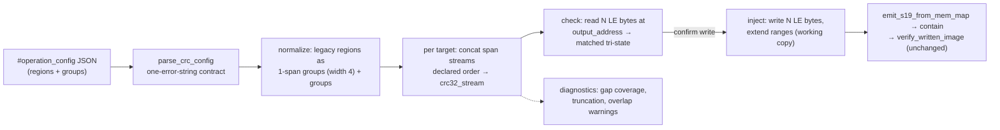

# 01 — Requirements · batch-32 · CRC multi-region single-CRC groups (B-21, P1)

**BLUF.** One P1 feature from the baseline backlog (B-21): let the operator declare **groups** of
disjoint memory regions that are concatenated **in declared order** and fed through **one** CRC
computation, producing **one** CRC stored at **one** output address with a **configurable output byte
width** (little-endian). The current engine (`s19_app/tui/operations/crc.py`) computes one CRC per
region, each fixed at 4 LE bytes (`LE32_WIDTH = 4`, crc.py:48 — re-verified at `551fc77`). Schema:
**a new top-level `groups` key alongside the legacy `regions` key** (Option A below) — legacy configs
parse and behave byte-identically. 4 user stories (US-044..047, continuing the repo numbering) ·
**23 ATs** (18 architect-drafted incl. the AT-047c own/cross split + AT-045f/AT-047e/AT-047f from the
Phase-1 QA fold + AT-047h from the Phase-2 QA fold) · 2 repo-level requirement rows (`R-CRC-GROUP-001`, `R-CRC-WIDTH-001`). **0 engine-frozen
modules touched** (all work in `tui/operations/` + `tui/screens.py` + `tui/operations/model.py`).

**Operator-question defaults (Phase-0/1 decision record — each overridable at any gate via a §6.5
amendment; adopted under the session standing authorization):**
- **Q1 gaps in a declared group span** → CRC covers present bytes only + a mandatory per-group
  coverage warning note (S-3).
- **Q2 output width set** → `{1, 2, 4, 8}` LE; widths < 4 truncate to the low bytes + fire a
  truncation warning (S-4).
- **Q3 mixed-config result order** → legacy regions first (file order), then groups (file order) (S-8).
- **Q4 legacy regions** → stay silent on gaps (strict compat; no new notes on the legacy path) (S-3).

Language: English. Route: full /dev-flow. Status: **Phase-1 LOCKED (QA strategy folded; Phase-2
cross-review next).**

---

## 1. Scope & context

### 1.1 Current behavior (code-verified)

| Fact | Evidence |
|------|----------|
| Config = global params + flat `regions: [{start, end, output_address}]`; every region carries its OWN output address | `crc_config.py:60-120` (`CrcRegion`, `CrcConfig`), `_build_config` crc_config.py:374-431 |
| One CRC **per region**: segments inside `[start,end)` (present bytes only, split on gaps, ascending) → one `crc32_stream` per region | `region_segments` crc.py:154-207, `compute_region_crc` crc.py:210-268, `compute_region_crcs` crc.py:271-324 |
| Storage codec is **fixed 4-byte little-endian** — explicitly "NOT parameterized" (§6.2 D-5) | `LE32_WIDTH` crc.py:46-48, `encode_le32`/`decode_le32` crc.py:327-388, `read_stored_crc_le` crc.py:391-442 |
| Check: per region, compute + read 4 LE bytes at `output_address`; `matched` tri-state (True/False/None-when-absent); never raises | `check_regions` crc.py:445-527 |
| Inject: working copy only (input never mutated); writes 4 bytes, extends/merges `ranges` when the output window is outside every loaded range | `inject_crcs` crc.py:632-729, `_extend_ranges` crc.py:584-629 |
| Write path: check → inject → `emit_s19_from_mem_map` → stage under `temp/` → `copy_into_workarea` (containment + no-overwrite dedup) → `verify_written_image` against the injected map; faults are collected findings | `write_crc_image` crc.py:790-916 |
| Config text comes from the raw-JSON `TextArea` `#operation_config` (pre-filled with `DUMMY_CONFIG_TEXT`), parsed on Execute via `parse_crc_config`; collect-don't-abort: every fault is `(None, [exactly one error string])` | screens.py:1231, :1458, :1748 (refreshed at Phase-2); `parse_crc_config` crc_config.py:311-371 |
| Result model: `CrcRegionResult {output_address, computed_crc, stored_value, matched, written}` on `OperationResult.crc_regions`, serialized by `to_dict` | model.py:131-178, :260, :335-346 |
| No overlap validation exists today; the committed dummy config places each `output_address` INSIDE its own region (0x0001FFFC ∈ [0x10000, 0x20000)) | `DUMMY_CONFIG_TEXT` crc_config.py:47-57 |

### 1.2 Files in scope (all NON-frozen)
- `s19_app/tui/operations/crc_config.py` — schema extension + validation.
- `s19_app/tui/operations/crc.py` — group compute, width-parameterized codec, check/inject.
- `s19_app/tui/operations/model.py` — result model extension (defaulted field).
- `s19_app/tui/screens.py` — result-row / notes surface (expected minimal).
- `examples/crc_config.example.json` + `DUMMY_CONFIG_TEXT` — format guidance update.
- Tests: `tests/test_crc_config.py`, `test_crc_engine.py`, `test_crc_operation.py`, `test_tui_crc_surface.py`.

**Engine-frozen set (READ-only, 0 diff target):** `core.py, hexfile.py, range_index.py, validation/,
tui/a2l.py, tui/mac.py, tui/color_policy.py`. The engine keeps using `range_index` primitives
import-only (crc.py:26), exactly as today.

---

## 2. Schema design — options considered

### Option A (RECOMMENDED): new top-level `groups` key alongside legacy `regions`

```json
{
  "polynomial": "0x04C11DB7",
  "init": "0xFFFFFFFF",
  "reverse": true,
  "final_xor": "0xFFFFFFFF",
  "regions": [
    { "start": "0x00010000", "end": "0x00020000", "output_address": "0x0001FFFC" }
  ],
  "groups": [
    {
      "regions": [
        { "start": "0x00030000", "end": "0x00034000" },
        { "start": "0x00040000", "end": "0x00042000" }
      ],
      "output_address": "0x00042000",
      "output_bytes": 4
    }
  ]
}
```

Rules: `regions` and `groups` are each optional, but **at least one must be present and non-empty**
(amends the current "`regions` must contain at least one region", crc_config.py:410-411 — see §6.5
amendment note). A group's inner `regions` entries carry `start`/`end` ONLY (no per-span
`output_address`). `output_bytes` is optional, default `4`, allowed set `{1, 2, 4, 8}`. All ints
accept hex-string-or-int via the existing `_parse_int`. A legacy-only file parses to a config whose
`groups` list is empty and behaves byte-identically to today.

### Option B (REJECTED): unified list, shape-discriminated entries
One `regions` list where an entry is either a legacy region (`{start,end,output_address}`) or a group
(`{regions:[...], output_address, output_bytes}`), discriminated by which keys are present.
- **Backward compat:** equal to A (legacy entries unchanged).
- **Validation simplicity:** worse. Shape-sniffing makes the single collected error string ambiguous —
  a legacy entry with a typo'd `output_address` is indistinguishable from a half-formed group, so the
  operator gets "region 2 is neither a region nor a group" instead of a precise field error. The
  current parser's charm is exactly one crisp error (`_build_config` raises KeyError/TypeError/ValueError
  with a named field, crc_config.py:374-431).
- **Operator ergonomics in the raw-JSON TextArea:** worse. Mixed-shape entries in one list are easy to
  mis-edit; a labeled `groups` block is self-documenting in the `DUMMY_CONFIG_TEXT` pre-fill.

### Option A′ (considered, folded into A): key name `crc_groups` instead of `groups`
The file is already a CRC config — the `crc_` prefix is redundant noise in the editor. `groups` chosen;
trivially reversible before code (rename is a one-line parse change + fixture sweep).

### Recommendation rationale (ties to constraints)
**Option A.** (1) Backward compat is structural, not behavioral: the legacy branch of the parser is
literally untouched, so `test_crc_config.py` / `test_crc_operation.py` stay green unmodified — the
strongest possible compat evidence. (2) Each key validates independently with the existing
one-error-string contract intact. (3) The JSON `TextArea` is the only editor (no structured form,
screens.py:1231) — a visually separated, labeled block is the most operator-forgiving shape there.
(4) Reversibility: adding a sibling key is a two-way door; a unified list (B) would be a wire-format
commitment that is painful to walk back once real configs exist.

**Internal model (preliminary, Phase-2 refines):** `CrcConfig` gains
`groups: list[CrcGroup] = field(default_factory=list)` (defaulted → every existing constructor call in
tests stays valid). `CrcGroup {spans: list[tuple[int,int]], output_address: int, output_bytes: int}`.
A normalization helper yields the unified evaluation sequence: **legacy regions (file order, as
single-span groups with `output_bytes=4`) then groups (file order)** — so check/inject/result code has
ONE loop, and legacy results keep their current list positions (first) for report stability.

---

## 3. Semantics (decided, with rationale)

| # | Decision | Rationale |
|---|----------|-----------|
| S-1 | **Concatenation order = declared order** of the group's `regions` list. Within each span, present bytes ascend (existing FR2). The group stream is `concat(span_1_bytes, span_2_bytes, ...)` digested by ONE `crc32_stream` call — equivalent to one non-resetting CRC state across spans (same argument as crc.py:220-227). NOT address-sorted across spans. | Matches the operator's "concatenated in declared order and processed as if contiguous". Address-sorting would silently break any firmware whose CRC tool orders regions non-monotonically. AT-045b pins order-sensitivity. |
| S-2 | **Duplicate/overlapping spans within a group are digested each time they appear** — no dedup, no error. | "As if contiguous" means the operator's declared byte stream is authoritative; documented, not policed. |
| S-3 | **Absent bytes inside a declared span: CRC covers present bytes only** (exact `region_segments` semantics, FR7 parity) **and a per-group coverage diagnostic note fires** ("group N: span [s,e) has K absent byte(s) — CRC covers present bytes only"). Legacy regions stay silent (today's behavior) unless Q4 flips. | Consistency with the shipped per-region engine and the collect-don't-abort culture. BUT a silent gap changes the stream length and makes the CRC diverge from any device tool that CRCs the full padded range — hence the mandatory diagnostic for groups. Escalation options (hard-fail / fill byte) are Q1. |
| S-4 | **Output width `output_bytes ∈ {1,2,4,8}`, little-endian** (existing convention, §6.2 D-5 direction). Stored/written value = the low `8*N` bits of the 32-bit CRC: `N=4` exact (today), `N=8` zero-extended high bytes, `N<4` **truncated low bytes + a truncation warning note**. Codec generalizes to `encode_le(value, width)` / `decode_le(data)`; `encode_le32`/`decode_le32` remain as fixed-4 wrappers (public API + KATs untouched). | "Specify the bytes" per operator. LE keeps one endianness rule tool-wide. Truncation is allowed-but-warned because some targets genuinely store CRC16-sized fields; the warning surfaces the weakened error detection. Width set is Q2. |
| S-5 | **Check:** compute group CRC over the pristine input `mem_map`; read `output_bytes` LE bytes at `output_address` (ANY absent byte → `stored_value=None`, `matched=None` — exact `read_stored_crc_le` contract generalized); tri-state `matched`. Never raises. | Direct generalization of crc.py:391-442 + :445-527. |
| S-6 | **Inject:** all CRCs are computed over the ORIGINAL input first, then all writes land on the working copy (today's check-then-inject pipeline, crc.py:866-868) — so one group's output write can never feed another group's input bytes within the same run. Writes `output_bytes` LE bytes; extends/merges `ranges` by `[out, out+N)` via `_extend_ranges`. Emission/containment/verify path (`write_crc_image`) unchanged. | Deterministic, order-independent computes; reuses the audited containment + verify seam untouched. |
| S-7 | **Overlap policy: warn, never block — SCOPED (Phase-2 F-2 fold): overlap notes fire only when at least one member of the pair is a GROUP; legacy self-overlap and legacy-to-legacy pairs stay silent (strict compat — the committed dummy config's legacy regions are self-overlapping by design, so unscoped warnings would fail AT-044a).** A warning note fires when a target's output window `[out, out+N)` intersects (a) any of its OWN input spans — self-referential CRC: inject invalidates the value just computed — or (b) any OTHER target's input span — that target's stored-vs-computed comparison becomes flash-order-dependent. | Blocking would break existing practice: the committed dummy config already places outputs inside their own regions (crc_config.py:53-54), so a hard error would reject today's canonical example. Collect-don't-abort. |
| S-8 | **Result model:** `CrcRegionResult` gains `output_bytes: int = 4` (defaulted field → all existing constructions and `to_dict` consumers stay valid); JSON report entries gain the key. Evaluation/result order per §2 (legacy first, then groups). | Minimal ripple; backward-compat pinned by AT-044a/AT-047d. |

### Flow (group path, check + confirm-write)



---

## 4. User stories & Definition of Ready (US-nnn placeholders, continuing from US-043)

**US-044 — config schema.** *As a firmware integrator, I want to declare groups of disjoint regions
with one output address and byte width in the same CRC config JSON, with my existing per-region
configs still valid unchanged, so I don't have to migrate anything to adopt the feature.* READY.
Observable through `parse_crc_config` return + end-to-end check/write results.

**US-045 — single-CRC group semantics.** *As a firmware integrator, I want the group CRC computed
over my regions concatenated in the order I declared, as if they were one contiguous block, so the
tool reproduces the multi-region CRC my flashing/build tool computes.* READY. Observable through
computed CRC values vs `zlib.crc32` oracles and vs manual `crc32_stream` concatenations.

**US-046 — configurable output width.** *As a firmware integrator, I want to specify how many bytes
(1/2/4/8, little-endian) the CRC occupies at the output address, so the stored field matches my
target's memory layout.* READY. Observable through bytes written into the emitted S19 and bytes read
on check.

**US-047 — check/inject surface.** *As an operator, I want check and confirm-write to handle groups
end-to-end — per-target verdicts, diagnostics, and the JSON report — so groups are first-class next
to legacy regions.* READY. Observable through result rows/notes, `to_dict`, and a re-read of the
emitted file (output-then-consume, C-12).

---

## 5. Acceptance (black-box) blocks — EARS ATs

Surface: `parse_crc_config` return · `check_regions`/`CrcOperation.execute` results and notes ·
`write_crc_image` result + re-read of the emitted S19 · `OperationResult.to_dict`.

### US-044 — schema + backward compat
| AT | EARS statement |
|----|----------------|
| **AT-044a** | When a config containing only the legacy `regions` key — whose fixture MUST include a region with an internal gap (QA fold: locks the Q4 legacy-silent-on-gaps branch) — is parsed and executed (check AND confirm-write), the system shall produce results identical to current behavior: same `CrcRegionResult` values in the same order, same notes (zero new notes on the gapped region), byte-identical emitted S19. *(Counterfactual direction: compat pin — must PASS pre-change AND post-change. The separate "pre-existing CRC suite passes unmodified" clause is process evidence at the increment gate — a diff/inspection check, not part of this test node.)* |
| **AT-044b** | When a config declares `groups` entries of the form `{regions:[{start,end},...], output_address, output_bytes}` (numeric fields as hex string AND as int), `parse_crc_config` shall return a config whose parsed group **round-trips the declared values** — span list in declared order, `output_address`, `output_bytes` — with an empty error list. *(QA fold: value assertions mandatory; "populated + no errors" alone cannot fail against a field-dropping parser.)* |
| **AT-044c** | When a config declares both `regions` and `groups`, check shall evaluate every target — legacy regions first (file order), then groups (file order) (Q3 default) — producing one result per target. |
| **AT-044d** | When a config is faulty, `parse_crc_config` shall return `(None, [exactly one error string naming the offending field])` without raising — **parametrized, one named case per branch** (QA fold): (a) neither key present/non-empty; (b) group with an empty `regions` list; (c) `output_bytes` outside the allowed set (incl. 0, 3, -1, non-int). |
| **AT-044e** | When the updated `DUMMY_CONFIG_TEXT` editor pre-fill is parsed, it shall parse cleanly and shall demonstrate both a legacy region and a group (format guidance stays self-validating, mirroring `test_parse_crc_config_dummy_prefill_is_valid`). |

### US-045 — group CRC semantics
| AT | EARS statement |
|----|----------------|
| **AT-045a** | When a group declares two disjoint fully-present spans [A, B] with default params, the computed group CRC shall equal `zlib.crc32` over `bytes(A) + bytes(B)` (concatenated declared order, single non-resetting state). |
| **AT-045b** | When the same two spans are declared in reversed order [B, A], the computed CRC shall equal the oracle over `bytes(B) + bytes(A)` and shall differ from AT-045a's value (declared order, NOT address order). |
| **AT-045c** | When a declared span inside a group contains absent addresses, the group CRC shall cover only present bytes (segment semantics) and the operation notes shall carry a coverage diagnostic naming the group and the absent-byte count. |
| **AT-045d** | When a group declares exactly one span with `output_bytes` 4, its computed CRC, check verdict, and injected bytes shall equal the legacy per-region result over the same `(start, end, output_address)` (equivalence bridge). |
| **AT-045e** | When non-default params (polynomial/init/reverse/final_xor) are configured, the group CRC shall equal `crc32_stream` with those params over the concatenated stream (params flow through the group path, not just the legacy path). |
| **AT-045f** | When a group declares the same span twice (`[A, A]`), the computed CRC shall equal the oracle over `bytes(A) + bytes(A)` with no error and no dedup — the declared byte stream is authoritative (S-2 owner; QA fold: previously an unowned policy branch). |

### US-046 — output width
| AT | EARS statement |
|----|----------------|
| **AT-046a** | When `output_bytes` is 8, confirm-write shall write exactly 8 little-endian bytes at `output_address` (low 4 = CRC, high 4 = `0x00`) and the working ranges shall gain/merge `[out, out+8)`. |
| **AT-046b** | When `output_bytes` is 1 or 2 — **parametrized, one named case per width** (QA fold) — the written/compared value shall be the low N bytes of the CRC little-endian, and the operation notes shall carry a truncation warning for that target. |
| **AT-046c** | When `output_bytes` is omitted from a group, the system shall use 4. |
| **AT-046d** | When any of the N bytes at `output_address` is absent from the loaded image on check, the target shall report `stored_value=None` / `matched=None` without raising. |

### US-047 — check/inject/report surface
| AT | EARS statement |
|----|----------------|
| **AT-047a** | When check runs over a mixed config against an image where one group's stored value matches and another's differs, the results shall report per-target `matched` True/False respectively, each carrying its `output_address` and `output_bytes`. |
| **AT-047b** | When the operator confirms write, re-reading the emitted S19 file (fresh `S19File` parse) at each group's `output_address` shall decode exactly the computed group CRC in N LE bytes, and `verify_status` shall be `"verified"` (output-then-consume over the shipped artifact, C-12). |
| **AT-047c** | When a target's output window overlaps **one of its OWN input spans** (boundary sub-case: overlap of exactly 1 byte at span end), the notes shall carry a self-overlap warning and the operation shall still complete with results for every target (QA fold: split from the former combined own/cross AT). |
| **AT-047d** | When results serialize via `OperationResult.to_dict`, each target entry shall include `output_bytes`, and legacy-region entries shall keep all existing keys with unchanged values (report backward compat). |
| **AT-047e** | When a groups config is entered into the shipped `#operation_config` TextArea and Execute is driven through the real TUI handler (Pilot), the per-group verdicts and notes shall appear on the result surface — Layer-B through the handler, mirroring `test_crc_check_reaches_result_surface_via_handler` (QA fold: without this, a handler wiring bug is invisible to every operations-layer AT). |
| **AT-047f** | When two targets are configured such that target 2's input span CONTAINS target 1's output window, confirm-write shall inject for target 2 the CRC computed over the ORIGINAL (pristine) input bytes — proving all computes precede all writes (S-6 owner; QA fold: fails under a naive compute-inject-compute loop). |
| **AT-047g** | When a target's output window overlaps ANOTHER target's input span, the notes shall carry a cross-target overlap warning (distinct wording from AT-047c's self-overlap) and the operation shall still complete with results for every target (QA fold: split from the former combined AT). |
| **AT-047h** | When a MIXED legacy+groups config (at least one group with `output_bytes` != 4) is driven through the shipped TUI Write flow — real Write button, `ConfirmWriteScreen` confirm, worker completion — the emitted file shall exist on disk with the group CRCs at their output addresses, and the result surface shall render the group write row with the parameterized "(N LE bytes)" text (Phase-2 QA M-2 fold: the handler-to-modal-to-write branch for groups was previously unobserved; the existing `test_crc_inject_reaches_surface_via_handler` pins the literal "(4 LE bytes)"). |

**Counterfactuals (C-10, to capture RED in Phase 3):** AT-045a/b/e/f, AT-046a/b/c/d, AT-047a/b/c/e/f/g
fail on today's engine (no group concept / fixed `LE32_WIDTH` codec); AT-044b/c/d fail against today's
parser (unknown key ignored / `regions` required). **AT-044a is the sole compat pin — must PASS
pre-change AND post-change** (its counterfactual value is post-change regression detection).
**AT-045d is RED-first, not a compat pin** (QA fold correcting the draft label: it cannot run
pre-change because the group path does not parse; its green state proves the group≡legacy
equivalence bridge). AT-047d is RED-first for the new key + a compat assertion for legacy entries. **Phase-2 M-1 completion:** AT-045c is RED-first (no group parses today); AT-044e is RED-first ONLY ONCE the pre-fill is updated (the current dummy-prefill mirror test passes today — a pre-update GREEN is NOT the pin); AT-047h is RED-first (no group write row exists).

---

## 6. Proposed requirements (HLR level — LLR decomposition is Phase 2)

**R-CRC-GROUP-001 (traces US-044, US-045, US-047).** *The CRC operation shall accept, alongside the
legacy per-region form, operator-declared region GROUPS — each an ordered list of `{start, end}`
spans plus one `output_address` and one optional `output_bytes` — and shall compute for each group a
single CRC over the spans' present bytes concatenated in declared order through one non-resetting CRC
state, checking/injecting that single value at the group's output address; legacy-only configs shall
parse and behave identically to the pre-change system, all faults shall follow the existing
one-collected-error / never-raise contracts, and gap-coverage and overlap conditions shall surface as
diagnostic notes, never aborts.*

**R-CRC-WIDTH-001 (traces US-046).** *The stored/written CRC field width shall be configurable per
group as 1, 2, 4, or 8 little-endian bytes (default 4): widths above 4 zero-extend, widths below 4
truncate to the low bytes and fire a truncation warning; the check path shall read exactly the
configured width and report no-stored-value when any byte is absent; legacy regions remain fixed at
4 (amends §6.2 D-5 "NOT parameterized" — see §6.5 note below).*

**§6.5 amendment notes (Before/After to be recorded formally at the gate):**
1. `crc_config` parse rule *"field 'regions' must contain at least one region"* → *"at least one of
   'regions' / 'groups' must be present and non-empty"*.
2. §6.2 **D-5** *"Fixed storage codec width … NOT parameterized"* → parameterized per GROUP
   (`{1,2,4,8}` LE); legacy regions keep fixed 4. `encode_le32`/`decode_le32` stay as wrappers.

**Dual traceability skeleton (LLR/TC columns filled in Phase 2):**

| US | HLR | Black-box AT | White-box TC |
|----|-----|--------------|--------------|
| US-044 | R-CRC-GROUP-001 (schema clause) | AT-044a..e | LLR-GRP-001.1/.2/.3/.4/.13/.14/.15 (see section 12) |
| US-045 | R-CRC-GROUP-001 (compute clause) | AT-045a..f | LLR-GRP-001.5/.6 (see section 12) |
| US-046 | R-CRC-WIDTH-001 | AT-046a..d | LLR-WID-001.1..6 (see section 12) |
| US-047 | R-CRC-GROUP-001 (surface clause) | AT-047a..h | LLR-GRP-001.7/.8/.9/.10/.11/.12 (see section 12) |

---

## 7. Out of scope (explicit)

- Per-group algorithm-parameter overrides (poly/init/reverse/xor stay a single global set).
- CRC algorithms other than 32-bit CRC (no CRC16/CRC64 engines; width config changes STORAGE only).
- Big-endian or mixed-endian output codecs (LE only, per existing convention).
- Fill/pad semantics for absent bytes (e.g. `0xFF` fill) — unless Q1 flips the default.
- A structured form editor for groups — the raw-JSON `TextArea` remains the only config surface.
- HEX/A2L/MAC as CRC inputs (S19-only stays, per REQUIREMENTS.md §18 scope note).
- `report_service` integration (J-3 deferral stands).
- Renaming/deprecating the legacy `regions` form.
- Any modification to the engine-frozen set.

---

## 8. Risks

| # | Risk | Mitigation |
|---|------|------------|
| RK-1 | **Gap divergence:** present-bytes-only group CRC silently differs from a device tool that CRCs the full padded range → false mismatches (or worse, false matches after inject). | Mandatory coverage diagnostic (S-3); Q1 offers hard-fail/fill escalation. |
| RK-2 | **Truncated widths (N<4)** weaken error detection to 8/16 bits. | Allowed-but-warned (S-4, AT-046b); Q2 can forbid instead. |
| RK-3 | **Declared-order trap:** an operator expecting address-sorted concatenation gets a different CRC with zero other symptoms. | AT-045b pins the semantics; `DUMMY_CONFIG_TEXT` + docs state "declared order" explicitly. |
| RK-4 | **Snapshot drift:** updating `DUMMY_CONFIG_TEXT` (TextArea pre-fill) and/or result-row rendering can drift SVG snapshot baselines → regen ONLY in canonical CI (pinned textual 8.2.8), never locally. | Budget a canonical-CI regen step; keep pre-fill change minimal. |
| RK-5 | **Result-model ripple:** `CrcRegionResult.output_bytes` touches `to_dict` and every result consumer. | Defaulted field; AT-044a (suite-unmodified) + AT-047d (JSON keys) pin compat. |
| RK-6 | **Self-referential outputs:** output window inside an input span makes inject invalidate the just-computed CRC (pre-existing possibility — the dummy config does this today). | Warn-never-block (S-7, AT-047c); computes-before-writes (S-6) keeps within-run determinism. |
| RK-7 | **Untestable-against-device params:** as with R-CRC-ENGINE-002, we prove the group semantics WIRED (oracles/KATs), not that they match any specific device tool. | Stated as residual risk; operator validates one real config against their tool before trusting inject. |

---

## 9. Operator-question decision record (Phase-1; each overridable via §6.5 amendment)

The four draft questions were presented to the operator (session 2026-07-09) alongside the
architect's recommended defaults; the operator's "continue" under standing authorization adopts the
defaults. Each remains overridable at any later gate — an override triggers a §6.5 Before/After
amendment plus re-derivation of the affected AT/TC set.

| Q | Decision (default adopted) | Alternatives on file | ATs pinned by it |
|---|---------------------------|----------------------|------------------|
| Q1 gaps in a group span | CRC present bytes only + mandatory per-group coverage warning | hard-fail the group; configurable pad fill (e.g. `0xFF`) | AT-045c |
| Q2 width set | `{1,2,4,8}` LE; `<4` truncate-low + warning | reject `<4`; wider set | AT-046a/b/c, AT-044d(c) |
| Q3 mixed result order | legacy regions first (file order), then groups (file order) | strict interleaved file order | AT-044c |
| Q4 legacy gap diagnostic | legacy regions stay SILENT on gaps (strict compat) | extend the new warning to legacy | AT-044a (gapped fixture, zero new notes) |

---

## 10. Evidence checklist (architect, draft-time)

- [x] Constraints stated explicitly — §1.2 (non-frozen files only), BLUF (backward compat mandated), §1.1 (collect-don't-abort, LE, one-error-string contracts; each with file:line).
- [x] At least 2 alternatives considered — §2 Options A / B / A′ with per-dimension comparison.
- [x] Recommendation has rationale tied to constraints — §2 "Recommendation rationale" (compat, validation, TextArea ergonomics, reversibility).
- [x] Risks listed — §8 RK-1..RK-7 (semantic, security-adjacent overlap, cost=snapshot-CI, compat).
- [x] Cost / latency — CORRECTED at Phase-2 (security F1): compute is O(total_spans x |mem_map|), not O(bytes) — `region_segments` scans the whole map per span; bounded by the LLR-GRP-001.14 span-count ceiling. Process cost: RK-4 canonical-CI regen.
- [x] Diagram included — §3 mermaid flow (parse → normalize → compute → check/inject → verify).
- [x] What would change the recommendation — §9 Q1 (fill semantics would add a `fill` field to the group schema), Q2 (width set), Q3 (ordering would force interleaved normalization); a NO on backward compat would reopen Option B.
- [x] Two-layer requirements — every US has a first-class black-box AT block (§5) + dual-traceability skeleton (§6); LLR/TC chain explicitly deferred to Phase 2 (this is a Phase-1 DRAFT).

---

## 11. Validation strategy (qa-reviewer, Phase 1)

Method norm: `test` (pytest) — black-box ATs at the parse/execute/write surface + white-box TCs
(decomposed in Phase 2). Exceptions:

| Item | Method | Notes |
|---|---|---|
| R-CRC-GROUP-001 / R-CRC-WIDTH-001 / US-044..047 | test | Oracles: `zlib.crc32` + `crc32_stream` KATs; C-12 node per §11.2 |
| AT-044a "suite passes unmodified" clause | inspection | Diff/process check at the increment gate (no edits to existing crc test nodes) — NOT part of the test node |
| §6.5 amendments (parse rule; §6.2 D-5) | inspection | Formal Before/After record at the Phase-3 increment that lands each |
| RK-7 device-tool equivalence | analysis + manual | Residual (same as R-CRC-ENGINE-002): we prove WIRED, not device-matching; operator validates one real config before trusting inject |
| RK-4 snapshot drift | test (canonical CI) | `DUMMY_CONFIG_TEXT`/result-row drift → regen in canonical CI only (textual 8.2.8); never local |

### 11.2 C-12 output-then-consume node (AT-047b) — binding spec

One joined test node: drive the SHIPPED `write_crc_image` path with a groups config → take the
emitted path FROM THE RETURNED RESULT (handler-produced artifact in the workarea; never a
test-constructed path, never a direct `emit_s19_from_mem_map` call, never a same-values direct
write) → fresh `S19File` re-parse → decode exactly `output_bytes` LE bytes at each group's
`output_address` → assert equality against BOTH the run's `computed_crc` AND an independent
`zlib.crc32` oracle (so an identical compute+write corruption still fails) → assert
`verify_status == "verified"` on the same result. Pattern:
`tests/test_crc_operation.py::test_modified_s19_reread_matches_intent`. Splitting the chain or
seeding the file separately voids C-12. **Fixture pin (Phase-2 m-6 fold): the config driven through
this node is MIXED legacy+groups and includes at least one group with `output_bytes` != 4, so the
width dimension and the mixed-write case are both observed in the on-disk artifact.**

### 11.3 Boundary + negative inventory (Phase-3 obligations)

Parse: N1 neither/both-empty keys; N2 empty inner `regions` + 1-span group (valid boundary);
N3 `output_bytes` each of {1,2,4,8} + disallowed {0, 3, -1, non-int} → one error naming the field;
N4 hex-string vs int parity for every numeric field; N5 `end <= start` span (decide reject vs
empty-stream in Phase 2 — one named case either way); N6 stray `output_address` inside a group span
(decide reject vs ignore in Phase 2 — assert explicitly).

Compute: B1 1-span group ≡ legacy (AT-045d); B2 span with 0 present bytes (diagnostic still fires,
full absent count); B3 absent byte at exactly one interior address (minimum segment split);
B4 duplicate span digested twice (AT-045f); B5 adjacent spans declared in address order ≡ single
contiguous-range CRC (contiguity identity).

Width/output: B6 write at each width (8 → high 4 = 0x00; 1,2 → truncation warning per target);
B7 output window at image edge (fits exactly / one past → extends ranges by exactly the window);
B8 exactly ONE absent stored byte of N (byte 0; byte N-1) → `stored=None, matched=None`; B9 range
extension in-gap (new range) vs adjacent (merge) at width ≠ 4.

Overlap/isolation: B10 self-overlap of exactly 1 byte at span end (AT-047c boundary); B11 cross-target
overlap completes with all results (AT-047g); B12 pristine-input computes proven via contained output
window (AT-047f).

Compat: B13 legacy-only config WITH a gapped region — byte-identical, zero new notes (AT-044a);
B14 mixed ordering (AT-044c).

### 11.4 Test-count ledger baseline

`pytest --collect-only -k "crc"` @ `551fc77`: **49 collected** (suite total 1191): test_crc_config.py
15 · test_crc_engine.py 9 · test_crc_operation.py 14 · test_tui_crc_surface.py 11. Signed base for the
Phase-3 ledger (`post = base − D + A`).

### 11.5 Naming-collision guard (operator-facing)

The TUI already has a "width" control — the S19 RECORD width (16/32 bytes/line;
`test_confirm_write_width_selector_cycles`). The new field is ALWAYS "output bytes"
(`output_bytes`) in UI text, notes, and test names — never "width" — to keep greps and operators
unconfused.

### 11.6 QA evidence checklist (Phase 1)

- [x] All ATs EARS + black-box at named surfaces — §5 (20 ATs), surfaces line §5 header.
- [x] C-10 non-default driving — AT-045e (params), AT-046a/b (widths), AT-045b (order); AT-046c is
  boundary-only, not sole width coverage.
- [x] One AT per policy branch — S-2 → AT-045f; S-6 → AT-047f; own/cross overlap → AT-047c/AT-047g;
  matched tri-state → AT-047a (True/False) + AT-046d (None). (Closed by the Phase-1 QA fold.)
- [x] Counterfactual directions unambiguous per AT — §5 counterfactuals block (AT-044a sole compat
  pin; AT-045d corrected to RED-first).
- [x] C-12 node specified against the shipped write path — §11.2.
- [x] Layer-B handler AT exists — AT-047e (mirrors test_tui_crc_surface.py handler idiom).
- [x] Boundary/negative inventory — §11.3 (N1-N6, B1-B14).
- [x] Ledger baseline signed — §11.4 (49/1191, collect-only executed 2026-07-09).
- [x] No PII/secrets in fixtures — all synthetic hex configs.
- [x] No test results claimed as run — collect-only executed; Phase 3 owns RED/GREEN capture.

---

## 12. LLR decomposition (Phase-2, architect) + fold record

Normative statements use *shall*. Each LLR names its owning AT(s); white-box TC-<n> ids are minted in
Phase 3 and reconciled per V-5.

### R-CRC-GROUP-001 → LLR-GRP-001.x

| LLR | Statement | Owns | File |
|---|---|---|---|
| .1 | `_build_config` shall accept an optional `groups` list; each entry shall build `CrcGroup(spans, output_address, output_bytes)` via `_parse_int`; `CrcConfig.groups: list[CrcGroup]` shall default to empty | AT-044b | crc_config.py |
| .2 | Presence rule: at least one of `regions`/`groups` shall be present and non-empty; every fault shall surface as exactly one collected error naming the field (§6.5 amendment #1) | AT-044d(a) | crc_config.py |
| .3 | Parse rejections (one named-field error each): empty inner `regions`; `output_bytes` ∉ {1,2,4,8} (incl. 0, 3, −1, non-int); group span `end <= start` (N5 — REJECT: an inverted span is always a typo, and an empty stream would silently CRC to 0x00000000 with K=0 so no coverage note could fire); `output_address` key inside a group span (N6 — REJECT: signature of legacy-semantics expectation; targeted tripwire on this one key only — general unknown-key tolerance unchanged) | AT-044d(b,c), N3-N6 | crc_config.py |
| .4 | A pure normalizer shall yield the unified target sequence: legacy regions (file order, single-span, `output_bytes=4`, legacy-provenance flag) then groups (file order) — the only place ordering/widening is decided (Q3) | AT-044c | crc.py |
| .5 | Group CRC shall be one `crc32_stream` over the spans' present-byte streams concatenated in declared order (each span stream = joined `region_segments`); config params shall flow through; `mem_map` shall never be mutated | AT-045a/b/e/f | crc.py |
| .6 | Coverage diagnostic: absent-count > 0 in a group shall emit ONE note per group (aggregate count + gapped spans named — never one note per span, so a 40-span group cannot flood the surface); legacy-provenance targets shall never emit it (Q4) | AT-045c, AT-044a | crc.py |
| .7 | Check per target: compute → read `output_bytes` LE at `output_address` → tri-state `matched`; shall never raise | AT-047a, AT-046d | crc.py |
| .8 | Overlap notes (S-7 as scoped by F-2): shall fire only when ≥1 member of the pair is a group — group self-overlap (own wording) and group-involved cross-target (distinct wording); legacy-only pairs silent; notes shall never abort the run | AT-047c/g, AT-044a | crc.py |
| .9 | All computes over the pristine input shall precede all writes (existing check→inject pipeline); inject shall write N LE bytes and extend ranges by `[out, out+N)` | AT-047f, AT-046a | crc.py |
| .10 | `CrcRegionResult.output_bytes: int = 4` (defaulted field); inject and the screens re-inject shall derive width from the RESULT field, never re-parsed editor text (load-bearing consumer: screens.py:1912 re-runs `inject_crcs(op_input, result.crc_regions)` with no config in hand) | AT-047d | model.py, crc.py |
| .11 | `OperationResult.to_dict` per-target entries shall gain `output_bytes`; the existing 5 keys shall stay byte-identical for legacy entries | AT-047d | model.py:335-348 |
| .12 | Result surface: `_present_write_result`'s hardcoded "(4 LE bytes)" (screens.py:1897-1898) shall parameterize to the target's `output_bytes`; `_crc_region_lines` shall tolerate 64-bit stored values; `_summarize_check` wording decided at Inc-4; ALL group notes/errors/rows shall render only through `markup=False` (or `Text`) surfaces (C-17, security F4), with a hostile-input case folded into AT-047e's fixture (invalid hex value containing `[red]…[/red]` rendered verbatim) | AT-047e/h | screens.py, crc.py |
| .13 | `DUMMY_CONFIG_TEXT` + `examples/crc_config.example.json` shall gain one group and keep parsing cleanly | AT-044e | crc_config.py |
| .14 | **(security F1)** Parse-time ceiling on total declared spans (`len(regions) + Σ len(group.regions)`), mirroring the change-document entry ceiling; violation = one collected error naming the count and limit | AT-044d(d) — new parametrized case | crc_config.py |
| .15 | **(security F2)** Parse-time numeric-domain bounds for GROUP fields: all span/output ints non-negative; `end ≤ 2^32`; `output_address + output_bytes ≤ 2^32`; violation = one collected error naming the field. Legacy `regions` keep today's tolerant parse (strict-compat, AT-044a) — groups-only strictness, same pattern as Q4 | AT-044d(e) — new parametrized case | crc_config.py |

### R-CRC-WIDTH-001 → LLR-WID-001.x

| LLR | Statement | Owns |
|---|---|---|
| .1 | `encode_le(value, width)`, width ∈ {1,2,4,8}: low `8·width` bits, zero-extend above 4; `encode_le32` shall remain the fixed-4 wrapper (public API + KATs untouched) | AT-046a/b |
| .2 | `decode_le(data)` length-driven inverse; `decode_le32` wrapper preserved | AT-046a |
| .3 | Truncation warning: one note per target per run when width < 4, naming target and width, on both check and write | AT-046b |
| .4 | `read_stored_crc_le(op_input, addr, width=4)` generalized: ANY absent byte of N → `(None, matched=None)`; legacy callers unchanged by default | AT-046d, B8 |
| .5 | Compare rule (F-6): `matched = decoded_stored == (computed & ((1<<8N)−1))` for N ≤ 4; N = 8 shall require the high 4 stored bytes ≡ 0 | AT-047a |
| .6 | Range extension `[out, out+N)` at every width; merge/adjacency via `_extend_ranges` unchanged | AT-046a, B7/B9 |

### Phase-2 TC obligations (minted as TC-<n> in Phase 3)
- AT-044a shall be realized with **literal frozen expectations** (golden double-proof, batch-24 control): expected values/bytes captured at authoring, never recomputed through the pipeline under test (QA m-4).
- AT-047f's TC shall pin that the overlapped-output target is evaluated BEFORE the containing-span target under the Q3 order, or the counterfactual is vacuous (QA m-5).
- AT-046a's ranges clause is realized at the TC layer (repo Layer-A idiom); the AT's observable is the emitted file carrying the 8-byte window (QA m-7).

### Fold record (Phase-2 gate)
- Architect F-1: `to_json_dict` → `OperationResult.to_dict` (4 occurrences swept). F-2: S-7 scoped (§3 row edited). F-3: screens.py refs refreshed (1231/1458/1748).
- QA M-1: counterfactual block completed (AT-044e/045c/047h directions). M-2: AT-047h added (group confirm-write Layer-B). m-3: AT count corrected → 23. m-6: §11.2 fixture pinned mixed + non-default width.
- Security F1/F2 → LLR-GRP-001.14/.15 (+ §10 cost claim corrected); F3 → N5 REJECT (LLR-GRP-001.3); F4 → C-17 clause in LLR-GRP-001.12.
