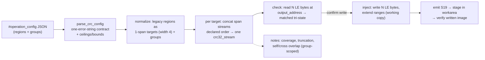

# CRC region groups — functional description (batch-32)

**Audience:** technical stakeholders (firmware integrators, repo developers). **Purpose:** understand
what the multi-region single-CRC groups feature does, its exact semantics, its diagnostics, and its
backward-compat guarantees. Code: `s19_app/tui/operations/crc_config.py` (schema/validation),
`s19_app/tui/operations/crc.py` (compute/check/inject), `s19_app/tui/operations/model.py` (results),
`s19_app/tui/screens.py` (surface).

## What it does

The CRC operation now accepts, alongside the legacy per-region form, operator-declared **groups** of
memory regions. Each group's spans are concatenated **in declared order** and fed through **one**
CRC-32 computation, producing **one** CRC stored at **one** output address with a configurable output
byte width (little-endian, LE). This matches firmware build tools that compute a single CRC across
several non-contiguous flash regions.

## Config schema

The config is still one raw JSON document (edited in the `#operation_config` TextArea). New top-level
`groups` key beside the legacy `regions` key; each is optional, but **at least one must be present and
non-empty**. Shipped example (`examples/crc_config.example.json`, byte-identical to the TextArea
pre-fill `DUMMY_CONFIG_TEXT`):

```json
{
  "polynomial": "0x04C11DB7",
  "init": "0xFFFFFFFF",
  "reverse": true,
  "final_xor": "0xFFFFFFFF",
  "regions": [
    { "start": "0x00010000", "end": "0x00020000", "output_address": "0x0001FFFC" },
    { "start": "0x00020000", "end": "0x00030000", "output_address": "0x0002FFFC" }
  ],
  "groups": [
    {
      "regions": [
        { "start": "0x00030000", "end": "0x00034000" },
        { "start": "0x00040000", "end": "0x00042000" }
      ],
      "output_address": "0x00042000",
      "output_bytes": 4
    }
  ]
}
```

Rules:

- A group's inner `regions` entries carry `start`/`end` **only** — a stray `output_address` inside a
  span is rejected (it signals a legacy-semantics expectation).
- `output_bytes` is optional; default `4`; allowed set `{1, 2, 4, 8}`.
- All numeric fields accept hex string or int (existing `_parse_int`).
- Faults follow the existing contract: `parse_crc_config` returns `(None, [exactly one error string
  naming the offending field])` — never raises. Rejections include: neither key present/non-empty;
  empty inner `regions`; `output_bytes` outside the set; inverted/zero-length span (`end <= start`);
  total declared spans over the **4096 ceiling** (each span costs a full memory-map scan); group
  span/output values outside the 32-bit address space, including `output_address + output_bytes > 2^32`.
  Legacy `regions` keep today's tolerant parse.

## Semantics

- **Declared order, not address order.** The group stream is `concat(span_1_bytes, span_2_bytes, …)`
  digested by one non-resetting CRC state. Reversing the span order changes the CRC. Address-sorting
  would silently break firmware whose build tool orders regions non-monotonically.
- **The declared byte stream is authoritative.** Duplicate or overlapping spans within a group are
  digested each time they appear — no dedup, no error.
- **Present bytes only.** Absent addresses inside a declared span are skipped (same segment semantics
  as the legacy engine) and a coverage diagnostic fires (below). Caution: this makes the CRC diverge
  from any device tool that CRCs the full padded range — validate against your tool (see risks).
- **Global params.** `polynomial` / `init` / `reverse` / `final_xor` remain a single global set that
  flows through the group path; no per-group overrides.
- **Mixed configs.** Evaluation and result order is legacy regions first (file order), then groups
  (file order), so legacy results keep their current report positions.

## Output width (`output_bytes`)

The stored/written field is the low `8·N` bits of the 32-bit CRC, little-endian:

| N | Behavior |
|---|----------|
| 4 | Exact — today's behavior (default) |
| 8 | Zero-extended: low 4 bytes = CRC, high 4 = `0x00`; check requires the high 4 stored bytes ≡ 0 |
| 1, 2 | Truncated to the low bytes + a **truncation warning** per target (weakened error detection) |

Check reads exactly N bytes at `output_address`; if **any** byte is absent, the target reports
`stored_value=None` / `matched=None` (tri-state, never raises). Inject writes N bytes on the working
copy and extends/merges the loaded ranges by `[out, out+N)`. All CRCs are computed over the **pristine
input** before any write lands, so one target's output write can never feed another's input within a
run. Legacy regions stay fixed at 4 bytes; `encode_le32`/`decode_le32` remain as fixed-4 wrappers.

## Diagnostics (notes — collect, never abort)

| Note | Fires when | Scope |
|------|-----------|-------|
| Coverage warning | A group span has absent bytes: one **aggregate** note per group (absent-byte count + gapped spans named — never one note per span) | Groups only — legacy regions stay silent on gaps (strict compat, Q4) |
| Truncation warning | `output_bytes` < 4, on both check and write | Per target |
| Self-overlap warning | A target's output window `[out, out+N)` intersects one of its OWN input spans (inject invalidates the just-computed value) | Only when ≥1 member of the pair is a group |
| Cross-target overlap warning (distinct wording) | A target's output window intersects ANOTHER target's input span (stored-vs-computed becomes flash-order-dependent) | Only when ≥1 member of the pair is a group |

The group scoping on overlap warnings is deliberate: the committed dummy config's legacy regions are
self-overlapping by design, so unscoped warnings would add new notes to legacy-only runs and break
byte-identical compat. All notes render through markup-safe surfaces (hostile text in a config value
is displayed verbatim, never interpreted as markup).

## Backward compatibility guarantees

- A legacy-only config (no `groups` key) parses to an empty `groups` list and behaves
  **byte-identically** to the pre-change system: same results in the same order, zero new notes
  (even on gapped regions), byte-identical emitted S19. Pinned by a golden test whose expected CRC
  (`0x156424B4`) was independently double-proven against the pre-change engine at `551fc77`.
- JSON report entries keep all 5 existing keys with unchanged values; each entry gains one new key,
  `output_bytes` (4 for legacy regions).
- Public codec API preserved: `encode_le32` / `decode_le32` / `read_stored_crc_le` callers unchanged.
- The engine-frozen module set has a 0 diff for this batch.

## Operator workflow

1. Load an S19 image; open the CRC operation.
2. Edit the JSON config in the `#operation_config` TextArea (pre-filled with a working example that
   demonstrates both forms).
3. **Execute** → parse + check: per-target verdict rows (`matched` True/False/None with
   `output_address` and width) + diagnostic notes.
4. **Write** (confirm modal) → inject computed CRCs into a working copy, emit S19, stage into the
   workarea, re-verify the written image. Write rows render "(N LE bytes)" per target. The input file
   is never mutated.



## Assumptions, risks, next steps

- **Assumption:** the operator's declared span order matches their build tool's concatenation order
  (RK-3 — stated in the pre-fill and here; a mismatch yields a different CRC with no other symptom).
- **Residual risk (RK-7):** semantics are proven wired against `zlib.crc32` / `crc32_stream` oracles,
  **not** against any specific device tool. Gap handling (present-bytes-only) is the most likely
  divergence point (RK-1).
- **Next step:** validate one real production config against your build/flash tool's CRC before
  trusting inject. Deferred (out of scope): structured group form editor, per-group algorithm params,
  fill/pad gap semantics (Q1 alternative on file), report_service integration.
