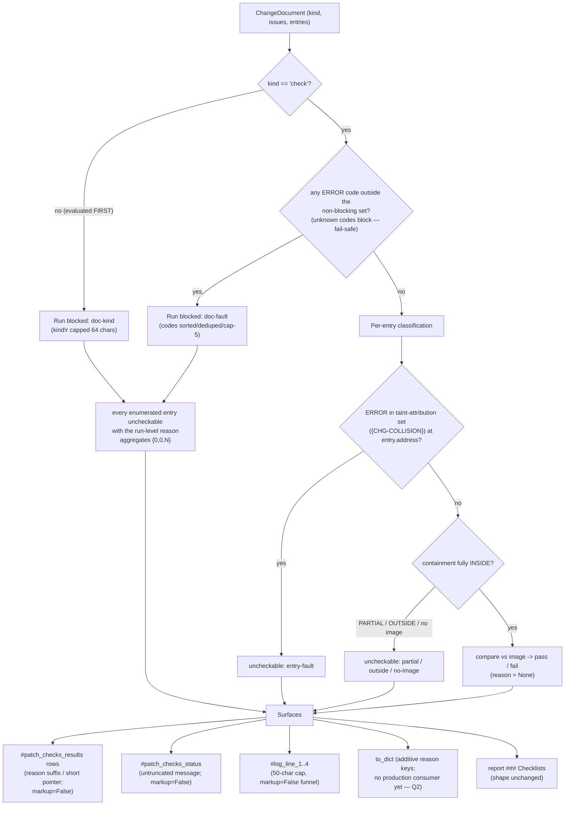

# Functionality — batch-33 · self-explaining check results + per-entry taint

**Audience:** engineers working on the Patch Editor checks path. **Purpose:** understand how the new
check-run semantics work — the reason taxonomy, the two-set gate, the run-blocked flow, and the
markup-safety closure. Modules: `s19_app/tui/changes/check.py` (engine),
`s19_app/tui/changes/model.py` (carrier), `s19_app/tui/changes/io.py` (new issue code),
`s19_app/tui/services/change_service.py` (message/rows), `s19_app/tui/screens_directionb.py` and
`s19_app/tui/app.py` (surfaces). 0 engine-frozen modules touched.

## 1. Reason taxonomy — `CHECK_UNCHECKABLE_REASON_DOMAIN` (6 tokens, canonical order)

`reason_code` is the stable token (tests and `to_dict` assert on it); the display string is the
human sentence. Both ride `CheckRunEntry` (`None` on `pass`/`fail`); run-level blocks additionally
ride `CheckRunResult.run_blocked_reason_code` / `run_blocked_reason` (`None` on a runnable document).

| reason_code | Scope | Display string | File-derived text? |
|-------------|-------|----------------|--------------------|
| `doc-kind` | run-level block | `this is a change-set (kind {kind!r}), not a check-set — Run checks needs kind 'check'` | **YES** — `kind` is verbatim document text on the composed/pasted path → C-17 markup-safety applies |
| `doc-fault` | run-level block | `document carries {n} error-severity declaration fault(s) [{codes}] — fix the document before running checks` | No (codes are repo constants, n is a count) |
| `entry-fault` | per-entry | `entry at 0x{addr:X} carries [{code}] — see declaration faults` | No |
| `partial` | per-entry | `range partially outside the loaded image [partial]` | No |
| `outside` | per-entry | `range outside the loaded image [outside]` | No |
| `no-image` | per-entry | `no image loaded` | No |

**Template bounds (security F2, DoS class):** `{codes}` renders sorted, deduplicated, capped at 5
codes with a `+N more` marker; `{kind!r}` is display-capped at 64 chars with an ellipsis marker —
the `!r` is kept because it escapes control characters. All strings are C-9-compliant: addresses,
codes, counts — never byte/value content. Pinned by `test_llr051_3_reason_template_caps`.

## 2. The two-set gate (replaces the collective `not_runnable` boolean at old `check.py:166`)

Two distinct code sets, defined beside the reader codes they classify (LLR-050.1, architect B-1):

- **(a) Non-blocking set** — entry-scoped codes whose presence does NOT block the run:
  `CHG-ADDRESS-SYNTAX`, `CHG-BYTES-SYNTAX`, `CHG-VALUE-EMPTY`, `CHG-ENCODE-FAIL`, `MF-ENTRY-LIMIT`,
  `CHG-COLLISION`, plus the NEW `CHG-DECL-STRUCTURE` (§4). Any ERROR code **outside** this set is
  document-blocking — the fail-safe default for unknown/future codes.
- **(b) Taint-attribution set** — codes whose address-matching finding taints a constructed entry:
  ONLY codes emitted against *constructed* entries — today exactly `{CHG-COLLISION}` (one finding
  per colliding partner with `address=entry.address`, so a collision pair taints BOTH partners with
  `entry-fault`; start-address equality is exact for this producer).

**Why skip-site codes never taint:** the reader is skip-and-continue — a faulted declaration
(`CHG-BYTES-SYNTAX` etc.) constructs NO entry, and its finding already surfaces in the
declaration-faults panel. All skip sites emit `address=`, so an undifferentiated
"allowlisted code × address equality" rule would FALSE-TAINT a healthy constructed entry that
happens to share an address with a skipped declaration (e.g. a duplicated-then-edited file). That
was the Phase-2 blocker B-1: "non-blocking" and "taint-attributable" are different properties and
must be different sets. The regression pin (`test_tc050_2_taint_boundaries` + AT-050b) holds it:
non-tainting code *membership*, not address absence, protects the healthy entry.

Evaluation order in `run_check_document`: **kind first** (more specific, actionable message), then
blocking ERRORs, then per-entry classification (taint → containment → normal compare). Purity is
preserved (no Textual import on the check path; frozen diff 0).

## 3. Run-blocked flow (wrong kind or blocking document fault)

A blocked run is loud on the wide surface, bounded everywhere else:

- **Status label (`#patch_checks_status`)** — receives the untruncated `result.message`:
  `Checks: not run — {run_blocked_reason} ({counts})`, and the service returns `ok=False`
  (supersedes the old `ok = failed == 0` corner where an all-uncheckable blocked run reported
  success). `ok=False` is observable at the `ChangeActionResult` return (the app discards `ok` on
  this path — m-3).
- **Log lines (`#log_line_1..4`)** — `_append_log_line` caps every line at 50 chars, so the
  ~100-char reason can never appear complete there. The message therefore front-loads
  `Checks: not run` so even the truncated log line communicates the block; tests assert prefix-only
  on the log surface (QA P1).
- **Result rows** — every enumerated entry renders `uncheckable` with the BOUNDED short pointer
  `run blocked [{code}]`, never the full reason (F2 no-multiplication: the full sentence exists
  once, on the status label / `CheckRunResult`).
- **Aggregates** — the three-key shape `{passed, failed, uncheckable}` is unchanged; a blocked run
  over N enumerated entries counts `{0,0,N}` (zero-entry envelope fault → `{0,0,0}`), so the report
  `### Checklists` table keeps rendering (TC-051.5).

Per-entry uncheckable rows on a *runnable* document get the ` ({reason})` suffix (Phase-3
realization of LLR-051.5); pass/fail row text is byte-identical to pre-batch behavior.

## 4. New issue code: `CHG-DECL-STRUCTURE`

Security F1 found `MF-BAD-STRUCTURE` dual-use: minted for envelope faults AND per skipped junk
(non-object) declaration. Under the fail-safe, one junk element would have blocked the whole run —
silently re-introducing the collective taint the batch removes. Fix: the two per-declaration junk
sites in `io.py` now mint the distinct, additive code **`CHG-DECL-STRUCTURE`**, which joins the
non-blocking + non-tainting entry-scoped family; envelope `MF-BAD-STRUCTURE` stays run-blocking.

## 5. Markup safety — three surfaces, five-message exposure closure (C-17)

The `doc-kind` reason embeds verbatim document text, so every surface rendering reason text must be
markup-inert. The completed census is THREE surfaces:

| Surface | State before | Fix |
|---------|--------------|-----|
| Result rows (`#patch_checks_results`) | Already safe — `Static(..., markup=False)` | None needed (and blocked rows carry only the constant short pointer by construction) |
| `#patch_checks_status` | Markup-enabled `Label.update` (Textual default) — renders the untruncated file-derived reason | Constructed `markup=False` (Inc-3) |
| Log labels `#log_line_1..4` via `set_status` → `_render_log_lines` | Markup-enabled — a **pre-existing** exposure independent of this batch: `CHG-KIND-UNKNOWN`'s message embeds `kind {kind!r}` verbatim on TODAY'S load path | Constructed `markup=False` (LLR-051.8), placed AFTER the 50-char cap — never pre-escape, since the cap would bisect escape sequences (F4) |

The one-line funnel scrub closes **five** pre-existing sibling exposures at once — the verbatim
file-text interpolations `CHG-KIND-UNKNOWN {kind!r}`, `CHG-FORMAT {fmt!r}`,
`CHG-ENCODING-UNKNOWN {encoding!r}`, `CHG-VALUE-MODE-UNKNOWN {value_mode!r}`, and
`MF-BAD-STRUCTURE {entry_type!r}` (F3). Gates: `test_at051e_hostile_kind_renders_literal_on_all_surfaces`
(hostile kind token sized to BISECT at the 50-char cap — the truncation-bisected-token vector) and
`test_tc051_4_hostile_encoding_sibling_through_load_funnel` (a sibling token through the real load
path, proving the class closure).

## 6. Help affordance (`#patch_checks_help`)

The existing label is extended (Option A — lowest cost, existing widget and AT harness) to state, in
short lines: what Run checks does and against which artifact (the original sentence, preserved
verbatim as line 1 — the AT-032a token pin survives), that it requires a `kind="check"` document (a
change-set must be Applied, not checked), the reason taxonomy, and that healthy entries are still
checked. Static literal text only — no file-derived content, so no C-17 surface. The label lives in
a scrollable pane, so added lines add height, never width (80×24 fit re-verified; one patch-120x30
snapshot cell drifted → xfail until canonical-CI regen, standing policy).

## 7. Check-run flow

---

*Assumptions:* behavior as merged in batch-33; the apply gate is deliberately unchanged (AT-050d).
*Risks / limitations:* `entry-fault` has one producer today (`CHG-COLLISION`); the allowlist +
address-match rule generalizes to future entry-scoped codes without engine change. `to_dict` reason
keys have zero production consumers (deliberate Q2 groundwork). *Next steps:* Q2 report Reason
column; canonical-CI snapshot regen; O-2 filename-markup hygiene on `#status_text`/notify (same
exposure class, different source — future candidate).
