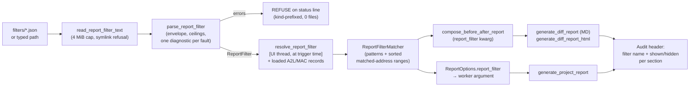

# Functionality — s19_app — Batch 35

> **Artifact language:** English. Phase 6 artifact. Owner: `docs-writer`.
> **Audience:** technical stakeholder (firmware/calibration engineer operating `s19tui`)
> and future maintainers. **Purpose:** understand and operate the report filter; author a
> filter file without reading code. This document is also the **operator format
> documentation** owed by Phase 4 (04-validation §9 item 2).

## 🔑 At a glance (read first)

- **What this batch added:** an operator-authored JSON **report filter** (whitelist) that
  restricts the before/after report and the project report to selected symbols/address
  ranges under a mandatory audit header — plus a patch-editor **control regroup** that
  separates patch-script buttons from the check-run button.
- **Capabilities:** per-run filter selection (dropdown of `<project>/filters/*.json` or a
  typed path) · glob + exact symbol matching with real byte-size extents · end-exclusive
  address ranges · loud refusal on any invalid filter (0 files written) · zero-match
  reports declare themselves · unfiltered output stays byte-identical (golden-proven) ·
  the A↔B diff report is exempt (always complete).
- **How to use it:** open the Reports screen (`action_view_reports`), pick a filter in the
  new selector row, then trigger either report — key `b` (before/after) or the Generate
  button (project report). No selection = full report, exactly as before this batch.

---

## 1. The filter file format (operator authoring guide)

### 1.1 Envelope

A filter is a single JSON object, UTF-8, with this exact top-level shape — no other keys
are allowed at either level (unknown keys are rejected with a named diagnostic):

```json
{
  "format": "s19app-report-filter",
  "version": "1.0",
  "include": {
    "symbols": ["<pattern>", "..."],
    "addresses": [{"start": "<hex-or-int>", "end": "<hex-or-int>"}]
  }
}
```

- `format` must be exactly `"s19app-report-filter"`; `version` exactly `"1.0"`
  (constants `REPORT_FILTER_FORMAT_ID` / `REPORT_FILTER_FORMAT_VERSION`,
  `s19_app/tui/services/report_filter.py:45/:48`).
- **Missing keys are lenient (D-10/D-10a):** a missing `include` key, or a missing
  `symbols`/`addresses` sub-key, is accepted and treated as the empty list. Empty
  include lists are VALID — they match nothing, which routes to the loud zero-match
  report (§3.4), never to a silent full report. The realistic typo `"includes"` is still
  rejected as an unknown key.
- Parsing collects **one named diagnostic per fault** (a file with N faults yields ≥N
  diagnostics) and never raises, mirroring the `crc_config` discipline.

### 1.2 `include.symbols` — patterns

Each entry is a string matched against an item's linkage symbol and against the NAMES of
loaded A2L/MAC records (see §2). Semantics:

- **Exact equality first, then glob.** A symbol matches a pattern when `symbol ==
  pattern` OR `fnmatch.fnmatchcase(symbol, pattern)` holds (F-2). The equality
  short-circuit guarantees a literal name containing glob metacharacters matches itself:
  the pattern `PAR[0]` matches the literal symbol `PAR[0]` (equality) AND the symbol
  `PAR0` (glob char-class meaning). Whitelist over-match is accepted by design — extra
  matches are visible in the output, never hidden.
- **Case-sensitive.** `fnmatchcase`, not `fnmatch`: pattern `CAL_*` does NOT match
  `cal_x`. A2L symbols are case-sensitive.
- **Glob syntax** is Python `fnmatch`: `*` any run, `?` one char, `[seq]` char class.
- **Unbalanced brackets are legal.** A pattern like `CAL_[` is NOT a parse error —
  `fnmatchcase` treats the lone `[` literally, so `CAL_[` matches exactly the symbol
  `CAL_[` and nothing else (Q-10).
- Ceiling: at most **4096 patterns** (`SYMBOL_PATTERN_CEILING`); 4097 is rejected.

### 1.3 `include.addresses` — ranges

Each entry is `{"start": ..., "end": ...}` where each bound is a JSON integer or a
`"0x"`-prefixed hex string (`"0x10"` and `16` are equivalent).

- **`end` is EXCLUSIVE** — the range covers `[start, end)`, matching the tool's
  `ChangeSummaryEntry.address_end` convention. A single byte at `0x1000` is
  `{"start": "0x1000", "end": "0x1001"}`. An item whose range ends exactly at a filter's
  `start` does NOT match.
- Domain: `0 <= start < end <= 2^32`. Negative, non-parsable, out-of-domain, or
  `start >= end` entries each yield a named diagnostic.
- Ceiling: at most **4096 ranges** (`ADDRESS_RANGE_CEILING`); 4097 is rejected.

### 1.4 File-level limits and read rules

- **Size cap: 4 MiB** (`REPORT_FILTER_SIZE_CAP_BYTES`), probed on disk BEFORE reading.
- The path must be a **regular file — symlinks are refused at read time** (this also
  closes the select-then-swap window: a file swapped for a symlink after selection is
  refused when the report is triggered).
- The filter file is **re-read and re-parsed on every report run**: an edited file takes
  effect on the next run; a deleted file refuses the next run.

### 1.5 Performance note (measured, 04-validation §4 item 4)

A realistic operator filter (tens of patterns/ranges) parses and resolves in
milliseconds. The pathological ceiling case is bounded but slow: a 4096-pattern +
4096-range filter measured **parse 3 ms · resolve ≈1.8 s · classify 10,000 report items
≈9.3 s — on the UI thread** (both report triggers resolve the filter synchronously
before generating). Practical guidance: **ceiling-size filters stall the UI for
seconds**; keep filters focused. The 4 MiB cap and the 4096/4096 ceilings bound the
worst case; resolution happens once per run.

### 1.6 Complete example

Save as `<project>/filters/customer-abc.json` (any name, `.json` suffix) to appear in
the dropdown, or anywhere on disk to use via the typed path:

```json
{
  "format": "s19app-report-filter",
  "version": "1.0",
  "include": {
    "symbols": ["CAL_ENGINE_*", "MAP_BOOST_LIMIT", "PAR[0]"],
    "addresses": [
      {"start": "0x80040000", "end": "0x80040100"},
      {"start": 16, "end": 32}
    ]
  }
}
```

This shows: a glob family (`CAL_ENGINE_*`), one exact symbol, one metacharacter-bearing
literal (matches `PAR[0]` exactly plus `PAR0` via glob), one hex range (256 bytes,
end-exclusive), and one decimal range (bytes 16..31).

---

## 2. Match semantics (what "matches the filter" means)

An item (a linkage row, a Modifications row, a Checklists row, a hexdump region) carries
a symbol `s` (possibly none) and a half-open address range `[a, b)`. It is MATCHED when
**any** of:

- **(a) Symbol branch:** `s` matches an `include.symbols` pattern (equality-or-glob,
  §1.2).
- **(b) Explicit address branch:** `[a, b)` intersects any `include.addresses` range.
- **(c) Named-record extent branch:** `[a, b)` intersects the address EXTENT of any
  loaded A2L/MAC record whose NAME matches an `include.symbols` pattern.

**Byte-size extents (F-1).** In branch (c), a name-matched A2L parameter covers its real
extent `[address, address + byte_size)` — filtering for `MAP_X` catches a patch landing
on byte 2..n of a 4-byte `MAP_X`, not just its first byte. When `byte_size` is absent or
not a positive integer the extent falls back to 1 byte; MAC records carry no size and
are always 1-byte points.

**Annotation divergence (F-10, expected behavior):** an extent-matched row may still
show `-` in the report's Symbols column — the annotation column is best-effort labeling
(point-based), while filtering is a visibility contract (extent-based). A row shown with
`-` is not a bug.

The matched address set (explicit ranges ∪ name-matched extents) is built **once per
report run** by `resolve_report_filter(...)` into a `ReportFilterMatcher`, which is the
only filter object the report generators ever see (D-9). Resolution and classification
never raise, for any record shape.

---

## 3. What gets filtered, per report

### 3.1 Before/after report (key `b`) — MD + HTML pair

- Filtered: linkage-table rows, differing-run sections, and hex windows **seeded** by
  matched runs. Filtering happens BEFORE window merging (D-5), so merged windows are
  computed over the filtered run set only.
- Kept whole: header, statistics, inventory sections.
- **Window semantics (F-03/Q-2):** the filter hides ITEMS. A merged window seeded by
  matched runs may legitimately cover excluded addresses in its merged/context rows —
  an informative audit note discloses this. An excluded run seeds no linkage row and no
  window heading.

### 3.2 Project report (Reports screen → Generate)

- Filtered: **Modifications rows**, **Checklists rows** (matched via symbol branch on
  `CheckRunEntry.linkage_symbol` OR range intersection, like every other item), and the
  **applied-region hexdump windows** (regions filtered before window computation).
- Kept whole: header, statistics (extended with shown/hidden counts), variant inventory,
  legend, entropy, and declared-regions addendum.

### 3.3 Audit header contract

Every FILTERED report (both kinds, both formats) opens with an audit header — the FIRST
block after the report title, fixed line format, rendered as `## Report filter applied`
(MD) / `<h2>Report filter applied</h2>` (HTML). It names the applied filter file and the
shown/hidden item counts; **shown + hidden always equals the pre-filter count**. Count
basis per surface (F-07): the before/after report counts linkage entries; the project
report counts per section (Modifications rows, Checklists rows, applied regions), the
header stating each. An UNFILTERED report carries NO audit header — a filtered report
can never pass for a complete one, and a complete one never grows a header.

### 3.4 Zero-match notice

A valid filter matching zero items still writes the report: the filtered sections'
bodies are replaced by the notice `filter matched 0 of N items` (N = pre-filter count).
The zero-match wording is deliberately disjoint from the refusal wording (no shared
prefix token, Q-12), so "valid filter, nothing matched" is never confusable with
"invalid filter, refused".

### 3.5 A↔B diff report — exempt by design

The A↔B compare diff report **ignores the filter selection entirely** and stays
complete: a filtered diff could hide unexpected deltas (operator lock). Verified both by
inspection (no filter kwarg reaches the A2B call) and black-box (AT-056e: with a filter
selected, the A2B output is byte-identical to a no-filter run).

### 3.6 No filter = byte-identical

With no filter selected, both reports are byte-identical (in canonical form: CRLF and
run-root path normalization only) to the pre-batch output — proven by goldens captured
at the base revision and perturbation-proven three times (Inc-0 author, Inc-0 reviewer,
Phase-4 independent re-derivation).

---

## 4. Selection UX

- **Where:** one selector row (`#report_filter_row`) in the Reports screen
  (`ReportViewerScreen`), above the buttons: a dropdown (`#report_filter_select`) listing
  the active project's `filters/*.json` (bare names, sorted deterministically, symlinks
  skipped, empty/absent directory → empty list) plus a free path input
  (`#report_filter_path`, resolved via `resolve_input_path`; out-of-project paths are
  allowed — the filter is read-only input; nothing is ever written outside
  `<project>/reports/`).
- **Sticky per-run selection:** the choice is held in one app-level field
  (`_report_filter_path`) consumed by BOTH triggers at generation time — select once in
  the Reports screen, then key `b` and Generate both honor it. Only the PATH is stored;
  the file is re-read per run (§1.4). Reopening the screen shows the true current
  selection.
- **Default = none = full report.** A fresh app, or the blank dropdown entry, produces
  the pre-batch full report, byte-identical.
- **Project-switch reset:** every path that swaps the active project/loaded file set
  (project load/create/save-as-new, loose-file load) resets the selection to none — a
  prior project's filter never leaks into the next project's reports.
- **Refusal behavior:** an invalid, missing, oversized, or symlinked filter refuses the
  report on EITHER trigger — the status line shows the report-kind-prefixed named
  fault(s), the generator/worker is never started, and `reports/` gains 0 files. Never a
  silent fallback to a full report.
- **Markup safety:** filter filenames and diagnostics render literally on the status
  funnel (`markup=False` labels) and are sanitized in written files (ctl-strip, MD cell
  escaping, HTML escaping) — hostile names like `[red]x[/red].json` display verbatim and
  cannot forge report structure.

---

## 5. Filter data flow (diagram)



The matcher is the ONLY filter object crossing the service boundary; generators never
see the raw `ReportFilter` or artifact record lists (D-9). All filter computation
completes before the first report file write.

---

## 6. Patch-editor regroup (US-057)

The Patch Editor's change-file pane now renders two labeled sections instead of one
mixed button row: a **patch-script section** (Load / Validate / Apply / Save, still in
`#patch_doc_controls`) and a **checks section** (a new `#patch_checks_controls`
container holding the Run-checks button and its help text). Layout-only: all 15
pre-batch widget ids survive, the locked AT-032a help-token span is intact, and no
handler, action, or key binding changed — every button produces its pre-batch behavior.
Snapshot impact is confined to the patch cells (120x30 drifted, 80x24 renders below the
fold and held), pending the standing post-merge canonical regen.

---

## 7. Components / modules touched

| Module | Role in this batch |
|--------|--------------------|
| `s19_app/tui/services/report_filter.py` | NEW — read/parse/resolve + `ReportFilter`, `ReportFilterMatcher`, match engine (consumes `range_index` primitives; engine-frozen set untouched) |
| `s19_app/tui/services/before_after_service.py` | `compose_before_after_report` gains the single `report_filter` kwarg (default None) |
| `s19_app/tui/services/diff_report_service.py` | Filtered linkage rows / run sections / hex windows, audit header, zero-match notice (MD + HTML) |
| `s19_app/tui/services/report_service.py` | `ReportOptions.report_filter` field; filtered Modifications / Checklists / hexdump windows; audit header; sanitized header interpolation |
| `s19_app/tui/app.py` | Filter scan, sticky `_report_filter_path`, UI-thread resolve at both triggers, refusal-before-worker, project-switch reset, markup-safe status |
| `s19_app/tui/screens.py` | `ReportViewerScreen` selector row (dropdown + free path, seeded on open, escaped option labels) |
| `s19_app/tui/screens_directionb.py` + `styles.tcss` | Patch-editor two-section regroup (compose + CSS only) |

## 8. Usage / examples

```text
# 1. Author a filter (see §1.6) and save it as
#    .s19tool/workarea/<project>/filters/customer-abc.json
# 2. In s19tui: open Reports (rail item), pick "customer-abc.json" in the dropdown.
# 3. Press Generate  -> filtered project report under <project>/reports/
#    or press b       -> filtered before/after MD+HTML pair (after an applied save-back)
# 4. Clear the selection (blank entry) -> next report is the full, byte-identical report.
```

## 9. Assumptions · risks · limitations · next steps

- **Assumptions:** operator authors JSON by hand (no filter editor UI — out of scope by
  operator lock); one filter semantics shared by both report kinds.
- **Risks / limitations:** ceiling-size filters stall the UI for seconds (§1.5, measured
  — accepted residual); a broad glob (`*`) makes a "filtered" report near-complete —
  whitelist semantics are operator-owned, and the audit header still reports
  shown/hidden; glob over-match (§1.2) is visible-by-design; the Symbols-column `-` on
  extent-matched rows (§2) is expected.
- **Out of scope (operator-locked):** A↔B diff filtering, exclude-lists, per-project
  auto-apply, filter editor UI.
- **Next steps:** merge PR; post-merge canonical snapshot regen (patch cells); ubuntu CI
  run as the cross-platform golden proof; backlog: S-F7 sanitation follow-up,
  canonicalizer consolidation, P2/P3 pool (see 05-postmortem §6).

## Evidence checklist — docs-writer

- [x] Audience and purpose declared at the top — header block.
- [x] Structure follows the functionality template — At-a-glance + detail sections; format-guide section added per the Phase-4 owed-docs mandate (justified deviation).
- [x] Code/CLI snippets actually run — the §1.6 JSON mirrors the TC-307 valid-fixture shape (tests/test_report_filter.py); the §8 flow is the AT-056a/AT-055a pilot flow. Marked: JSON example itself not separately executed (untested as a literal file).
- [x] Assumptions listed — §9.
- [x] Risks / limitations called out — §9 + §1.5 perf note.
- [x] Next steps stated — §9.
- [x] Diagram included — §5 mermaid filter data flow.
- [x] No invented APIs / versions / metrics — all symbols grep-verified (`report_filter.py:45-63,81,150,293,441,629`; `_zero_match_notice` / `_audit_header_lines` in both generators); perf numbers quoted from 04-validation §4 item 4; counts from 04-validation §6/§8.
