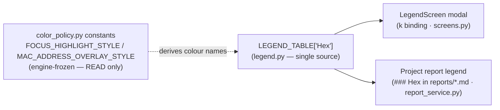
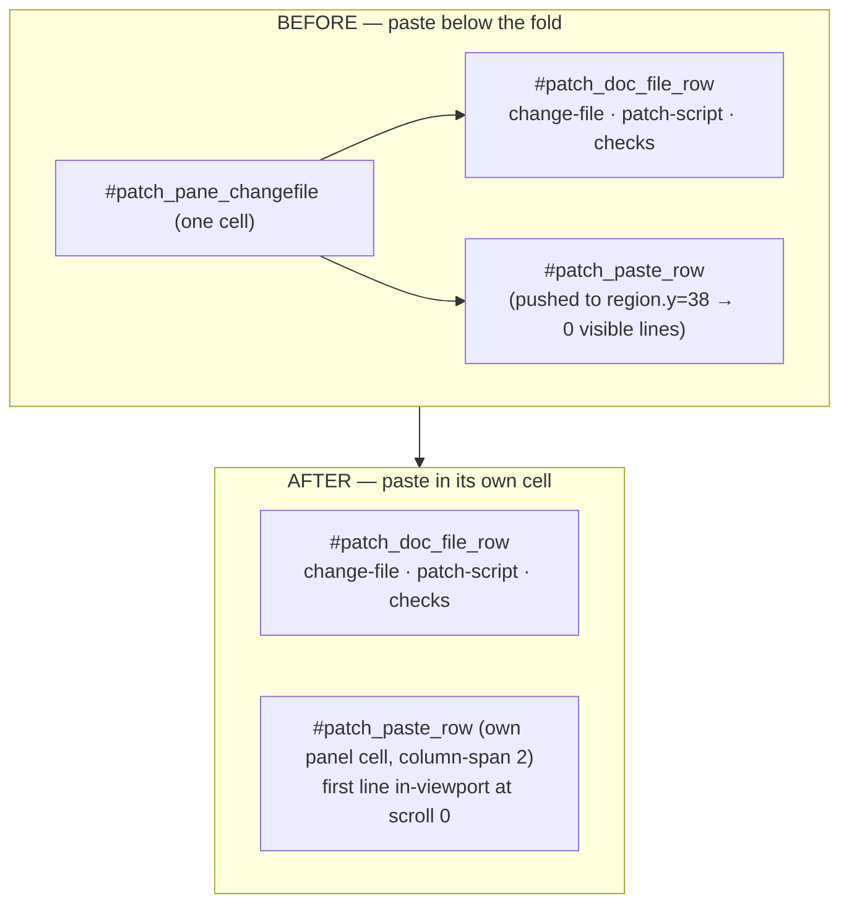

# batch-36 — What shipped (functional description)

> Phase 6 (Documentation). Author: docs-writer. **Audience:** technical stakeholder (engineer /
> tech lead reviewing the release). **Purpose:** understand what the three shipped features do and
> why. Sourced from `.dev-flow/2026-07-11-batch-36/01-requirements.md`, `04-validation.md`,
> `05-postmortem.md`, and the three increment packets. All claims verified against the executed
> gate run (`04-validation.md` §1: `1343 passed, 5 xfailed, 0 failed`, exit 0).

## BLUF

batch-36 ships three quality-of-life improvements to the S19 TUI — none touches the
engine-frozen parsing/validation core (frozen-guard diff = 0, `04-validation.md` §5):

1. **US-059 — hex-view colour legend.** The two hex-cell overlay colours now have a documented
   key in **both** the in-app Legend modal and the generated project report.
2. **US-058 — Patch Editor readable paste box.** The change-set paste box is reparented into its
   own cell so multi-line JSON is actually readable, and the cramped control cluster is separated.
3. **US-060 — fixture housekeeping.** Ad-hoc test inputs moved into the canonical `examples/`
   tree and a 54 MB duplicate A2L was pruned — working-tree `examples/` dropped from **96 MB to
   ~42 MB** with no loss of test coverage.

---

## US-059 — Workspace hex-view colour legend

**What it does.** The Workspace hex view paints two byte-cell *overlay* colours, but until now they
had no legend entry, so an operator had no key for what the colours meant. This adds a **Hex**
section to the shared legend documenting exactly those two colours:

| Colour | Meaning |
|--------|---------|
| **Yellow** (`bold yellow`, `FOCUS_HIGHLIGHT_STYLE`) | search / goto-focus span |
| **Orange3** (`bold orange3`, `MAC_ADDRESS_OVERLAY_STYLE`) | MAC address overlay |

**Why these two and not more.** These are *interaction* highlights, not `sev-*` validation
severities — they are not in `SEVERITY_CLASS_MAP`. The row colour names are **derived at runtime
from the shipped overlay-style constants** (`_colour_name_from_style()` reads
`FOCUS_HIGHLIGHT_STYLE` / `MAC_ADDRESS_OVERLAY_STYLE` from `color_policy.py`), so the legend can
never silently drift from what the hex renderer actually paints. The engine-frozen `color_policy.py`
is only **read**, never modified.

**Single source, two consumers.** The Hex block is added once, to `LEGEND_TABLE` in the non-frozen
`s19_app/tui/legend.py`. Both existing consumers already iterate that table, so the one block
reaches both surfaces:

**How it's verified.** AT-059a reads the rendered modal body; AT-059b generates a report through the
real seam and **re-reads the written `.md` file** off disk (output-then-consume). TC-322 pins the
runtime coupling to the overlay-style constants and asserts the Hex colours are absent from
`COLOUR_SEVERITY` (anti-drift). A single-source parity test (TC-S2) confirms the modal and the
report render the same rows.

---

## US-058 — Patch Editor: readable paste box + separated controls

**The problem.** The "Paste change-set (v2 JSON)" `TextArea#patch_paste_text` was stacked *below* the
change-file / patch-script / checks controls inside a single shared grid cell of
`#patch_pane_changefile`. At `scroll_y == 0` its first line rendered at `region.y=38` while the
pane's visible content-region was only rows `[8,10)` @80x24 — i.e. **0 in-viewport lines**, pushed
below the fold. The operator could not read or edit multi-line JSON, and the packed controls invited
mis-clicks.

**The fix (compose + CSS only — no behaviour change).** The paste group (`#patch_paste_row`) is
**reparented out of the crowded pane into its own top-level panel cell**, spanning both columns. The
panel grid changes from `grid-size: 2 3` to `grid-size: 2 4` with row weights `1fr 2fr 2fr auto`, so
the paste cell gets a real vertical budget and its region is **sibling-disjoint** from the
change-file / patch-script / checks cluster, with no right-edge clip at either width.

**Measured outcome (the accepted limit).** At **120 cols** the paste box shows **4** in-viewport
lines — genuinely multi-line and readable. At the **80-col floor** the height-starved 5-row shell
physically allows **1** in-viewport line (`N_80 = 1`). That single line is an operator-accepted
"first option" improvement over the previous below-the-fold **0** — it is recorded as accepted
residual **F-01** (`04-validation.md` §6), not a defect, and involves no scope expansion.

**Zero behaviour change.** All **15** `patch_*` widget ids still resolve to exactly one widget, the
locked AT-032a help-token span survives, and every button/binding behaves as before (the
`#patch_checks_run_button` press still posts a real `Checks:` status line). AT-058b pins the id
census + wiring; AT-058a pins the geometry at both widths. The two patch SVG snapshot cells
(`patch-comfortable-80x24`, `patch-comfortable-120x30`) are `xfail`-declared pending the standing
post-merge canonical-CI regen (local regen is forbidden — `reference_snapshot_regen_env`); TC-321
pins that the xfail set is *exactly* those two cells.

---

## US-060 — Relocate test inputs to `examples/` + prune the heavy duplicate A2L

**What changed on disk.**

- **Relocated** the git-tracked `tmp/stress_smoke/{stress.a2l,.mac,.s19}` (an ad-hoc test-input
  folder outside the canonical tree) via `git mv` into a discoverable case
  `examples/case_07_stress_smoke/firmware.{a2l,mac,s19}`, with a `README.txt` matching convention
  and a `case_07_stress_smoke` entry in `examples/case_00_public/MANIFEST.md`.
- **Pruned** the 54 MB slow-only duplicate `examples/professional_validation/case_06_large_nested_a2l/`
  (the `pv__case_06_large_nested_a2l` case, ~490 s, runs only on push-to-main full CI).
- **Retained** the 36 MB top-level `examples/case_06_large_nested_a2l/` — it runs on every PR in the
  normal suite, so it is the higher-value large-A2L fixture to keep (operator constraint D-1: keep a
  bare-minimum real-vendor large A2L).

**Result.** Working-tree `examples/` dropped **96 MB → ~42 MB**. `SLOW_CASE_IDS` is now empty (no
slow case remains). Note this reclaims **working-tree** size only; a git-**history** rewrite
(filter-repo) is explicitly out of scope and would need separate approval.

**Safe-delete gate (I-060-1).** Before the irreversible `git rm`, a construct-kind census proved the
54 MB copy was a pure scale duplicate of the retained 36 MB file — identical 13 `/begin` construct
kinds, `kinds(54 MB) ⊆ kinds(36 MB)` TRUE — so no unique A2L construct coverage was lost. Evidence
was recorded in `increment-002.md` §I-060-1 **before** the delete.

**Coverage preserved.** AT-060a fuses four facts in one node: `tmp/stress_smoke/` gone (disk + git
index); the relocated `case_07_stress_smoke` loads to a non-empty `mem_map` through the real
`build_loaded_s19/hex` service layer; the 54 MB duplicate absent; the 36 MB A2L present. TC-323 pins
that `case_07` is discovered, the `pv__` case is not, and the large-A2L pipeline case is still
discovered — so the smoke suite covers the same functional requirements as before.

---

## Assumptions · risks · next steps

- **Assumption:** the two patch snapshot cells are baselined by the standing post-merge canonical-CI
  regen (not in this batch — local regen drifts unrelated baselines). Tracked as residual R-2.
- **Risk (accepted):** F-01 — the 80x24 paste box shows 1 line, not multi-line. Operator-accepted;
  full multi-line readability is a ≥120-col affordance.
- **Lesson carried to backlog:** the US-059 supersession census missed the batch-35 report
  byte-identity golden (`tests/goldens/batch35/at055b-project-report.md`), which the new `### Hex`
  section legitimately drifts — caught and rebaselined in-batch. New standing rule: report
  byte-identity goldens are census members whenever a report-content source (e.g. `LEGEND_TABLE`)
  changes (proposed control C-CAND-B, `05-postmortem.md` §7).
- **Next:** REQUIREMENTS.md rows R-TUI-046/047/048 (this Phase 6); post-merge canonical-CI SVG regen
  retires the 2 patch xfails; open queue continues with P2 (B-11..B-14) / P3 (B-16..B-19).
