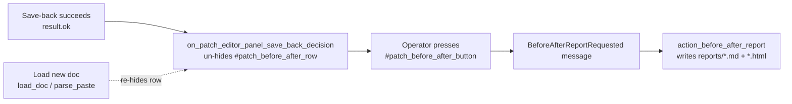
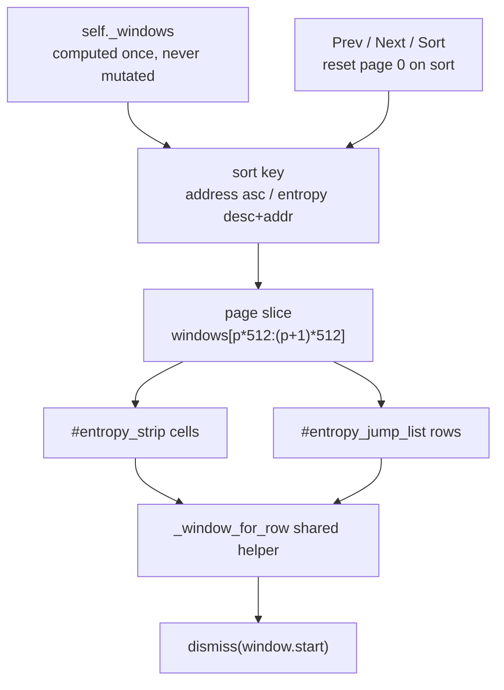
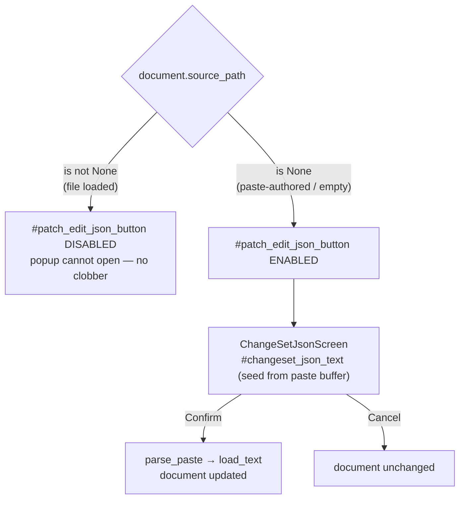

# 06 — Functional description — batch-37 (P2: B-11..B-14)

**Audience:** technical stakeholders (maintainers, reviewers, QA) familiar with the s19tool TUI.
**Purpose:** understand WHAT the five batch-37 features do and where they live, without reading the
diff.

> **BLUF.** Batch-37 ships the whole P2 backlog as five stories across two TUI surfaces — the Patch
> Editor and the Entropy Viewer. It makes a previously *transient* before/after-report offer
> **persistent**, lets the entropy viewer **page past its 512-window cap and sort** by entropy or
> address, gives that viewer a **band-colour legend and click-to-navigate strip cells**, and adds a
> patch-editor **Refresh** action plus a **full-size JSON popup editor** for the change-set — the
> latter fenced by a data-loss guard that disables the popup whenever a change *file* is loaded.
> None of the five touches the entropy computation, the report content, or the change-set apply
> engine — they are presentation, trigger, and re-read transforms over already-computed data. All
> code landed in non-frozen modules (`screens.py`, `screens_directionb.py`, `app.py`, `styles.tcss`);
> engine-frozen diff = 0.
>
> Ledger row per feature: R-TUI-049 (US-061) · R-TUI-050 (US-062) · R-TUI-051 (US-063) ·
> R-TUI-052 (US-064a) · R-TUI-053 (US-064b). Detail: `REQUIREMENTS.md` §34. Sources cited inline.

---

## 1. US-061 — Persistent before/after-report control (R-TUI-049)

**What it does.** After a successful patch save-back, the Patch Editor now reveals a **persistent
button row** (`#patch_before_after_row`, holding `#patch_before_after_button`,
`screens_directionb.py:2066-2070`) offering the before/after report. Pressing it writes the same
`reports/*.md` + `reports/*.html` pair the `b` key binding already produces.

**Why it changed.** The only prior affordance was a transient `notify` toast ("Before/after report
ready — press b…") that vanished after its timeout — undiscoverable and easily missed. The button
is a durable widget: it survives re-render, so the operator can act on it whenever they notice it.

**How it behaves.**
- **Reveal:** `on_patch_editor_panel_save_back_decision` un-hides the row (removes the `.hidden`
  class, `screens_directionb.py:2413-2422`) only on a successful save-back (`result.ok`), reusing
  the same reveal idiom the existing `#patch_saveback_row` uses.
- **Activate:** the button posts a `PatchEditorPanel.BeforeAfterReportRequested` message
  (`screens_directionb.py:1610`, `:2180-2185`) that routes to the **existing**
  `action_before_after_report` handler (`app.py:1839`) — no new report-writing code, so the two
  trigger paths (`b` key and button) write byte-identical output.
- **Clear-on-context:** loading a new document (`load_doc` / `parse_paste`) re-hides the row
  (`screens_directionb.py:2430-2440`), because the underlying report input (`last_summary`) is gone
  and a stale "report ready" offer must not linger.

**Explicitly unchanged.** The report CONTENT (`compose_before_after_report`), the report goldens,
and the `b` accelerator. The transient `notify` may remain as a redundant hint but no longer *gates*
the feature.

---

## 2. US-062 — Entropy viewer pagination + sort (R-TUI-050)

**What it does.** The entropy viewer (`EntropyViewerScreen`) can now (a) **page** through every
computed window instead of silently truncating at 512, and (b) **sort** the strip + jump list by
**address** (default) or **entropy** (descending).

**Why it changed.** Previously `self._windows[:ENTROPY_MAX_ROWS]` truncated the view to the first
512 windows in address order and showed only a "truncated" indicator — so windows past 512 were
invisible and the highest/lowest-entropy regions could not be found.

**How it behaves.**
- **Paging (fixed 512-window page).** The old `ENTROPY_STRIP_MAX_CELLS` / `ENTROPY_MAX_ROWS` = 512
  caps become a **per-page window budget**, not a hard truncation. `Prev` / `Next` buttons
  (`#entropy_page_prev` / `#entropy_page_next`, `screens.py:1053-1054`) and `action_page_prev/next`
  (`screens.py:1144-1149`) move the page index within `[0, ceil(N/512)-1]`. The former truncation
  indicator is replaced by a **`page P/Q` position indicator** (`#entropy_page_indicator`,
  `screens.py:1057`, `:1125`). Both the strip cells and the jump-list rows on a page are drawn from
  the SAME 512-window slice, so their indices agree. Page size is a FIXED constant — it is **not**
  pilot-measured (a small measured page would have put window index ≥ 512 tens of pages away,
  unreachable in one `Next`).
- **Sort.** `#entropy_sort_button` (`screens.py:1050`) toggles `action_toggle_sort`
  (`screens.py:1152`) between `address` (ascending `start`) and `entropy` (descending `entropy`
  with a **stable ascending-address tie-break**). Sorting operates on a **display copy** —
  `self._windows` is never mutated — and resets the page index to 0 so the extremal window lands on
  the visible page.
- **Selection remap.** Because the jump list now shows a sorted+paged slice, the raw row index no
  longer maps to the intended window. Both the jump-list selection and the strip click resolve
  through ONE shared helper, `_window_for_row` (`screens.py:905`), preserving the
  `0 <= index < len(page slice)` bound. The pre-existing dismiss contract is guarded by AT-036b.

**Explicitly unchanged.** `entropy_service.compute_entropy` and the `self._windows` snapshot —
paging and sort are pure display transforms; `compute_entropy` is still called exactly once at
construction.

---

## 3. US-063 — Entropy band legend + clickable strip (R-TUI-051)

**What it does.** The entropy viewer now shows a **legend** mapping each band colour to its meaning,
and each strip cell is **click-navigable** — a real pointer click on a cell dismisses the modal with
that window's `start` address (the same jump the list row performs).

**Why it changed.** The strip was band-coloured (`ENTROPY_BAND_COLOUR`) but had no legend, so a
colour's meaning was opaque; and the strip was a plain `Static` with no click handler, so only the
jump-list rows navigated.

**How it behaves.**
- **Legend.** `_legend_widget` builds `#entropy_legend` (`screens.py:1019-1022`) with one row per
  band — grey→constant/padding, green→low, yellow→medium, red→high/random — plus the low-confidence
  dim cue. The rows are **derived by iterating `ENTROPY_BAND_COLOUR`** (single source): if a band is
  added to that dict but not the legend, TC-326 fails. The legend uses the `legend.py`
  colour→meaning row *pattern* but is a separate in-modal table — deliberately decoupled from the
  frozen `sev-*` severity classes and from `LEGEND_TABLE` (a different colour domain).
- **Clickable strip (C-16 real mechanism).** Each visible cell is rendered as an **individual
  clickable widget** carrying a stable id `#entropy_cell_<row>` (`screens.py:738`). A click posts
  `EntropyCell.Selected` → `on_entropy_cell_selected` → `action_jump(row)` (`screens.py:1161-1187`),
  which resolves the window through the SAME `_window_for_row` helper as the jump list and dismisses
  with its `start`. Per-cell widget ids were chosen over Rich-`Text` `@click`-meta offset arithmetic
  (which had zero in-repo precedent) so the click is deterministic — no offset math. `action_jump`
  mirrors the jump-list index bound, so a click on padding beyond the last cell is a no-op, not a
  crash or wrong-window dismiss.

**Explicitly unchanged.** The entropy computation; the jump-list navigation (reused).

---

## 4. US-064a — Patch-editor Refresh (R-TUI-052)

**What it does.** A new **Refresh** button (`#patch_doc_refresh_button`,
`screens_directionb.py:1927`) re-reads the currently-selected change/check file from disk into the
editor, reflecting external edits — without re-typing the path or reloading the app.

**Why it changed.** Previously the only re-read was the `load_doc` action driven off the path input;
there was no one-action refresh of the file already selected.

**How it behaves.** The button maps to an `ActionRequested("refresh_doc")` seam
(`screens_directionb.py:2233`) that re-invokes `ChangeService.load` over
**`ChangeService.document.source_path`** — the loaded document's own path, NOT the widget path-input
(design decision A-03, so a refresh always re-reads what is actually loaded). Boundaries: if no
file-backed document is loaded (`source_path is None`) Refresh surfaces the existing "enter a
change-file path to load" guard; malformed JSON on re-read surfaces an `MF-JSON-PARSE` finding via
the existing collect-don't-abort path without crashing; a deleted file surfaces a status diagnostic.

**Census note.** Adding the button to `#patch_doc_controls` required updating **two** layout
censuses — the home-file id census AND the sibling `test_tc319_regroup_section_structure_census`
(`test_tui_patch_layout.py:351`) that pins the same container's child order in a different file.
The sibling was missed per-increment and caught by the Phase-4 whole-suite gate (drives control
candidate C-CAND-A). See `04-validation.md` §7.

---

## 5. US-064b — JSON popup editor + file-loaded disable-guard (R-TUI-053)

**What it does.** An **"Edit JSON"** button (`#patch_edit_json_button`,
`screens_directionb.py:2033`) opens a full-size modal (`ChangeSetJsonScreen`, `screens.py:171`) with
a large editable `TextArea` (`#changeset_json_text`, `screens.py:232`) showing the current
change-set JSON. On **Confirm** the edited text is applied back to the change document; **Cancel**
leaves it untouched. This delivers the "expand-to-edit" affordance batch-36 (F-01) deferred — the
in-panel paste box could show only ~0-1 editable lines at 80 cols; the popup measures N_80 ≥ 7 /
N_120 ≥ 13 editable lines.

**How it behaves.**
- **Seed + apply.** The popup is seeded from the `#patch_paste_text` buffer, which for a
  paste-authored document IS the document's editable source of truth. Confirm routes the edited text
  through the **existing** `parse_paste` → `ChangeService.load_text` seam
  (`screens_directionb.py:2201-2209`, `app.py:1874`), so the entries/issues the editor renders
  reflect the edited JSON. Malformed JSON on Confirm surfaces via the same collect-don't-abort path.

- **Data-loss guard (A-01, the safety-critical part).** The button is **disabled whenever a change
  *file* is loaded** (`document.source_path is not None`, `screens_directionb.py:2446-2462`). This
  closes a real footgun found at Phase-2 review: a file load refreshes only the entries table, never
  the paste buffer, so the buffer still holds stale `DUMMY_CHANGESET_TEXT`; letting Confirm run
  `load_text` in that state would **silently replace the loaded document** = data loss. The guard
  makes the unsafe path *unreachable* rather than half-building a `document→JSON` serializer that
  `ChangeService` does not have. A defense-in-depth re-check in the handler (`app.py:1881`) refuses
  to push the popup even if the disabled button is somehow bypassed. For a paste-authored / empty
  document (`source_path is None`) the button is enabled and the popup opens normally.

**Scope (recorded decision, not drift).** US-064b edits the **paste buffer** (MVP). File-loaded JSON
round-trip is OUT until a separate `document→JSON` serializer story lands; the disable-guard keeps
that out-of-scope path unreachable-and-safe. See `05-postmortem.md` §3.

---

## 6. Assumptions · risks · limitations · next steps

**Assumptions.** Every `file:line` above was verified against the batch-37 worktree source (base
`978a900`). The 5 features assume the operator runs at ≥ 80x24; geometry is pilot-measured at 80x24
and 120x30.

**Risks / limitations (all accepted, none blocking).**
- **2 entropy snapshot cells** await canonical-CI baseline regen post-merge (local regen forbidden).
- **Native bracketed-paste 64 KiB cap gap (pre-existing, US-064-adjacent):** neither
  `#patch_paste_text` nor the new `#changeset_json_text` popup caps Textual's native bracketed paste
  at 64 KiB — the 65 KiB `os_clipboard_input` funnel guards a *different* ingress. US-064b adds no
  new uncapped ingress; this is a separate backlog item, not a batch-37 regression.
- **~9 LOW review carries** (e.g. `Escape` not bound on `ChangeSetJsonScreen`; Cancel button is —
  data-safe). Enumerated in `05-postmortem.md` §6.

**Next steps.** Canonical snapshot-baseline regen PR post-merge (retires the 2 xfail cells);
operator decision on the pre-existing native-paste cap; P3 backlog (B-16..B-19) and the Bookmarks
scaffold remain open (`BACKLOG.md`).
