# Diagram — Patch Editor widget-tree architecture (batch-46)

> Accurate to the shipped `PatchEditorPanel.compose` (`s19_app/tui/screens_directionb.py:2272-2588`)
> and the CSS in `styles.tcss:785-891`. The invariant this diagram encodes: in every window the **docked
> button row(s) are siblings of the scrollable body**, never descendants of it — the HLR-064 / field-audit
> B2 structural fix. Preserved (FOLD-1) grouping sub-containers are shown as non-scrolling groups inside the
> bodies. Leaf widgets are elided; only ids that carry the structure or the reparent-safety census are shown.

```mermaid
graph TD
    PANEL["#patch_editor_panel<br/>layout: horizontal (wide) / vertical (width-narrow)"]

    PANEL --> WS["#patch_win_script .patch-window (2fr)"]
    PANEL --> WC["#patch_win_checks .patch-window (1fr)"]
    PANEL --> WJ["#patch_win_json .patch-window (1fr)"]

    %% ---------- PATCH SCRIPT ----------
    WS --> WST["Label 'PATCH SCRIPT'<br/>.patch-window-title (constant, C-17)"]
    WS --> WSB["#patch_win_script_body<br/>VerticalScroll .patch-window-body"]
    WS --> WSD1["#patch_doc_entry_buttons<br/>.patch-docked-row · Add/Edit/Remove/Edit-JSON"]
    WS --> WSD2["#patch_history_controls<br/>.patch-docked-row · Undo/Redo"]
    WS --> WSD3["#patch_doc_controls<br/>.patch-docked-row · Load/Refresh/Validate/Apply/Save"]
    WS --> WSD4["#patch_pane_variant<br/>.patch-docked-group"]

    WSB --> PE["#patch_pane_entries (non-scroll group, FOLD-1)<br/>entries table + empty-state + addr/value/bytes inputs"]
    WSB --> PC["#patch_pane_changefile (non-scroll group, FOLD-1)<br/>#patch_doc_file_row: change-file Select + path + script label"]

    WSD4 --> VR["#patch_variant_row<br/>Select + '?' (variant ABOVE execute)"]
    WSD4 --> ER["#patch_execute_row<br/>Scope + Execute-scope"]

    %% ---------- CHECKS ----------
    WC --> WCT["Label 'CHECKS'<br/>.patch-window-title"]
    WC --> WCB["#patch_win_checks_body<br/>VerticalScroll .patch-window-body"]
    WC --> WCL["#patch_checks_section_label"]
    WC --> WCD["#patch_checks_controls<br/>.patch-docked-group · Run checks + help"]

    WCB --> CIC["#patch_doc_issue_count"]
    WCB --> CIS["#patch_doc_issues (markup=False, C-17)"]
    WCB --> CST["#patch_checks_status (markup=False, C-17)"]
    WCB --> CRE["#patch_checks_results"]

    %% ---------- JSON EDIT ----------
    WJ --> WJT["Label 'JSON EDIT'<br/>.patch-window-title"]
    WJ --> WJB["#patch_win_json_body<br/>VerticalScroll .patch-window-body"]
    WJ --> WJD["#patch_paste_controls<br/>.patch-docked-row · Parse pasted + Edit-JSON"]
    WJ --> WJSB["#patch_saveback_row<br/>.hidden .patch-docked-group (revealed on save)"]
    WJ --> WJBA["#patch_before_after_row<br/>.hidden .patch-docked-group (revealed on save)"]

    WJB --> PR["#patch_paste_row<br/>#patch_paste_text (CappedTextArea, 64 KiB)"]

    classDef window fill:#1f6feb22,stroke:#1f6feb,color:#c9d1d9;
    classDef body fill:#23863622,stroke:#238636,color:#c9d1d9;
    classDef docked fill:#9e6a0322,stroke:#d29922,color:#c9d1d9;
    classDef hidden fill:#6e768166,stroke:#6e7681,color:#c9d1d9,stroke-dasharray: 4 3;

    class WS,WC,WJ window;
    class WSB,WCB,WJB body;
    class WSD1,WSD2,WSD3,WSD4,WCD,WJD docked;
    class WJSB,WJBA hidden;
```

**How to read it.** Each `.patch-window` has three kinds of direct child: the constant **title** (top), the
single scrollable **body** (green), and one or more **docked** rows/groups (amber) that are *siblings* of
the body. Because the docked rows are not inside the body's `VerticalScroll`, no inner body fold can trap
them (the B2 fix). Dashed nodes are `.hidden`-toggled groups the app reveals on a successful save. The
`#patch_pane_*` groups inside the bodies are the FOLD-1-preserved batch-22 containers, kept as non-scrolling
groups so `test_tui_patch_variant.py` and `test_tui_directionb.py` pass unchanged.
