# Diagram — Architecture / data flow of the batch-47 insight layer

> **Reads with:** `06-docs/functionality.md` §5. Accurate to the shipped code at HEAD `12c5d1c`.
> **The point of this diagram:** the insight layer is **view-only**. Every arrow into it is a *read* of a
> pre-computed value. The only additive data are the two derived `LoadedFile` fields, computed in the
> non-frozen `load_service` (worker thread) and **carried through the two MAC-merge sites**.

## 1. Layers and reads

```mermaid
flowchart TB
    subgraph FROZEN["🔒 Parsers + engine — ENGINE-FROZEN (C-27 dual-guard, 0 diff vs main)"]
        direction LR
        CORE["core.py<br/>S19File<br/>· records (S0/S7/S8/S9)<br/>· get_out_of_order_records()"]
        HEXF["hexfile.py<br/>IntelHexFile<br/>discards type 03/05<br/>⇒ no entry point"]
        A2LP["tui/a2l.py<br/>tag enrichment<br/>flag key = in_memory"]
        MACP["tui/mac.py<br/>MAC records"]
        RIDX["range_index.py<br/>build_sorted_range_index<br/>address_in_sorted_ranges<br/>range_in_sorted_ranges"]
        VENG["validation/engine.py<br/>validate_artifact_consistency<br/>⇒ ValidationReport<br/>(issues, CoverageMetrics)"]
        CPOL["tui/color_policy.py<br/>SEVERITY_CLASS_MAP<br/>css_class_for_severity"]
    end

    subgraph SERVICES["TUI services — non-frozen (worker thread)"]
        LSVC["services/load_service.py<br/>build_loaded_s19 / build_loaded_hex<br/>· compute_entropy → entropy_windows<br/>🆕 out_of_order_count = len(get_out_of_order_records())<br/>🆕 entry_point = first S7/S8/S9 .address (None for HEX)"]
        VSVC["services/validation_service.py<br/>build_validation_report<br/>🆕 build_mac_coverage_strip"]
        ASVC["services/a2l_service.py<br/>enrich_tags_and_render"]
    end

    SNAP["models.py :: LoadedFile — the snapshot every renderer reads<br/>ranges · mem_map · errors · range_validity<br/>entropy_windows (batch-45)<br/>🆕 out_of_order_count: int = 0<br/>🆕 entry_point: Optional[int] = None<br/><i>defaulted + appended after entropy_windows ⇒ ~40 omitting constructors keep compiling</i>"]

    subgraph MERGE["⚠️ MAC-merge / primary-reload — rebuilds LoadedFile by explicit field-copy"]
        M1["app.py:6954 — primary reload, preserving MAC"]
        M2["app.py:6997 — _merge_mac_with_existing_primary"]
    end

    subgraph VIEW["🎨 Insight layer — VIEW ONLY (batch-47). Reads. Never computes."]
        direction TB
        ISTYLE["🆕 tui/insight_style.py<br/>palette constants<br/>human_bytes · label_value<br/>microbar · threshold_style<br/><i>Text-returning ⇒ C-17-safe by construction</i>"]
        ESTYLE["tui/entropy_style.py<br/>band_style → (class, glyph, meaning)<br/>glyphs · ░ ▒ ▓"]
        WS["Workspace<br/>build_loader_facts_text → #ws_stats<br/>update_memory_strip → #ws_memstrip (+ ╱ gap)<br/>update_sections → micro-cues"]
        HEXV["hexview.py<br/>_hex_byte_style → render_hex_view_text<br/>00/FF dim · ASCII cyan · other bright"]
        A2LV["A2L Explorer<br/>_build_a2l_table_cells → tuple[Text,…]<br/>on_data_table_row_highlighted<br/>A2LDetailCard.show_tag"]
        MACV["MAC View<br/>_mac_status_glyph → ✓ ⚠ ✗ ·<br/>#mac_coverage_strip"]
        MAPV["Memory Map<br/>_build_band_widgets (+ ╱ hatch)<br/>MapRuler · _build_region_row<br/>_region_hex_peek → #map_detail_body"]
        TCSS["styles.tcss<br/>navy/pastel $-vars · .db-pane tall border<br/>zebra · sev-* hues (Amendment C)"]
    end

    CORE --> LSVC
    HEXF --> LSVC
    LSVC -- "builds" --> SNAP
    SNAP --> MERGE
    MERGE -- "🆕 LLR-066.7: MUST carry forward<br/>out_of_order_count + entry_point<br/>(MJ-1 — else the facts silently lie)" --> SNAP

    A2LP --> ASVC --> ENR["app._a2l_enriched_tags : list[dict]"]
    MACP --> VENG
    VENG --> VSVC
    VSVC -- "CoverageMetrics<br/>mac_total · mac_in_s19<br/>a2l_mac_address_matches" --> MACV

    SNAP -- "entropy_windows (read)" --> WS
    SNAP -- "entropy_windows (read)" --> MAPV
    SNAP -- "🆕 out_of_order_count · entry_point (read)" --> WS
    SNAP -- "mem_map · ranges (read)" --> HEXV
    SNAP -- "mem_map (read)" --> MAPV

    ENR -- "in_memory flag · description · unit (read)" --> A2LV
    ENR -- "symbol addresses (read)" --> MAPV
    RIDX -- "membership query — NOT a linear scan<br/>(LLR-073.1)" --> MAPV

    ESTYLE --> WS
    ESTYLE --> MAPV
    ISTYLE --> WS
    ISTYLE --> A2LV
    ISTYLE --> MACV
    ISTYLE --> MAPV

    CPOL -- "sev-* class names + semantics<br/>UNCHANGED · 0 diff.<br/>Restyle is CSS-only (Amendment C)" --> TCSS
    TCSS -. "applies app-wide via the Screen rule" .-> WS
    TCSS -. " " .-> A2LV
    TCSS -. " " .-> MACV
    TCSS -. " " .-> MAPV

    classDef frozen fill:#2b1b1b,stroke:#fd8383,color:#e9e9e9
    classDef view fill:#0f1525,stroke:#54efae,color:#e9e9e9
    classDef svc fill:#131a2c,stroke:#91abec,color:#e9e9e9
    classDef snap fill:#0a0e1b,stroke:#7dd3fc,color:#e9e9e9
    classDef merge fill:#2b2618,stroke:#f6ff8f,color:#e9e9e9

    class CORE,HEXF,A2LP,MACP,RIDX,VENG,CPOL frozen
    class LSVC,VSVC,ASVC svc
    class SNAP snap
    class M1,M2 merge
    class ISTYLE,ESTYLE,WS,HEXV,A2LV,MACV,MAPV,TCSS view
```

### How to read it

| Element | Meaning |
|---|---|
| 🔒 red boxes | **Engine-frozen** (C-27). Read-only oracles — 0 diff vs `main`, verified every increment. |
| 🎨 green boxes | The batch-47 **insight layer**. Every inbound arrow is a *read*. |
| 🆕 | New in batch-47. |
| ⚠️ yellow box | The two merge sites. `LoadedFile` is **rebuilt, not mutated**, on MAC attach — a field-copy site that pre-dates a new field silently defaults it. This is where **MJ-1** would have shipped a lying loader-facts line; the Phase-2 writer-census caught it before code, `LLR-066.7` mandates carry-forward, `AT-066d` is the counterfactual. |

### Two properties the diagram is meant to prove

1. **No arrow runs from the view layer back into the frozen boxes** except as a read. The MAC coverage
   strip lives in the non-frozen `validation_service`, not in frozen `validation/`. The `sev-*` restyle
   touches only `styles.tcss`; `color_policy.py` is 0-diff.
2. **The thread split holds.** `LoadedFile` is built on the worker thread (`_parse_loaded_file` →
   `load_service`) and consumed on the main UI thread (`_apply_loaded_file` → each `update_*`). The two
   derived fields are computed **worker-side**; renderers only read the finished snapshot.
