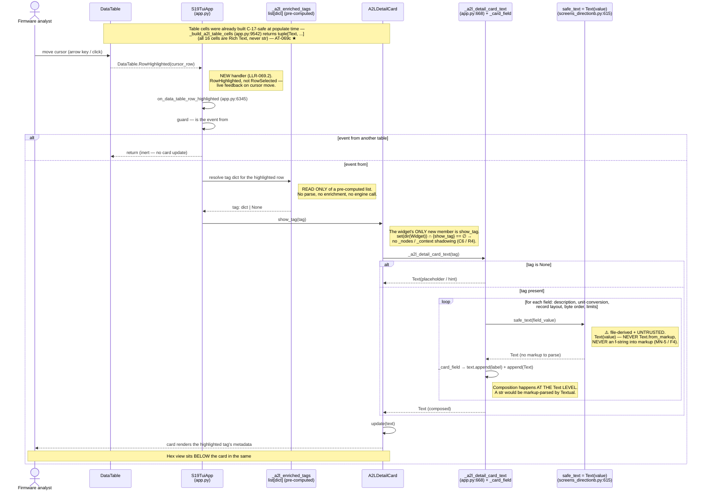
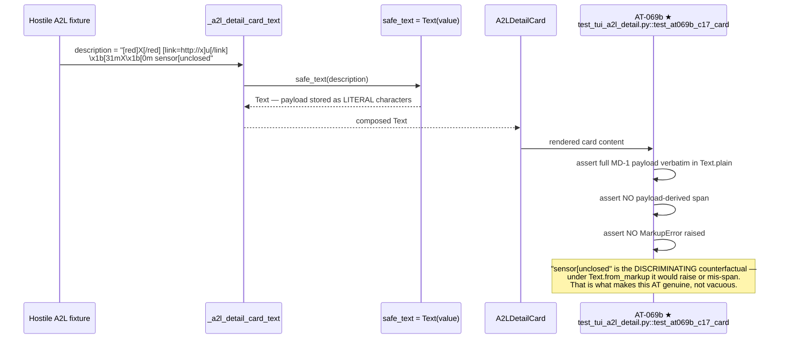

# Diagram — Sequence: A2L row highlight → detail card (C-17-safe render)

> **Why this flow.** It is the batch's most representative path: a NEW handler, a NEW widget, a
> pre-computed data read, and a **gate-blocking C-17 sink** — all in one interaction. Accurate to the
> shipped code at HEAD `12c5d1c`. Requirement: HLR-069 / R-TUI-069 (LLR-069.1–069.4). ATs: `AT-069`,
> `AT-069b ★`, `AT-069c ★`.

## 1. Main flow — highlight a tag row

## 2. The C-17 negative control (`AT-069b ★`) — same path, hostile input

## 3. What the flow demonstrates about the batch

| Property | Where it shows up above |
|---|---|
| **Render-only** | The handler *resolves* a tag from `_a2l_enriched_tags`. It never parses, enriches, or calls the engine. |
| **Safe by construction, not by patching** | `safe_text = Text(value)` at every field; composition stays at the `Text` level end-to-end. There is no point in the path where a `str` could be markup-parsed. |
| **Two distinct sinks, two ATs** | The **card** (`AT-069b`) and the **table cell** (`AT-069c`) are separate sinks. Neither AT covers the other — the table cells were already `Text` at populate time, before this flow begins. |
| **Geometry measured, not assumed (C-29)** | The card's height (5) and the surviving hex rows were pilot-measured in the real `#a2l_hex_pane` at both 80×24 and 120×30 before the split was fixed. |
| **Shadowing checked (C6)** | `show_tag` is the widget's only new member — a `_nodes`/`_context` collision would have produced a silent mount crash with no traceback. |
