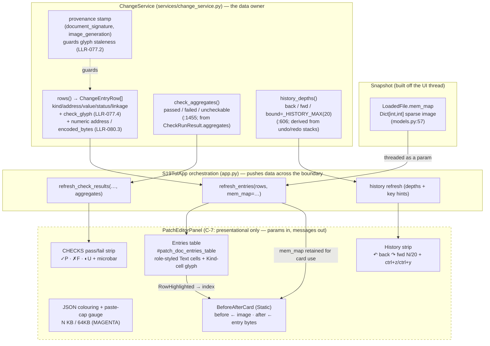
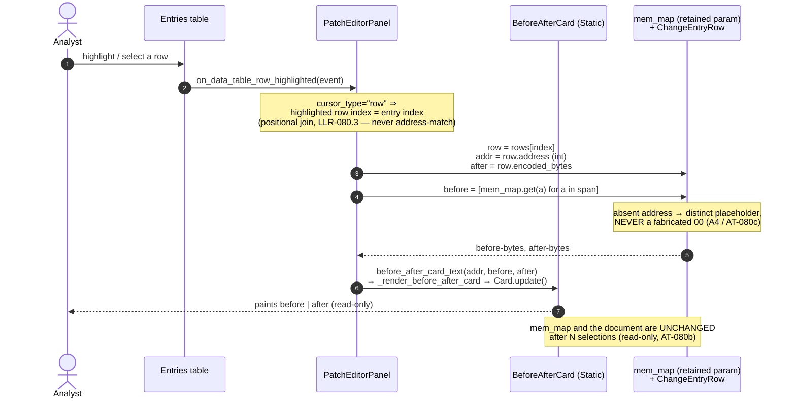

# Batch-48 — Architecture & Flow Diagrams

> **Audience:** a maintainer of the `s19_app` TUI layer. **Purpose:** show how already-computed data reaches the Patch Editor's new render surfaces, and how the headline before/after card is driven — with the **C-7 panel-purity boundary** made explicit. Symbols cite `screens_directionb.py` / `services/change_service.py` / `models.py` at HEAD `fccab02`.

---

## 1. Architecture — data flow into the Patch Editor render surfaces (`architecture-dataflow`)

The defining constraint is **C-7 panel purity**: `PatchEditorPanel` is strictly presentational — zero `self.app`, zero `mem_map` reach-ins, zero service imports. Every datum it renders is **pushed in as a method parameter** by `S19TuiApp` (`app.py`); the panel never pulls. The batch-48 additions all respect that boundary — `mem_map` is threaded through `refresh_entries(…, mem_map=…)`, aggregates through an extended `refresh_check_results`, and history depths through a dedicated refresh.

**Reading it:** `LoadedFile.mem_map` and everything `ChangeService` computes stay on the service/snapshot side of the dashed C-7 boundary. `app.py` is the only thing that crosses it, and it crosses by **calling the panel's `refresh_*` methods with parameters** — never by letting the panel reach back into the app. The entries table and the card are fed by the same `refresh_entries` call (the card reuses the `mem_map` the table was given), which is why a row highlight can drive the card without any new service round-trip.

---

## 2. Sequence — the live before/after card on row select (`sequence-before-after-card`)

The card is driven by a positional (index-based) join, never an address match: the entries table is `cursor_type="row"`, so the highlighted row index **is** the entry index. Before-bytes come from `LoadedFile.mem_map` at the entry's address; after-bytes are the entry's declared `encoded_bytes`. The whole path is read-only — it paints, it applies nothing.

**Reading it:** selection produces a paint and nothing else. The panel derives both sides from data it was already handed (`mem_map` retained from `refresh_entries`, and the row's own numeric `address` / `encoded_bytes`), so it neither re-parses `address_text` nor touches the service — keeping the C-7 boundary intact and the operation provably side-effect-free.
