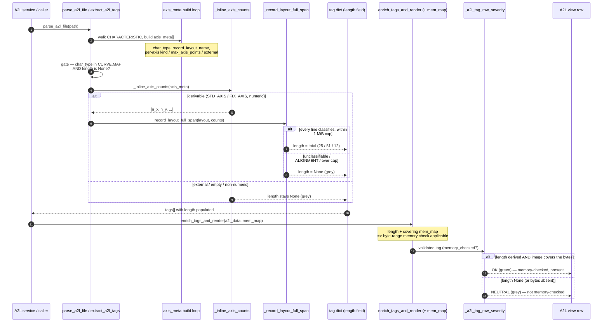

# Diagram (b) — data flow: parse → summer → A2L row severity

**What it shows:** how a derived `length` flows from `parse_a2l_file` through the post-axis-walk summer, into `tag["length"]`, through `enrich_tags_and_render`, and finally into the A2L view row's colour via `_a2l_tag_row_severity`. This is the output-then-consume chain that AT-108 exercises.

**Reading it:**
- The summer sits **inside the parse walk**, upstream of every consumer — so no service or view code changed; they all just read the now-populated `tag["length"]`.
- `enrich_tags_and_render` alone does **not** set the `sev-*` colour — the row severity comes from `_a2l_tag_row_severity` (app.py). A derived `length` is what makes the byte-range memory check *applicable*; a covering `mem_map` is what flips the row grey → green. AT-108 pins exactly this: revert the length to `None` over the same covering map and the row falls back to `memory_checked = False` / not-OK.
