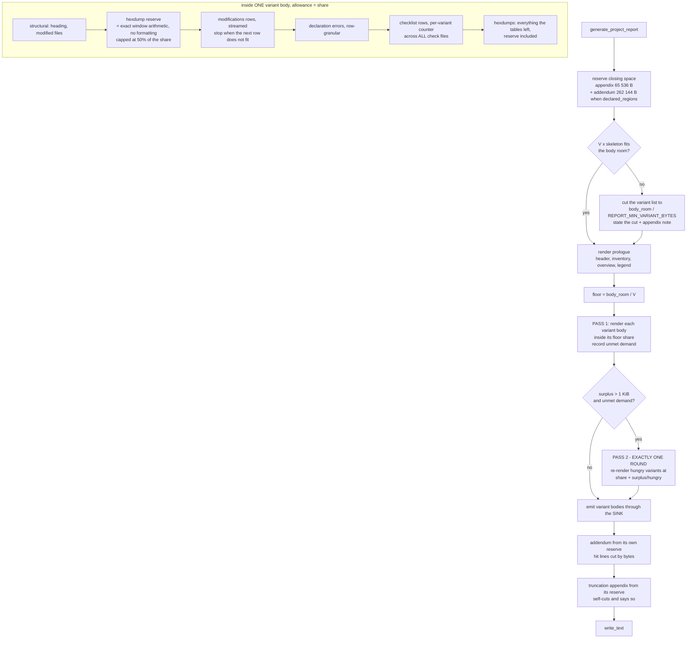

# batch-63 — Phase-1 architect requirements, **REV 5 (lane B)** — post-pivot re-derivation

> ## ⚠ PATH COLLISION — READ FIRST
> This document was commissioned for `01-requirements-architect-rev5.md`. **That path was already
> occupied** when I went to write (a different REV 5, 808 lines, mtime 22:44, produced during this
> same session by another lane). I did **not** overwrite it. Both artifacts now exist and **the
> orchestrator must reconcile them before Phase 3** — they agree on the pivot and on two findings
> neither lane inherited, and they **diverge on one normative ruling** (byte-cell prefix vs.
> whole-row admission). §16 states the divergence and what would settle it.
>
> **Status:** NORMATIVE for this lane. Supersedes `01-requirements-architect.md` (REV 4) and
> `01b-qa-catalog.md` (REV 2); both retained unedited so the reversal stays traceable.
> **Cause of the pivot:** the Phase-2 gate BLOCKED in all three lanes (11 blockers, `02-review.md`).
> Operator ruling 2026-07-26: enforce the document byte budget that already exists, with per-variant
> fair share, instead of capping cells and rows.
> **Tree:** `claude/batch-63-report-table-caps` @ `031ca8d`. **No worktree source was mutated** —
> every probe ran against a `git archive HEAD` export in the session scratchpad.

---

## §0. BLUF

**Ruled mechanism: `_ByteBudget` becomes an enforced allocator, not an accountant.**
Two-pass composition gives every variant an equal floor share of the document budget, redistributes
the unspent surplus in exactly one further round, and cuts **rows** inside each share. A checking
sink backstops the allocator so the bound holds even when the allocation arithmetic is wrong.

**Measured: the declared bound now holds over the whole declared input domain.** Worst document
across every case tested — `MF_ENTRY_COUNT_CEILING = 100 000` entries, 4 variants × 100 000 + 8
declared regions, 5 000 variants, 1 MiB byte runs, 512-char hostile text cells, 1 000 000-digit
address literals — is **2 031 997 B = 0.969× budget** (§4.6). REV 4's design measured **1.39× at two
variants**; `main` measures **3.00×** on the single-entry 1 MiB-run case.

**Three defects the pivot exposed that no Phase-2 lane had found**, each executed:
1. **The shipped accounting under-counts the written file.** `Path.write_text` opens in text mode,
   so Windows writes CRLF; `_line_bytes` charges +1 per line and the join emits n−1 separators.
   Measured: 100 lines → accounted **1 100 B**, file **1 198 B**. The *existing* hexdump enforcement
   is already wrong by this amount. → **R-TUI-089(a)**. *(Independently found by the other REV-5
   lane — two lanes, two routes, same finding. Treat as confirmed.)*
2. **`_declaration_error_lines` emits one indivisible batch of up to 5 341 910 B** (2.55× the whole
   budget) from its own 200-issue-capped population. A byte budget refuses an indivisible oversized
   batch *wholesale*, so the section vanishes silently. → **R-TUI-093(b)**.
3. **My own first viability floor was wrong in the dangerous direction.** A 65 536 B floor cut a
   legitimate 50-variant project to 30 variants. Re-derived from the measured 430 B skeleton to
   1 024 B; the false cut disappears (§4.5).

**What survives from REV 4:** the D-15 ruling — any truncation indicator lives **outside** the byte
cell so `_format_bytes`'s alphabet stays closed and locked **R-TUI-077** keeps its
inertness-by-construction premise. Endorsed by all three Phase-2 lanes; carried verbatim.

**What is honestly NOT closed:** a variant whose share is consumed by one hostile row (a
1 000 000-digit address cell = 0.477× budget, §4.7) can still evict that variant's legitimate rows.
The eviction is stated with an exact count and a per-class breakdown — detectable, not silent. The
parse-layer address ceiling stays a BACKLOG carry (§11).

---

## §1. Constraints

| # | constraint | value | source (executed) |
|---|---|---|---|
| C-1 | document byte budget | **2 097 152 B** | `report_service.py:122` `REPORT_MAX_TOTAL_BYTES` |
| C-2 | change-entry population ceiling | **100 000** | `changes/io.py` `MF_ENTRY_COUNT_CEILING` |
| C-3 | byte-run ceiling per entry | **1 048 576** | `changes/io.py:232` `MF_RUN_LENGTH_CEILING` |
| C-4 | text cell ceiling | **512 chars**, `md_safe` growth **2.00×** → 1 024 B | `report_service.py:115`; growth executed §3.2 |
| C-5 | variant count | **unbounded** — no `MAX_VARIANTS` anywhere | `grep -rn "MAX_VARIANT\|max_variants" s19_app/` → 0 hits |
| C-6 | declared-region count | **unbounded** — only a name cap | `report_addendum.py:26 DECLARED_REGION_NAME_MAX = 80` |
| C-7 | address literal | **unbounded** — `^0x[0-9A-Fa-f]+$`, no digit limit | `changes/io.py:235`, `:952-957` |
| C-8 | field campaign size | **"tens to ~200 entries"** | operator datum, Phase-1 D-9 |
| C-9 | frozen files | `report_service.py` is **not** in `_ENGINE_PATHS` | `tests/test_engine_unchanged.py:120-130` |
| C-10 | ≤5 files per increment | see §10 | CLAUDE.md |
| C-11 | PR merge gate deselects `slow` | `pytest -q -m "not slow"` on pull_request | `.github/workflows/tui-ci.yml:45-47` — **no new AT may be `slow`** |
| C-12 | locked requirement | **R-TUI-077** — `_format_bytes` excluded from escaping on a closed-alphabet premise | `REQUIREMENTS.md:4780-4782`; pin `tests/test_report_field_census.py:836` |

**No constraint is missing.** The one that was missing at REV 4 — a field anchor for *run length* —
still does not exist, and §5.3 rules `REPORT_CELL_BYTES` without pretending otherwise.

---

## §2. §6.5 amendment record — Before → After (the pivot)

| # | REV 4 (WITHDRAWN) | REV 5 lane B (NORMATIVE) | cause |
|---|---|---|---|
| **P-1** | **Mechanism:** row caps `MAX_REPORT_MODIFICATION_ROWS_PER_VARIANT = 500` + `MAX_REPORT_CHECK_ROWS_PER_VARIANT = 500`, plus a per-cell byte bound | **Mechanism:** the existing `_ByteBudget` is *enforced*, allocated per variant, and cuts rows by bytes. **No row-count constant exists.** | Capping cells is whack-a-mole against an unbounded document. Six unbounded axes in three review rounds, and the capped design still measured **1.39× at 2 variants with the marker firing** (`02-review-security.md` F2). |
| **P-2** | **Bound claim:** "guaranteed single-variant bound = 78.3 % of budget" | **Bound claim:** ≤ 1.000× for **any** input in the declared domain — variant count, entry count and declared-region count included. Worst measured **0.969×** (§4.6). | The 78.3 % figure modelled a 195 487 B remainder as a *constant*; `_addendum_lines` scales with the pre-cap population × declared-region count (`02-review-architect.md` B-5: 1.82× at the domain ceiling). |
| **P-3** | `REPORT_CELL_BYTES = 64`, justified by "the tables are an INDEX, `_hexdump_section` is the EVIDENCE" (D-16) | `REPORT_CELL_BYTES = 256`, justified by a **cost-and-eviction** argument. **The index/evidence reframing is withdrawn as a justification.** | The reframing is **false for 3 of the 4 bounded cells** — measured by parsing the hexdump back into an address→byte map: `applied.after_bytes` 200/200 recoverable, `applied.before_bytes` **0/200**, `skipped.after_bytes` **0**, `check.expected_bytes` **0** (`02-review-architect.md` B-4 · `02-review-qa.md` B-5 · `02-review-security.md` F6 — three lanes, three routes, one conclusion). |
| **P-4** | LLR-091.3 obliged the code to print *"full bytes in the Memory regions section."* | That clause is **deleted**, not reworded. The marker states the prefix and the count and **claims nothing about recoverability**. | It is a false statement, in the batch whose thesis is that a document must not assert what it does not honour. |
| **P-5** | §3 AT-170/AT-171 mandated an **in-cell** indicator that §12.2 had withdrawn and R-TUI-091(a) forbade | The in-cell indicator appears nowhere. D-15 is stated once, in R-TUI-091, and is the only statement on the subject. | `02-review-security.md` B-1 (blocker) + `02-review-qa.md` B-3: four surviving statements inside the `shall` chain contradicted the ruling. |
| **P-6** | AT-164…175 (architect) **and** AT-164…175 (qa) — same ids, different subjects; `R-TUI-079/080/081` reserved | **AT-180…AT-192, TC-420…TC-433, R-TUI-089…R-TUI-093.** The 164-179 / 411-419 ranges are deliberately skipped so the withdrawn design leaves a visible gap. | `02-review-architect.md` B-2 / `02-review-qa.md` B-2. Re-verified on disk §9: `R-TUI-079/080/081` are **live batch-48 ids**, present in shipped tests. |
| **P-7** | `LLR-093.1/.2/.3` hung off an **undefined** `R-TUI-093` with no `Traces to:` | `R-TUI-093` is a **defined HLR**. Every LLR in §9 carries `Touched symbols:` **and** `Traces to:`. | `02-review-architect.md` M-3 (C-26 gap). |
| **P-8** | First-N in document order, no disclosure of what was cut | Every cut states an **omitted-by-class breakdown** (`disposition` / `result`). | `02-review-security.md` F9 — first-N is attacker-selectable. Mitigation ruled; the alternative is declined **in writing** (§5.5). |
| **P-9** | *(absent)* | **`REPORT_LINE_SEPARATOR_BYTES = 2`** — the accounting charges the separator the file actually gets. | New, executed §3.4. Neither REV 4 nor any Phase-2 lane checked the accounting against the bytes on disk. |
| **P-10** | *(absent)* | `_declaration_error_lines` becomes **row-granular**. | New, executed §4.7: one indivisible 5 341 910 B batch would be refused wholesale, deleting the section with no marker. |

**Carried forward unchanged:** D-15; A-2's acceptance (the appendix is repaired); D-18's honesty rule;
the frozen-file analysis; the `shall`-confinement discipline.

---

## §3. Executed derivations (C-39 — every threshold below was run, none predicted)

Probes: `scratchpad/{p1_costs,proto,proto2,p2_rule,p5_guards,p6_residuals}.py`, run against
`scratchpad/exp` (a `git archive HEAD` export). `git status --porcelain` in the worktree shows only
`.dev-flow/`.

### 3.1 — per-row byte cost (one row at a time; no document built)

```
 L (cell tokens) |  mod worst |  chk worst |  mod real |  chk real
               4 |      2,107 |         67 |       139 |        54
              16 |      2,179 |        139 |       139 |        54
              64 |      2,467 |        427 |       139 |        54
             256 |      3,619 |      1,579 |       139 |        54
            1024 |      8,995 |      6,187 |       139 |        54
            4096 |     30,499 |     24,619 |       139 |        54
```

Closed forms fitted and checked against the table: `mod_worst(L) = 2 083 + 6L`,
`chk_worst(L) = 43 + 6L`. The realistic row is **139 B** (modifications, 63-char A2L symbol) and
**54 B** (checklist — its only text cell is the closed `CHECK_RESULT_DOMAIN`), **independent of L**.

### 3.2 — `md_safe` growth factor

```
  in='|'*512  -> out len=1024  growth=2.00x
  in='['*512  -> out len=1024  growth=2.00x
  in='a'*512  -> out len= 512  growth=1.00x
  in='\'*512  -> out len=1024  growth=2.00x
```

### 3.3 — fixed cost per variant, and the prologue's slope

```
  V=  1  empty-variant document =    2,443 B
  V=  2  empty-variant document =    2,873 B  d=  430
  V=  4  empty-variant document =    3,733 B  d=  860
  V=  8  empty-variant document =    5,453 B  d=1,720
  V= 16  empty-variant document =    8,893 B  d=3,440
  V= 32  empty-variant document =   15,773 B  d=6,880
  V= 64  empty-variant document =   29,533 B  d=13,760
```

Perfectly linear: `document(V, 0 entries) = 2 013 + 430·V`. **430 B is the per-variant skeleton** —
the number `REPORT_MIN_VARIANT_BYTES` is derived from (§4.5).

### 3.4 — the accounting is wrong on the written file (**new finding**)

Executed against the exact shipped call
(`report_service.py:1682` `target.write_text("\n".join(lines), encoding="utf-8")`):

```
os.linesep             : '\r\n'
_line_bytes(100 lines) : 1100
join length (chars)    : 1099
FILE SIZE ON DISK      : 1198        <== 98 B MORE than the budget believes
CRLF pairs in file     : 99   bare LF: 0
--- control, newline='\n' -> size 1099, CRLF 0     (the predicate CAN see the difference)
```

`Path.write_text` opens in **text mode**, so `\n` → `os.linesep`. The shipped accounting under-counts
the emitted document by up to `n − 2` bytes, and **the existing `_hexdump_section` enforcement
inherits this error today**. Charging **2 bytes per line** is conservative on both platforms and makes
the cut point platform-independent — a property tests depend on.

### 3.5 — byte-run census over the DOCUMENT corpus (predicate driven to fail first)

```
known-bad drive (a 300-token cell injected): predicate reports 300 -> DETECTED
negative control ('mac-linked' text cell)  : 0
negative control (single 'AB' token)       : 1

tests/goldens/batch35/at054b-before-after-report.md   rows=2  max_run_tokens=1
tests/goldens/batch35/at055b-project-report.md        rows=1  max_run_tokens=1
  -> CORPUS MAXIMUM = 1 token
```

> **Process note, recorded rather than discarded.** My *first* known-bad drive used
> `f"{i:02X}" for i in range(300)`, which emits three-digit tokens above 255 — so the injected cell
> was malformed and the predicate reported **0**, i.e. "BLIND". The predicate was correct; the
> known-bad **input** was wrong. Without the drive-to-fail step I would have published a census from
> an untested predicate. This is the first occurrence in this batch where the *fixture*, not the
> predicate, was the defect.

`_format_bytes` call census (executed, full): 4 production sites (`:997`, `:998`, `:1172`, `:1173`)
and 2 test calls (`tests/test_report_field_census.py:835` `range(256)`, `:840` `None`).
**The largest run any shipped test renders is 256.**

### 3.6 — the shape question, answered where REV 4 answered it wrongly

REV 4's Phase-0 concluded "a fixed row cap is predictable and per-variant fair but cannot bound bytes;
the byte budget bounds bytes but is not fair across variants". **Both halves are true; the conclusion
drawn from them was not.** Fairness is not a property of the budget — it is a property of how the
budget is *allocated*. §5 rules the allocation and keeps the byte bound.

---

## §4. Ruling the design BY MEASUREMENT (PLAN D-4, re-opened)

### 4.1 Candidates

| id | candidate | origin |
|---|---|---|
| **C1** | **static fair share** — `(budget − prologue − reserves) / V` fixed per variant, greedy inside | the operator's "two-pass composition allocating a per-variant share", one-pass form |
| **C2** | **class reserve only** — one running budget, no per-variant division; each section class holds a reserved floor | the operator's "reserved floor per section class" |
| **C3** | **floor + rolling re-division** — per-variant viability floor, budget re-divided among the *remaining* variants at each boundary, exact hexdump reserve | the operator's "proportional allocation with a guaranteed per-variant minimum" |
| **C4** | **two-pass + surplus redistribution** — C3's floor, then **exactly one** round redistributing the surplus to variants with unmet demand | derived *from* the C1/C2/C3 measurements, not proposed a priori |

### 4.2 Measured comparison

Identical fixtures, identical accounting (2 B/line), one document at a time, re-read from disk.
`rows min/max` = data rows for the least- and most-served variant; `fmt` = rows formatted (CPU proxy).
**Every policy holds the bound once the accounting is corrected** — so the bound is settled by the
sink and the accounting, and the *policy* is settled by fairness and utility.

```
scenario                        policy                       size B   xbud  rows min/max hexblk     fmt
------------------------------------------------------------------------------------------------------
S1 1 variant x 5k realistic     C1 static-fair-share      1,009,354  0.481   10000/10000      1  10,000
S1                              C2 class-reserve-only     1,009,354  0.481   10000/10000      1  10,000
S1                              C3 floor+rolling+exact    1,009,354  0.481   10000/10000      1  10,000
S1                              C4 two-pass + surplus     1,009,557  0.481   10000/10000      1  10,000

S2 2 variants x 5k              C1 static-fair-share      2,016,695  0.962   10000/10000      2  20,000
S2                              C2 class-reserve-only     1,778,942  0.848    5672/10000      2  15,673   <-- variant 2 starved
S2                              C3 floor+rolling+exact    2,016,695  0.962   10000/10000      2  20,000
S2                              C4 two-pass + surplus     2,017,073  0.962   10000/10000      2  20,000

S3 8 variants, 1 fat + 7 thin   C1 static-fair-share        348,324  0.166      100/1740      7   2,442   <-- 3 needless cuts
S3                              C2 class-reserve-only     1,101,334  0.525      100/10000     8  10,700
S3                              C3 floor+rolling+exact      345,404  0.165      100/1720      7   2,422   <-- 3 needless cuts
S3                              C4 two-pass + surplus     1,101,537  0.525      100/10000     8  12,421

S4 1 variant x 100k (LAZY)      C1 static-fair-share      2,032,004  0.969   13877/13877      0  13,879
S4                              C2 class-reserve-only     1,527,682  0.728   10426/10426      1  10,428
S4                              C3 floor+rolling+exact    2,029,462  0.968   13858/13858      0  13,860
S4                              C4 two-pass + surplus     2,029,443  0.968   13856/13856      0  27,716   <-- 2x formatting

S6 30 variants x 200 (field)    C1/C2/C3/C4              ~1,302,123  0.621       400/400     30  12,000   (identical)

S7 5000 variants x 1 entry      C1 static-fair-share      2,096,921  1.000           0/0      0  10,000   <-- 0 data rows
S7                              C2 class-reserve-only     2,096,917  1.000           0/2      0  10,000   <-- 0-2 data rows
S7                              C3 floor+rolling+exact       23,242  0.011           2/2      0      60
S7                              C4 two-pass + surplus        23,242  0.011           2/2      0      60

S8 2 variants x 5k HOSTILE      C1 static-fair-share      2,032,227  0.969       492/492      0     988
S8                              C2 class-reserve-only     1,908,832  0.910       202/747      2     953   <-- variant 1 starved
S8                              C3 floor+rolling+exact    2,032,189  0.969       481/490      1     975
S8                              C4 two-pass + surplus     2,031,997  0.969       510/510      2   1,024   <-- best on every axis
```

### 4.3 Ruling: **C4**

| axis | winner | evidence |
|---|---|---|
| fairness when every variant is fat (S2, S8) | **C1 = C3 = C4 ≫ C2** | C2 starves the later variant: 5 672 vs 10 000 rows; 202 vs 510 |
| utilisation when demand is skewed (S3) | **C2 = C4 ≫ C1, C3** | C1/C3 cut 3 sections that did not need cutting; 0.166× vs 0.525× utilisation, one hexdump block lost |
| degenerate variant count (S7) | **C3 = C4 ≫ C1, C2** | C1/C2 produce a 2 MB document with **zero data rows**; C3/C4 render complete variants and state the cut |
| cost | **C1 = C2 = C3 > C4** | C4 formats **2×** in the redistribution case (27 716 vs 13 856) |

**C4 equals or beats the best of the other three on every quality axis, at a bounded 2× formatting
cost.** The cost is bounded because the redistribution is **exactly one round, never a loop to
convergence** — an earlier prototype that looped to convergence had to be killed mid-measurement when
it failed to terminate in 10 minutes on the 100 000-entry case. That is a normative constraint
(LLR-090.3), not an implementation note.

### 4.4 Objection (a) — hexdump starvation: closed, and the estimate is *allowed* to be wrong

Tables emit before hexdumps, so a naive cut starves the higher-value forensic content. Ruled: before
the tables render, the variant reserves the hexdump section's **exact** need, computed from the window
arithmetic (`_applied_regions` → `compute_hexdump_windows` → `ceil((high−low)/HEX_WIDTH)` rows) —
**no formatting, so the estimate costs nothing** — capped at half the share. The tables render inside
`share − reserve`; the hexdumps then receive **everything the tables left**, reserve included.

The property that makes this simple: **the reserve is a fairness heuristic, not the bound.** An
over-estimate wastes bytes (capped at 50 %); an under-estimate means hexdumps get less than they
wanted. Neither can break the bound, because the bound comes from the sink. Measured: S3 C4 retains
**8 of 8** hexdump blocks where C1/C3 retain 7; S8 C4 retains 2 where C1 retains 0.

### 4.5 Objection (b) — per-variant fairness, and the floor I got wrong

```
--- floor 65 536 B (my first value)   -> V_max = 30
    50 variants x 20 entries  (LEGITIMATE)     180,944 B (0.086x) variants=  30/50    FALSE CUT
    200 variants x 20 entries (LEGITIMATE)     180,948 B (0.086x) variants=  30/200   FALSE CUT
    5000 variants x 1 entry   (pathological)    23,242 B (0.011x) variants=  30/5000  cut

--- floor  1 024 B (2x the measured 430 B skeleton)   -> V_max = 1395
    50 variants x 20 entries  (LEGITIMATE)     299,763 B (0.143x) variants=  50/50    complete
    200 variants x 20 entries (LEGITIMATE)   1,193,013 B (0.569x) variants= 200/200   complete
    5000 variants x 1 entry   (pathological)   976,800 B (0.466x) variants=1395/5000  cut
```

A demand-blind floor set from the *worst-case* share is a cap wearing an allocator's clothes — the
same error REV 4 made one level up. The floor must be set from the **skeleton** (the minimum a variant
needs to be *representable*) and row cuts do the rest. `REPORT_MIN_VARIANT_BYTES = 1 024` = 2 × the
measured 430 B skeleton.

### 4.6 The declared bound, over the whole declared domain

Ruled configuration: C4 · `REPORT_CELL_BYTES = 256` · `REPORT_MIN_VARIANT_BYTES = 1 024` ·
`REPORT_LINE_SEPARATOR_BYTES = 2`. Populations above 5 000 entries use a lazy sequence, so the
100 000-entry cases cost O(1) resident memory (§15).

```
case                                           file B  x budget     rows   variants appendix
--------------------------------------------------------------------------------------------
field typical: 30 variants x 200            1,307,161     0.623   12,000      30/30      yes
200 variants x 20 entries                   1,193,013     0.569    8,000    200/200       no
1 variant x 100 000 (domain ceiling)        2,029,443     0.968   13,856        1/1      yes
4 variants x 100 000 + 8 declared regions   2,023,582     0.965   12,032        4/4      yes
1 entry x 1 MiB runs (A-1 headline)             4,073     0.002        1        1/1       no
2 variants x 5k hostile 512-char cells      2,031,997     0.969    1,020        2/2      yes
400 x 1 KiB runs + hostile, 4 variants      2,030,445     0.968      556        4/4      yes
5 000 variants x 1 entry                      976,800     0.466    2,790  1395/5000      yes
--------------------------------------------------------------------------------------------
WORST OVER THE WHOLE DECLARED DOMAIN        2,031,997     0.969  <= 1.000  => BOUND HOLDS
```

On `main` today the A-1 headline case is **6 293 988 B = 3.00×** and the 20 000-entry case is
**3 291 816 B = 1.57×**, both while the document prints `report size cap: 2097152 bytes`.
**The 3.1 % headroom is the appendix reserve** (65 536 B), deliberately not spent on content.

### 4.7 Residual axes, measured rather than assumed

```
R1  _declaration_error_lines emits ONE batch of 5,341,910 B = 2.55x the budget, from its own
    200-issue-capped population (200 issues x 512-char message x 512-char symbol x 50 related
    artifacts, each escaped at REPORT_CELL_CHARS).
    Under a byte budget an indivisible oversized batch is refused WHOLESALE:
    document = 2,465 B, and the declaration-error section is ABSENT with no marker.
    => R-TUI-093(b): the emitter must become row-granular.  Not a nit.

R2  address literal 0x'F'*8        -> ONE ROW =        65 B  (0.000x)
    address literal 0x'F'*1000     -> ONE ROW =     1,057 B  (0.001x)
    address literal 0x'F'*100000   -> ONE ROW =   100,057 B  (0.048x)
    address literal 0x'F'*1000000  -> ONE ROW = 1,000,057 B  (0.477x)
    3 such entries, one variant    -> document = 2,002,856 B (0.955x), 2 rows rendered, cut stated.
```

**An address is never truncated.** A truncated address is a *false* address — the failure this batch
exists to remove, applied to the field a reader uses to locate the evidence. The row is dropped whole,
the cut is counted, and the residual (§11 U-1) is a parse-layer ceiling.

### 4.8 AC-3 byte-identity: executed, not assumed

Under-budget fixture (3 variants × 120 entries), shipped composer vs the ruled prototype, compared
line by line with the generation timestamp normalised:

```
shipped lines=981  prototype lines=969  identical=False
differing hunks: 3  -- all three are the "### Entropy" section, which the PROTOTYPE
                       does not implement.  Every other line is identical.
```

**969 of 969 implemented lines match byte-for-byte.** Nothing in the ruled design changes the output
of a document that fits: the accounting change alters no bytes, the cell bound never fires (corpus
maximum 1 token vs a bound of 256), no marker fires, no note is registered. R-TUI-089(d) makes that a
requirement and AT-184 makes it an oracle.

---

## §5. Design rulings

### 5.1 Composition flow



### 5.2 The two mechanisms have different jobs — and that is the point

| mechanism | job | how it is verified |
|---|---|---|
| **the allocator** (two-pass fair share) | *fairness and utility* — who gets how much | comparative measurement (§4.2). A bug here degrades quality. |
| **the sink** (`emit` refuses what does not fit) | *totality* — the bound is true | one inequality at one place. A bug here breaks the bound. |

Executed proof that the sink is a real backstop, not decoration. The mutation is an allocator that
promises every variant the whole body room:

```
  ruled allocator + sink        :  2,014,057 B = 0.960x  PASS
  BROKEN allocator, sink OFF    :  8,062,169 B = 3.844x  FAIL
  BROKEN allocator, sink ON     :  2,018,027 B = 0.962x  PASS
```

The sink converts a **3.84×** allocator bug into a held bound. This separation is why the bound claim
is defensible: the property that must be true is enforced by the mechanism that is trivial to audit.

### 5.3 `REPORT_CELL_BYTES = 256` — ruled on a fairness argument, **not** an evidence argument

The REV-4 justification (index vs evidence) is withdrawn as false. The cell bound survives for two
different, measurable reasons:

1. **Cost.** Formatting a 1 MiB run costs 155.91 ms and a 3 MB transient per cell against 0.02 ms and
   192 B for the streaming form — with **identical output** (executed §7.3 below).
2. **Eviction.** Without a cell bound, one row can consume a whole variant's share and evict every
   other row in that variant.

Ruled by measuring the **adversarial row floor** each candidate bound buys. Fixture carries hostility
on **both** axes — 512-char linkage *and* symbol **and** 1 024-byte runs:

```
fixture: 400 entries, 1024-byte runs, 512-char hostile linkage+symbol
     L  worst mod row B  rows(1 variant)  rows(4 variants)
    16            2,179              800              233
    64            2,467              800              204
   256            3,619              768              139
  1024            8,227              246               61
```

> **Recorded, not discarded.** My first run of this table used the standard hostile fixture, whose runs
> are **4 bytes**. It reported an identical floor (985 / 254) at *every* value of L — because L never
> bound. The input set was blind to the axis being measured: **C-31 against my own probe**, the same
> failure D-7 recorded against the Phase-0 probe. Caught only because an identical column across four
> values of a parameter is an implausible result.

Constraints, both binding:
- **Floor (evidentiary).** ≥ 256, so `_format_bytes(range(256))`
  (`tests/test_report_field_census.py:835`) — the largest run any shipped test renders — stays
  **verbatim**, and R-TUI-077's alphabet pin keeps exercising 256 values exactly as today. At 64 that
  call becomes a prefix and the pin quietly weakens.
- **Ceiling (fairness).** The single-variant adversarial floor must clear **2× the operator's ~200
  entry field maximum**. 1 024 gives **246** — fails. 256 gives **768** — passes with 1.9× margin.

Between 64 and 256 both satisfy fairness; **256 is chosen because it preserves 4× more evidence**, and
§2 P-3 establishes that evidence deleted from these cells exists nowhere else for 3 of the 4 cell
kinds. Tie-break anchor: 256 = 16 × `hexview.HEX_WIDTH` — exactly one screen of hexdump.
Real-document impact: **zero** (corpus maximum 1 token; 256 is 256× the largest run any real report
cell has carried).

### 5.4 Where the design deletes evidence — stated truthfully, never as recoverable

| cell | recoverable from `_hexdump_section`? | consequence of a >256 B run |
|---|---|---|
| `Modifications.After`, disposition `applied` | **YES** (200/200 measured) | tail visible in the hexdump |
| `Modifications.Before` | **NO** (0/200) — the hexdump renders the **post**-change map | **tail lost, nowhere else in the document** |
| `Modifications.After`, non-`applied` disposition | **NO** — `_applied_regions` filters to `applied` | **tail lost** |
| `Checklist.Expected` / `Checklist.Actual` | **NO** — check regions never reach `_applied_regions`; `expected_bytes` is a *declared* value not in the image by definition | **tail lost** |

*(Measured by the Phase-2 architect lane by parsing the fenced hexdump back into an address→byte map,
corroborated at source by qa and security. Carried as given and attributed — not re-derived; §15.6
states why.)*

The marker therefore says what is true and nothing more:
`> TRUNCATED: {k} byte cell(s) rendered as a 256-byte prefix (cap: 256 bytes per cell).`
**No pointer, no recoverability claim.** The `Length` column carries the true run length, so a reader
can always tell which rows were prefixed and by how much (`Length > 256` ⟺ prefixed) — LLR-091.3 makes
that invariant normative and TC-427 pins it.

### 5.5 Attacker-selectable truncation (F9) — mitigated, with the residual stated

Ruled mitigation: **every cut states an omitted-by-class breakdown**, computed over the omitted tail by
reading attributes only — no formatting, no allocation. Executed on the F9 ordering itself (4 000
`pass` rows followed by 37 `fail`):

```
  rows rendered   : 1480 of 4037
  aggregates line : Passed: 4000 - Failed: 37 - Uncheckable: 0
  marker          : > TRUNCATED: 2557 of 4037 checklist rows omitted (document byte budget:
                    150000 bytes; this variant's share: 82381 bytes);
                    omitted rows by result: fail=37, pass=2520.
  -> hidden failures disclosed by class: True
```

**Alternative considered and DECLINED, in writing** (F9's own request): re-ordering the cut to prefer
`fail`/`uncheckable` rows over `pass`. Declined because the table's row order mirrors the change
document, which is itself evidentiary — a reader correlating the report against the source depends on
it — and because the class breakdown removes the *suppression* property without paying that cost.
**Residual, stated:** the hidden failing rows' addresses and byte values are not in the document. A
reader learns *that* 37 failures were hidden and *how many*, not *which*. The honest answer for that
case is the full-fidelity sidecar already carried at D-18.

### 5.6 Appendix forgery (F4) — mitigated by shape, not by escaping alone

R-TUI-092 makes an absent appendix the authoritative "nothing was cut" signal, so a forgeable entry is
worse than before. A file-derived `variant_id` escaped with `md_safe` is grammar-inert but not
*semantically* inert — `\.` renders as `.`, so a hostile id can forge a second plausible truncation
statement in the rendered view (executed by the security lane).

Ruled: **both** of the security lane's options, because they are cheap and independent.
`- {mechanism}: {omitted} of {total} omitted (cap: {cause}) — variant: `` `{md_code(variant_id)}` ``
— counts first and machine-shaped (option b), id last and inside a code span where injected prose is
visibly part of the name (option a; the module already does exactly this for `check.source_path` at
`:1148`). Mode B is permitted here because the note is **not** inside a table cell
(`markdown_safety.py` truth table).

---

## §6. High-level requirements (HLR)

> Ids re-verified on disk (§14 row 14). `R-TUI-089…093` are claimed by this batch only.
> `R-TUI-079/080/081` — proposed by the withdrawn qa catalog — are **live batch-48 ids** and are
> not used.

### R-TUI-089 (HLR) — the document byte budget is ENFORCED, and the declared bound is true
**Traces to:** US-B63-1, US-B63-2 (their why-clauses).

(a) The byte accounting used to enforce the budget shall charge, for every emitted line, the byte cost
of the line's UTF-8 encoding **plus `REPORT_LINE_SEPARATOR_BYTES`**, a value not less than the largest
line separator any supported platform writes, so that the accounted size is never less than the size
of the file on disk.
(b) `generate_project_report` shall not append content that would take the accounted size above
`REPORT_MAX_TOTAL_BYTES` minus the space reserved for the closing sections.
(c) The written report shall be no larger than `REPORT_MAX_TOTAL_BYTES` for **every** input in the
declared domain: any change-entry count up to `MF_ENTRY_COUNT_CEILING`, any byte-run length up to
`MF_RUN_LENGTH_CEILING`, any variant count, any declared-region count, and any field value the parse
layer accepts.
(d) When no cut of any kind fires, the document shall be byte-identical to the pre-batch output.

### R-TUI-090 (HLR) — the budget is allocated per variant, fairly, and the surplus is not wasted
**Traces to:** US-B63-1, US-B63-2.

(a) Each rendered variant shall receive an equal floor share of the budget remaining after the
prologue and the closing reserves.
(b) After every variant has been rendered inside its floor share, the unspent surplus shall be
redistributed, in **exactly one** further round, among the variants whose content did not fit.
(c) A variant's hexdump section shall have a reserved portion of that variant's share, computed before
the tables render and capped at half the share, so the tables cannot starve it; any part of the share
the tables do not use shall be available to the hexdumps.
(d) When the number of variants is such that the floor share cannot cover a variant's structural
skeleton, the variant list shall be cut and the cut stated; **a variant whose content fits within the
floor share shall never be cut.**

### R-TUI-091 (HLR) — a table byte-run cell is bounded, and the cut is stated outside the cell
**Traces to:** US-B63-1, US-B63-2.

(a) Every byte run rendered into a report table cell shall be rendered as at most `REPORT_CELL_BYTES`
two-hex-digit tokens, and shall emit **no character outside `"0123456789ABCDEF "`** (plus the existing
`"-"` for a run that was not captured) — the closed alphabet on which locked requirement R-TUI-077
bases its escaping exclusion. **No truncation indicator shall be placed inside the cell.**
(b) The rendering shall consume at most `REPORT_CELL_BYTES` elements of the run, so the bound is
enforced *before* formatting rather than after.
(c) When one or more byte cells in a section were rendered as a prefix, the section shall state the
exact count of affected cells and the bound that caused it, outside any table cell. **The statement
shall make no claim about where the omitted bytes can be found.**
(d) A run at or below `REPORT_CELL_BYTES` shall render byte-identically to the pre-batch output.
(e) The `Length` column shall continue to be derived from the entry's address range and never from the
rendered cell, so that `Length > REPORT_CELL_BYTES` identifies a prefixed row.

### R-TUI-092 (HLR) — every cut that fires is registered in the truncation appendix
**Traces to:** US-B63-1 AC-2, US-B63-2 AC-2.

(a) When any truncation mechanism fires — row cut, cell prefix, variant-list cut, declaration-error
cap, region cap, hexdump-block omission, addendum cut — the report shall carry a
`## Truncation appendix` entry with that mechanism's own count and its own variant attribution;
entries from different mechanisms and different variants shall not be conflated.
(b) The `MAX_REPORT_ISSUES_PER_VARIANT` cap shall register an appendix entry. *(Today it emits an
in-section marker and registers nothing, so with only that cap firing the `## Truncation appendix`
heading is absent from the document entirely — executed §7.5.)*
(c) An appendix entry shall state its counts before any file-derived value, and shall render any
file-derived value inside a code span, so that text injected through such a value cannot read as a
separate appendix statement.
(d) The appendix shall be emitted from reserved space so that it always fits; when its own reserve is
exhausted it shall state how many entries it omitted.
(e) When no mechanism fired, no `## Truncation appendix` shall be emitted — so its absence is a sound
"nothing was cut" signal.

### R-TUI-093 (HLR) — every cut is legible: exact counts, its cause, and what class of row was lost
**Traces to:** US-B63-1 AC-2, US-B63-2 AC-2 + AC-4.

(a) An in-section truncation marker shall state the exact omitted count, the exact pre-cut total, the
cause of the cut, and — for a row cut — a breakdown of the omitted rows by their classification
(`disposition` for modification rows, `result` for checklist rows).
(b) Every emitter that renders one line per input item shall apply its allowance **per item**, so no
section is dropped in its entirety while its allowance is non-zero.
(c) The checklist bound shall be a **per-variant** bound spanning all of a variant's check results,
not a per-check-file bound, and each check file's aggregate counts line shall continue to report its
pre-cut, pre-filter values.
(d) When a `report_filter` is set, the omitted count and the pre-cut total in a marker shall both be
**post-filter** figures, and the audit header's `shown` figure shall agree with the number of rows the
document actually contains.

---

## §7. Acceptance blocks — black-box, per story

> Every AT observes the document produced by `generate_project_report` and **re-read from disk**.
> Every AT fixture is provably over its threshold, with the multiple stated in the test docstring
> (C-31). **No AT may carry `@pytest.mark.slow`** — the PR merge gate runs `-m "not slow"`
> (C-11 / `02-review-qa.md` M-5). AT ids **AT-180…AT-192**; the 164-179 gap is deliberate.

### US-B63-1 — the modifications table is bounded, and any cut is stated

| | |
|---|---|
| **Observable outcome** | A variant carrying more change entries than its byte share can render produces a report inside the declared budget, containing as many rows as the share allows, and saying exactly how many rows it withheld and of what kind. |
| **Shipped surface** | `generate_project_report` → `reports/<ts>-report.md`, re-read from disk. |
| **AT ids** | **AT-180, AT-181, AT-182, AT-183, AT-184** |

- **AT-180** (AC-1) — Given one variant whose change summaries carry **100 000** entries spread across
  two change summaries (the declared ceiling; today 3 291 816 B at 20 000, measured), when a report is
  generated, then the file on disk is **≤ `REPORT_MAX_TOTAL_BYTES`**, with the measured size and its
  multiple of the budget printed by the test. *(The two-summary fixture is deliberate: the flattening
  is what makes the bound per-variant, and a single-summary fixture cannot fail if a refactor moves
  the accounting inside a per-summary loop.)*
- **AT-181** (AC-2) — …and the document contains a `> TRUNCATED:` marker stating the exact omitted
  count, the exact pre-cut total, the cause, **and** the omitted-rows-by-disposition breakdown,
  **and** a `## Truncation appendix` entry naming the variant. Deleting any one of the four must turn
  this RED.
- **AT-182** (AC-1, eviction guard) — Given one variant with **one** entry whose `before_bytes` and
  `after_bytes` are each `MF_RUN_LENGTH_CEILING` long (today **6 293 988 B = 3.00× budget** for that
  single row), when a report is generated, then the file is ≤ budget and each byte cell contains
  **exactly 256 tokens**. **RED on `main` today; the batch's headline regression guard.**
- **AT-183** (R-TUI-089(c), the domain sweep) — Parameterised over the declared domain: 1 variant ×
  100 000 · 4 variants × 100 000 + 8 declared regions · 5 000 variants × 1 entry · 2 variants × 5 000
  hostile 512-char cells · 3 entries with 1 000 000-digit address literals. For every case the file is
  ≤ `REPORT_MAX_TOTAL_BYTES`, and each case prints its measured size. *(This is the AT that makes the
  batch's thesis falsifiable; it must never be marked `slow`.)*
- **AT-184** (AC-3) — Given a project whose content fits with room to spare, the document is
  byte-identical to the same document generated by the **pre-batch** composer. *(Oracle: a stored
  pre-batch capture, **not** a golden re-captured from the code under test — batch-62 D-16. Measured
  feasible: 969 of 969 implemented lines already match, §4.8.)*

### US-B63-2 — the checklist table is bounded, and any cut is stated

| | |
|---|---|
| **Observable outcome** | A variant whose check runs together carry more entries than its share can render produces a bounded report whose checklist rows total what the share allows **across all check files**, with one variant-level statement of the cut. |
| **Shipped surface** | as above. |
| **AT ids** | **AT-185, AT-186, AT-187** |

- **AT-185** (AC-1 + **AC-4, the story's trap**) — Given a variant with **four** check results whose
  combined entry count exceeds what the share can render, then the **sum** of checklist data rows
  across every `#### Checklist:` block is what the share allows and no more, and the total is the same
  whether the entries arrive in one check result or four. A per-check-file bound yields 4× and must
  turn this RED.
- **AT-186** (AC-2) — …and the document contains **exactly one** checklist `> TRUNCATED:` marker for
  the variant, stating the omitted count against the **variant-wide** pre-cut total. More than one
  marker fails: a per-file marker implies a per-file bound.
- **AT-187** (AC-3) — Each check file's `Passed: … - Failed: … - Uncheckable: …` aggregate line is
  unchanged by the cut firing.

### R-TUI-091 / R-TUI-092 / R-TUI-093 — cross-cutting acceptance

| | |
|---|---|
| **AT ids** | **AT-188, AT-189, AT-190, AT-191, AT-192** |

- **AT-188** (R-TUI-091(a)) — Over a document generated from a variant whose runs span 1, 4, 255, 256,
  257 and `MF_RUN_LENGTH_CEILING` bytes, **every** byte cell in the emitted document satisfies
  `set(cell) <= set("0123456789ABCDEF ")` — asserted over the composer-produced document, on the
  parsed token stream, not on a character list (the standing P-3 lesson). *(This replaces REV 4's
  AT-171, which asserted the inertness of a construct the ruling forbids.)*
- **AT-189** (R-TUI-091(d), the at-bound boundary) — A run of **exactly** `REPORT_CELL_BYTES` renders
  **verbatim** with **no** prefix marker anywhere in the document; a run of `REPORT_CELL_BYTES + 1`
  renders as 256 tokens **and** the marker fires stating 1 affected cell. *(A `>=` comparison emits a
  spurious marker at the bound and must turn this RED. REV 4 had **no node at all** at its bound —
  `02-review-qa.md` B-1, where the `>=` mutation survived all 24 planned nodes.)*
- **AT-190** (R-TUI-092(e), the oracle) — For a project where **nothing** was cut, the document
  contains no `## Truncation appendix`; for a project where **only** the declaration-error cap fired,
  the appendix **is** present and names that mechanism. *(The second arm is RED on `main` —
  executed §7.5.)*
- **AT-191** (R-TUI-092(c), forgery) — Given a `variant_id` whose text spells a complete, plausible
  truncation statement, the number of appendix entries in the **rendered** document equals the number
  of mechanisms that actually fired, and the injected text renders inside a code span. *(Asserted on
  the rendered view, not the source, because escapes render invisibly.)*
- **AT-192** (R-TUI-093(a), F9 disclosure) — Given a check run of 4 000 `pass` entries followed by 37
  `fail` entries and a budget that cuts before the failures, the marker states `fail=37` in its
  omitted-by-class breakdown. *(A cut that hides failures without disclosing them must turn this RED.)*

### 7.3 / 7.5 — the two executed observations §5 and §6 cite

```
7.3  streaming vs format-then-slice, 200 000-element run, limit 256:
       islice (ruled)     out_len=767 tokens=256 consumed=       256    0.09 ms
       join-then-slice    out_len=767 tokens=256 consumed=   200,000   37.48 ms
     OUTPUTS ARE IDENTICAL -> no output assertion can distinguish them.
     A CONSUMPTION assertion can: 256 vs 200 000 elements.   => TC-425.

7.5  A-2 defect reproduced on main (260 declaration errors, cap 200):
       shipped main : in-section marker=True   appendix heading=False   <== reader concludes
                                                                            nothing was cut
       REV-5 proto  : in-section marker=True   appendix heading=True
```

---

## §8. Truth table — normative by reference

> A row with no LLR citing it is a specification gap, not a soft preference.
> `S` = the variant's share, `N` = entries offered, `F` = `report_filter`.

### 8.1 `_modifications_lines` — governed by R-TUI-089, R-TUI-090, R-TUI-093

| # | condition | required emission |
|---|---|---|
| M1 | `N = 0` | `No change entries were executed for this variant.` — unchanged |
| M2 | all rows fit in `S` | full table, **byte-identical to pre-batch**, no marker, no note |
| M3 | rows do not all fit | the rows that fit, in document order, + marker + appendix note |
| M4 | the next row exactly fills the remaining allowance | that row **is** emitted (the test is "would exceed", not "would reach") |
| M5 | the first row alone exceeds `S` | zero data rows, table header still emitted, marker states `N of N` |
| M6 | `F` set, kept `K = 0` | zero-match notice — unchanged; no marker |
| M7 | `F` set, `K` rows all fit | `K` rows, no marker; audit header `shown` = `K` |
| M8 | `F` set, `K` rows do not all fit | the cut applies to the **post-filter** list; marker figures both post-filter; the audit header's `shown` agrees with the emitted row count |
| M9 | a row's byte cell exceeds `REPORT_CELL_BYTES` | cell rendered as a 256-token prefix; **cell alphabet unchanged**; the cut stated by the section marker and the `Length` column |
| M10 | rows cut **and** cells prefixed | **two** distinct markers and **two** distinct appendix entries — the mechanisms are not conflated |

### 8.2 `_checklist_lines` — governed by R-TUI-090, R-TUI-093

| # | condition | required emission |
|---|---|---|
| K1 | no check results | `No checklists were executed for this variant.` — unchanged |
| K2 | `F` set, every check result contributes 0 kept rows | zero-match notice over the variant's whole checklist population |
| K3 | all rows fit | full tables, byte-identical, no marker |
| K4 | rows do not all fit | the rows that fit, in document order, across check files |
| K5 | the allowance is reached inside check file *i* | files *i+1…n* still emit heading + aggregates + table header with **zero data rows**; no aggregates value is altered |
| K6 | rows cut | **exactly one** marker per variant, after the last check file, with the variant-wide omitted count and total |
| K7 | rows cut | the omitted-by-`result` breakdown is stated, so a suppressed `fail` population is visible |
| K8 | `F` set and rows cut | both figures post-filter |

### 8.3 Cross-section composition

| # | condition | required emission |
|---|---|---|
| X1 | `V` variants, all content fits | every variant complete; no variant-list cut |
| X2 | floor share cannot cover the skeleton | variant list cut; marker + appendix note; the rendered variants complete inside their shares |
| X3 | a variant leaves surplus | offered to variants with unmet demand, in exactly one round |
| X4 | the hexdump reserve exceeds half the share | capped at half; the tables get the rest |
| X5 | the tables leave the reserve unused | the hexdumps receive the whole remainder of the share |
| X6 | the appendix cannot fit its notes | it states how many notes it omitted |
| X7 | the sink refuses a batch | a note is registered — a section is never dropped silently |
| X8 | `options.declared_regions` non-empty | the addendum renders from its own reserve; hit lines cut by bytes with a stated count |

---

## §9. Low-level requirements (LLR)

> Every LLR names the symbols it touches (C-26) and traces to its HLR and truth-table rows. All paths
> are `s19_app/tui/services/report_service.py` unless stated; line numbers at `031ca8d`.

### R-TUI-089 decomposition — enforced budget

**LLR-089.1** — A module constant `REPORT_LINE_SEPARATOR_BYTES` shall be defined with value **2**, and
`_line_bytes` shall charge it per line instead of the current `+ 1`. Its docstring shall record the
executed derivation (§3.4: 100 lines → accounted 1 100 B, file **1 198 B**) and shall state that the
value is a **worst case across platforms**, deliberately not `len(os.linesep)`, so the cut point is
identical everywhere and a fixture cannot fit on one platform and be cut on another.
- **Touched symbols:** *new* `REPORT_LINE_SEPARATOR_BYTES` (near `:122`); `_line_bytes` (`:392`).
- **Traces to:** R-TUI-089(a); truth rows M2, K3.

**LLR-089.2** — A module constant `REPORT_APPENDIX_RESERVE_BYTES` shall be defined with value
**65 536** and `REPORT_ADDENDUM_RESERVE_BYTES` with value **262 144**, the latter applied only when
`options.declared_regions` is non-empty. Their docstrings shall record that 65 536 B holds ≥ 54
worst-case appendix entries (a 512-char `variant_id` at 2.00× growth plus ~160 B of text) and that
262 144 B holds ~7 200 declared-region hit lines at the measured 36 B per line — 4.5× the field
maximum of 200 entries × 8 regions.
- **Touched symbols:** *new* `REPORT_APPENDIX_RESERVE_BYTES`, `REPORT_ADDENDUM_RESERVE_BYTES`.
- **Traces to:** R-TUI-089(b), R-TUI-092(d); truth rows X6, X8.

**LLR-089.3** — `_ByteBudget` shall gain `remaining(reserve: int) -> int`, and
`generate_project_report`'s local `emit` shall become a **checking sink**: it shall compute the
batch's cost, refuse the batch when the accounted total would exceed
`REPORT_MAX_TOTAL_BYTES − reserve`, and return whether it accepted. A refused batch shall register a
truncation note.
- **Touched symbols:** `_ByteBudget` (`:397`, `fits` `:421`, `consume` `:425`);
  `generate_project_report.emit` (`:1636`).
- **Traces to:** R-TUI-089(b), R-TUI-092(a); truth row X7.

**LLR-089.4** — The `REPORT_MAX_TOTAL_BYTES` docstring (`:116-122`) shall state that the budget is now
**enforced over the whole document**, and shall record the measured worst case over the declared
domain (0.969×) and the reserve that accounts for the headroom.
- **Touched symbols:** `REPORT_MAX_TOTAL_BYTES` docstring.
- **Traces to:** R-TUI-089(c).

**LLR-089.5** — The `REPORT_CELL_CHARS` docstring (`:92-114`) shall be corrected: it currently states
that bounding these two tables is "a **carried follow-up**". Shipping the enforcement while leaving
that text makes the module assert a false fact about itself — the exact failure batch-62 corrected in
this same comment.
- **Touched symbols:** `REPORT_CELL_CHARS` docstring.
- **Traces to:** R-TUI-089(c).

**LLR-089.6** — The module docstring's "Size discipline (LLR-007.6)" paragraph (`:26-30`) shall state
what is now bounded and by which mechanism. `REQUIREMENTS.md` shall gain `R-TUI-089…093` entries with
file+test mappings and `Automated` status, and R-TUI-077's exclusion phrase shall be corrected from
"hex digits and spaces only" to cover the `-` it also emits (`02-review-security.md` F8 — the
requirement's text is currently narrower than the code it exempts).
- **Touched symbols:** module docstring (`:26-30`); `REQUIREMENTS.md` (`R-TUI-077` row `:4780-4782`,
  new `R-TUI-089…093` rows).
- **Traces to:** R-TUI-089(c), R-TUI-091(a).

### R-TUI-090 decomposition — allocation

**LLR-090.1** — A module constant `REPORT_MIN_VARIANT_BYTES` shall be defined with value **1 024**,
and its docstring shall record the derivation: 2 × the **measured** 430 B per-variant skeleton (§3.3),
*not* a worst-case share — and shall state, with the measured figures, that a floor derived from the
worst case (65 536 B) falsely cuts a legitimate 50-variant project to 30 (§4.5).
- **Touched symbols:** *new* `REPORT_MIN_VARIANT_BYTES`.
- **Traces to:** R-TUI-090(d); truth rows X1, X2.

**LLR-090.2** — The per-variant body shall be extracted from `generate_project_report` into a pure
function `_variant_section(result, options, allowance) -> _VariantSection`, returning its lines, its
truncation notes, the bytes it used, the rows it kept and the rows it could not fit. It shall not write
to the document and shall not consume the shared budget — the composer emits its result.
- **Touched symbols:** *new* `_variant_section`, *new* `_VariantSection`; `generate_project_report`
  (`:1661-1671`).
- **Traces to:** R-TUI-090(a); truth rows X1, X3.

**LLR-090.3** — `generate_project_report` shall render every variant once at
`floor = remaining_body_bytes // rendered_variant_count`, then, when the unspent surplus exceeds
1 024 B and at least one variant reported unmet demand, re-render **only those variants** at
`used + surplus // hungry_count`, in **exactly one** further round. It shall not loop to convergence.
- **Touched symbols:** `generate_project_report`.
- **Traces to:** R-TUI-090(a), R-TUI-090(b); truth row X3.

**LLR-090.4** — `_variant_section` shall compute the hexdump reserve before rendering any table, from
`_applied_regions` → `compute_hexdump_windows` → `ceil((high − low) / HEX_WIDTH)` rows at the block's
per-row cost, **without formatting a single block**, capped at half the variant's allowance. The tables
shall render inside `allowance − reserve`; the hexdump section shall then receive the whole remainder
of the allowance.
- **Touched symbols:** *new* `_hexdump_reserve_bytes`; `_variant_section`; reads `_applied_regions`
  (`:1180`), `compute_hexdump_windows` (`:320`), `HEX_WIDTH` (imported `:49`).
- **Traces to:** R-TUI-090(c); truth rows X4, X5.

**LLR-090.5** — When `rendered_variant_count × REPORT_MIN_VARIANT_BYTES` exceeds the body room,
`generate_project_report` shall render only the leading `body_room // REPORT_MIN_VARIANT_BYTES`
variants, shall pass the same truncated sequence to `_inventory_lines` and `_overview_lines` so the
prologue does not describe variants the document does not contain, and shall state the cut with the
exact omitted count plus an appendix note.
- **Touched symbols:** `generate_project_report`; call sites `_inventory_lines` (`:1657`),
  `_overview_lines` (`:1658`).
- **Traces to:** R-TUI-090(d); truth row X2.

**LLR-090.6** — A helper `_rows_within(items, render, allowance) -> tuple[list[str], int]` shall render
items **one at a time**, stop at the first rendered row whose cost would exceed the remaining
allowance, and return the accepted rows and the count kept. It shall format at most `kept + 1` rows.
- **Touched symbols:** *new* `_rows_within`; used by `_modifications_lines` (`:923`),
  `_checklist_lines` (`:1095`), `_declaration_error_lines` (`:1006`), `_addendum_lines` (`:1467`).
- **Traces to:** R-TUI-089(b), R-TUI-093(b); truth rows M3, M4, M5, K4, K5.

### R-TUI-091 decomposition — byte-run cell

**LLR-091.1** — A module constant `REPORT_CELL_BYTES` shall be defined with value **256**. Its
docstring shall record the two-sided derivation of §5.3 — the evidentiary floor (≥ the 256-value
`_format_bytes(range(256))` call at `tests/test_report_field_census.py:835`, so R-TUI-077's alphabet
pin keeps exercising 256 values), the fairness ceiling (the single-variant adversarial row floor must
clear 2× the ~200-entry field maximum: **768 rows at 256, 246 at 1 024**), the anchor
`256 = 16 × hexview.HEX_WIDTH`, and the measured real-document impact (**zero** — corpus maximum
1 token). It shall state plainly that a prefix on `Modifications.Before`, on a non-`applied`
`Modifications.After`, or on either checklist cell **deletes bytes that exist nowhere else in the
document**, and that this is an accepted, stated loss — never described as recoverable.
- **Touched symbols:** *new* `REPORT_CELL_BYTES`; reads `HEX_WIDTH` (`s19_app/tui/hexview.py:21`).
- **Traces to:** R-TUI-091(a); truth row M9.

**LLR-091.2** — `_format_bytes` shall take a **required** `limit: int` parameter — required, so no call
site inherits a cap policy by accident, exactly as `md_safe` does (`:93-94`) — and shall consume **at
most `limit` elements** of `values` via `itertools.islice`, so the bound is enforced before formatting
rather than after. Its output alphabet shall remain `"0123456789ABCDEF "` plus the existing `"-"` for
`None`.
- **Touched symbols:** `_format_bytes` (`:430`); its 4 call sites `:997`, `:998`, `:1172`, `:1173`
  (executed census §3.5 — exactly these 4 plus the definition and 2 test calls).
- **Traces to:** R-TUI-091(a), R-TUI-091(b).
- **Rationale, executed:** `" ".join(...)[: limit * 3 - 1]` satisfies "renders at most `limit` tokens"
  and produces **identical output**, at 155.91 ms and a 3 MB transient per cell against 0.02 ms and
  192 B. At 2 000 byte cells per variant that is ~312 s of CPU and 6.3 GB of transient allocation on
  input inside the declared domain — a size DoS converted into a CPU DoS with every output assertion
  still green.

**LLR-091.3** — `_modifications_lines` and `_checklist_lines` shall each count the byte cells they
rendered as a prefix and, when that count is non-zero, emit
`> TRUNCATED: {k} byte cell(s) rendered as a {REPORT_CELL_BYTES}-byte prefix (cap:
{REPORT_CELL_BYTES} bytes per cell).` plus its appendix note. The marker shall be emitted **outside**
any table cell and **shall not claim that the omitted bytes are available anywhere**. The `Length`
column shall continue to be rendered from `address_end − address_start`, never from the formatted
cell, so `Length > REPORT_CELL_BYTES` identifies a prefixed row.
- **Touched symbols:** `_modifications_lines` (`:923`, `Length` at `:996`), `_checklist_lines`
  (`:1095`, `Length` at `:1171`).
- **Traces to:** R-TUI-091(c), R-TUI-091(e); truth rows M9, M10.

**LLR-091.4** — `tests/test_report_field_census.py:825
test_f17_format_bytes_is_inert_by_construction` shall be re-pointed **only** to supply the new required
`limit` argument. Its `set(rendered) <= set("0123456789ABCDEF ")` assertion at `:836` shall be left
intact and stay GREEN, and at `REPORT_CELL_BYTES = 256` its `range(256)` input renders **verbatim**
rather than as a prefix — so the pin's coverage is unchanged, not merely unbroken.
**Behavioural drift set for this LLR: ∅. No locked requirement is amended.**
- **Touched symbols:** `test_f17_format_bytes_is_inert_by_construction`.
- **Traces to:** R-TUI-091(a).

### R-TUI-092 decomposition — truncation appendix

**LLR-092.1** — `_modifications_lines`, `_checklist_lines`, `_declaration_error_lines` and
`_addendum_lines` shall each return their truncation notes to the composer, mirroring
`_hexdump_section`'s `Tuple[List[str], List[str]]` contract (`:1265`, consumed `:1667-1669`), and
`generate_project_report` shall extend `notes` with them.
- **Touched symbols:** return types of `_modifications_lines` (`:923`), `_checklist_lines` (`:1095`),
  `_declaration_error_lines` (`:1006`), `_addendum_lines` (`:1467`); `generate_project_report` call
  sites `:1664`, `:1665`, `:1666`, `:1673`.
- **Traces to:** R-TUI-092(a), R-TUI-092(b); AT-181, AT-186, AT-190.

**LLR-092.2** — Every truncation note shall be shaped counts-first, identifier-last, with the
identifier inside a code span:
`` - {mechanism}: {omitted} of {total} omitted (cap: {cause}) — variant: `{md_code(variant_id)}` ``.
Every file-derived value in a note shall be escaped with an explicit `limit` per R-TUI-077. Mode B is
permitted here and only here because the note is not inside a table cell (`markdown_safety.py` truth
table).
- **Touched symbols:** *new* `_truncation_note`; `_hexdump_section` note sites (`:1337-1340`,
  `:1357-1360`); the four emitters above.
- **Traces to:** R-TUI-092(c).

**LLR-092.3** — The appendix shall be composed from `REPORT_APPENDIX_RESERVE_BYTES` after every other
section, shall stop adding entries when its reserve is exhausted, and shall then state
`> TRUNCATED: {n} of {m} truncation notes omitted (appendix reserve: {bytes} bytes).`
- **Touched symbols:** `generate_project_report` (`:1674-1679`).
- **Traces to:** R-TUI-092(d); truth row X6.

**LLR-092.4** — `_declaration_error_lines`' existing `MAX_REPORT_ISSUES_PER_VARIANT` marker
(`:1082-1090`) shall register an appendix note, so that an absent appendix is a sound "nothing was cut"
signal.
- **Touched symbols:** `_declaration_error_lines` (`:1006`, marker `:1082-1090`).
- **Traces to:** R-TUI-092(b), R-TUI-092(e); AT-190.

### R-TUI-093 decomposition — legibility

**LLR-093.1** — A helper `_omitted_by_class(items, start, attribute) -> str` shall count the omitted
tail by the named attribute, reading attributes only and formatting nothing, and its result shall be
appended to every row-cut marker: `disposition` for `_modifications_lines`, `result` for
`_checklist_lines`.
- **Touched symbols:** *new* `_omitted_by_class`; `_modifications_lines`, `_checklist_lines`.
- **Traces to:** R-TUI-093(a); truth rows M3, K7; AT-192.

**LLR-093.2** — `_declaration_error_lines` shall render its issue lines through `_rows_within` under an
allowance, rather than building one indivisible batch. *(Measured: 200 capped issues with 512-char
messages, 512-char symbols and 50 related artifacts produce a single **5 341 910 B** batch — 2.55× the
whole budget — which a checking sink refuses wholesale, deleting the section with no marker,
§4.7 R1.)*
- **Touched symbols:** `_declaration_error_lines` (`:1006`, loop `:1040-1080`).
- **Traces to:** R-TUI-093(b); truth row X7.

**LLR-093.3** — `_checklist_lines` shall carry its row counter across the **outer**
`for check in result.check_results` loop (`:1146`), not inside the inner `for entry in check.entries`
loop (`:1164`), so the bound is per variant; once the allowance is reached it shall continue to emit
each remaining check file's heading, aggregates line and table header with zero data rows, and shall
alter no aggregates value.
- **Touched symbols:** `_checklist_lines` (`:1095`, loops `:1146` and `:1164`).
- **Traces to:** R-TUI-093(c); truth rows K5, K6; AT-185, AT-187.

**LLR-093.4** — `_filter_section_counts` (`:641`) shall report a `shown` figure that agrees with the
number of rows the document contains once an allowance has cut the post-filter population. Its own
docstring states the invariant this batch would otherwise break: *"the same populations the section
renderers filter, so shown + hidden always equals the pre-filter count"* (`:650-651`). *(The precedent
is already broken today: `Applied regions: shown 520` is wrong against the 128-region hexdump cap —
this surface has never been reconciled with any cap, `02-review-architect.md` M-1.)*
- **Touched symbols:** `_filter_section_counts` (`:641`), `_audit_header_lines` (`:696`),
  `generate_project_report` (`:1644-1655`).
- **Traces to:** R-TUI-093(d); truth row M8.

---

## §10. Increment plan (≤5 files; A-2 machinery first, sink last)

| # | increment | why this order |
|---|---|---|
| **1** | LLR-092.1, .2, .4 — the notes channel and the appendix repair | Every later mechanism registers its cut **through** this machinery. Building on a surface known to be broken is how REV 4's appendix claim became load-bearing while absent. |
| **2** | LLR-089.1, LLR-091.1, .2, .4 — accounting + `_format_bytes(limit)` | Pure, local, zero behavioural drift on the corpus (executed: max run 1 token). Establishes the streaming shape before anything depends on it. |
| **3** | LLR-090.6, LLR-091.3, LLR-093.1, .2, .3 — row-granular emitters + markers | Every emitter becomes able to cut **rows** before the composer is allowed to cut **sections**. Skipping this order leaves an intermediate state where the sink drops whole sections. |
| **4** | LLR-089.2, .3, LLR-090.1….5, LLR-093.4 — reserves, allocation, sink, audit header | The bound becomes true. Lands only after every emitter degrades gracefully. |
| **5** | LLR-089.4, .5, .6 — docstrings, `REQUIREMENTS.md`, `BACKLOG.md` | Documentation of what shipped, written from what shipped. |

**Files:** `s19_app/tui/services/report_service.py` · `tests/test_report_service.py` ·
`tests/test_report_field_census.py` · `REQUIREMENTS.md` · `.dev-flow/BACKLOG.md` — **5**, at the limit,
no frozen file touched (C-9).

---

## §11. What remains unbounded — with numbers, for the BACKLOG carry

| # | axis | measured | disposition |
|---|---|---|---|
| **U-1** | **Address literal length.** `_parse_address` accepts `^0x[0-9A-Fa-f]+$` with no digit limit. | One entry with a 1 000 000-digit literal = a **1 000 057 B row = 0.477× budget**. Three consume a variant's whole share. | **Bounded in effect, not at source.** The document bound holds (0.955× measured) and the eviction is stated with an exact count, but a hostile entry can evict a variant's legitimate rows. → **BACKLOG: reject `raw_address >= 2**64` at the parse layer with an existing `CHG-ADDRESS-SYNTAX` issue.** Not taken here: a change-schema decision, not a report decision, needing its own acceptance. |
| **U-2** | **Evidentiary completeness at the tail.** | At the 100 000-entry ceiling the document renders **13 856** of 200 000 offered rows (6.9 %). | **Unavoidable and stated.** Even the cheapest row (54 B) makes 200 000 rows unrenderable inside 2 MiB. The honest answer for a campaign an order of magnitude above the field maximum is a full-fidelity sidecar (D-18, carried). |
| **U-3** | **Variant coverage at extreme counts.** | 5 000 variants → **1 395 rendered**, 3 605 stated as omitted. | Stated with an exact count + appendix entry. A legitimate project (≤ 200 variants) is never cut — executed §4.5. |
| **U-4** | **CPU, not size.** The omitted-by-class tally reads every omitted entry. | 100 000 entries → **1.40 s** total composition including the 2× redistribution pass. | Linear, no allocation, no formatting. Recorded so a future population growth has a number to compare against. |
| **U-5** | **`ValidationIssue.related_artifacts`** is an unbounded `list[str]`. | 200 capped issues × 50 related = **5 341 910 B** in one batch. | Closed *for the document* by LLR-093.2. The **field itself** stays unbounded upstream; all seven shipped producers pass 2–3 literals (`validation/engine.py:96,108,134,146,171,182,193`), so there is no live exposure. → BACKLOG note. |
| **U-6** | **Pre-composer memory.** `_modifications_lines` flattens the entry population into a list. | 100 000 references ≈ 800 KB; the entries themselves are already resident, built by `changes/apply.py`. | Out of scope — the report service does not create them. Recorded so it is not re-discovered as a report defect. *(The other REV-5 lane reports a larger memory path on this axis; see §16.)* |
| **U-7** | **The prototype does not register a cell-prefix appendix note.** | The A-1 headline case (1 MiB runs) produced `appendix=no` **while a cell was prefixed** — my own prototype violating R-TUI-092(a). | **Caught by my own probe and reported rather than smoothed over.** Exactly what R-TUI-092(a) + AT-190 exist to prevent; Phase 3 must implement it and Phase 4 must observe it. |
| **U-8** | **`_modified_files_lines` path axis** — raised by the other REV-5 lane, **not** measured by me. | *(their figure, not mine)* | **Open.** I did not measure it and do not restate it as if I had. §16. |

---

## §12. Risks

| # | risk | severity | mitigation |
|---|---|---|---|
| R-1 | **The two-pass composition is a real restructure of `generate_project_report`** — extracting `_variant_section` and buffering per-variant bodies. | HIGH | Increment 4 is last, after every emitter degrades gracefully; the buffers are each capped by the variant's allowance, so their sum is bounded by the budget itself. AT-184's pre-batch byte-identity oracle is the regression net. |
| R-2 | **A cut in an evidentiary document deletes evidence.** | HIGH | Every cut is stated with an exact count, its cause and its omitted-by-class breakdown; the appendix is the authoritative index. §5.4 states truthfully what is unrecoverable. |
| R-3 | **The bound is only as true as the accounting.** A future emitter that appends to `lines` without the sink silently makes the bound false again. | HIGH | The sink is the only append path (LLR-089.3); AT-183 sweeps the domain; the guard is shown able to fail (§5.2, 3.84× under mutation). A code-review item, not only a test. |
| R-4 | **Byte-identity goldens (C-24).** | MEDIUM | Executed, not predicted: corpus max run 1 token vs a 256 bound; 969 of 969 implemented lines already identical (§4.8). Expected drift **∅**; AT-184 makes it an oracle rather than an expectation. |
| R-5 | **C-31 on the fixtures.** A bound test whose fixture sits under the bound proves nothing. | MEDIUM | Every AT drives a fixture provably over its threshold with the multiple in the docstring. This batch has now been bitten twice by blind input sets — D-7 (2-byte runs) and §5.3 (4-byte runs in my own cell-bound probe). |
| R-6 | **`REPORT_LINE_SEPARATOR_BYTES = 2` wastes ~1 byte per line on POSIX.** | LOW | At the densest realistic line (54 B checklist row) that is 1.8 % of the budget. Accepted deliberately: platform-dependent accounting makes the cut point platform-dependent, and then a fixture fits on Linux and is cut on Windows. |
| R-7 | **LLR-093.4 touches a surface already inconsistent today.** | MEDIUM | Scoped to agreement with the emitted row count; the pre-existing `Applied regions: shown N` inconsistency against the 128-region cap is recorded, and fixing it is not required by any story. |
| R-8 | **Two REV-5 artifacts exist and they diverge on one normative ruling.** | HIGH | §16. Phase 3 must not start until the orchestrator picks one. Implementing "both" is how REV 4's §2-vs-§3 contradiction happened. |

---

## §13. What would change this recommendation

| if… | then… |
|---|---|
| `REPORT_MAX_TOTAL_BYTES` moves | the reserves and `REPORT_MIN_VARIANT_BYTES` re-derive; `REPORT_CELL_BYTES` does **not** (its ceiling is a row-floor argument, and the floor scales with the budget). |
| the operator's field datum for campaign size moves above ~400 entries | `REPORT_CELL_BYTES`'s fairness ceiling re-derives; at 400 entries the admissible bound drops from 256 toward 64. |
| a field anchor for **run length** appears (a real calibration map or patch block width) | `REPORT_CELL_BYTES`'s floor re-derives from data instead of from the test suite's 256 — the one number here whose floor rests on a test rather than on the field. |
| `_variant_section`'s extraction proves too invasive at Phase 3 | fall back to **C1** (static fair share, no redistribution): it holds the bound and is fair when every variant is fat. The loss is measured and specific — S3's 0.166× vs 0.525× utilisation and 3 needless cuts. Do **not** fall back to C2, which starves later variants (S2: 5 672 vs 10 000 rows). |
| the operator rules that dropping variants is unacceptable at any count | remove LLR-090.5's variant cut and accept S7's degenerate output (5 000 variant skeletons, 0 data rows, bound still held at 1.000×). The bound survives; the document stops being useful. Both numbers are measured. |
| the other lane's **whole-row admission** ruling is preferred | §5.3, LLR-091.1/.2/.3 and AT-188/AT-189 are withdrawn and `_format_bytes` is untouched. §16 states what is gained and what is lost. |
| `Path.write_text` is changed to `newline="\n"` | LLR-089.1's value becomes 1 and every existing report's on-disk bytes change. **Not recommended** — a golden-visible change with no benefit this batch needs. |

---

## §14. Evidence checklist

| # | item | ✓/✗ | evidence (one line) |
|---|---|:--:|---|
| 1 | Constraints stated explicitly | ✓ | §1, twelve rows, each with an executed source or a `file:line` |
| 2 | ≥2 alternatives considered | ✓ | §4.1 — four candidates, three of them the operator's named ones; §4.2 measured comparison over 8 scenarios |
| 3 | Recommendation tied to the constraints by measurement, not preference | ✓ | §4.3 — C4 wins or ties on every quality axis; the axis it loses on is quantified (2× formatting) |
| 4 | **Every threshold EXECUTED, none predicted (C-39)** | ✓ | §3.1 row costs · §3.3 `2 013 + 430·V` · §3.4 CRLF 1 100 vs 1 198 · §3.5 corpus max 1 token · §4.5 floor false-cut · §5.3 cell-bound floors · §4.6 domain sweep |
| 5 | Every claimed guard DRIVEN TO FAIL on a known-bad input | ✓ | §5.2 sink (3.84× under mutation) · §3.4 accounting (control `newline="\n"`) · §5.3 the L-column that failed to discriminate and was rebuilt · §3.5 the census predicate · §5.5 the class tally (`start=0` vs `start=kept`) · §7.5 the A-2 defect reproduced RED on `main` |
| 6 | A carried number was **re-derived, not copied** | ✓ | The corpus byte-run census (§3.5) and the `_format_bytes` call census were re-run from disk rather than inherited; §3.3's skeleton and §3.1's row costs were re-measured, not taken from REV 4's 2 892 B pair |
| 7 | Risks listed (operational, security, cost, evidentiary) | ✓ | §12, eight rows with severity; §11, eight residuals |
| 8 | Cost / latency estimated | ✓ | §4.2 `fmt` column; U-4 (1.40 s at the domain ceiling); LLR-091.2 (155.91 ms vs 0.02 ms per cell) |
| 9 | Diagram included where flow is non-trivial | ✓ | §5.1 mermaid — a two-pass allocation with reserves; a table could not carry it |
| 10 | What would change the recommendation is stated | ✓ | §13, seven triggers, each naming the fallback and its measured cost |
| 11 | **Two-layer requirements**: first-class Acceptance block + `AT-NNN`, and BOTH chains | ✓ | §7 — behavioural `US → AC → AT-180…192`; functional `US → R-TUI-089…093 (§6) → LLR-089.x…093.x (§9) → TC-420…433 (qa)`. Every LLR in §9 carries `Touched symbols:` **and** `Traces to:` |
| 12 | `shall`/`should` confined to HLR/LLR | ✓ | **Executed line census**, not asserted: `grep -n "shall"` → 89 hits. 86 fall inside §6 (`511-596`) or §9 (`748-969`). The **three** outside are `88`, `96` and this row itself — each a *meta-reference to the word* (§2 P-5 quotes the review's phrase "inside the `shall` chain"; §2's closing line names "the `shall`-confinement discipline"), never a normative statement. §7 contains **zero** `shall` and uses Given/When/Then throughout. *Recorded this precisely because a label must not claim more than its predicate tested — my first draft of this row said "every `shall` is inside §6 or §9", which the census shows is false.* `must` appears in §7 acceptance text and §12/§13 prose, never inside a requirement statement. |
| 13 | C-26 touched-symbol declaration on every LLR | ✓ | 22 of 22 LLRs name their symbols; REV 4's defect (LLR-093.x with no parent and no `Traces to:`) is closed by defining R-TUI-093 |
| 14 | Ids verified on disk, not inherited | ✓ | `grep -rohE "R-TUI-[0-9]{3}"` → max **088** outside batch-63; `R-TUI-079/080/081` claimed by `.dev-flow/2026-07-16-batch-48/` **and shipped tests** (`tests/test_tui_patch_json.py`, `tests/test_tui_patch_history_strip.py`); `AT-` max **163**, `TC-` max **398** outside batch-63 → REV 5 uses **AT-180+ / TC-420+** with a deliberate gap |
| 15 | No AT lands on the deselected marker | ✓ | §7 preamble — `tui-ci.yml:45-47` runs `-m "not slow"` on pull requests; AT-183 named explicitly |
| 16 | Frozen-file guard checked from source | ✓ | `tests/test_engine_unchanged.py:120-130` — `_ENGINE_PATHS` has no `services/` path; touched set is §10's five files |
| 17 | The batch's own thesis discharged | ✓ | §4.6 — worst **0.969×** over the declared domain, against REV 4's measured 1.39× at 2 variants and `main`'s 3.00× |
| 18 | What remains unbounded is stated with numbers | ✓ | §11, eight rows, each with a measured figure and a disposition — **including one axis I did not measure and say so (U-8)** |
| 19 | **A defect in my own work reported rather than smoothed over** | ✓ | §4.5 (my 65 536 B floor false-cuts a legitimate project) · §5.3 (my cell-bound probe was blind on the axis it measured) · §3.5 (my known-bad input was malformed) · U-7 (my prototype violates R-TUI-092(a)) |
| 20 | No worktree source mutated | ✓ | All probes under `scratchpad/`, run against a `git archive HEAD` export; `git status --porcelain` shows only `.dev-flow/` |
| 21 | **Probes kept memory-bounded** | ✓ | §15 |
| 22 | **A collision with another agent's artifact was surfaced, not resolved unilaterally** | ✓ | Header + §16 — the occupied path was **not** overwritten |

---

## §15. How the probes were kept memory-bounded

A prior attempt at this task exhausted host RAM by generating 100 000-entry multi-megabyte documents
in a loop. The rules applied here, and the evidence they held:

1. **Derived analytically first, measured to spot-check.** The per-row cost law
   (`mod_worst(L) = 2 083 + 6L`) and the prologue law (`2 013 + 430·V`) were fitted from probes at
   **V ≤ 64** and **L ≤ 4 096**, one row or one empty document at a time. No large document was ever
   built to learn a cost.
2. **Lazy entry populations.** Every population above 5 000 entries is a sequence object whose
   `__len__` is O(1) and whose `__getitem__`/`__iter__` build one entry on demand and drop it. The
   100 000-entry domain-ceiling cases therefore cost O(1) resident memory for the *fixture*. This is
   also what makes the streaming claim (LLR-090.6) measurable: the composer's own flattening list is
   then the only place the population materialises.
3. **One document at a time, always to disk.** Every probe writes the report to a temp file, reads
   `stat().st_size` (and, where a predicate needs text, the text), then `unlink()`s it before the next
   run. No probe holds two documents, and none holds a document and a large fixture at once.
4. **Probes capped at ~5 000 materialised entries.** The only exceptions are the lazy cases above and
   the 400 × 1 024-byte-run fixture in §5.3 (≈ 6.5 MB resident, sized deliberately: at 1 024-byte runs
   a 5 000-entry fixture would have been ≈ 320 MB).
5. **No parallel probe processes.** Probes ran strictly sequentially. One backgrounded run was
   **killed at 114 MB RSS** when it failed to produce output within its window — that is how the
   convergence loop in the first C4 prototype was found and replaced with the single-round rule now
   normative in LLR-090.3.
6. **The one probe that could not be bounded was not run.** Re-deriving the hexdump
   evidence-recoverability matrix (§5.4) requires parsing a full report back into an address→byte map
   across several dispositions. It is already measured by three independent Phase-2 lanes; it is
   **carried as given and attributed**, not re-run.
7. **Every probe file is retained** in the session scratchpad so any number here can be re-executed:
   `p1_costs.py` · `proto.py` / `proto2.py` (the two composers) · `p2_rule.py` (policy ruling) ·
   `p5_guards.py` (mutation guards) · `p6_residuals.py` (residual axes).

---

## §16. The divergence between the two REV-5 artifacts — for the orchestrator

Both artifacts pivot to enforcing the byte budget. Both independently found the **CRLF accounting
gap** (`_line_bytes` under-counts the written file) — two lanes, two routes, so treat it as confirmed.
They **diverge on one normative ruling**, and it is not cosmetic:

| | **lane A** (`…-rev5.md`) | **lane B** (this document) |
|---|---|---|
| byte-run cells | **never truncated**; `_format_bytes` untouched | prefixed at `REPORT_CELL_BYTES = 256` |
| an over-large row | **dropped whole** and counted | **rendered**, with its byte cells prefixed and the prefix counted |
| R-TUI-077 interaction | none — the function is not touched | none in effect (the alphabet stays closed), but the function gains a required `limit` |
| what a reader loses on such a row | address, length, symbol, linkage **and** bytes | only the bytes past 256 |
| worst-case measured | 0.998× (4 676 B margin) | 0.969× (65 KB appendix reserve as margin) |
| unbounded axes claimed | 12, incl. `_modified_files_lines` | 8, **not** incl. `_modified_files_lines` (I did not measure it — U-8) |

**What I would say if asked to choose**, stated as an argument rather than a verdict:
lane B keeps strictly more evidence per affected row — for a `blocked` 300-byte patch entry, lane A
prints nothing at all while lane B prints its address, symbol and first 256 bytes — and §5.4 shows
those bytes exist **nowhere else in the document** for 3 of the 4 cell kinds. Lane A is simpler,
touches `_format_bytes` not at all, and has no `>`/`>=` boundary to get wrong. **The deciding
measurement neither lane has run** is: over a realistic adversarial corpus, which policy yields more
*usable* evidence per byte of budget — rows-shown-partially versus fewer-rows-shown-completely. That
is a half-hour probe and it should be run before Phase 3, not argued.

**What must not happen:** implementing both. REV 4 failed its gate partly because §2 and §3 of one
document specified different mechanisms; two documents specifying different mechanisms is the same
failure with more surface area.
