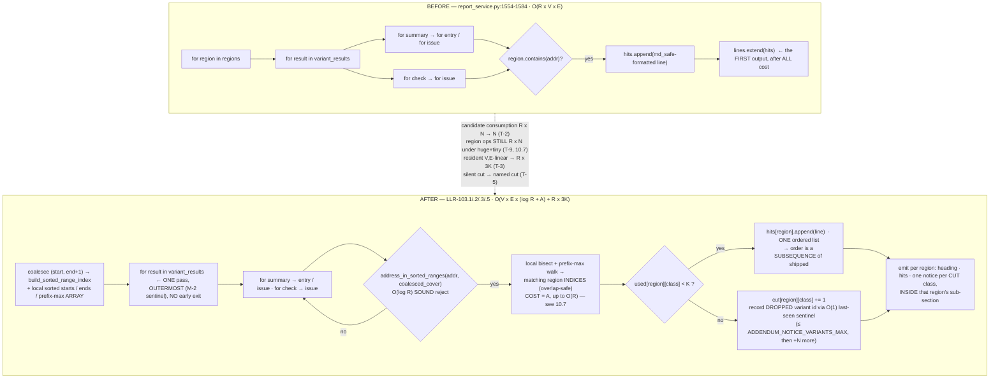

# Requirements Document — s19_app — Batch 64 — **REVISION 3**

> **Revision 3 — 2026-07-27, `iterate-to-refine` iteration 2.** Discharges the Phase-2 **RE-GATE**:
> security **OK to ship, unconditional** (6/6 CLOSED, 5 LOW/nit folded here); qa **9/9 CLOSED** + 4 new
> majors + 5 new minors; architect **9 CLOSED / 3 PARTIAL** + 1 new blocker + 4 new minors.
> **Zero design objections from any lane across two gates.** Everything folded below is confined to
> **§11 / §11.1 (the execution plan)** and to the **instrumentation** of two new nodes; nothing
> re-derives a measurement and no requirement Statement changed.
> **The blocker was `ARCH-N-1` = `QA-NEW-1` — the same finding from two lanes: §11.1's per-node
> expected-verdict table asserted RED at Inc-1 for 8 of 28 nodes that are GREEN on `082ada9`.**
> Revision 2 built that table to discharge `ARCH-B-3` and applied the mechanism only to the two nodes
> the reviewer had named, so the defect survived inside its own fix. **Revision 3 re-derives the Inc-1
> verdict for EVERY node by execution against the shipped producer** — the transcript is pasted in
> §11.1 — and states the *rule* by which each verdict follows. §17.6 is the re-gate disposition table;
> §9b gains **A-28 … A-40**. **This lane also found one defect neither re-gate lane raised**
> (§11.1 note 3: the `≥ 50 %` RED-margin rule kills `TC-483`, the one genuinely-correct RED in the
> `K-1/K/K+1` family, because a boundary node's RED is `threshold + 1` **by construction** — executed).
>
> **Revision 2 — 2026-07-27, `iterate-to-refine` iteration 1.** Discharges all **27** Phase-2 findings
> (security S1–S6, qa B-1/M-1–M-4/m-1–m-4, architect B-1–B-3/M-1–M-6/m-1–m-3). **§17 is the
> one-row-per-finding disposition table** — **25 `FOLDED`, 2 `FOLDED (narrowed)`, 0 findings rejected
> outright**, with **one named sub-part rejected in writing** (`SEC-S5` fold 2, the severity histogram
> — §17.4, §12 X-8). No finding vanishes. **§17.5 records the three review claims this lane found
> mechanically wrong**, folded anyway but with their mechanisms corrected. Revision 1 is superseded in
> place; every change is a **Before → After** row in the **§9b** amendment log (A-10 … A-27) with its
> parent re-read verdict. **6 new acceptance nodes** (`AT-200…203`, `TC-498`, `TC-499`); **2 ids retired
> in place** (`AT-195`, `TC-496`); **4 new residuals** (§10.7 … §10.10); **increments re-cut** (§11.1).
>
> **Artifact language:** English (engineering-workflow default).
> **Normative keyword:** `shall`, only inside HLR/LLR **Statement** lines. `should` never appears in a
> normative statement.
> **Tree:** `claude/batch-64-addendum-producer-bound` @ `082ada9` (== `origin/main`).
> **Provenance rule (C-39, in force):** every threshold below carries its executed RED and GREEN from
> **this** tree, with the lane and section that produced it. Nothing is inherited from batch-63.
> **Where two lanes measured the same quantity and disagree, BOTH are recorded with provenance and the
> row states which one the acceptance uses** — no averaging, no silent pick.
> **Consolidation rule (P-7):** this document supersedes
> `01-requirements-architect.md` (architect lane) and `01b-qa-catalog.md` (qa lane). Every one of the
> qa lane's **16 observable slugs** appears in §5 bound to an id **or** under an explicit
> `RETIRED — <reason>` line. Nothing vanishes.

---

## 0. BLUF

**Build the single-pass, region-indexed, self-disclosing addendum producer. Two lanes converged
independently on the same blocker, one correction kills batch-63's standing design shape, and the
requirement narrows what it claims in four places rather than over-promising.**

1. **Two-party confirmed blocker — `range_index` is boolean-only AND unsound over overlapping ranges
   (§2.6).** Both Phase-1 lanes found it independently; the orchestrator verified the same code path;
   this consolidation lane re-read `s19_app/range_index.py:62-68` a fourth time. Declared regions **do**
   overlap and there is no non-overlap constraint anywhere. The primitive is usable **only** over a
   coalesced half-open cover and **only** as a reject pre-filter. `range_index.py` is engine-frozen and
   is **not** touched.
2. **Per-class BUCKETS break byte identity below the bound (§9 A-1).** The shipped emission order
   **interleaves** modifications and change-file issues; three per-class lists concatenated emit
   `mod, mod, issue, issue` where shipped emits `mod, issue, mod, issue`. Adopted shape: **ONE ordered
   hit list per region + three admission COUNTERS**, which makes the admitted sequence a *subsequence*
   of the shipped one by construction. **batch-63's standing design shape is wrong and appears nowhere
   in this document.**
3. **Emission order is pinned by NOTHING today, so byte identity alone does not cover it (§9 A-2).**
   Executed: `grep -c "Addendum" tests/goldens/batch35/at055b-project-report.md` → **0**; `_addendum_lines`
   has **0** direct references in `tests/`. The spec therefore owes an **explicit order acceptance**
   (`TC-494`), not a reliance on the golden.
4. **REVISION 2's headline correction: the R multiplier is RELOCATED, not removed, and revision 1's
   oracle could not see it (§10.7, `TC-498`).** Two Phase-2 lanes found this independently. Under a
   `huge+tiny` geometry — one enclosing region plus `R−1` narrow ones, which is how an operator declares
   "whole calibration area + named sub-blocks" — the `LLR-103.2` attribution walk is `O(R)` per surviving
   candidate. Executed, architect lane, `E = 500`, one matching region at every `R`:

   ```
   R          =      1        8       64      256
   consumed   =    500      500      500      500     <- the ONLY oracle revision 1 had
   region ops =    500     4000    32000   128000     <- exactly R x N
   matches    =      1        1        1        1
   ```

   `500 → 128000 @ R = 256` reproduces §7 T-2's *RED* figures on the work axis. Corroborated by the
   security lane on its own fixture: **153600 comparisons for 300 candidates at `R = 512`**, **19200 at
   `R = 64`**. **Three folds, all landed:** `R-TUI-098` and `HLR-103` now claim **candidate consumption**
   independence, never total-work independence; **non-claim (e)** carries the residual with its numbers;
   and **`TC-498`** is a new region-comparison counter pinned to the `huge+tiny` geometry, so the oracle
   finally tests what its label claims. `LLR-103.2`'s structure ambiguity is resolved **in writing** in
   favour of the prefix-max **array** (§4 `LLR-103.2`), which makes the residual an accepted, disclosed
   implementation choice rather than an unnoticed one.

5. **The claim is narrowed, deliberately, in SIX places.** B-3(b) is **reduced** `R×V×E → V×E` **on the
   candidate axis only** (§10.1) and **relocated** on the work axis (§10.7). The memory-exhaustion DoS is
   **not** closed (§10.2) — with `declared_regions=()` the whole-report peak still grows ×1.68 per
   E-doubling / ×1.81 per V-doubling (architect Phase-1 §7.6d), ×1.94 per E-doubling (qa Phase-1 §4) and
   ×1.77 per E-doubling (architect Phase-2 §7) — three fixtures, three figures, none averaged. Resident
   cost stays `O(R × 3K)` with `R` uncapped (§10.3). Intra-class and cross-variant eviction is
   **disclosed, not prevented** (§10.4) — and §10.4's revision-1 wording **overstated the harm**, corrected
   by execution (§10.4, security S5). The notice names **up to `ADDENDUM_NOTICE_VARIANTS_MAX`** affected
   variants, not all of them (§10.9).

6. **`AT-197` was `AT-165` again, one axis over, and revision 2 fixes it (§7 T-5, `AT-202`).** Revision 1's
   variant predicate `{variants} ⊇ {v2,v3}` is a **representation** check. The qa lane built `FIX-H` —
   which names every variant that *contributed* to the cut class rather than every variant whose hits were
   *dropped* — and it is **GREEN on every acceptance revision 1 stated**, while telling the operator that
   `v1` (the attacker, all of whose hits were admitted) lost evidence. That inverts US-B64-2. The
   Phase-1 catalog had this boundary at `01b-qa-catalog.md:466-467`; revision 1 demoted it to prose.
   **Restored as set EQUALITY with its own id (`AT-202`), its own threshold, and `FIX-H` as its executed
   RED arm.**

7. **X-2 is CLOSED — measured twice, at the shipped surface, on the implemented shape.** Both Phase-2
   lanes measured `AT-194`'s exact form on `FIX-A` (the adopted no-early-exit arm) with fixtures built
   before `tracemalloc.start()`: qa **RED 2.265 / GREEN 0.998**; architect **RED 2.000 / GREEN 1.018**
   (3/3 reps). Both transcripts are pasted at §7 T-1. The Inc-2 re-derivation obligation is **struck**.
8. **Marginal-cost threshold: the two Phase-1 lanes measured two different quantities and this document
   picks one by evidence, not preference (§7, T-1).** ADOPTED: the marginal-delta doubling ratio at
   `E: 2000 → 4000`, **≤ 1.30**. RETIRED in writing: the 4× sweep anchored at `E = 250`, ≤ 2.5 (RED 5.54,
   GREEN 1.52) — its denominator sits inside the small-`E` anchoring artefact that **both** lanes
   measured, and accommodating that artefact is what forces the threshold up to 2.5.
   **Revision 2:** the RED figure is **fixture-specific** (`2.27` Phase-1 qa · `2.265` Phase-2 qa ·
   `2.000` Phase-2 architect) and is therefore **no longer a reproduction target**. Gates assert
   *RED strictly above the threshold on a NAMED fixture*, never a verbatim number (§7 T-1, architect M-4).
9. **Per-class early exit is RETIRED, and the architect lane's stated reason for it is corrected
   (§5.2, §12 X-1).** It is not "impossible"; qa executed it (`consumed = 200` of `E = 4000`). It is
   **forbidden by US-B64-2**. **Revision 2 strengthens the argument with the Phase-2 qa lane's
   transcript:** a real per-class early exit (`FIX-A2`) emits **no notice at all** on the flood attack
   (`notices=[]`), because it stops iterating before it reaches `v2` and `v3`. The incompatibility is
   *"cannot detect that anything was cut"*, not merely *"cannot count it"* — total, not partial.

10. **(NEW in revision 3) The design survived two gates with zero objections; the execution PLAN did
    not, twice, and for the same reason.** Revision 2's §11.1 verdict table was built to discharge
    `ARCH-B-3` — *"`AT-196` is GREEN by construction, so 'every AT fails' is unsatisfiable"* — and it
    applied that analysis **only to the two nodes the reviewer had named**. Executed against the shipped
    producer, **8 of 28 rows were wrong** and Inc-1's gate was unsatisfiable for exactly the reason
    revision 1's was. Revision 3 derives all 28 verdicts by execution and pastes the transcript (§11.1).
    **The general lesson, and the one this batch should carry to its postmortem: a fold that fixes the
    reviewer's EXAMPLES rather than the reviewer's CLASS re-plants the defect inside its own fix** —
    which is the *"partially closed"* pattern batch-63 paid for, caught here at Phase 2 rather than at
    Phase 3. The second-order form is worse: the artefact that *documents* the fix is the one that
    carries the defect forward, because it now reads as evidence.

---

## 1. Introduction

### 1.1 Purpose

Bound the resident cost of the declared-region report addendum
(`s19_app/tui/services/report_service.py:1514` `_addendum_lines`) and make its truncation
**evidentiary** rather than silent. Backlog item **D1** (`.dev-flow/BACKLOG-CODE.md:16`), specced in
batch-63, BLOCKED at that batch's Phase-2 re-gate, returned to the backlog.

### 1.2 Scope

**IN:** `_addendum_lines` — its traversal, its resident allocation, its emission order, and a new
truncation notice.

**OUT (carries; must not be pulled in):** OB-4 / sec-F4 — `_modifications_lines`
(`report_service.py:970`) and `_checklist_lines` (`:1142`), measured 988 B/entry, unbounded. D2 — the
schema-legal address `ValueError`. OB-3 — `diff_report_service` text-mode writers. OB-2 — the AT/TC
registry. The `M-2` truncation-marker claim.

### 1.3 Definitions

| Term | Definition |
|---|---|
| `R` | `len(options.declared_regions)` — operator-declared region count. **Uncapped**; see §10.3. |
| `V` | variant count = `len(variant_results)`. |
| `E` | per-variant candidate count contributed by one leaf sequence. |
| `N` | total candidate leaves consumed by ONE pass = `Σ_v [ Σ_s (\|entries\| + \|issues\|) + Σ_c \|issues\| ]`. |
| `K` | `MAX_ADDENDUM_HITS_PER_CLASS_PER_REGION` — the per-(region, class) admission cap. **NEW — created in Phase 3.** |
| hit class | one of three producing classes: `modification` (`summary.entries`), `change-file issue` (`summary.issues`), `check-file issue` (`check.issues`). All three are **document-derived**, i.e. attacker-authored (`s19_app/tui/changes/apply.py:363`, `s19_app/tui/changes/check.py:399`). |
| candidate | one leaf element examined for region membership. |
| admitted / cut | a candidate whose formatted line is stored / dropped by the per-class cap. |
| **candidate consumption** | the number of leaf elements pulled from the leaf sequences by ONE call. Measured by the injected counting iterable. The quantity `TC-488` / `TC-489` assert. |
| **region ops (`A`)** | **PINNED in revision 3** (`ARCH-N-2` / `QA-NEW-2`): the number of **`ends[i] >= addr` comparisons** performed by the downward attribution walk of `LLR-103.2`, summed over the call. **Excluded, by definition:** the `pmax[i] >= addr` loop guard, the attribution `bisect_right(starts, addr)`, and the coalesced-cover reject pre-filter's own bisect. `A` is **not** bounded by candidate consumption: it is `O(R)` per surviving candidate in the worst case (§10.7). The quantity `TC-498` asserts. **NEW in revision 2** — revision 1 had no term for it, which is why it had no oracle for it; **revision 2 had the term but not the counting convention**, and three defensible conventions give three different numbers (§7 T-9). |
| **AT** | Layer-B black-box acceptance test: drives `generate_project_report` and **reads the written report file** (or the `ReportViewerScreen` seam that renders it). An observable that can only be seen through an injected instrument is **not** an `AT` — it is a `TC` (qa M-3; `01b-qa-catalog.md:748`). |
| **TC** | Layer-A white-box functional test against the HLR/LLR mechanism, including every mechanism-only observable (candidate consumption, region ops, direct `_addendum_lines` peak). |

### 1.4 References

- `.dev-flow/2026-07-27-batch-64/PLAN.md` — 2 stories, 10 inherited findings, decision log.
- `.dev-flow/2026-07-27-batch-64/01-requirements-architect.md` — architect lane (superseded by this file).
- `.dev-flow/2026-07-27-batch-64/01b-qa-catalog.md` — qa lane, 16 observable slugs (superseded by this file).
- `.dev-flow/2026-07-26-batch-63/02-review-rescoped-architect.md:118` (B-2), `:169` (B-3), `:211` (B-4).
- `.dev-flow/2026-07-26-batch-63/02-regate-security.md:52` (F1), `:134` (F2).
- `.dev-flow/BACKLOG-CODE.md:16` (D1), `:17` (OB-4), `:18` (F4).
- `~/.claude/templates/dev-flow/req-template.md` — structure followed.
- `docs/engineering-rules.md` — C-13…C-39. Draft-time controls applied: **C-12** (output-then-consume),
  **C-15** (probe runtime identity), **C-26** (reverse census), **C-31** (input-set mutation),
  **C-35** (execute the transform over real input), **C-39** (pre-execute every executable threshold).

### 1.5 Document overview

§2 restates the system, the defect, and the two-party-confirmed blocker. §3 is `R-TUI-098` + `HLR-103`
with a first-class Acceptance block per story. §4 is `LLR-103.1…103.6`. **§5 is the slug → id binding
table plus the id ledger — the Phase-1 P-7 artefact.** §6 is dual traceability + the pre-fix
executability ledger. §7 is the threshold register with every RED/GREEN and its provenance (T-1…T-9).
§8 is the notice specification and its priced alternatives. §9 is the Phase-1 amendment log (A-1…A-9);
**§9b is the revision-2 amendment log (A-10…A-27)**; **§9c is the revision-3 RE-GATE amendment log
(A-28…A-40)**. §10 is residuals with numbers (§10.1…§10.10).
§11 is the increment cut **plus §11.1's per-node expected-verdict table — re-derived by execution in
revision 3, with its transcript and four notes**. §12 is the
unresolved-contradiction register (X-1…X-9). §13 is the evidence checklist. §14 is the diagram, §15 what
would change the recommendation, §16 the reconciliation log (three events), and **§17 is the 27-row
Phase-2 finding disposition table — the revision-2 P-7 artefact, including the one REJECTED item and the
three review claims this lane found mechanically wrong — extended by §17.6's 15-row Phase-2 RE-GATE
disposition and §17.7's "checked and could not fault" record (the revision-3 P-7 artefact).**

---

## 2. Overall description

### 2.1 Product perspective

`generate_project_report` (`report_service.py:1589`) composes the Markdown project report. When
`options.declared_regions` is non-empty (`:1719`) it appends `_addendum_lines(...)` (`:1720`). The
addendum is **evidentiary**: an operator reads it to decide whether a change landed inside a declared
calibration/critical region.

### 2.2 The defect, restated

`_addendum_lines` nests `for region → for result → for summary → for entry/issue` and builds a local
`hits: List[str]` (`:1560`), appending one **fully formatted, `md_safe`-escaped** string per matching
`(region × variant × candidate)` at `:1565` / `:1571` / `:1579`, extending `lines` only at `:1584`.
The entire cost is paid **before any output exists**, so `_ByteBudget` and every row-cap design is
structurally blind to it (this is OB-4 as restated in `BACKLOG-CODE.md:17`).

Resident cost per emitted hit, re-derived on this tree by **both** lanes over **different** fixtures —
recorded separately, **not averaged**:

| lane | measurement | figures |
|---|---|---|
| architect §7.5 (T-2) | 6-point grid, `R/V/E` swept | **86.5 – 93.2 B/hit** |
| qa §5.8 (P2b) | 3-point grid | **93.9 / 93.3 / 89.1 B/hit** |

Product law, qa §5.8 (P2a), fixture built outside the traced window: `E 500→1000` ×2.00 · `V 1→2` ×2.01
· `R 1→2` ×1.91. Pre-fix traversal `= R × N` exactly (architect §7.4; qa §3.3 `500/1000/2000/4000` at
`R = 1/2/4/8`, `E = 500`).

### 2.3 Constraints

| Constraint | Value | Source |
|---|---|---|
| Engine-frozen, must not be modified | `core.py`, `hexfile.py`, **`range_index.py`**, `validation/`, `tui/a2l.py`, `tui/mac.py`, `tui/color_policy.py` + `_ENGINE_TEST_FILES` | `tests/test_engine_unchanged.py:120`, `tests/test_tui_directionb.py:5443` and `:5458-5468` — both read, executed; `report_service.py` is in **neither** list, and **no report test** is in `_ENGINE_TEST_FILES` (qa §6) |
| Files per increment | ≤ 5 | global CLAUDE.md |
| In-domain workload | 14 calls, max `R = 2`, max hits in ONE region = **2**, max candidates = **3** | architect §7.7, executed over the real suite |
| Existing cap precedent | `MAX_REPORT_ISSUES_PER_VARIANT = 200` (`report_service.py:90`) | grep |
| Region-count cap | **NONE ANYWHERE.** Only `DECLARED_REGION_NAME_MAX = 80` on the NAME (`report_addendum.py:26`) | architect §7.2b — 5000 regions constructed with no rejection |
| Membership convention | `DeclaredRegion` is **inclusive** `[start, end]` (`report_addendum.py:15-16`, `:92-94`); `range_index` is **half-open** `[start, end)` (`range_index.py:15`) | architect §7.1.6; qa §3.1 P1a — both executed |
| Order-protection baseline | `tests/goldens/batch35/at055b-project-report.md` contains **0** occurrences of `Addendum`; `_addendum_lines` has **0** references in `tests/` | qa §2 / §3.2; architect §7.7 (`grep` exit 1) |
| **Source-AST escaper census (NEW in revision 2)** | `tests/test_report_field_census.py:353` `test_census_covers_every_escaped_expression_in_the_source` asserts **set equality** between `{(func, ast.unparse(arg0))}` extracted from `report_service.py` and the hand-maintained `_ESCAPED_EXPRESSIONS` at `:327`. Baseline **18 == 18**. A new escaper call site with a **new first-argument expression** trips `assert not new`; removing an existing one trips `assert not gone` | architect B-2, executed; **re-verified by this lane** — extraction is `(node.func.id, ast.unparse(node.args[0]))` at `:363-364`, and `("md_safe", "result.variant_id")` is **already** an entry at `:344`. See §10.10 for what that implies |
| **Column-0 static guard (NEW in revision 2)** | `tests/test_report_field_census.py:860` `test_no_escaped_field_is_emitted_at_the_head_of_its_line` walks `ast.JoinedStr` **only**, so a notice assembled by `CONST.format(...)` is **structurally invisible** to it | architect B-2 second half, executed (`head-of-line offenders = []` unchanged after the patch) |
| **Truncation appendix** | `generate_project_report:1722-1726` emits `## Truncation appendix` from a `notes` list. `> TRUNCATED:` sites at `:1383` and `:1403` feed it via `notes.append`; the site at **`:1134` (`_declaration_error_lines`) does NOT** — it returns `List[str]` with no notes channel | architect M-5; **corrected by this lane** — the convention is **2 of 3**, not universal. §10.8 |

### 2.4 Assumptions and dependencies

- **A-1.** `variant_results` and its leaf sequences are re-iterable in-memory sequences, not one-shot
  iterators. Verified by the shipped producer, which re-iterates them `R` times today (architect §7.4).
  A one-shot generator is executed-broken (qa §3.3 P2d: `R=2 E=3` → 3 hit lines where 6 are expected).
  *If this fails the batch is invalidated* — but it cannot fail, because the shipped code depends on it.
- **A-2.** `V` is **operator**-scaled (project manifest); `E` and the class mix are **attacker**-scaled
  (the change/check documents). This asymmetry is why the cap is per-(region, class) and **not**
  per-(region, class, variant) — §8.3.
- **A-3.** `md_safe` is the escaping contract for every file-derived value reaching the addendum and is
  unchanged by this batch. Executed (architect §7.8): `>` **is** in `MD_ESCAPE`, and `_normalise`
  collapses `\r\n\t` to a space, so no attacker-controlled value can reach column 0 or forge a notice
  line. **This does not make the notice safe by default** — see §2.7 / `AT-199`.

### 2.5 Source user stories

| ID | User Story | Source | DoR |
|----|------------|--------|-----|
| **US-B64-1** | As an operator generating a project report over a manifest with declared regions, I get the report without the tool consuming memory proportional to (regions × variants × entries), so a large or hostile change document cannot exhaust my machine. | backlog D1 / batch-63 re-gate | **READY** (operator, Phase 0) |
| **US-B64-2** | As an operator reading an evidentiary report, when the addendum was truncated I can see WHICH hit classes (and which variants) were cut, so I can distinguish "there is no evidence" from "the evidence did not fit". | batch-63 sec-F1 §2.5 rec 2 + inherited finding #2 | **READY** (operator, Phase 0) |

Both stories arrived through Definition of Ready and are **not re-scoped here**.

### 2.6 The blocker — TWO-PARTY CONFIRMED (three, counting the orchestrator)

`s19_app/range_index.py::address_in_sorted_ranges` inspects **exactly one** candidate interval and is
therefore unsound over overlapping ranges, and returns `bool` so it can never name **which** region.

```python
# s19_app/range_index.py:62-68  — re-read by this consolidation lane, 2026-07-27
starts, ends = index
if not starts:
    return False
candidate = bisect.bisect_right(starts, addr) - 1
if candidate < 0:
    return False
return addr < ends[candidate]
```

| party | independent evidence |
|---|---|
| **architect lane** (§7.1.4 / §7.1.5) | `address_in_sorted_ranges(0x5000, build([(0x1000,0x9000),(0x2000,0x2010)])) = False`, ground truth `True`; also `0x8fff` **WRONG**. Return value probed: `bool`. |
| **qa lane** (§3.1 P1b/P1c/P1d) | over `outer(0x1000-0x2000) ⊃ inner(0x1500-0x1600)`: `0x1800` **LOST**, `0x2000` **LOST**; equal-start nesting: `0x1900` **LOST**. `P1d`: return type `bool`, no region identity. |
| **orchestrator** | verified the same code path independently. |
| **this lane** | source re-read above; `bisect_right(starts, addr) - 1` selects one interval, so any interval with a smaller `start` and a larger `end` is never tested. |

Two further executed facts make it load-bearing rather than theoretical:

- **Declared regions DO overlap.** `DeclaredRegion.__post_init__` (`report_addendum.py:72-90`) validates
  `name` / `start >= 0` / `end >= start` only; there is **no** cross-region check. Architect §7.2
  constructed `outer / inner / dup` (two of them byte-identical) with no rejection, and the shipped
  producer emitted the single entry at `0x1550` **3 times**, once per matching region.
- **Convention mismatch.** `DeclaredRegion` is inclusive, `range_index` is half-open. Executed both
  lanes: without `end + 1`, **the end address of every declared region is a false negative**
  (architect §7.1.6: `contains(0x10FF)=True` vs `address_in_sorted_ranges(0x10FF)=False`; qa §3.1 P1a:
  `addr 0x2010 contains=True naive=False (start,end+1)=True`).
- **Exposure today is total.** All **33** `DeclaredRegion(...)` constructions in `tests/` are disjoint;
  **no test uses overlapping or nested regions** (qa §3.1). A `FIX-E`-shaped implementation — membership
  via the raw primitive over the unmerged list — **ships green** and silently drops evidence.

**Adopted design (architect `LLR-103.2`, qa "merge-then-resolve" — the same construction under two
names):** coalesce to a disjoint half-open cover `_coalesce([(r.start, r.end + 1) for r in regions])`,
use `range_index` as a sound `O(log R)` **reject pre-filter only**, and resolve region identity from a
**caller-local** `bisect` + **prefix-max-of-ends ARRAY** (the structure choice is pinned in revision 2 —
see `LLR-103.2`) inside `report_service.py`.
**`range_index.py` is engine-frozen and stays untouched** — consuming it needs no unfreeze
(`report_service.py` imports it **0** times today, architect §7.1.7).

**This construction is NOT novel in this repo — revision 2 cites the precedent it reinvents.**
`s19_app/tui/services/report_filter.py:737` already builds
`build_sorted_range_index(_merge_ranges(ranges))` over A2L+MAC `(addr, addr+extent)` spans that
**overlap freely**, with `_merge_ranges` at `report_filter.py:598`. Executed (security S4):
`_merge_ranges([(4096, 36864), (8192, 8208)]) -> [(4096, 36864)]`. `LLR-103.2` is the same
coalesce-then-index shape, and Phase 3 must read `_merge_ranges` before writing `_coalesce`.

**Soundness of the whole construction — cleared by THREE independent executions, no finding:**

| party | sweep | mismatches |
|---|---|---|
| qa Phase-1 §3.1 P1e | `0x0F00..0x2100` step 7 vs `DeclaredRegion.contains` | **0** |
| security Phase-2 §5 V1 | 9 adversarial suites + 200 randomised region sets, ~150 k addresses | **0** |
| architect Phase-2 §3 | 11 named geometries + 3 000 random geometries, **375 064** address checks | **0** |

The prefix-max walk **enumerates every** matching region, not just the nearest; the `+1`
inclusive→half-open conversion is correct at both edges; sorting the recovered indices restores the
caller's region order `LLR-103.4` requires. **The cost of that soundness is §10.7** — the walk is `O(R)`
per surviving candidate under an enclosing region, and revision 2 discloses it rather than claiming
otherwise.

### 2.7 The notice is a NEW markdown sink

The notice line is the batch's only new emitted string, and it emits file-derived text (variant ids).
Executed against a reference notice implementation (qa §3.4 P6a):

```
shipped-shape hit line  : '- modification @ 0x1000 (variant v\*\_\[x\](http:\/\/e\.example)\~\~z\~\~)'
NEW notice line         : '- _Truncated at 200 per class: modification (variants v*_[x](http://e.example)~~z~~)._'
hit line escaped?       : True
notice escaped?         : False
```

Same class as the hole batch-60 closed (linkify + `~~strike~~` in an audit record) and the same class
batch-62 spent a whole batch on. It is an **acceptance** (`AT-199` + `TC-495`), not a review note.

---

## 3. High-level requirement

### R-TUI-098 — the declared-region addendum is a bounded, self-disclosing producer

> **Requirement text (for `REQUIREMENTS.md`).** The declared-region report addendum shall consume the
> candidate set in a single pass **whose candidate consumption is independent of the declared-region
> count**, shall bound its own resident allocation independently of the per-variant candidate count and
> of the variant count, shall preserve the pre-batch-64 emission order and be byte-identical to the
> pre-batch-64 output whenever no admission cap fires, and shall disclose every cap that does fire by
> naming the cut hit class, the dropped count, and **up to `ADDENDUM_NOTICE_VARIANTS_MAX` of the
> variants whose hits were dropped, with an explicit count of the remainder**.
>
> **What this requirement deliberately does NOT claim** (executed evidence in §10):
> (a) it does **not** claim the project report's resident-memory exhaustion axis is closed —
> `_modifications_lines` (`:970`) and `_checklist_lines` (`:1142`) remain uncapped at a measured
> **988 B/entry**, and the report's baseline peak with `declared_regions=()` still grows **×1.68 per
> E-doubling / ×1.81 per V-doubling** (architect Phase-1 §7.6d), **×1.94 per E-doubling** on the qa
> lane's fixture (qa Phase-1 §4) and **×1.77 per E-doubling** on the Phase-2 architect lane's fixture —
> three fixtures, three figures, **not averaged**;
> (b) it does **not** claim traversal below one pass — the `R` multiplier is removed **from candidate
> consumption**, the `V×E` pass is not, and **per-class early exit is refused on purpose**
> (§5.2, §12 X-1);
> (c) it does **not** claim the addendum's resident cost is independent of `R` — it is `O(R × 3K)` by
> construction and `R` has no cap anywhere;
> (d) it does **not** claim intra-class or cross-variant eviction is prevented — first-`K` in
> attacker-controlled document order still decides *what is shown*; the notice makes it *visible*.
> A hit evicted from the addendum is **not** thereby removed from the report: `_declaration_error_lines`
> (`:1053-1140`) renders the same issue per variant under its own `MAX_REPORT_ISSUES_PER_VARIANT = 200`
> cap (§10.4, executed);
> **(e) — NEW in revision 2 — it does *not* claim the addendum's total WORK is independent of `R`.**
> The `R` multiplier is **relocated**, not removed: recovering region identity for a candidate that
> lies inside an enclosing declared region costs `O(R)` in the worst case. Executed on the `huge+tiny`
> geometry (one enclosing region + `R−1` narrow ones): **region ops `500 / 4000 / 32000 / 128000` at
> `R = 1 / 8 / 64 / 256` for 500 candidates producing ONE hit** (architect Phase-2 §3), and
> **153600 region ops for 300 candidates at `R = 512`**, **19200 at `R = 64`** (security Phase-2 §2).
> `19200` is bit-for-bit the figure §7 T-2 records as the defect being removed on the *candidate* axis.
> The residual is §10.7; the oracle that can falsify it is `TC-498`;
> **(f) — NEW in revision 2 — it does *not* claim the notice names ALL affected variants.** Above
> `ADDENDUM_NOTICE_VARIANTS_MAX = 8` the notice states **how many** were not named but not **which**.
> Executed (security Phase-2 §3 S2): `affected = 20` renders
> `v1, v2, v3, v4, v5, v6, v7, v8, +12 more`. For `v9…vN` the operator retains the ambiguity US-B64-2
> exists to remove. The cap itself is **required** — an uncapped list reintroduces a `V` term into the
> bound `LLR-103.3` establishes (§8.2). Residual §10.9.

- **Validation:** `inspection` (the requirement text itself) + the HLR/LLR chain below.
- **Executed verification:** `TC-497` — inspection at the merge gate that `REQUIREMENTS.md`, this
  requirement, and the PR body carry the §10 residuals **with their numbers**. **Owned by Inc-3 only**
  (architect M-3); the procedure is the explicit grep list below, not a judgement call (qa m-4).
- **Numeric pass threshold — `TC-497`'s executable half.** Each of these seven strings appears
  **verbatim ≥ 1 time** in the union of `REQUIREMENTS.md` + the PR body:

  ```
  988 B/entry        ×1.68        ×1.81        ×1.94
  19200 → 300        500 → 128000        +N more
  ```

  **`TC-497`'s inspection half** (a human verdict, recorded as such, not as a check): a named reviewer
  records **0** occurrences of a whole-report-peak closure claim and **0** occurrences of an
  R-independence claim on the *work* axis. This half is a **judgement, flagged as one** — revision 1
  presented it as a countable check with no pattern (qa m-4).

### HLR-103 — bounded, order-preserving, self-disclosing addendum production

- **Traceability:** US-B64-1, US-B64-2
- **Statement:** When `generate_project_report` renders the declared-region addendum, the system
  shall consume each candidate exactly once regardless of the declared-region count, shall admit
  at most `MAX_ADDENDUM_HITS_PER_CLASS_PER_REGION` hits per (region, hit class), shall preserve the
  pre-batch-64 line sequence exactly while no cap has fired, and shall emit, inside the sub-section of
  the region whose cap fired, one truncation notice per (region, hit class) whose cap fired, naming
  that class, the dropped count, and **up to `ADDENDUM_NOTICE_VARIANTS_MAX` of the identifiers of the
  variants whose hits were dropped, with an explicit count of the remainder**.
- **Rationale (informative):** the resident cost is paid before any output exists, so no output-side
  budget can reach it; and a bound that silently drops evidence turns an evidentiary document into a
  misleading one — the failure batch-63's `AT-165` proved a shape-check cannot detect. The Statement
  says *"consume each candidate exactly once"* rather than *"traverse … regardless of the
  declared-region count"* because the latter is **false on the work axis** (§10.7, non-claim (e)) and
  the former is exactly what `TC-488` / `TC-489` measure. **A statement must claim what its oracle
  tests.**
- **Validation:** `test`
- **Executed verification:** `pytest -q tests/test_report_addendum_bound.py` (**NEW — created in
  Phase 3**) plus `pytest -q tests/test_report_service.py -k "addendum or region"` (7 collected today —
  `pytest --collect-only`, architect Phase-1 §7.7b) plus `pytest -q tests/test_tui_report_seam.py`.
- **Numeric pass threshold:**
  - marginal-delta doubling ratio at `E: 2000 → 4000` **≤ 1.30** — GREEN **0.998** (qa Phase-2) and
    **1.018** (architect Phase-2), both on the implemented `FIX-A` shape; RED **strictly > 1.30 on the
    test's own named fixture** (observed 2.265 / 2.000 / 2.27 across three fixtures — **not** a
    reproduction target, §7 T-1);
  - candidate consumption `consumed == N` at `R ∈ {1, 8, 64}` in **both** geometries (RED
    `300/2400/19200`, GREEN `300/300/300` — §7 T-2);
  - **region ops `A == R × N`** at `R ∈ {1, 8, 64, 256}` under `huge+tiny` geometry, with `A` as defined
    at §1.3 (`ends[i] >= addr` comparisons only) — **NEW in revision 2**, §7 T-9, `TC-498`. This is a
    **disclosure counter with a recorded value**, not a pass/fail bound: it asserts the *measured* `A`
    equals the value §10.7 discloses, so the residual cannot go stale silently in either direction.
    **The bound form `A ≤ c × (N + total_hits)` was CONSIDERED AND REJECTED** — under `huge+tiny` the
    output is `R`-independent, so `N + total_hits` is fixed while `A = R × N` grows without bound in `R`
    and no constant `c` exists. A gate that cannot pass is the same defect class as one that cannot
    fail. *(**Bullet re-ordered in revision 3, `SEC-N2` / `ARCH-N-3`:** revision 2 opened this bullet in
    bold with the `c`-bound — the form the system is designed to fail — and only then disclaimed it, so
    a Phase-3 implementer skimming the "Numeric pass threshold" list, or a transcriber copying `HLR-103`
    into `REQUIREMENTS.md`, would write the failing assertion.)*;
  - byte identity **0 differing bytes**, 5/5 fixture shapes + the hostile golden (§7 T-4);
  - **0** regressions across the union regression set (§6.3).
- **Priority:** high

#### Acceptance (black-box) — US-B64-1

- **Observable outcome:** the operator generates a report over a hostile change document (candidate
  count doubled at large `E`) and the tool's **additional** memory attributable to the declared-region
  addendum stops growing with the candidate count; the addendum stops re-reading the candidate set once
  per declared region; and an untruncated report is byte-for-byte the document it was before.
- **Shipped surface:** `s19_app.tui.services.report_service.generate_project_report(...)` invoked with
  a non-empty `options.declared_regions` — the same call the TUI makes at `app.py`'s report worker, and
  the same call `tests/test_tui_report_seam.py:355-372` already drives with `"calzone,0x1000,0x10FF"`.
- **Deliverable + observation:** the report file at `<project>/reports/<UTC>-report.md` exists, is
  non-empty, and still carries the `## Addendum: declared regions` heading and its per-region
  sub-headings. The AT reads **the file**; the marginal-memory observable is taken across the same
  shipped call. **An AT that produced no file fails.**
- **Acceptance test(s):** **`AT-194`** (marginal resident cost), **`AT-196`** (byte identity + emission
  order below the bound). *(provisional-until-Phase-3, V-5.)*
- **`AT-195` is RETIRED as an id and NOT reused (revision 2, qa M-3 + C-18).** Revision 1 bound it to
  *"candidate consumption via an injected re-iterable counting sequence"*, which (i) is **not readable
  from the written report file** and therefore fails §1.3's `AT` definition, and (ii) asserts the
  **identical** predicate on the **identical** instrument as `TC-488` — one node under two ids.
  The observable is **not lost**: it lives at `TC-488` / `TC-489`, is strengthened by the new `TC-498`,
  and US-B64-1 retains **two genuinely file-observed** Layer-B nodes (`AT-194`, `AT-196`). The id is
  retired rather than re-pointed because re-pointing would bind two observables to one id — the same
  rule §5.2 applies to batch-63's `AT-164..167`.
- **Boundary catalog (QC-3):**
  - ☑ **empty** — `R ≥ 1` and `N = 0` → addendum renders `None.` per region, no notice. Also: no
    variants at all; `issue.address is None`; a 1-byte-wide region. All four executed against the
    shipped function (qa §7.6) and `FIX-A` reproduces all four exactly. → `TC-484`.
  - ☑ **boundary** — per class exactly `K-1`, `K`, `K+1` candidates in one region, plus one far-above
    (`E = 4000`). **Mandatory**: the in-domain maximum is **2** hits per region (architect §7.7), and
    executed proof that this makes an in-domain-only test set vacuous — at `E = K-1` and `E = K` the
    **shipped** function is GREEN on the bound predicate and only goes RED at `E = K+1` (qa §5.4).
    → `AT-198`, `TC-481`, `TC-482`, `TC-483`.
  - ☑ **geometry (NEW in revision 2)** — three pinned geometries, because two of them hide §10.7:
    **overlapping** (all `R` regions cover one span) → `TC-488`; **disjoint** (each covers `1/R`) →
    `TC-489`; **`huge+tiny`** (one enclosing region + `R−1` narrow ones below the hit addresses, the
    natural *"whole calibration area + named sub-blocks"* operator declaration) → **`TC-498`**, which
    counts **region ops**, not candidate consumption. Executed: candidate consumption reads `500` at
    every `R` in **all three** geometries, so revision 1 had no fixture able to distinguish them
    (architect Phase-2 §3; security Phase-2 §2).
  - ☑ **invalid** — overlapping regions where a hit lies inside the outer region beyond the inner
    region's end (§2.6) → `TC-486`. Duplicate-name / exactly-duplicated / equal-start-nested regions →
    `TC-487`.
  - ☑ **error** — `R = 0`: `_addendum_lines` is never called (`report_service.py:1719` guards it);
    asserted as a guard, not exercised as an addendum case → `TC-485`.

#### Acceptance (black-box) — US-B64-2

- **Observable outcome:** when an attacker floods one hit class in one region, the operator reading the
  generated report sees a line **inside that region's sub-section** that **names the cut class**,
  **how many hits were dropped**, and **which variants' evidence was dropped** — so "there is no
  `CHG-COLLISION` in this region" is distinguishable from "a `CHG-COLLISION` existed and did not fit".
  A class that was **not** cut is **not** named; a variant that contributed hits and lost **none** is
  **not** named; a region that lost nothing carries **no** notice; and no notice appears anywhere when
  nothing was cut.
- **Shipped surface:** the same `generate_project_report` call; the notice is read out of the written
  report file, and additionally through the `ReportViewerScreen` seam (`AT-200`).
- **Deliverable + observation:** the report file contains, inside the flooded region's sub-section,
  exactly one line per cut class matching `ADDENDUM_TRUNCATION_NOTICE_FMT`, whose `{label}` equals
  `ADDENDUM_CLASS_LABELS[<cut class>]`, whose `{dropped}` equals the count the test derives
  **independently from its own fixture**, and whose `{variants}` **set-equals** the set of variants the
  test knows lost at least one hit. **The AT quotes the constants, never their values.**
- **Notice counting is ADDENDUM-SCOPED, never report-wide (NEW in revision 2, security S3).** The
  report carries **three pre-existing `> TRUNCATED:` emitters** — `report_service.py:1134`
  (`_declaration_error_lines`, `> MAX_REPORT_ISSUES_PER_VARIANT` issues in one variant), `:1383`
  (`> REPORT_MAX_REGIONS_PER_VARIANT` modified regions), `:1403` (hexdump byte budget). Executed
  (security Phase-2 §3 S3) against **this document's own §7 T-5 fixture**:

  ```
  flood=199  addendum class total=201  v1 issues=199  :1134 fires=False  pre-existing "> TRUNCATED:" =0
  flood=200  addendum class total=202  v1 issues=200  :1134 fires=False  pre-existing "> TRUNCATED:" =0
  flood=201  addendum class total=203  v1 issues=201  :1134 fires=True   pre-existing "> TRUNCATED:" =1
  flood=400  addendum class total=402  v1 issues=400  :1134 fires=True   pre-existing "> TRUNCATED:" =1
  ```

  §7 T-5's **third transcript row is `flood = 400`** — at that row a correct implementation produces
  **two** `> TRUNCATED:` lines, one of which is not the addendum's. `:1383` and `:1403` fire on axes the
  AT fixture does not control at all. **Every notice predicate below therefore counts lines matching**

  ```
  ^> TRUNCATED: (?:modification|change-file issue|check-file issue) hits in this region were capped at
  ```

  **between the `## Addendum: declared regions` heading and the next `^## ` heading _or END-OF-FILE,
  whichever comes first_**, with the class alternation built from `ADDENDUM_CLASS_LABELS` and the prefix
  from `ADDENDUM_TRUNCATION_NOTICE_FMT` — never from a literal. `TC-499` is the positive control: a
  fixture that fires `:1134` while **no** addendum cap fires must read **0** addendum notices.
- **The `or EOF` arm is LOAD-BEARING, and an EMPTY SCOPE MUST FAIL THE TEST (NEW in revision 3,
  `QA-NEW-3` major).** Revision 2's fold defined the scope as *"…and the next `^## `"* with no EOF arm.
  **Executed on a real report from `generate_project_report`:**

  ```
  '## ' headings, in order:
      ## Variant inventory
      ## Consolidated overview
      ## Legend
      ## Variant: a
      ## Addendum: declared regions
  addendum is heading #5 of 5
  next '^## ' after it: NONE - EOF        bytes after the addendum heading: 103

  literal 'heading .. next ^## ':   scope found? False -> NO SCOPE -> reads 0 addendum notices, ALWAYS
  'heading .. next ^## OR EOF':     scope found? True  -> 5 lines
  ```

  **The addendum is the LAST `## ` section.** `## Truncation appendix` is the only section emitted after
  it, and only when `notes` is non-empty — and `notes` is populated **exclusively** by
  `_hexdump_section`, which no notice fixture in §7 T-5 drives. A literal implementation of revision 2's
  predicate therefore finds **no scope at all** and reads **0 addendum notices on every report**, making
  `AT-197`, `AT-198`, `AT-199`, `AT-201`, `AT-202`, `AT-203` **and `TC-499`** vacuously "0 notices" —
  GREEN on `AT-198`'s absence arms and RED on everything else, regardless of what the producer does.
  **This is a defect revision 2's own S3 fold planted:** revision 1's report-wide count had the security
  defect S3 named, but it did not have this one.
  **Both clauses are mandatory:** (i) *"…or end-of-file, whichever comes first"*; and (ii) the Inc-1
  harness's scope-extraction helper **shall raise / fail the test when the scope is empty or the heading
  is absent** — it must never return an empty scope that then reads as zero notices. A predicate that
  cannot distinguish *"no notice"* from *"no scope"* is not an oracle.
- **Acceptance test(s):** **`AT-197`** (the evicted-evidence notice: class · count · **exact** variant
  set), **`AT-198`** (presence/absence: class total `≤ K` → no addendum notice anywhere; `K+1` → exactly
  one), **`AT-199`** (escaping + notice-forgery negative), **`AT-200`** (the notice reaches the written
  file **and** the `ReportViewerScreen` seam), **`AT-201`** (P-6 class-level positive control: an uncut
  class is never named), **`AT-202`** (P-6 **variant**-level positive control: an uncut variant is never
  named), **`AT-203`** (region attribution at `R ≥ 2`: the notice sits under the flooded region's
  sub-section and nowhere else).
- **Why this is not `AT-165` again — REVISION 2, because revision 1's version of this paragraph was
  wrong.** batch-63's `AT-165` asserted *"every producing hit-class is represented"* and was **GREEN
  through all three attacks** while the operator-relevant `CHG-COLLISION` was evicted — it tested the
  concatenation **shape**. Revision 1 claimed `AT-197` fixed that by asserting *"the identity of what was
  lost"*, but its actual predicate was `{variants} ⊇ {v2, v3}` — a **representation** check, structurally
  `AT-165` with `variant` substituted for `class`. The Phase-2 qa lane built the arm that proves it:

  ```
  === AT-197 threshold AS WRITTEN IN REVISION 1  (flood = K) ===
    SHIP    RED    notices=[]
    FIX-A   GREEN  notices=[('change-file issue', 2, ['v2', 'v3'])]
    FIX-G   GREEN  notices=[('modification', 0, []), ('change-file issue', 2, ['v2','v3'])]
    FIX-H   GREEN  notices=[('change-file issue', 2, ['v1', 'v2', 'v3'])]   <-- v1 lost NOTHING
  ```

  `FIX-H` differs from `FIX-A` only in listing every variant that **contributed** to the cut class rather
  than every variant whose hits were **dropped**. It is GREEN on `AT-196`, on all three `AT-198` arms, on
  `AT-194`/`TC-488`/`TC-489`/`TC-481-483`/`TC-493` by construction — **the entire acceptance set of
  revision 1** — while telling the operator that `v1`, the attacker whose flood caused the eviction and
  every one of whose hits was admitted, lost evidence. **That inverts US-B64-2 for a third of the named
  variants.**
  **The fix:** `AT-197`'s variant field is now **set EQUALITY** against *the set of variants with ≥ 1
  dropped hit*, derived by the test from its own fixture; `FIX-H` is a **named RED arm**; and the
  variant-level false-positive gets its own node, **`AT-202`**, with the same first-class status
  `AT-201` has at the class level. Under-naming keeps its three RED arms (`SHIP` no notice, `FIX-C`
  `(variants ?)`, `FIX-F` no variant list — qa Phase-1 §5.11/§5.12); over-naming now has one too.
- **Boundary catalog (QC-3):**
  - ☑ **empty** — no cap fires → **no addendum notice line exists anywhere in the report** (this is also
    what makes `AT-196`'s byte identity possible). → `AT-198` arm 1.
  - ☑ **boundary** — class **total** `K-1` / `K` / `K+1` in one region. **Executed trap** (architect
    Phase-1 §7.9): a *flood* of `K-1` still truncates once another variant contributes to the same class,
    so **the predicate keys on the class TOTAL, never on the flood size**. → `AT-198`.
    Also: exactly one variant cut (no spurious list separator); a variant that contributed hits and was
    cut (must appear) → `AT-197`; a variant that contributed hits and was **not** cut (must **not**
    appear) → **`AT-202`**, RED arm `FIX-H`. *(This last row is the one revision 1 demoted to prose;
    it now carries an id, a threshold in §7 T-5 and an executed RED arm — qa B-1.)*
  - ☑ **invalid** — a variant id whose text *is* a notice line; an issue code containing `> TRUNCATED`;
    a variant id carrying `*_[x](http://e.example)~~z~~`. → `AT-199`, `TC-495`.
  - ☑ **error** — more affected variants than `ADDENDUM_NOTICE_VARIANTS_MAX` → the notice appends
    `+N more` rather than growing with `V`, on a fixture where at least one variant contributes cut hits
    **non-contiguously** (architect M-2's sentinel invariant). → `TC-490`.
  - ☑ **false-positive direction, CLASS axis (P-6 positive control)** — a class that produced hits and
    was **not** truncated must **not** appear in the notice. Executed: `FIX-G` (always names all three
    classes) is **GREEN** on six of the nine other observables and RED only here and on `TC-482`.
    → **`AT-201`** *(split out of `AT-198` arm 3 in revision 2 — qa M-4/C-18: `FIX-G` is RED on arms 1
    and 3 for two different reasons (`n=2` vs `named=[…, 'modification']`) and a single collected node
    reports only one of them).*
  - ☑ **false-positive direction, VARIANT axis (P-6 positive control)** — a variant that produced hits in
    the cut class and lost **none** must **not** appear in the notice. Executed: **`FIX-G` does NOT cover
    this** — `FIX-G` is *GREEN* on it (qa Phase-2 §1), so the class-axis control is not a substitute.
    → **`AT-202`**, RED arm `FIX-H`.
  - ☑ **region attribution (NEW in revision 2, qa M-2)** — with `R ≥ 2` and exactly one region flooded,
    the notice appears under the **flooded** region's `### ` sub-section and is **absent** from every
    other region's sub-section. Executed: arm `FIX-I` (= `FIX-A` with every notice re-emitted under the
    **first** region's sub-section) is `AT-197=GREEN AT-198a3=GREEN` while placing the notice under the
    *quiet* region — telling the operator the quiet region lost evidence and the flooded one lost none.
    **Every notice fixture in revision 1 was `R = 1` or below-bound, so nothing observed this.**
    → **`AT-203`**, RED arm `FIX-I`.

---

## 4. Low-level requirements

### LLR-103.1 — single **candidate consumption**, independent of the declared-region count

- **Traceability:** HLR-103 → US-B64-1
- **Statement:** `_addendum_lines` shall iterate `variant_results` and every leaf candidate sequence
  (`summary.entries`, `summary.issues`, `check.issues`) **exactly once per call**, with the
  declared-region loop moved **out** of the candidate traversal, so that the number of candidate
  elements consumed is independent of `len(regions)`; it shall **not** terminate that traversal
  early on cap saturation; and it shall keep `variant_results` as the **outermost** loop.
- **Validation:** `test (unit)`
- **Executed verification:** `pytest tests/test_report_addendum_bound.py -k "tc488 or tc489 or tc498"` — a
  re-iterable `list` subclass counting `__iter__` yields is substituted for each leaf sequence; `TC-498`
  additionally counts region ops `A` through the named seam below.
- **`A`'s instrument is a NAMED TEST SEAM, and `A` counts exactly one thing (NEW in revision 3 —
  `ARCH-N-2` blocking-major + `QA-NEW-2`).** Revision 2 said only *"counts region comparisons at the
  attribution call"*, which named neither the seam nor the convention. Both are pinned here, because an
  exact-equality gate on an unpinned counter is satisfied by tuning the counter until it prints
  `R × N` — the `ARCH-M-4` defect class, re-created on the new oracle.
  - **The counted quantity.** One region op = **one `ends[i] >= addr` comparison** in the downward walk.
    The `pmax[i] >= addr` loop guard, the attribution `bisect_right(starts, addr)`, and the coalesced-cover
    reject pre-filter's bisect are **excluded**. Executed, `LLR-103.2` implemented verbatim, `huge+tiny`,
    `N = 500`:

    ```
        R   A(ends only)   A(+pmax guard)   A(+both bisects)    R x N   which satisfies A == R x N
        1            500             1000               2000      500   ends-only
        8           4000             8000              10500     4000   ends-only
       64          32000            64000              68000    32000   ends-only
      256         128000           256000             261000   128000   ends-only
    ```

    **Only the `ends`-comparison convention satisfies the equality**, and it is also the only one that is
    **invariant under the reversible design note below**, which authorises Phase 3 to drop the reject
    pre-filter. Executed at `R = 256`: ends-only reads `128000` with the reject and `128000` without it;
    the `+bisect` convention reads `261000` with and `260500` without. **A counter whose value moves with
    a spec-sanctioned implementation choice cannot carry an exact-equality gate.**
  - **The seam.** `_addendum_lines` shall expose its per-call region-op count through **one named,
    test-only seam** — either a module-level `report_service._LAST_ADDENDUM_REGION_OPS: int` reset at
    entry and written at exit, or an optional keyword-only `_ops_counter: Optional[Callable[[], None]]`
    invoked once per counted comparison. Phase 3 picks one and records which in the docstring; **the
    spec's obligation is that a seam exists and is named, exactly as `TC-488`'s counting sequence is.**
    The seam does **not** exist on `082ada9`, which is why `TC-498` is `NOT EXECUTABLE PRE-FIX` (§6.2,
    §11.1) rather than expected-RED.
  - **The fixture precondition the equality rests on.** `A == R × N` is a law only when **every declared
    region's `start` lies below the probe address**, so the downward walk visits all `R` entries. Executed:
    under `huge+tiny` at `R = 256`, 256 of 256 region starts are below `0x5000`; under a counter-fixture
    with 255 regions declared *above* the probe address the walk starts at `i = 0`, visits **1** of 256
    entries and `A` reads `500`, not `128000`. **Without the precondition stated, `A == R × N` is fixture
    luck, not a law**, and the test would be pinning an accident.
- **Numeric pass threshold:** `consumed == N` for `R ∈ {1, 8, 64}` where `N` is computed by the test
  from its own fixture, **in both geometries**. Executed RED (architect Phase-1 §7.4): `300 / 2400 /
  19200` at `N = 300`. Executed GREEN on the prototype: `300 / 300 / 300`. Corroborated (qa Phase-1 §5.6,
  `E = 500`, overlapping): RED `SHIP` `500/1000/4000`, `FIX-C` `500/1000/4000`; GREEN `FIX-A`
  `500/500/500`. Re-executed by the Phase-2 qa lane: `SHIP` `[300, 2400, 19200]`, `FIX-A`
  `[300, 300, 300]`.
  **These RED figures are properties of the lanes' fixtures, NOT reproduction targets** (architect M-4).
  The gate form is: *`consumed == N` GREEN; `consumed / N ≥ R` RED, on the test's own named fixture, with
  a pasted transcript.*
  **Plus (NEW in revision 2) — the region-ops disclosure counter, `TC-498`, §7 T-9:** under `huge+tiny`
  geometry the test records region ops `A` at `R ∈ {1, 8, 64, 256}` and asserts `A == R × N` — i.e. it
  **asserts the residual §10.7 discloses**, so a future change to an output-proportional structure fails
  the test loudly and forces §10.7 to be re-read rather than silently going stale.
- **Acceptance criteria (informative):**
  - **The fixture geometry is stated in the test docstring and THREE geometries are exercised.**
    `TC-488` uses **overlapping** regions (all `R` regions cover one span); `TC-489` uses **disjoint**
    regions (each covers `1/R` of the space) and asserts `consumed == N` there **too**; `TC-498` uses
    **`huge+tiny`** (one enclosing region + `R−1` narrow ones) and asserts on **region ops**.
  - **`TC-489`'s rationale is CORRECTED in revision 2 (qa m-1).** Revision 1 called it *"a positive
    control against a stealth early exit"*. Executed refutation — a real per-class early exit
    (`FIX-A2`, `break` on the leaf loop) cannot fire until `N > R × K`:

    ```
    --- E=300  geometry=disjoint  N=300  K=200 ---
      FIX-A2  consumed R=1/8/64 -> [201, 300, 300]      consumed==N ? RED (R=1 only)
    --- E=20000 geometry=disjoint ---
      FIX-A2  consumed R=1/8/64 -> [201, 1601, 12801]   consumed==N ? RED
    >>> the exit cannot fire until N > R*K:  R=1 -> 200 · R=8 -> 1600 · R=64 -> 12800
    ```

    At the spec's own fixture scale (`N = 300` / `E = 500`) **two thirds of the disjoint control is
    dead**, and `TC-488` (overlapping) already catches `FIX-A2` at **every** `R` (`201/201/201`).
    **The stealth-early-exit claim moves onto `TC-488`, where it is executed-true at every `R`.**
    `TC-489`'s stated purpose is now, in writing: *a control that the candidate-consumption property is
    not geometry-dependent.* It has **zero** detection power for §10.7 — under disjoint geometry region
    ops read `500` at every `R` for a correct **and** an `O(R)` implementation (architect Phase-2 §3) —
    and revision 1 implied otherwise. See §12 X-3.
  - **The `+N more` sentinel invariant (architect M-2).** `variant_results` as the outermost loop is a
    **load-bearing** invariant, not an incidental choice: it is what lets the distinct-affected-variant
    remainder be counted with an `O(1)` per-(region, class) last-seen sentinel instead of an `O(V)`
    membership set — and an `O(V)` set would reintroduce `V` into the very bound `LLR-103.3` establishes.
    An implementer reorganising loops (e.g. for a §10.7 fix) breaks it silently. `TC-490` asserts it on a
    fixture where a variant contributes cut hits **non-contiguously**.
  - The fixture is **re-iterable** (inherited finding #5): the RED arm re-iterates every leaf `R` times,
    so a one-shot generator breaks the RED arm at `R ≥ 2` (executed, qa §3.3 P2d).
  - Peak memory and wall time **shall not** be used for this LLR — batch-63 measured cap-and-break vs
    cap-and-continue at `19019/19019` peak (ratio 1.00) and `1.00` vs `1.04` time (inherited finding
    #4); qa re-confirmed on this tree with `FIX-A`/`FIX-D` at `21021/21021` (qa §4, §5.8). **Only the
    counting iterable separates them.**

### LLR-103.2 — sound membership over **overlapping**, inclusive regions

- **Traceability:** HLR-103 → US-B64-1
- **Statement:** `_addendum_lines` shall decide candidate membership using
  `range_index.build_sorted_range_index` / `range_index.address_in_sorted_ranges` applied to a
  **coalesced, half-open** cover built as `_coalesce([(r.start, r.end + 1) for r in regions])`, used
  **solely as a reject pre-filter**, and shall recover the matching region identities from a
  caller-local `bisect` over a start-sorted region vector plus a **prefix-maximum-of-ends ARRAY**
  (`pmax[i] = max(ends[0..i])`, a plain `List[int]` built once per call in `O(R)`), walking `i`
  downward from `bisect_right(starts, addr) - 1` while `pmax[i] >= addr` and collecting every `i`
  whose `ends[i] >= addr`; it shall emit one line per (matching region × candidate) in the caller's
  region order, thereby reproducing today's behaviour in which a candidate inside `M` overlapping
  regions is emitted `M` times.
- **Validation:** `test (unit)`
- **Executed verification:** `pytest tests/test_report_addendum_bound.py -k "tc486 or tc487"`.
- **Numeric pass threshold:** for regions `[(0x1000,0x9000), (0x2000,0x2010)]` and address `0x5000`,
  the produced addendum lists the hit under region 0 — i.e. **1 hit, not 0**. Executed pre-state
  (architect §7.1.5): `address_in_sorted_ranges(0x5000, …) = False` while ground truth is `True`. For
  three overlapping regions containing one entry, the report emits that entry **3 times** (architect
  §7.2). RED arm named and executed by the qa lane: `FIX-E` drops exactly
  `- issue [S1I] @ 0x1800 (variant v0)` and `- issue [S3I] @ 0x2000 (variant v1)`, and adds nothing
  (qa §5.3) — **2 hits lost, 0 gained**.
- **Acceptance criteria (informative):**
  - **`range_index.py` is engine-frozen (`tests/test_engine_unchanged.py:123`) and is NOT modified.**
    Consuming it is permitted; `report_service.py` imports it **0** times today (architect §7.1.7) —
    this is a `NEW` import. The coalescing helper lives in `report_service.py`, **never** in
    `range_index.py` (qa §6).
  - The primitive is **boolean-only** (`-> bool`, executed by both lanes) and returns **no region
    identity**, so attribution must be local. It is also **incorrect on a raw overlapping range set**
    (§2.6) — the coalescing step is a **correctness** precondition, not an optimisation. Dropping it
    silently drops hits; `TC-486` is the guard that fires if a later change removes it.
  - The `+1` converts `DeclaredRegion`'s inclusive `[start, end]` to the primitive's half-open
    convention. Without it the **end address of every declared region is a false negative** (executed,
    both lanes).
  - **The in-repo precedent this LLR must read before it is written (NEW in revision 2, security S4).**
    `s19_app/tui/services/report_filter.py:737` already does
    `build_sorted_range_index(_merge_ranges(ranges))` over freely-overlapping A2L+MAC spans;
    `_merge_ranges` is at `report_filter.py:598`. `_coalesce` is the same function under a different
    name. Phase 3 **reuses or mirrors `_merge_ranges`**; it does not invent a third coalescer, and if it
    writes a local one it states in the docstring why `_merge_ranges` was not reused. *(Revision 1
    reinvented this construction without citing it — an evidence gap, not a design error.)*
  - **STRUCTURE PINNED: prefix-max ARRAY, not a segment tree (NEW in revision 2, architect m-3 +
    B-1 fold 3).** Revision 1 said only *"prefix-max-of-ends structure"*, which admits both a prefix-max
    **array** (`O(R)` build, `O(R)` worst-case enumeration) and a max-**segment-tree** (`O(R)` build,
    `O((1 + k) log R)` output-sensitive enumeration for `k` matches). They are **identical on
    correctness and differ exactly on §10.7**. The array is adopted:
    - *Simple over clever.* A `List[int]` running max plus a downward `while` is ~6 lines a reviewer can
      verify by reading; a segment tree is a new data structure inside a function whose entire purpose is
      to get simpler, and it would be the only one in `report_service.py`.
    - *The residual it accepts is bounded and operator-scoped.* `R` is operator-supplied (§2.4 A-2),
      uncapped (§10.3), and the pathological geometry costs `R` comparisons per **surviving** candidate,
      not per candidate — the coalesced-cover reject still rejects non-members in `O(log R)`.
    - *Reversible.* Swapping in an output-sensitive structure is a local change behind the same call
      signature; **§15 item 7 records what would trigger it**, and `TC-498` is the counter that would
      show the improvement.
    **Consequence, stated rather than discovered later: §10.7 is an accepted implementation choice, not
    an inherent limit of the problem.** An output-sensitive structure removes it. Revision 1 could not
    say which, because it had not chosen.
  - **Design note (informative, reversible):** the coalesced-cover reject is *subsumed for correctness*
    by the local prefix-max prune and is retained because `range_index` is the codebase's designated
    primitive for "many addresses against many ranges" (`CLAUDE.md`, Range/validation engine) and
    because the reject path is the hot path under the B-3(b) attack. It is **not load-bearing for the
    asymptotic bound**; dropping it is a spec-sanctioned, reversible Phase-3 choice if measurement shows
    the second binary search costs more than it saves. Nothing else in this spec changes if it is
    dropped **except** that the coalescing correctness precondition then moves onto the local structure,
    and `TC-486` still guards it.

### LLR-103.3 — per-(region, hit-class) admission cap, resident bound independent of V and E

- **Traceability:** HLR-103 → US-B64-1
- **Statement:** `_addendum_lines` shall maintain, per declared region, **one ordered hit list** and
  **three** independent admission counters — one per hit class — and shall append a formatted line to
  that region's list only while the candidate's class counter is
  `< MAX_ADDENDUM_HITS_PER_CLASS_PER_REGION`, so that the function's own resident allocation is at most
  `len(regions) × 3 × MAX_ADDENDUM_HITS_PER_CLASS_PER_REGION` hit lines plus `len(regions) × 3` notice
  lines plus `len(regions) × 3 × ADDENDUM_NOTICE_VARIANTS_MAX` variant identifiers plus
  `len(regions) × 3` integer counters and `len(regions) × 3` last-seen variant sentinels, independent of
  the per-variant candidate count and of the variant count.
- **Validation:** `test (unit)` + `analysis`
- **Executed verification:** `pytest tests/test_report_addendum_bound.py -k "tc481 or tc482 or tc483 or tc484 or tc485 or tc493"`;
  the analysis is the executed E-axis sweep of §7 T-3.
- **Numeric pass threshold:** direct `_addendum_lines` peak ratio per `E`-doubling at `R=1, V=1`
  **≤ 1.25** — executed GREEN `×1.02, ×1.00, ×1.00` (architect §7.6a) and `1.00` (qa §5.8); executed RED
  `×1.98, ×2.00, ×2.00` (architect) and `1.98` / `1.96` (qa `SHIP` / `FIX-C`). Rendered hit lines of one
  class under one region `≤ K` at every `E` (RED: `SHIP` renders 201 at `E=K+1` and 4000 at `E=4000`).
  Emitted-line count `≤ 2 + R × (1 + 3K + 3 + 1)` at any `E`.
- **Acceptance criteria (informative):**
  - **ONE ordered list per region, not three per-class lists.** Executed counter-example (architect
    §7.3/§7.5, qa §3.2/§5.1): the shipped order **interleaves** `modification` and `change-file issue`
    lines, so a per-class concatenation emits `mod, mod, issue, issue` where shipped emits
    `mod, issue, mod, issue` and `LLR-103.4` fails (`FIX-B` RED at byte index 3).
    **This corrects batch-63's standing design shape.**
  - The admitted sequence is a **subsequence** of the shipped sequence by construction, which is what
    makes `LLR-103.4` provable rather than asserted.
  - `K = 200`, matching `MAX_REPORT_ISSUES_PER_VARIANT = 200` (`report_service.py:90`). In-domain max
    hits per region is **2** (architect §7.7) → 100× margin, which is exactly why `LLR-103.4`'s and
    `AT-198`'s boundary fixtures at `K-1 / K / K+1` are mandatory and not optional.
  - **Bounding the OUTPUT is not bounding the PRODUCER.** `FIX-C` (`hits[:CAP]`) is GREEN on byte
    identity and RED here at `1.96` (qa §5.8). This is the discriminator that a row-cap design fails.
  - **The `V`-independence of this bound rests on `LLR-103.1`'s variant-major invariant (NEW in
    revision 2, architect M-2).** `ADDENDUM_NOTICE_VARIANTS_MAX` bounds the *named* identifiers, but the
    `+N more` remainder is the count of **distinct** affected variants — computing it by membership
    against all variants seen is `O(V)` per (region, class) and puts `V` straight back into the bound.
    It is `O(1)` **only because** `for result in variant_results` is the outermost loop, so a per-(region,
    class) `last_cut_variant` sentinel is sufficient. That invariant is load-bearing and revision 1 never
    stated it. It is now in `LLR-103.1`'s Statement and asserted by `TC-490`.

### LLR-103.4 — byte identity **and emission order** below the bound

- **Traceability:** HLR-103 → US-B64-1
- **Statement:** While no admission counter has reached `MAX_ADDENDUM_HITS_PER_CLASS_PER_REGION` for
  any (region, hit class), the report bytes produced by `generate_project_report` shall be identical,
  under `tests/conftest.py::canonical_report_bytes`, to the bytes produced by the pre-batch-64 producer
  over the same inputs; and within one region the emitted hit sequence shall be
  `for result → for summary → (that summary's entry hits, then that summary's issue hits) → after all
  of that result's summaries, that result's check-result issue hits`, with region sub-sections in the
  caller's region order.
- **Validation:** `test (integration)`
- **Executed verification:** `pytest tests/test_report_addendum_bound.py -k "tc491 or tc494"`, comparing
  against a golden captured at **Inc-1** from the SHIPPED producer (C-12: output produced first,
  consumed after) via `canonical_report_bytes(raw, run_root)` (`tests/conftest.py:970`).
- **Numeric pass threshold:** **byte equality**, 0 differing bytes, over 5 fixture shapes
  `(R,V,E) = (1,1,1) · (3,2,5) · (2,3,66) · (1,1,0) · (1,1,200)` — executed **IDENTICAL = True,
  5/5** (architect Phase-1 §7.5) — **plus** the hostile below-bound golden `FIX-GOLD` (overlapping +
  nested + empty + inclusive-edge, 2 variants, ≥ 2 summaries, check results), executed `SHIP` GREEN /
  `FIX-A` GREEN / `FIX-B` **RED** / `FIX-C` GREEN / `FIX-D` GREEN / `FIX-E` **RED** / `FIX-F` GREEN /
  `FIX-G` **RED** / `FIX-H` GREEN. **Plus** an explicit expected-sequence assertion (`TC-494`) over the
  interleaved shipped order.
  **The first-diff INDICES are illustrative, not thresholds (NEW in revision 2, qa m-3).** Two lanes
  rebuilding `FIX-GOLD` independently measured `FIX-B` @3/@7, `FIX-E` @5/@4, `FIX-G` @10/@10. The
  *direction* reproduces perfectly in both; the index is a property of the exact fixture. **No test
  asserts on a first-diff index**, and Inc-1 re-derives the indices from the committed golden rather than
  copying either lane's.
- **Acceptance criteria (informative):**
  - **batch-63 DROPPED this (its D-2) and it was the only observable both of its Phase-1 lanes
    independently converged on.** It is restored here as a required acceptance.
  - **Order is pinned by NOTHING today, so the golden alone does not cover it.** Executed:
    `grep -c "Addendum" tests/goldens/batch35/at055b-project-report.md` → **0** (qa §2), and
    `_addendum_lines` has **ZERO** direct references in `tests/` (architect §7.7, `grep` exit 1). The
    byte-identity arm therefore needs a **new** golden that actually contains an addendum, **and** a
    separate order assertion whose failure report names the position rather than an opaque byte offset.
  - **The `(1,1,200)` shape uses a LITERAL `E = 200`, deliberately NOT derived from `K` (NEW in
    revision 2, architect M-1).** Revision 1 wrote it `(1,1,200 == K)` and described it as *"sits exactly
    at `K`"*, which reads as `E := K`. That directly contradicts `TC-492`'s `K → 37` mutation: with
    `E := K`, re-valuing `K` to 37 changes the document the golden was captured from and `TC-491` goes
    **RED** — the mutation and the golden cannot both be satisfied. Resolution: **all five golden shapes
    use literal `E`**; `200` is chosen *because* it coincides with the default `K`, so the shape still
    exercises the exactly-at-`K` boundary (the cap fires only when a candidate is *rejected*, i.e. at
    `K+1`), and it stays a fixed document under any `K`. `TC-492`'s mutation is correspondingly scoped
    to the `K`-derived nodes (`TC-481/482/483`, `AT-197`, `AT-198`, `AT-201`, `AT-202`), **not** to "the
    suite".
  - **`TC-494`'s fixture pins `S ≥ 2` (NEW in revision 2, architect m-1).** §0 item 2 and §9 A-1 rest on
    the shipped order *interleaving* `mod, issue, mod, issue`. Executed: that holds only for `S ≥ 2` or
    `V ≥ 2`; **at `S = V = 1` the shipped order is class-grouped** (all `E` modifications, then all `E`
    change-file issues) — confirmed directly against `report_service.py:1554-1583`, where entries and
    issues are drained per *summary*. A `TC-494` written on an `S = 1` fixture is **GREEN on `FIX-B`**,
    the per-class-bucket mutant it exists to kill, and is therefore vacuous. `S ≥ 2` is a fixture
    **precondition stated in the requirement**, not only in a lane artefact, and `FIX-GOLD` carries
    `S ≥ 2` for the same reason.
  - **Sequencing hazard (both lanes, independently):** the golden must be captured on `082ada9` and
    committed in Inc-1, **before** the producer is touched. A golden regenerated after the fix certifies
    the fix against itself.
  - `tests/goldens/batch35/at055b-project-report.md` **must not change**. If it does, an addendum change
    leaked into a document that has no addendum — a defect, not a re-baseline (qa §10).

### LLR-103.5 — the truncation notice names the cut class, the count, and the variants

- **Traceability:** HLR-103 → US-B64-2
- **Statement:** For each (region, hit class) whose admission counter reached
  `MAX_ADDENDUM_HITS_PER_CLASS_PER_REGION`, `_addendum_lines` shall emit exactly one line, formatted
  from `ADDENDUM_TRUNCATION_NOTICE_FMT`, **inside that region's own sub-section**, immediately after
  that region's hit list and before the region's trailing blank line, stating that class's
  `ADDENDUM_CLASS_LABELS` label, the cap value, the number of dropped hits, and the
  **`md_safe`-escaped** identifiers of **exactly those variants that contributed at least one DROPPED
  hit — never a variant all of whose hits were admitted** — in first-drop traversal order, truncated at
  `ADDENDUM_NOTICE_VARIANTS_MAX` identifiers with an explicit `+N more` remainder naming the count of
  the unnamed distinct affected variants; where a hit class in that region did **not** reach the cap,
  `_addendum_lines` shall not name that class; where a region's counters did not reach the cap,
  `_addendum_lines` shall emit no notice inside that region's sub-section; and where no counter in the
  whole report reached the cap, `_addendum_lines` shall emit no notice line at all.
- **Validation:** `test (integration)`
- **Executed verification:** `pytest tests/test_report_addendum_bound.py -k "at197 or at198 or at199 or at201 or at202 or at203 or tc490 or tc495 or tc499"`
  plus `pytest tests/test_tui_report_seam.py -k at200`.
- **Numeric pass threshold:** under the batch-63 A2/A3 attack (one variant `v1` floods
  `CHG-ADDRESS-SYNTAX`; variants `v2`,`v3` each carry one ERROR `CHG-COLLISION`; `v1` also contributes 3
  **uncut** modifications), at `flood = K` the written report contains, **within the addendum section
  and inside the flooded region's sub-section**, **exactly 1** notice line for the `change-file issue`
  class, its dropped count equals **2** (derived by the test from its fixture), and its parsed variant
  list **set-EQUALS `{v2, v3}`** — derived by the test as *the set of variants with ≥ 1 dropped hit*,
  **not** as *the set of variants contributing to the class*. Executed RED arms: `SHIP` (no notice),
  `FIX-C` (`(variants ?)`), `FIX-F` (no variant list), **`FIX-H`** (names `['v1','v2','v3']` — over-naming;
  see §7 T-5), **`FIX-I`** (notice filed under the wrong region — `AT-203`), `FIX-A2` (no notice at all).
  **The zero-notice arm is keyed on the class TOTAL, not on the flood size** — executed, `flood = K-1`
  still emits **1** notice line because `199 flood + 1 (v2 collision) = K` admitted and `v3`'s collision
  is the `K+1`-th candidate. The correct predicate: *total candidates of that class in that region*
  `≤ K` → **0** addendum notice lines anywhere; `= K+1` → **exactly 1**.
  **Escaping threshold — RESTATED in revision 2 (qa M-1).** Revision 1 required *"a benign variant id
  renders with **0** escape artefacts"*. Executed refutation (`md_safe` at `limit=REPORT_CELL_CHARS`):

  ```
  md_safe('v1')        -> 'v1'            artefact-free? True
  md_safe('variant_a') -> 'variant\_a'    artefact-free? False
  md_safe('v-2.1')     -> 'v-2\.1'        artefact-free? False
  md_safe('cal zone')  -> 'cal zone'      artefact-free? True
  ```

  `_` and `.` are in `MD_ESCAPE`, so the threshold is satisfied or violated **purely by the unpinned
  choice of "benign" id** — vacuous on `v1`, false-failing a *correct* implementation on `variant_a`.
  The repo already documents the behaviour (`tests/test_report_service.py`, beside
  `assert "empty\\_zone" in addendum`). **The invariant that actually matters, and that cannot
  false-fail, is: for the SAME variant id, the notice's rendering equals the neighbouring hit line's
  rendering, byte for byte** — hostile ids escape in both, benign ids escape in both, and neither is
  privileged. `TC-495` asserts that equality over an id set spanning `[A-Za-z0-9-]`, `_`, `.`, and the
  full hostile string `*_[x](http://e.example)~~z~~`.
  **`TC-495` is one third of the escaping story, and revision 3 says so in one clause** (qa re-gate §8,
  raised as an observation rather than a finding). The equality *notice-rendering == hit-line-rendering*
  is also satisfied by an implementation that escapes **neither** side. What forbids that is the
  **pair**: `AT-199` (a hostile id cannot forge a notice line — independently re-executed and cleared by
  the security lane) plus `AT-196`'s byte identity, which pins the **hit-line** side to the shipped
  escaped form. **`TC-495` + `AT-199` + `AT-196` is sufficient; `TC-495` alone is not.**
  **Provenance correction:** revision 1 attributed the "0 escape artefacts" threshold to
  *"qa §5.14 negative direction"*. `01b-qa-catalog.md:496-497` states the negative direction as a
  **requirement** and gives no transcript; its only `Executed:` line points at §3.4, the **hostile**
  direction. The attribution is **struck** — it was an inherited claim presented as an executed one,
  which is precisely what the C-39 preamble forbids.
- **Acceptance criteria (informative):**
  - The AT **quotes the constants** `MAX_ADDENDUM_HITS_PER_CLASS_PER_REGION`, `ADDENDUM_CLASS_LABELS`,
    `ADDENDUM_TRUNCATION_NOTICE_FMT` — never the literal `200` and never the literal notice text.
    Boundary fixtures derive `E` as `K-1` / `K` / `K+1` from the imported constant.
  - **The dropped count and the affected-variant list are why `LLR-103.1` forbids early exit.** A
    traversal that stops when the buckets fill cannot count what it did not look at. This is the
    US-B64-2-over-optimisation trade recorded at §12 X-1.
  - The notice **discloses** residuals it does not close: intra-class and cross-variant eviction in
    attacker-controlled document order still decide *what is shown* (§10.4); above
    `ADDENDUM_NOTICE_VARIANTS_MAX` it states how many variants were unnamed, not which (§10.9); and it
    does **not** name the **severity** of what was dropped (§10.4, §8.2 — priced and rejected in writing,
    §12 X-8).
  - **The notice must reach the file — RATIONALE CORRECTED in revision 3 (`QA-NEW-6`).**
    **`AT-200`** is retained and its *direction* is right, but the mechanism revision 2 stated is
    **executed-false**, and the qa lane flagged it as **its own `QA-M-3` claim copied verbatim into the
    spec** — an inherited claim presented as an executed one, which is exactly what the C-39 preamble
    forbids and what §17.5 exists to catch. Executed on `082ada9`:

    ```
    def emit(batch: Sequence[str]) -> None:
        lines.extend(batch)
        budget.consume(_line_bytes(batch))

    'fits' referenced inside emit()?                      False
    budget.fits( call sites in generate_project_report:   NONE
    emit is a closure local to generate_project_report:   True
    ```

    `emit()` **unconditionally** extends `lines` and merely *accounts* bytes; the only `budget.fits`
    gate in the module is inside `_hexdump_section`. So there is **no `emit()` byte-budget hole to
    close**, and the RED arm revision 2 stated (*"an `emit()` path that drops it"*) is **not
    constructible from a test** without editing production code, because `emit` is a closure.
    **The corrected justification:** `AT-200` is the **only Layer-B node that observes the notice
    through the written file *and* the `ReportViewerScreen` seam** — i.e. the only node that certifies
    US-B64-2's *delivery* rather than its *production*. It also **guards a hole the batch-63
    `_ByteBudget` carry would open** if a future batch adds a `budget.fits` gate to `emit()` — which is
    honest and forward-looking rather than a claim about today's code.
    **Its falsifiability is carried by RED→GREEN across the Inc-1/Inc-2 boundary** (pre-fix: no notice
    exists at all), **not by a mutant arm** — §11.1's row says so. *(Revision 1 carried this as
    `TC-496`; revision 2 promoted it to a Layer-B `AT`, correctly, on the Layer-B grounds above — qa
    M-3.)*
  - **A sub-section split must key on the `md_safe`-ESCAPED region name (NEW in revision 3,
    `QA-NEW-7`).** `AT-203` (and any node that reads *"inside region X's `### ` sub-section"*) splits the
    addendum on a `### ` heading — and `_addendum_lines` renders that heading through
    `md_safe(region.name, limit=DECLARED_REGION_NAME_MAX)`. Executed:

    ```
    DeclaredRegion(name='B_quiet') renders '### B\_quiet (0x1000-0x1FFF)'   split on '### B_quiet ' finds it? False
    DeclaredRegion(name='A_flood') renders '### A\_flood (0x1000-0x1FFF)'   split on '### A_flood ' finds it? False
    DeclaredRegion(name='Bquiet')  renders '### Bquiet (0x1000-0x1FFF)'     split on '### Bquiet '  finds it? True
    DeclaredRegion(name='cal zone')renders '### cal zone (0x1000-0x1FFF)'   split on '### cal zone 'finds it? True
    ```

    A test that splits on the **raw** name finds no sub-section, and the *"absent from every other
    region's sub-section"* half then passes **vacuously**. **Required, either form:** the fixture's
    region names are drawn from `[A-Za-z0-9 ]` so the split is unambiguous, **or** the test derives the
    heading through `md_safe`. **And in both cases the test shall assert both sub-sections were FOUND
    before asserting anything about their contents.**
  - **The escaping expression is PINNED, and it is deliberately the one already censused (NEW in
    revision 2, architect B-2 + this lane's correction).** The variant identifiers recorded for the
    notice shall be escaped by `md_safe(result.variant_id, limit=REPORT_CELL_CHARS)` **at the recording
    site inside the traversal**, not by escaping a locally-rebound name later.
    `tests/test_report_field_census.py:353` keys its census on `(func_id, ast.unparse(node.args[0]))`
    (`:363-364`), and `("md_safe", "result.variant_id")` is **already** an entry at `:344`
    (*"planted (variant_id, 7 sites)"*). Escaping `result.variant_id` in place therefore adds **no new
    census key**; escaping a local (`vid = result.variant_id; md_safe(vid, …)`) adds
    `("md_safe", "vid")` and trips `assert not new`. **The spec pins the form so the guard's verdict is
    a decision, not an accident** — and Inc-2 owns the census file anyway as the contingency (§11, §10.10).
  - **The notice is built by `CONST.format(...)`, which places it OUTSIDE the column-0 static guard.**
    `test_no_escaped_field_is_emitted_at_the_head_of_its_line` (`tests/test_report_field_census.py:860`)
    walks `ast.JoinedStr` only, so an f-string-free notice is structurally invisible to it (executed:
    `head-of-line offenders = []`, unchanged after a patch that adds the notice). What defuses column 0
    here is the **literal `> ` prefix** inside `ADDENDUM_TRUNCATION_NOTICE_FMT`, plus `_normalise`'s
    collapse of `\r\n\t`. **Both facts are recorded here so a later edit that drops the `> ` prefix knows
    it is removing the only guard.** The Inc-2 `PLANTED` obligation (§11) is what proves the new sink
    inert *at the reader*, through markdown-it, rather than merely escaped at the writer.

### LLR-103.6 — the cap, the class labels, and the notice format are module constants

- **Traceability:** HLR-103 → US-B64-1, US-B64-2
- **Statement:** `report_service` shall define `MAX_ADDENDUM_HITS_PER_CLASS_PER_REGION`,
  `ADDENDUM_CLASS_LABELS`, `ADDENDUM_NOTICE_VARIANTS_MAX`, and `ADDENDUM_TRUNCATION_NOTICE_FMT` as
  module-level constants, and `_addendum_lines` shall read each cap and each label from the constant at
  call time rather than from an inline literal.
- **Validation:** `test (unit)` + `inspection` — **changed from `inspection` alone in revision 2**
  (qa m-4): the `K → 37` mutation had no runnable node and no named command, so it was an assertion
  about a test run that nothing performed.
- **Executed verification:**
  - inspection half — `rg -n "MAX_ADDENDUM_HITS_PER_CLASS_PER_REGION|ADDENDUM_CLASS_LABELS|ADDENDUM_TRUNCATION_NOTICE_FMT|ADDENDUM_NOTICE_VARIANTS_MAX" s19_app/ tests/`
    — **executed pre-state on this tree: 0 hits**, so all four are flagged **`NEW — created in Phase 3`**;
  - test half — `pytest -q tests/test_report_addendum_bound.py -k "tc492"`, a node that applies
    `monkeypatch.setattr(report_service, "MAX_ADDENDUM_HITS_PER_CLASS_PER_REGION", 37)` and re-drives the
    `K`-derived nodes in-process.
- **Numeric pass threshold:** post-change, `≥ 1` definition site in
  `s19_app/tui/services/report_service.py` and `≥ 1` import site in
  `tests/test_report_addendum_bound.py`; **0** occurrences of the bare literal `200` inside
  `_addendum_lines`'s body; and under `K = 37` the **`K`-derived nodes** — `TC-481`, `TC-482`, `TC-483`,
  `AT-197`, `AT-198`, `AT-201`, `AT-202` — stay green with their fixtures re-derived from the patched
  constant. **Scope correction (architect M-1):** the mutation is **NOT** applied to "the suite";
  `TC-491`/`AT-196`'s golden shapes use **literal** `E` by `LLR-103.4`'s pin and are excluded by
  construction, and applying the mutation to them would false-fail a correct implementation.
- **Executability flag (C-39 honesty, qa m-2):** `TC-492` is **NOT EXECUTABLE PRE-FIX** — its subject
  (the four constants) does not exist on `082ada9`. It is authored at Inc-1 as `xfail(strict=True)` and
  its first real verdict is Inc-2. It carries **no** RED/GREEN in §7 and must not be covered by a blanket
  ✓ in §13. The same flag applies to `TC-490` (`ADDENDUM_NOTICE_VARIANTS_MAX` does not exist yet) and to
  `TC-495`'s notice-vs-hit-line equality (there is no notice to compare against pre-fix).
- **Acceptance criteria (informative):**
  - Placement is `report_service.py`, beside `MAX_REPORT_ISSUES_PER_VARIANT` (`:90`), not
    `report_addendum.py`: the caps that govern report composition already live in one place, and this
    keeps the source increment at ONE file. `report_addendum.py` stays the *domain object* module.
  - **Name:** `MAX_ADDENDUM_HITS_PER_CLASS_PER_REGION` (architect lane). The qa lane's working name
    `MAX_ADDENDUM_HITS_PER_REGION_CLASS` names the same constant and is **not** used — one constant,
    one name.
  - "An AT quotes the constant, never its value" is the batch-63 rule this discharges.

---

## 5. Slug → id binding (P-7 artefact)

**Source:** `01b-qa-catalog.md` §9, 16 slugs. **Every row is bound to a live id or explicitly retired.**
Where a row folds a second lane's phrasing, the fold is stated in the row.

### 5.1 Binding table

| # | qa slug | bound id(s) | fold / notes |
|---|---|---|---|
| 1 | `OBS-below-bound-byte-identity` | **`AT-196`** · **`TC-491`** | Same observable as the architect lane's "byte identity below the bound" (`LLR-103.4`). **ONE id.** The qa lane's hostile `FIX-GOLD` fixture is folded into the golden **in addition to** the architect lane's 5 shapes — both fixture sets ship. Golden home: `tests/goldens/batch64/addendum-below-bound.md` (qa §6 path adopted, §12 X-4). |
| 2 | `OBS-emission-order-interleaved` | **`TC-494`** (under `AT-196`) | **Architect lane had no id for this.** Correction #2: order is pinned by nothing today, so byte identity does not cover it. White-box explicit expected sequence (qa §3.2's 7-line dump), because a golden diff reports order as an opaque byte offset. Folded under `LLR-103.4`, whose **Statement is amended** to carry the order clause (§9 A-2). |
| 3 | `OBS-overlap-membership-preserved` | **`TC-486`** (+ **`TC-487`** for duplicate / equal-start-nested) · **black-box via `AT-196`** | Same observable as `LLR-103.2`'s threshold. The qa lane's named lost hits (`0x1800`, `0x2000`) become `TC-486`'s expected values, replacing the architect lane's generic "1 hit, not 0". **Revision 2 adds the `AT-196` binding** (qa M-3, cosmetic): the catalog classed this black-box-through-the-file and it **is** covered there — `FIX-GOLD` carries `outer ⊃ inner` and `FIX-E` goes RED on it — but revision 1's row did not say so. |
| 4 | `OBS-hits-bounded-per-region-class` | **`TC-481`** (`K-1`) · **`TC-482`** (`K`) · **`TC-483`** (`K+1` + far-above `4000` + line-count bound) · surfaced black-box by **`AT-198`** | qa's C-31 point (shipped is GREEN at `K-1` and `K`, RED only at `K+1`) is the *reason* the three boundary TCs are mandatory; recorded in `AT-198`'s boundary catalog. |
| 5 | `OBS-interior-no-marker` | **`TC-482`** + **`AT-198`** arm 2 | The conjunction *count == K **and** no notice*. Kept as its own assertion because `FIX-G` is GREEN on slug #4 at every `E` and only the conjunction sees it (qa §5.5). |
| 6 | `OBS-traversal-R-multiplier-gone` | **`TC-488`** (overlapping) · **`TC-489`** (disjoint geometry control) · **`TC-498`** (**NEW** — region ops under `huge+tiny`) | Same observable as `LLR-103.1`. **`AT-195` is RETIRED (§5.2)** — mechanism-only observables are white-box and are **never** counted as Layer B (`01b-qa-catalog.md:748`), and `AT-195` duplicated `TC-488`'s predicate on the same instrument (C-18). **Revision 2 SPLITS the slug into its two real axes:** candidate consumption (`TC-488`/`TC-489`, threshold `consumed == N`) and **region ops** (`TC-498`, `A == R × N` under `huge+tiny`). Revision 1 had a single id for both and an oracle for only one, which is why §10.7 went unnoticed. `TC-489`'s rationale corrected per qa m-1. |
| 7 | `OBS-traversal-early-exit` (conditional) | **RETIRED — see §5.2. Retirement UPHELD by the Phase-2 qa lane with stronger evidence than revision 1 gave for it.** | qa §5.7 sanctioned exactly two dispositions ("bound **or** explicitly retired with the requirement's reason recorded"). This is the retirement, with its reason. The observable is **not lost**: it is caught by `TC-488` (`consumed == N`, overlapping) at **every** `R` — `FIX-A2` reads `201/201/201`. **Revision 2 moves the stealth-early-exit claim OFF `TC-489`**, whose disjoint arm only detects it at `R = 1` at this fixture scale (qa m-1). Executed evidence retained and strengthened: see §5.2. |
| 8 | `OBS-addendum-peak-flat-in-E` | **`TC-493`** | **Architect lane cited this threshold under `LLR-103.3` but allocated no TC** (`TC-481…485` are the boundary/negative arms). Now bound. Threshold reconciliation in §7 T-3 — both lanes measured the **same** quantity and their proposed thresholds (1.25 / 1.30) both sit inside the same executed gap `(1.02, 1.96)`. |
| 9 | `OBS-marginal-cost-flat` | **`AT-194`** | Same observable as the architect lane's `AT-194`. **ONE id.** The two lanes measured **different quantities** on this surface; §7 T-1 adopts the qa form and retires the architect form **in writing**. |
| 10 | `OBS-cap-constant-quoted` | **`TC-492`** | Same as `LLR-103.6`. **ONE id.** qa's executed-mutation form (re-value the constant to `37`, suite must stay green) is folded into `TC-492`'s threshold — the architect lane only had a grep count. |
| 11 | `OBS-notice-names-cut-classes` | **`AT-197`** (facet 1 of the triple) | Folded with #12 into `AT-197`, which asserts the whole `(class, dropped-count, variant-set)` triple. RED arms for this facet: `SHIP` (no notice), `FIX-C` (`(variants ?)`), `FIX-A2` (no notice at all). |
| 12 | `OBS-notice-names-cut-variants` | **`AT-197`** (facet 2 — now **set EQUALITY**) · **`AT-202`** (**NEW** — the variant-axis P-6 control) | **Revision 2 is a repair of revision 1's weakening.** Revision 1 stated the facet as `{variants} ⊇ {cut}` — a representation check — and demoted the catalog's explicit false-positive boundary (`01b-qa-catalog.md:466-467`, *"a variant that contributed hits and was not cut (must not appear)"*) to prose with **no threshold, no id and no RED arm**. `FIX-H` is GREEN on the entire revision-1 acceptance set while inverting US-B64-2 for the attacker variant. **Now: set equality in `AT-197`, `FIX-H` a named RED arm, and a first-class node `AT-202` for the over-naming direction.** RED arms for the under-naming direction retained: `FIX-F` (names classes only), `SHIP` (dropped-count facet). |
| 13 | `OBS-notice-absent-for-uncut-class` | **`AT-201`** (**NEW id** — was `AT-198` arm 3) | **The class-axis P-6 positive control.** Split to its own id in revision 2 (qa M-4 / C-18): revision 1's own row argued it is *"distinct from `AT-198` arms 1–2"* and then bound it to the same id, and `FIX-G` is RED on arms 1 and 3 for **two different reasons** (`n=2` vs `named=[…,'modification']`) which one collected node cannot report separately. RED arm `FIX-G`, GREEN on **six of the nine** other observables (qa §5.13) — and **GREEN on `AT-202`**, which is why the class control is not a substitute for the variant control. |
| 14 | `OBS-notice-escapes-file-derived-text` | **`AT-199`** · **`TC-495`** | Folded with the architect lane's "notice-forgery negative" (`AT-199`): same surface, two directions. `AT-199` = hostile input cannot forge a notice line (architect §7.8: `>` is in `MD_ESCAPE`, `\r\n\t` collapsed — **independently re-executed and cleared with no finding** by the Phase-2 security lane, §5 V2). `TC-495` = **the notice's rendering of a value equals the neighbouring hit line's rendering of the same value**, over `[A-Za-z0-9-]`, `_`, `.` and the full hostile id. **Revision 2 replaces revision 1's "benign → 0 escape artefacts" threshold**, which false-fails a correct implementation on `variant_a` (qa M-1, security §7 non-gating note — **two lanes, same finding**). |
| 15 | `OBS-notice-reaches-the-file` | **`AT-200`** (**PROMOTED** from `TC-496`) | **Revision 2 promotion (qa M-3).** The catalog classed this black-box through the file **and** the TUI seam (§5.15, §9); revision 1 demoted it to a `TC`, which under §6.3's wording stopped it counting toward US-B64-2's Layer-B obligation — even though it is the **only** node that observes the notice through the written file **and** the `ReportViewerScreen` seam, i.e. the only node certifying US-B64-2's **delivery** (C-31). Extends `tests/test_tui_report_seam.py` beside the declared-region drive at `:355-372`. **`TC-496` is retired as an id, not reused** (§5.2). **Justification corrected in revision 3 (`QA-NEW-6`, A-34):** revision 2's *"the only node closing the `emit()` byte-budget hole at `:1720`"* is **executed-false** — `emit()` never drops (no `fits` reference, no `budget.fits` call site in `generate_project_report`) and it is a **closure**, so the stated hole does not exist and its RED arm was not constructible. The **direction** (promote to a Layer-B `AT`) is right and is kept; only the mechanism was wrong, and the qa lane recorded that the wrong mechanism was its own `QA-M-3` claim copied verbatim. |
| 16 | `OBS-residual-stated-with-numbers` | **`TC-497`** (inspection, bound to `R-TUI-098`, **owned by Inc-3 only**) | **Architect lane had no id.** Inspection at the merge gate; §10 supplies the numbers, §3's "does NOT claim" paragraph supplies the non-claim. **Revision 2:** its executable half is the explicit 7-string grep list in `R-TUI-098` (qa m-4), its judgement half is flagged as a judgement with a named reviewer, and it is **owned by Inc-3 alone** (architect M-3 — revision 1 had it created in Inc-1 and passing in Inc-3, which made Inc-2's "Inc-1 tests GREEN" gate unsatisfiable). |

### 5.2 Explicit retirements

| retired item | scope | reason (in writing) |
|---|---|---|
| `OBS-traversal-early-exit` | qa §5.7 observable | **Incompatible with US-B64-2 — TOTALLY, not partially (strengthened in revision 2).** Revision 1's reason was *"a traversal that halts on saturation cannot derive the dropped count or the affected variants"*. The Phase-2 qa lane executed the stronger fact against this document's **own** flood fixture: <br>`=== AT-197 threshold (flood = K) ===` <br>`  FIX-A2  RED    notices=[]` <br>`=== AT-198 arm 1b (class total == K+1 -> exactly 1) ===` <br>`  FIX-A2  RED    n=0 []` <br>`FIX-A2` emits **no notice at all** on an attack that evicted two variants' `CHG-COLLISION` evidence, because it stops iterating before it ever reaches `v2` and `v3`. That is **"cannot detect that anything was cut"**, not "cannot count it". Executed proof the optimisation *works* is retained (`FIX-A2` `consumed = 200` of `E = 4000`; `201` at `R=1` reproduced independently), so this remains a deliberate trade rather than an impossibility — but `AT-197`/`AT-198` catch it **directly**, without needing the traversal counter. **The detection claim lives on `TC-488`** (`201/201/201` at every `R`), **not** on `TC-489` (dead at `R ≥ 8` at this fixture scale — qa m-1). |
| **`AT-195`** (id) | id space | **RETIRED IN PLACE, NOT REUSED (revision 2, qa M-3 + C-18).** Revision 1 bound it to candidate consumption via an injected counting sequence: (i) that observable is **not readable from the written report file**, so it fails §1.3's `AT` definition and `01b-qa-catalog.md:748`'s explicit ruling that mechanism-only observables are *"never counted as Layer B"*; (ii) it asserted the **identical predicate on the identical instrument** as `TC-488` — one node, two ids. **The observable is not lost** (`TC-488`/`TC-489`/`TC-498`), and US-B64-1 retains two genuinely file-observed Layer-B nodes (`AT-194`, `AT-196`). The id is **not re-pointed** at another observable, because that is exactly the hazard this table applies to batch-63's `AT-164..167`. A grep for `AT-195` lands here. |
| **`TC-496`** (id) | id space | **RETIRED IN PLACE, NOT REUSED (revision 2, qa M-3).** Its observable (`OBS-notice-reaches-the-file`) is **promoted to `AT-200`**, unchanged in content. The id is retired rather than kept alive alongside the promotion so that no grep finds two live ids for one node. |
| **The severity histogram in the notice format** (security S5 fold 2) | notice content | **REJECTED, with the reason in writing — the only REJECTED disposition in §17.** See §8.2's alternatives matrix and §12 X-8. Summary: `ChangeSummaryEntry` (`s19_app/tui/changes/model.py:321-373`) has **no severity field** — executed field list is `entry_type · address_start · address_end · before_bytes · after_bytes · disposition · linkage · linkage_symbol` — so the field is **undefined for 1 of the 3 hit classes** and the notice format would have to branch by class. Carried to `BACKLOG-CODE.md` as its own item at MED. |
| Architect-lane marginal-cost form: 4× `E` sweep `delta(E=1000)/delta(E=250)` at `V=1`, threshold ≤ 2.5 (RED 5.54 / GREEN 1.52, architect §7.6b/d) | threshold form for `AT-194` | **Its denominator sits inside the small-`E` anchoring artefact both lanes measured.** qa §8 executed the bounded arm at `E=500` reading growth **2.22** while rendering an *identical* addendum at every `E ≥ K+1`; the architect lane's own prototype adjacent-doublings at `E: 250→500→1000` read **1.35 / 0.90 / 1.24**, i.e. the same noise. Accommodating that artefact is what forces the threshold from 1.30 to 2.5, and a threshold widened to fit measurement noise is the batch-63 move this batch exists to avoid. ADOPTED form in §7 T-1. The RED figure 5.54 is **retained as corroborating evidence** that the shipped code fails by a wide margin on any anchoring. |
| batch-63 identifiers `AT-164..167`, `TC-440..454`, `R-TUI-095`, `HLR-100`, `LLR-100.1..4` | id space | Never implemented; contested with REV-5 lane A's claim on `AT-164..178`. Reuse would bind two different observables to one id. **Their content is carried forward in this document; only the numbers are dropped.** They must not appear as live ids anywhere. |
| batch-63 threshold `consumed ≤ R × 3K + ε` (its `TC-441`) | traversal threshold | Executed: **false-fails** the memory-correct single pass (`4000` consumed at `E = 4000`, qa §3.3). Replaced by `consumed == N` (§7 T-2). |
| batch-63 threshold `< 1.5` peak ratio on the **R** axis, and its "fix" by widening to 2.0 | memory threshold | Inherited finding #6; a per-region cap materialises `R × CAP` by construction, so the R axis is measured (architect §7.6c) and **deliberately not promoted** to any threshold. Widening to 2.0 stops it failing the shipped code (1.98 / 2.01). |
| "the addendum's marginal cost is ~89 B/hit at the shipped surface" | candidate acceptance | Executed and refuted: the shipped-surface delta per hit reads **150.3 / 238.3 / 237.3 / 269.2 B** across the grid — it contains the addendum's *output* and the join/encode terms, not the producer alone (qa §4, §8). |
| Any acceptance keyed to `generate_project_report`'s **whole-report** peak | acceptance form | Unsatisfiable — §10.2, executed on both lanes. |

**Union check (revision 2).** 16 slugs in, 15 bound to ids, 1 retired with reason. **Nothing vanished,
and slug #12 — the one the Phase-2 qa lane judged came out of the revision-1 merge weaker than it went
in — is restored above its catalog strength** (set equality + its own node `AT-202` + a named RED arm,
where the catalog had a boundary bullet).

**Id ledger — allocated, retired, free.** Contiguity is **not** claimed; two ids are retired in place,
and that is deliberate (§5.2).

| family | allocated | RETIRED IN PLACE (never re-pointed) | live | free |
|---|---|---|---|---|
| `AT` | `AT-194 … AT-203` (10) | **`AT-195`** | `AT-194`, `AT-196`, `AT-197`, `AT-198`, `AT-199`, `AT-200`, `AT-201`, `AT-202`, `AT-203` (**9**) | `AT-204+` |
| `TC` | `TC-480 … TC-499` (20) | **`TC-496`** | `TC-480…TC-495`, `TC-497`, `TC-498`, `TC-499` (**19**) | `TC-500+` |

Executed free-space check on this tree: `grep -rn "AT-20[0-9]" REQUIREMENTS.md tests/` → **0 hits**
(the only `.dev-flow/` hits are free-space declarations and the Phase-2 review's own recommendations, not
allocations); `grep -rn "AT-19[4-9]\|TC-4[89][0-9]" REQUIREMENTS.md tests/` → **0 hits** (qa Phase-2 §12).

**New-in-revision-2 nodes, with the finding that created each:**

| id | observable | created by |
|---|---|---|
| **`AT-200`** | the notice reaches the written file + the `ReportViewerScreen` seam | qa M-3 (promotion of `TC-496`) |
| **`AT-201`** | class-axis P-6 control: an uncut class is never named | qa M-4 (split from `AT-198` arm 3) |
| **`AT-202`** | **variant-axis P-6 control: an uncut variant is never named** | **qa B-1** (the blocker) |
| **`AT-203`** | region attribution at `R ≥ 2`: the notice sits under the flooded region only | qa M-2 |
| **`TC-498`** | **region ops `A` under `huge+tiny` geometry** | **security S1 / architect B-1** (the blocker) |
| **`TC-499`** | addendum-scoped notice counting positive control: `:1134` fires, 0 addendum notices | security S3 |

---

## 6. Validation strategy

### 6.1 Methods

- **Layer A (white-box, `TC-NNN`):** `test (unit)` / `test (integration)` / `inspection` against the
  HLR/LLR mechanism. **Every mechanism-only observable lives here** — candidate consumption, region ops,
  direct `_addendum_lines` peak — because they are visible only through an injected instrument.
- **Layer B (black-box, `AT-NNN`):** drive `generate_project_report` and read the **written report
  file** (or the `ReportViewerScreen` that renders it); assert the story's outcome. No `AT` references a
  private symbol except the four **constants** of `LLR-103.6`, which are the public contract the AT is
  required to quote instead of a literal.
- **The layer rule is enforced, not aspirational (revision 2, qa M-3).** Revision 1 violated it in both
  directions at once: `AT-195` was mechanism-only under a Layer-B id, and `OBS-notice-reaches-the-file` —
  genuinely file-observed and the only node closing the `emit()` hole — sat under a `TC` id. Both are
  corrected: `AT-195` retired (§5.2), `TC-496` promoted to `AT-200`.
  **Exception, stated rather than hidden:** `AT-194` reads its memory delta from `tracemalloc` across the
  shipped call, not from the file. It stays an `AT` because §3's Deliverable clause makes the **written
  file** a mandatory co-assertion (*"An AT that produced no file fails"*) and because the measured
  quantity is a property of the shipped surface, not of an injected substitute. `AT-195` had neither.

### 6.2 Dual-traceability

**Behavioral chain (black-box) — `US → AT → observed outcome`:**

| US | Observable outcome | Shipped surface | `AT-NNN` | Observed (RED → GREEN) |
|----|--------------------|-----------------|----------|------------------------|
| US-B64-1 | additional memory attributable to the addendum stops growing with the candidate count | `generate_project_report`, regions vs no-regions, same fixture | **AT-194** | delta doubling ratio at `E: 2000→4000` ≤ 1.30 — GREEN **0.998** (qa P2) / **1.018** (arch P2), both on `FIX-A`; RED **> 1.30 on the test's own fixture** (2.265 / 2.000 / 2.27 observed) |
| US-B64-1 | an untruncated report is unchanged, byte for byte and line for line | `generate_project_report` → report file → `canonical_report_bytes` | **AT-196** | byte equality vs the Inc-1 golden — 5/5 shapes + `FIX-GOLD`; RED arms `FIX-B`, `FIX-E`, `FIX-G` (indices illustrative, §7 T-4). **Expected GREEN at Inc-1 by construction — a regression guard, see §11** |
| US-B64-2 | the operator can name what was cut: class, count, **exactly** which variants | `generate_project_report` → report file | **AT-197** | notice names class `change-file issue`, dropped **2**, variant set **== {v2, v3}**; RED arms `SHIP` (none), `FIX-C` (`?`), `FIX-F` (no variants), **`FIX-H`** (`['v1','v2','v3']`), `FIX-A2` (none) |
| US-B64-2 | no notice when nothing was cut; exactly one when something was | `generate_project_report` → report file | **AT-198** | class total `≤ K` → **0** addendum notice lines; `K+1` → **exactly 1**. **Arms 1–2 expected GREEN at Inc-1 by vacuity — see §11** |
| US-B64-2 | a notice cannot be forged from document-derived text | `generate_project_report` → report file | **AT-199** | 1 notice line, not 2; `md_safe` escapes the injected `>`; `\r\n\t` collapsed. Independently re-executed and **cleared with no finding** by the Phase-2 security lane (§5 V2) |
| US-B64-2 | the notice is **delivered** — it reaches both the written file and the screen the operator reads | `generate_project_report` → report file **and** `ReportViewerScreen` seam | **AT-200** | the notice line is present in the written file **and** in the rendered seam text. **RED arm CORRECTED in revision 3 (`QA-NEW-6`): there is none.** Falsifiability is RED→GREEN across the Inc-1/Inc-2 boundary (pre-fix no notice exists). The revision-2 arm *"an `emit()` path that drops it"* is executed-false — `emit` never drops, and it is a closure |
| US-B64-2 | a class that lost nothing is never named | `generate_project_report` → report file | **AT-201** | named classes == cut classes; RED arm **`FIX-G`** (`named=['change-file issue','modification']`) |
| US-B64-2 | a variant that lost nothing is never named | `generate_project_report` → report file | **AT-202** | named variants == variants with ≥ 1 dropped hit; RED arm **`FIX-H`** (`['v1','v2','v3']` where `v1` lost nothing). **`FIX-G` is GREEN here** — the class control does not cover it |
| US-B64-2 | the notice tells the operator WHICH region lost evidence | `generate_project_report` → report file, `R ≥ 2` | **AT-203** | notice inside the flooded region's `### ` sub-section, absent from every other; RED arm **`FIX-I`** (`under flooded region? False · under quiet region? True`) |

**Functional chain (white-box) — `US → HLR → LLR → TC`:**

| Requirement | ← parent | Method | `TC-NNN` | Notes |
|---|---|---|---|---|
| R-TUI-098 | US-B64-1, US-B64-2 | inspection | TC-497 | residuals stated with numbers; no closure claim. **7-string grep list + a flagged judgement half. Inc-3 only** |
| HLR-103 | R-TUI-098 | test (integration) | TC-480 | end-to-end shape (heading + sub-headings + hits + notices) |
| LLR-103.1 | HLR-103 | test (unit) | TC-488, TC-489 | counting sequence, **overlapping** geometry `R=1/8/64` (`consumed == N`; also the stealth-early-exit control, `FIX-A2` `201/201/201`); **disjoint** geometry control (`consumed == N`; a *geometry* control only — qa m-1) + re-iterability guard |
| LLR-103.1 | HLR-103 | test (unit) | **TC-498** | **NEW** — region-ops counter under **`huge+tiny`** geometry, `A == R × N` at `R ∈ {1,8,64,256}`. The oracle §10.7 needs and revision 1 lacked |
| LLR-103.2 | HLR-103 | test (unit) | TC-486, TC-487 | nested-overlap correctness (§2.6 case, expected `0x1800` + `0x2000` present); duplicate / identical / equal-start-nested regions |
| LLR-103.3 | HLR-103 | test (unit) | TC-481, TC-482, TC-483 | `K-1` / `K` (+ no notice) / `K+1` (+ far-above 4000 + line-count bound) |
| LLR-103.3 | HLR-103 | test (unit) | TC-484, TC-485 | negative/empty domain: `N = 0` → `None.`, no variants, `issue.address is None`, 1-byte region; `R = 0` guard at `:1719` |
| LLR-103.3 | HLR-103 | analysis | TC-493 | direct `_addendum_lines` peak ratio per `E`-doubling ≤ 1.25 |
| LLR-103.4 | HLR-103 | test (integration) | TC-491, TC-494 | golden capture + canonical comparison harness (**literal `E`, never `K`-derived**); explicit expected emission sequence (**fixture precondition `S ≥ 2`**) |
| LLR-103.5 | HLR-103 | test (unit) | TC-490, TC-495 | `> ADDENDUM_NOTICE_VARIANTS_MAX` affected variants → `+N more` with the distinct count, on a **non-contiguous** contributor fixture (the `O(1)` sentinel invariant); notice-rendering **equals** hit-line-rendering for the same value, across benign and hostile ids |
| LLR-103.5 | HLR-103 | test (integration) | **TC-499** | **NEW** — addendum-scoped counting positive control: a fixture that fires the pre-existing `:1134` emitter while no addendum cap fires reads **0** addendum notices |
| LLR-103.6 | HLR-103 | test (unit) + inspection | TC-492 | constants defined + no bare `200` in the body + the **`K`-derived nodes** green under `monkeypatch` `K = 37` (**not** "the suite" — architect M-1) |

**Gap check (revision 2):** every live `AT` (`AT-194`, `AT-196…AT-203`, **9**) appears in table 1 with a
US; every live `TC` (`TC-480…TC-495`, `TC-497…TC-499`, **19**) appears in table 2 with a parent; every
`LLR-103.1…103.6` appears at least once; every US has ≥ 1 AT **that reads the written file**
(US-B64-1: `AT-194`, `AT-196`; US-B64-2: `AT-197`…`AT-203`). Retired ids `AT-195` / `TC-496` appear in
**neither** table, by design. **0 gaps.**

**Pre-fix executability ledger (C-39 honesty, qa m-2).** Not every node can carry a RED from `082ada9`;
the ones that cannot are named here rather than covered by a blanket ✓ in §13:

| node | pre-fix status | why |
|---|---|---|
| `TC-490`, `TC-492`, `TC-495` (equality half), **`TC-498`** | **NOT EXECUTABLE PRE-FIX** | subject is a constant, a notice, or an attribution walk that does not exist on `082ada9`; authored `xfail(strict=True)` at Inc-1, first real verdict at Inc-2. **`TC-498` added in revision 3** (`ARCH-N-1(b)` / `QA-NEW-2`): its instrument lives inside the walk, and under the only *available* pre-fix seam the shipped producer is GREEN — see §7 T-9 |
| `AT-196`, `TC-491` | **expected GREEN at Inc-1** | byte identity against a golden captured from the code under test — GREEN by construction (architect B-3) |
| `AT-198` arms 1–2 | **expected GREEN at Inc-1 by vacuity** | they assert *absence* of a notice, and the shipped producer emits none |
| **`TC-481`, `TC-482`, `TC-499`** | **expected GREEN at Inc-1 by vacuity — NEW in revision 3** | they assert *absence* (0 addendum notices, hit lines `≤ K` below the boundary) and the shipped producer has no notice concept and does not exceed `K` below `K+1`. **Executed, §11.1** |
| **`TC-484`, `TC-485`, `TC-486`, `TC-487`, `TC-494`** | **expected GREEN at Inc-1 by construction — NEW in revision 3** | the shipped producer **already satisfies** each predicate: `None.`/`address is None`/1-byte (§3's own boundary catalog says so), the `:1719` guard on unchanged code, `DeclaredRegion.contains` being *correct* on nested and duplicate geometry, and the interleaved `mod,issue,mod,issue` order the golden records. **Executed, §11.1** |
| `TC-497` | **not run before Inc-3** | its subject (`REQUIREMENTS.md` entry + PR body) does not exist until Inc-3 |
| everything else — `AT-194`, `AT-197`, `AT-198` arm 1b, `AT-199…AT-203`, `TC-480`, `TC-483`, `TC-488`, `TC-489`, `TC-493` (**13 nodes, enumerated rather than left as a residual class**) | **expected RED at Inc-1** | with a pasted transcript from that run. **Revision 2 wrote *"everything else → expected RED"* and that sentence was false for 8 nodes** (`ARCH-N-1` / `QA-NEW-1`); revision 3 enumerates the class instead of naming it, so the ledger cannot silently absorb a node again |

> **All four `xfail(strict=True)` nodes and all 13 expected-RED nodes read their constants through
> `_const(name, fallback)` inside the test body — never a module-level import** (§11.1 note 4). A
> module-level import of `MAX_ADDENDUM_HITS_PER_CLASS_PER_REGION` on `082ada9` is a pytest **collection
> error**, which `xfail` does not cover and which would take down every node in the file (executed:
> `ImportError: cannot import name 'MAX_ADDENDUM_HITS_PER_CLASS_PER_REGION'`).

### 6.3 Batch acceptance criteria

- Every LLR covered by ≥ 1 passing TC; every user story by ≥ 1 passing AT observing the outcome through
  the **written report file**, with boundary + negative evidence.
- **Every `AT` whose observable the pre-fix producer can exhibit is shown RED against the pre-fix tree
  before the fix lands** (Inc-1 gate), with a **pasted RED transcript from that run — not from a Phase-1
  artefact and not from a Phase-2 review** (qa §11.1). **REVISED in revision 2 (architect B-3):**
  revision 1 said *"every `AT`"* without qualification, which is **unsatisfiable** for `AT-196` (byte
  identity against a golden captured from the code under test is GREEN by construction) and vacuous for
  `AT-198` arms 1–2 (they assert notice *absence*, and the shipped producer emits none). Those nodes are
  **regression guards**, and their falsifiability is carried by the mutant arms Inc-2 must reproduce
  against the **implemented** producer: `FIX-B`, `FIX-E`, `FIX-G` RED on `AT-196`; `FIX-G` RED on
  `AT-201`; `FIX-H` RED on `AT-202`; `FIX-I` RED on `AT-203`. **Without that last clause `AT-196` has no
  demonstrated detection power on this tree at all — only on a Phase-1 prototype.**
  **EXTENDED in revision 3 (`ARCH-N-1` / `QA-NEW-1`): the regression-guard class is not two nodes, it is
  eleven.** Revision 2 applied this analysis only to the two nodes the reviewer named. Executed against
  the shipped producer (§11.1), `TC-481`, `TC-482`, `TC-484`, `TC-485`, `TC-486`, `TC-487`, `TC-494` and
  `TC-499` are **also** GREEN at Inc-1, and each now carries its own Inc-2 mutant arm — `FIX-C`/`FIX-G`,
  `FIX-G`, **`FIX-NONE`** (new), *(none — pure guard on unchanged code, stated in writing)*, `FIX-E`,
  `FIX-E`, `FIX-B`, **`FIX-SCOPE`** (new). **A regression guard with no named arm and no written
  "pure guard" note is an unfalsifiable node**, which is the defect class this batch exists to remove.
- **A RED gate asserts the failing SIDE of the threshold on a NAMED fixture, never a verbatim figure**
  (architect M-4). Three lanes measured `AT-194`'s RED at `2.27` / `2.265` / `2.000` on three fixtures;
  `TC-493`'s at `1.98` / `1.982`; `TC-488`'s at `300/2400/19200` (architect) and `500/1000/4000` (qa).
  An Inc-1 test with its own fixture **cannot** reproduce another lane's number, and an author who tries
  will either tune the fixture to hit it or record a false pass.
  **Gate form — REVISED in revision 3, stated PER THRESHOLD FAMILY** (`ARCH-N-4` + `QA-NEW-5`, plus this
  lane's own executed finding at §11.1 note 3). Revision 2 quantified *"RED on the failing side by
  ≥ 50 %"* over **every** expected-RED node. That is undefined for the ~12 boolean nodes, and it
  **actively kills `TC-483`** — the one genuinely-correct RED in the `K-1/K/K+1` family — because a
  boundary node's RED is `threshold + 1` **by construction** (`201` vs `200` = 0.5 % over, executed).
  Four families, four forms:

  | family | nodes | RED gate form |
  |---|---|---|
  | **ratio-valued** | `AT-194` (`≤ 1.30`), `TC-493` (`≤ 1.25`) | RED strictly on the failing side **by ≥ 25 % margin over the threshold**, fixture named, transcript pasted. *Lowered from 50 % on an executed mechanism, not at a gate:* the delta doubles when `E` doubles, so the RED tends to exactly `2.000`, and `2.000 / 1.30 = 53.8 %` leaves the rule **3.8 pp** of headroom against the value the mechanism actually produces — an Inc-1 fixture reading `1.94` would be a *correct* RED that fails the gate |
  | **boundary-valued** | `TC-481` / `TC-482` / `TC-483`, `AT-198` arms | **no margin.** The gate is the **adjacent pair**: the `K` fixture GREEN and the `K+1` fixture RED, both pasted, with `E` derived from `_const("MAX_ADDENDUM_HITS_PER_CLASS_PER_REGION", 200)` at Inc-1. A margin rule here is a fixture-tuning incentive, which is what `ARCH-M-4` removed |
  | **exact-equality / count** | `TC-488`, `TC-489` (`consumed == N`), `TC-498` (`A == R × N`), `TC-490` (`+N more`) | RED means observed ≠ required; the gate pastes **both** values and the per-arm ratio where it is defined. **Per-arm, not per-node:** `TC-488`'s `R = 1` arm reads `300 == 300` because the shipped producer *is* correct at `R = 1`; the node's RED comes from `R = 8` / `R = 64` and the gate names which arm carries it |
  | **boolean** | `AT-197`, `AT-199…AT-203`, `AT-198` arm 1b, `TC-480`, and every expected-GREEN regression guard | RED means the asserted predicate is **false**, with the **observed value pasted** (e.g. `notices=[]`, `named=[]`) and the named arm stated. There is nothing to take a percentage of |
- **Regression set (union of both lanes' checklists; baselines are per-subset and are NOT merged into
  one number):**
  - `pytest -q tests/test_report_service.py tests/test_tui_report_seam.py tests/test_report_field_census.py tests/test_manifest_writer.py tests/test_capped_text_area.py` → **123 passed** today (architect §7.7, 124.54 s). **`tests/test_report_field_census.py` is in this set AND is now owned by Inc-2** — revision 1 had it in the regression set and out of the structural census, which is how architect B-2 slipped through.
  - `pytest -q tests/test_report_service.py tests/test_report_addendum.py` → **44 passed** today (qa §10). The four addendum tests at `test_report_service.py:896-960` stay green **unmodified**.
  - `pytest -q tests/test_tui_report_filter_surface.py tests/test_before_after_report.py` — the other `canonical_report_bytes` consumers.
  - `pytest -q tests/test_engine_unchanged.py` → **1 passed**; `pytest -q tests/test_tui_directionb.py -k "tc031 or tc032"` — **`range_index.py` must show a zero diff vs `main`**.
  - `tests/goldens/batch35/at055b-project-report.md` — **must not change**.
  - full non-slow suite compared against the batch-63 close figure in `PLAN.md`'s test ledger.
- `04-validation.md`'s results are filled **by execution**, never by this file's numbers.

---

## 7. Threshold register — every number with its executed RED and GREEN

> C-39 in force. Provenance = lane + section that executed it **on this tree** (`082ada9`). Nothing is
> inherited from batch-63. Where two lanes measured the same quantity and disagree, the row says so and
> resolves it; where they measured different quantities, the row says which form is adopted and which
> is retired.

### T-1 — `AT-194` marginal resident cost at the shipped surface — **RECONCILED**

| | **ADOPTED** | **RETIRED (in writing)** |
|---|---|---|
| form | marginal-delta **doubling** ratio, `delta(E=4000) / delta(E=2000)`, `V=1`; `delta` = peak(with regions) − peak(no regions), same fixture | 4× **sweep** ratio, `delta(E=1000) / delta(E=250)`, `V=1` |
| threshold | **≤ 1.30** | ≤ 2.5 |
| executed RED | **2.27** (`SHIP`: `474535 → 1076391`) — qa §5.9/§8 | 5.54, 3/3 reps (`143788 → 797117`) — architect §7.6d |
| executed GREEN | **1.002** (bounded: `52631 → 52759`) — qa §8 | 1.52, 3/3 reps (`106058 → 161051`) — architect §7.6d |
| headroom | GREEN 30 % below threshold; RED fails by 75 % | GREEN 39 % below; RED fails by 122 % |

**Why the adopted form wins, by evidence rather than preference.** Both lanes independently measured
that the marginal delta is **noisy below `E ≈ 1000` and flat above it**: qa's bounded arm reads
`24053 / 53451 / 52631 / 52759` at `E = 500 / 1000 / 2000 / 4000` — the `E=500` point is the outlier
(growth **2.22** for an arm rendering an *identical* addendum at every `E ≥ K+1`), and the architect's
prototype adjacent-doublings at `E: 250→500→1000` read **1.35 / 0.90 / 1.24**, which is the same
artefact seen from the other side. `peak` is a max over the whole run, so the addendum's live set only
shows above the baseline when it coincides with the run's peak moment. **The retired form's denominator
(`E = 250`) sits inside that artefact**, which is what inflates its GREEN to 1.52 and forces the
threshold to 2.5. Anchoring at `E = 2000` puts both points in the flat regime, and the ratio separates
cleanly.

**What the adopted number does NOT establish (label discipline, R-1):** this observable's label is
*"the addendum's marginal cost stops tracking `V×E`"*. It must **not** be labelled *"report generation
is bounded"* — with no addendum at all the whole-report peak still doubles (§10.2). The delta is **not**
a clean isolation of the producer either: it reads **150.3 / 238.3 / 237.3 / 269.2 B per hit** across the
grid against the **86.5 – 93.9 B/hit** the producer actually costs, because it also carries the
addendum's output and its share of the join/encode. Any per-hit-constant phrasing is retired (§5.2).

**X-2 — CLOSED, by two independent Phase-2 measurements on the implemented shape.** Revision 1 carried an
open obligation: the adopted GREEN `1.002` came from the qa lane's `FIX-A2` arm, which includes the
per-class early exit this document **retires**, so the threshold's GREEN had never been measured on
`FIX-A`. **Both Phase-2 lanes measured it, at the shipped surface, on `082ada9`, with every fixture built
before `tracemalloc.start()` (inherited finding #7), monkeypatching the arm into
`report_service._addendum_lines` and driving the real `generate_project_report`.**

*Transcript 1 — Phase-2 qa lane (`qa2_memory.py`):*

```
--- AT-194 (black-box marginal delta), arm = SHIP (shipped producer) ---
  E= 2000  no_reg=   731170  with_reg=  1195793  delta=   464623
  E= 4000  no_reg=  1447289  with_reg=  2499665  delta=  1052376
  delta ratio E:2000->4000 = 2.265   threshold <= 1.30 -> RED

--- AT-194, arm = FIX-A  (IMPLEMENTED shape, NO early exit)   <-- X-2 ---
  E= 2000  no_reg=   669401  with_reg=   721827  delta=    52426
  E= 4000  no_reg=  1447289  with_reg=  1499633  delta=    52344
  delta ratio E:2000->4000 = 0.998   threshold <= 1.30 -> GREEN

--- AT-194, arm = FIX-A2 (retired shape, WITH early exit) ---
  delta ratio E:2000->4000 = 1.000   threshold <= 1.30 -> GREEN

--- TC-493 (white-box _addendum_lines peak), arm = SHIP ---
  E= 1000  peak=    92936     E= 2000  peak=   184232
  peak ratio E:1000->2000 = 1.982   threshold <= 1.25 -> RED

--- TC-493, arm = FIX-A  (IMPLEMENTED shape) ---
  E= 1000  peak=    21410     E= 2000  peak=    21306
  peak ratio E:1000->2000 = 0.995   threshold <= 1.25 -> GREEN
```

*Transcript 2 — Phase-2 architect lane (`p5_x2.py`), a different fixture:*

```
threshold: <= 1.30 (s7 T-1). Fixtures built BEFORE tracemalloc.start().

--- rep 1 ---
  SHIP     E= 2000  peak_with=   2462022  peak_none=    843548  delta=   1618474
  SHIP     E= 4000  peak_with=   4730022  peak_none=   1493532  delta=   3236490
  SHIP     RATIO delta(4000)/delta(2000) = 2.000   -> RED vs threshold 1.30

  FIX-A    E= 2000  peak_with=   1005894  peak_none=    843548  delta=    162346
  FIX-A    E= 4000  peak_with=   1658822  peak_none=   1493532  delta=    165290
  FIX-A    RATIO delta(4000)/delta(2000) = 1.018   -> GREEN vs threshold 1.30

--- rep 2 ---   SHIP 2.000 | FIX-A 1.018
--- rep 3 ---   SHIP 2.000 | FIX-A 1.018
```

| | qa Phase-2 | architect Phase-2 | agreement |
|---|---|---|---|
| RED (`SHIP`) | **2.265** | **2.000** (3/3 reps) | same side, **different fixtures** — see below |
| GREEN (`FIX-A`, implemented shape) | **0.998** — 23 % below the bar | **1.018** — 22 % below the bar | **both GREEN with margin** |

**The threshold survives without the early exit, measured twice, and the Inc-2 re-derivation obligation
is STRUCK** (§11, §12 X-2). The anti-widening rule is **kept** — it is good policy — but it now has
nothing pending: qa's GREEN `0.998` and the architect's `1.018` are both far below the `> 1.30`
re-derivation trigger.

**Which figure the acceptance uses, stated explicitly (C-39).** The two lanes' REDs differ (`2.265` vs
`2.000`) because the marginal delta is **fixture-specific** — it carries the addendum's output and its
share of the join/encode, not the producer alone. **The acceptance uses neither number.** Its GREEN
threshold is the constant `1.30`; its RED condition is *"strictly above `1.30` on the test's own named
fixture, by ≥ 50 %"*. All three observed REDs (`2.27`, `2.265`, `2.000`) satisfy that condition with room,
and none is a reproduction target (architect M-4). Revision 1's Inc-1 gate demanded *"the recorded RED
figures of §7 reproduced"*, which would **false-fail a correct Inc-1 test** written on its own fixture.

### T-2 — `TC-488` / `TC-489` / `LLR-103.1` **candidate consumption**

> **Label discipline (revision 2).** This row's subject is **candidate consumption**, not "traversal
> cost". Region ops are T-9. Revision 1 conflated them under one label and one oracle, which is §10.7.
> Revision 1 also bound this row to `AT-195`, now retired (§5.2).

- **Threshold:** `consumed == N` for `R ∈ {1, 8, 64}`, `N` computed by the test from its own fixture,
  in **both** geometries.
- **Executed RED** (architect Phase-1 §7.4, `N = 300`): `300 / 2400 / 19200` → `consumed/N = 1.00 / 8.00
  / 64.00`; the ZERO-match (B-3(b)) case pays the identical full product for zero output: `1200` at `R=4`.
- **Executed GREEN** (architect Phase-1 §7.4, prototype): `300 / 300 / 300` at `R = 1/4/8/64`, both
  all-match and ZERO-match.
- **Corroboration** (qa Phase-1 §5.6, `E = 500`, overlapping): RED `SHIP` `500/1000/4000` and `FIX-C`
  `500/1000/4000`; GREEN `FIX-A` `500/500/500`. Re-executed independently by the Phase-2 qa lane:
  `SHIP [300, 2400, 19200]`, `FIX-A [300, 300, 300]`. **Three runs, two lanes, two fixtures — agreement
  on the property, different absolute figures. The figures are NOT reproduction targets** (architect M-4).
- **Stealth-early-exit detection lives HERE, on the overlapping arm** (qa m-1): `FIX-A2` reads
  `201/201/201` at `R = 1/8/64` under overlapping geometry — RED at every `R`.
- **Retired alternative:** batch-63's `consumed ≤ R × 3K + ε` — executed to false-fail the correct fix
  (§5.2).

### T-9 — `TC-498` / `LLR-103.1` **region ops** under `huge+tiny` geometry — **NEW in revision 2**

> **This row exists because revision 1 had no oracle for the quantity its own requirement claimed.**
> Created by security S1 and architect B-1 independently.

- **Geometry (pinned):** one enclosing declared region spanning the image, plus `R−1` narrow regions
  below the hit addresses. **One region matches at every `R`** — the *output* is R-independent, which is
  what makes the ops growth a pure cost, not work the output justifies.
- **Executed** (architect Phase-2 §3, `p2_cost.py`, `E = 500` leaves at one address):

  ```
  geometry                   R  consumed(leaves)   region ops  ops/leaf  matches
  all-nested                 1               500          500      1.00        1
  all-nested                 8               500         4000      8.00        8
  all-nested                64               500        32000     64.00       64
  all-nested               256               500       128000    256.00      256

  huge+tiny                  1               500          500      1.00        1
  huge+tiny                  8               500         4000      8.00        1
  huge+tiny                 64               500        32000     64.00        1
  huge+tiny                256               500       128000    256.00        1

  disjoint                   8               500          500      1.00        1
  disjoint                 256               500          500      1.00        1
  ```

- **Corroboration** (security Phase-2 §2, `pB_llr1032.py`, `LLR-103.2` implemented verbatim, `N = 300`):

  ```
  geometry NEITHER TC-488 NOR TC-489 pins - ONE broad region + R-1 narrow ones
    R=   1  consumed=300  region comparisons=    300  emitted hits=300  comparisons/candidate=1
    R=   8  consumed=300  region comparisons=   2400  emitted hits=300  comparisons/candidate=8
    R=  64  consumed=300  region comparisons=  19200  emitted hits=300  comparisons/candidate=64
    R= 512  consumed=300  region comparisons= 153600  emitted hits=300  comparisons/candidate=512
  ```

  **The two lanes agree exactly on the law (`A = R × N`) on two different fixtures.** The security lane's
  `19200 at R = 64` is bit-for-bit the figure T-2 records as the *defect being removed* on the candidate
  axis.
- **Why prefix-max cannot prune here (mechanism, not slip).** `pmax[i] = max(ends[0..i])` is
  non-decreasing, so the downward walk stops only when `pmax[j] ≤ addr`. One region with a large `end`
  and a small `start` pins `pmax` above every address for the whole vector, and the walk visits all `R`
  entries for every candidate that clears the reject pre-filter. This is inherent to prefix-max
  attribution — and it is why `LLR-103.2` now pins the structure **in writing** (architect m-3).
- **Threshold form — a DISCLOSURE COUNTER, not a pass/fail bound.** `TC-498` asserts
  `A == R × N` at `R ∈ {1, 8, 64, 256}` under `huge+tiny`, with `N` derived from the fixture and `A`
  defined at §1.3 / `LLR-103.1`. This is deliberate and stated: a bound like `A ≤ c × (N + hits)`
  **cannot pass** against the adopted prefix-max array, and *"a gate that cannot pass is the same defect
  class as one that cannot fail"* (security F2's own formulation). `TC-498` instead **pins the residual
  §10.7 discloses**, so that (i) the number in §10.7 cannot go stale silently, and (ii) if a later batch
  swaps in an output-sensitive structure, `TC-498` fails loudly and forces §10.7 to be re-read and
  rewritten rather than quietly left over-claiming in the other direction.
  **The equality FORM is UPHELD by both re-gate lanes and is not reopened.** What revision 3 changes is
  the *instrument* and the *expected verdicts*.
- **`TC-498`'s Inc-1 verdict — CORRECTED in revision 3. It is `NOT EXECUTABLE PRE-FIX`, not RED**
  (`ARCH-N-1(b)` blocker + `QA-NEW-2` major; independently re-executed by this lane). Revision 2 wrote
  *"RED at Inc-1 (`SHIP` has no attribution walk to count)"* and *"GREEN at Inc-2"*. **Both verdicts
  invert under the only instrument available pre-fix**, and the reason is that revision 2 named a
  quantity without naming the seam that reads it. Executed on the shipped producer, `huge+tiny`,
  `N = 500`, counting `DeclaredRegion.contains` calls:

  ```
      R  consumed(N)   contains calls A      R x N   A == R x N ?   hits emitted
      1          500                500        500           True            500
      8          500               4000       4000           True            500
     64          500              32000      32000           True            500
    256          500             128000     128000           True            500
  ```

  The shipped `_addendum_lines` (`report_service.py:1554-1583`) loops `for region: for candidate:` and
  calls `DeclaredRegion.contains` **exactly `R × N` times** — it *is* the `O(R)` shape — so
  `A == R × N` is **GREEN on `082ada9`** under that seam, where §11.1 said RED. And the adopted design
  calls `contains` **zero** times, because it walks caller-local `starts` / `ends` / `pmax` arrays:

  ```
    DeclaredRegion.contains calls under the LLR-103.2 walk at R = 64:  0
        -> the same seam reads A = 0, so `A == R x N` is RED at Inc-2, where 11.1 said GREEN
  ```

  **Neither available pre-fix seam yields "RED at Inc-1".** The counter that reads the quantity
  `TC-498` asserts lives **inside the walk**, and the walk does not exist on `082ada9`. `TC-498`
  therefore joins `TC-490` / `TC-492` / `TC-495` in the `xfail(strict=True)` class (§6.2, §11.1), and
  the counting seam is now a **requirement obligation** on `LLR-103.1`, not an implementer's choice.
- **`all-nested` is NOT this defect and is recorded so no one "fixes" it.** Under all-nested geometry
  `R` regions genuinely match, so `R` work per candidate is **output-proportional and irreducible** given
  `LLR-103.5`'s per-(region, class) dropped counts. That is the same trade as X-1, on the region axis
  (§10.7, architect B-1 fold 4).
- **The two geometries revision 1 pinned are precisely the two that hide this.** `TC-488` (all regions
  cover one span) → every region matches, so `R` comparisons produce `R` output lines — legitimate.
  `TC-489` (disjoint) → the prefix-max prunes immediately, reading `500` at every `R` **for a correct and
  an `O(R)` implementation alike**. Neither pins the natural operator declaration.

### T-3 — `TC-493` / `LLR-103.3` direct `_addendum_lines` peak, E-axis, `R=1 V=1` — **CONVERGENT**

| lane | RED population | GREEN population | proposed threshold |
|---|---|---|---|
| architect §7.6a (`E: 200→400→800→1600`) | ×1.98, ×2.00, ×2.00 | ×1.02, ×1.00, ×1.00 | ≤ 1.25 |
| qa §5.8 (`E: 1000→2000`) | 1.98 (`SHIP`), 1.96 (`FIX-C`) | 1.00 (`FIX-A`), 1.00 (`FIX-D`) | < 1.30 |

**Same quantity, two independent derivations, no conflict.** Union GREEN max = **1.02**; union RED min =
**1.96**; the admissible gap is `(1.02, 1.96)` and **both** proposals sit inside it. **ADOPTED: ≤ 1.25**
(the tighter of the two) — 23 % headroom above the observed conforming max, 57 % below the observed
offending min, and it detects a partial regression earlier. qa's 1.30 is recorded as the independent
second derivation. **Anti-widening rule:** if Inc-2 measures GREEN > 1.10 on the implemented arm, the
threshold returns to Phase 1 rather than being widened at the gate.
**Convergence re-confirmed by a third measurement.** The Phase-2 qa lane, independently: `SHIP` **1.982**
RED, `FIX-A` **0.995** GREEN. `0.995` is 20 % below the `≤ 1.25` bar and does **not** trip the
anti-widening trigger (`GREEN > 1.10`). Three derivations, one property, no averaging.

**The R axis is deliberately absent** (inherited finding #6, both lanes): a per-region bucket set
materialises `R × CAP` by construction. Measured for the record (architect Phase-1 §7.6c): `58860 /
70454 / 93602 / 140354 B` at `R = 1/2/4/8`, marginal ≈ **11.6 kB/region** at `K = 200` — **flagged a
LOWER BOUND** for two reasons: that fixture's regions share formatted line objects, **and (NEW in
revision 2, security S6) no cap fires on it, so it carries none of the notice term the fix introduces.**
Executed (security Phase-2 §3 S6), worst case with all three caps firing at
`ADDENDUM_NOTICE_VARIANTS_MAX` and each id `md_safe`'d at `REPORT_CELL_CHARS`:

```
REPORT_CELL_CHARS=512  worst-case escaped id len=1024
worst-case notice line  ~    8329 chars
  R=    1 -> notice text alone ~     0.02 MB   (hit lines at K=200, ~90 B/hit:     0.05 MB)
  R=  128 -> notice text alone ~     3.20 MB   (hit lines at K=200, ~90 B/hit:     6.91 MB)
  R= 5000 -> notice text alone ~   124.94 MB   (hit lines at K=200, ~90 B/hit:   270.00 MB)
```

**§10.3's figure is therefore stated as a RANGE, not a point:** `≈ 11.6 kB/region with no cap firing,
≈ 20 kB/region with all three caps firing at ADDENDUM_NOTICE_VARIANTS_MAX with worst-case ids`. The
notice is **not** the dominant term — the hit lines are — which is why this is LOW and why the number is
corrected rather than the design. **Promoted to no threshold** either way.

### T-4 — `AT-196` / `LLR-103.4` byte identity + order

- **Threshold:** **0 differing bytes** under `canonical_report_bytes`.
- **Executed GREEN** (architect §7.5, prototype vs shipped): **IDENTICAL = True, 5/5** over
  `(1,1,1) 7L · (3,2,5) 98L · (2,3,66) 1194L · (1,1,0) 5L · (1,1,200==K) 604L`.
- **Executed GREEN/RED** (qa Phase-1 §5.1, hostile `FIX-GOLD`): `SHIP` GREEN · `FIX-A` GREEN ·
  **`FIX-B` RED** (class-bucket concatenation) · `FIX-C` GREEN · `FIX-D` GREEN · **`FIX-E` RED**
  (raw `range_index` membership) · `FIX-F` GREEN · **`FIX-G` RED** (spurious notice below the bound).
  Re-executed on an independently rebuilt `FIX-GOLD` by the Phase-2 qa lane: same three RED, plus
  **`FIX-H` GREEN** (its defect is in the notice's variant list, invisible below the bound — which is
  why `AT-202` is needed and `AT-196` is not a substitute).
- **The first-diff INDICES do not reproduce and are marked illustrative (revision 2, qa m-3).**

  | arm | Phase-1 qa index | Phase-2 qa index | direction |
  |---|---|---|---|
  | `FIX-B` | @3 | @7 | **RED both** |
  | `FIX-E` | @5 | @4 | **RED both** |
  | `FIX-G` | @10 | @10 | **RED both** |

  The index is a property of the exact `FIX-GOLD` construction, not of the defect. **No test asserts on
  a first-diff index**; Inc-1 re-derives them from the committed golden.
- **Order control** (architect Phase-1 §7.5, qa §3.2): with `S ≥ 2` the shipped order emits
  `mod, issue, mod, issue`; three per-class lists concatenated emit `mod, mod, issue, issue`. `TC-494`
  asserts the exact expected sequence **on a fixture with `S ≥ 2`** — mandatory, because at `S = V = 1`
  the shipped order is class-grouped and `TC-494` would be **GREEN on `FIX-B`**, the mutant it exists to
  kill (architect m-1, executed at `S=1, V=1, E=1..200`).
- **Pre-state that makes the golden necessary:** `grep -c "Addendum" tests/goldens/batch35/at055b-project-report.md`
  → **0**; `grep -rn "_addendum_lines" tests/` → **exit 1, 0 hits**.

### T-5 — `AT-197` / `AT-198` / `LLR-103.5` notice

Executed against the architect lane's prototype (§7.9), `K = 200`, batch-63 A2/A3 attack fixture:

```
syntax= 199 K=200: CHG-COLLISION survives 1/2 | notice lines=1
    > TRUNCATED: change-file issue hits in this region were capped at 200; 1 more not listed (variants affected: v3).
syntax= 200 K=200: CHG-COLLISION survives 0/2 | notice lines=1
    > TRUNCATED: change-file issue hits in this region were capped at 200; 2 more not listed (variants affected: v2, v3).
syntax= 400 K=200: CHG-COLLISION survives 0/2 | notice lines=1
    > TRUNCATED: change-file issue hits in this region were capped at 200; 202 more not listed (variants affected: v1, v2, v3).
```

**All notice counting below is ADDENDUM-SCOPED** — lines matching `ADDENDUM_TRUNCATION_NOTICE_FMT`'s
rendered prefix with a class from `ADDENDUM_CLASS_LABELS`, **between the `## Addendum: declared regions`
heading and the next `^## ` _or END-OF-FILE, whichever comes first_** (security S3; three pre-existing
`> TRUNCATED:` emitters at `report_service.py:1134` / `:1383` / `:1403`, one of which fires on the
`flood = 400` row above). **The `or EOF` arm is NEW in revision 3 (`QA-NEW-3`) and is load-bearing: the
addendum is the LAST `## ` section on an ordinary report (executed — heading #5 of 5, no next `^## `),
so the revision-2 predicate found no scope and read 0 notices always, vacuating every threshold below.
An empty scope must FAIL the test, never read as zero notices** — full transcript and reasoning at §3
US-B64-2.

- **Threshold (`AT-197`) — CHANGED in revision 2 (qa B-1):** at `flood = K` → exactly **1** addendum
  notice line for `change-file issue`, `{dropped} == 2` (derived by the test from its fixture), and the
  parsed variant list **set-EQUALS `{v2, v3}`** — derived as *the set of variants with ≥ 1 dropped hit*.
  Revision 1's `{variants} ⊇ {v2, v3}` is retired: it is a representation check, and `FIX-H` passes it
  while inverting US-B64-2.
  **RED arms:** `SHIP` (`notices=[]`) · `FIX-C` (`(variants ?)`) · `FIX-F` (no variant list) ·
  **`FIX-H`** (`[('change-file issue', 2, ['v1','v2','v3'])]` — `v1` lost nothing) · `FIX-A2`
  (`notices=[]`, the retired early-exit shape).
- **Threshold (`AT-202`) — NEW in revision 2:** the named variant set contains **no** variant all of
  whose hits in the cut class were admitted. Fixture: the same A2/A3 attack, where `v1` floods and
  **every one of `v1`'s own hits is admitted**. **RED arm `FIX-H`. Executed evidence that this needs its
  own node: `FIX-G` — the class-axis RED arm — is GREEN here** (qa Phase-2 §1), so `AT-201` does not
  cover it, and `AT-196`'s byte identity does not either (`FIX-H` is GREEN on `FIX-GOLD`).
- **Threshold (`AT-198`):** class **total** `≤ K` → **0** addendum notice lines; class total `== K+1` →
  **exactly 1**. **The trap is executed:** `flood = K-1` still emits **1** notice because
  `199 flood + 1 (v2 collision) = K` admitted and `v3`'s collision is the `K+1`-th candidate.
  **The predicate keys on the class total, never on the flood size** (correction #6). *Arms 1–2 are
  expected GREEN at Inc-1 by vacuity (architect B-3) — see §11.*
- **Threshold (`AT-201`) — split out of `AT-198` arm 3 in revision 2 (qa M-4):** a class
  present-but-uncut in the same region is **not** named. RED arm `FIX-G` (qa §5.13), which is GREEN on
  `OBS-notice-names-cut-classes`, `OBS-notice-names-cut-variants`, `OBS-hits-bounded-per-region-class`
  (at every `E` including `K-1`), `OBS-traversal-R-multiplier-gone` and `OBS-addendum-peak-flat-in-E`.
  Executed both directions: `FIX-G  RED  named=['change-file issue', 'modification']` on this arm and
  `FIX-G  RED  n=2` on `AT-198` arm 1 — **two different failure reasons, which is why one collected node
  could not report both.**
- **Threshold (`AT-203`) — NEW in revision 2 (qa M-2):** with `R ≥ 2`, two disjoint regions, `B_quiet`
  declared **first** and `A_flood` second and flooded, the notice is present inside `A_flood`'s `### `
  sub-section and **absent** from `B_quiet`'s. Executed:

  ```
  FIX-A  AT-197=GREEN AT-198a3=GREEN || notice under flooded region? True    under quiet region? False
  FIX-I  AT-197=GREEN AT-198a3=GREEN || notice under flooded region? False   under quiet region? True
  ```

  **`FIX-I` passes every acceptance revision 1 stated** while telling the operator that the *quiet*
  region lost evidence and the *flooded* region lost none. Every notice fixture in revision 1 was `R = 1`
  or below-bound, so **no acceptance ever had a cap fire with `R > 1`.** RED arm: `FIX-I`.
- **Threshold (`AT-199`):** injected `> TRUNCATED` text renders as `\>` and cannot reach column 0
  (architect §7.8, `MD_ESCAPE` contains `>` **and** `#`, `_normalise` collapses `\r\n\t` **before** any
  mode-specific step). Independently re-executed and **cleared with no finding** by the Phase-2 security
  lane (§5 V2): a variant id that *is* a notice line yields `lines produced=1  notice-shaped lines=1`.
- **Threshold (`TC-495`) — RESTATED in revision 2 (qa M-1 + security §7 non-gating, two lanes):** for the
  **same** variant id, the notice's rendering **equals** the neighbouring hit line's rendering, byte for
  byte, over an id set spanning `[A-Za-z0-9-]` (`v1`, `cal zone` — no artefact), `_`/`.`
  (`variant_a → variant\_a`, `v-2.1 → v-2\.1` — artefact in **both**), and the hostile
  `*_[x](http://e.example)~~z~~`. Revision 1's *"a benign variant id renders with 0 escape artefacts"*
  is **retired as executed-false for a correct implementation** — `_` and `.` are in `MD_ESCAPE`, so the
  threshold's verdict depended entirely on the unpinned choice of "benign" id. Its false provenance
  attribution (*"qa §5.14 negative direction"* — that section states a requirement and gives no
  transcript) is **struck**.
- **Threshold (`TC-499`) — NEW in revision 2 (security S3):** a fixture where `v1` carries
  `> MAX_REPORT_ISSUES_PER_VARIANT` declaration issues (firing the pre-existing `:1134` emitter) while
  **no addendum cap fires** reads **0** addendum notices and **≥ 1** report-wide `> TRUNCATED:` line.
  This is the positive control that proves the addendum-scoped predicate is scoped, not a grep.

### T-6 — `TC-492` / `LLR-103.6` constants

- **Pre-state, executed:** `rg -n "MAX_ADDENDUM_HITS_PER_CLASS_PER_REGION|ADDENDUM_CLASS_LABELS|ADDENDUM_TRUNCATION_NOTICE_FMT|ADDENDUM_NOTICE_VARIANTS_MAX" s19_app/ tests/` → **0 hits**. All four
  flagged **`NEW — created in Phase 3`**.
- **Threshold:** post-change `≥ 1` definition site + `≥ 1` import site; **0** bare `200` in
  `_addendum_lines`'s body; suite green with the constant temporarily re-valued to `37`.

### T-7 — `TC-483` line-count bound

- **Threshold:** emitted lines `≤ 2 + R × (1 + 3K + 3 + 1)` at any `E`.
- **Executed GREEN** (architect §7.6a, `R=1 V=1`): `lines = 604 / 607 / 607 / 607` at
  `E = 200/400/800/1600` — flat above the cap. **Executed RED:** `SHIP` renders **201** hits at
  `E = K+1` and **4000** at `E = 4000` (qa §5.4).

### T-8 — regression baselines

`123 passed` over the architect lane's 5-file addendum-adjacent set (124.54 s) · `44 passed` over the qa
lane's 2-file set · `tests/test_engine_unchanged.py` → `1 passed`. **Recorded per-subset; not merged.**

---

## 8. The notice specification

### 8.1 Decision (architect lane owns this; qa §9(a) explicitly deferred it)

**One `> TRUNCATED:` line per (region, *cut* class)** — at most 3 per region, **0** when nothing was cut
— emitted after that region's hit list and before its trailing blank line, from module constants:

```python
MAX_ADDENDUM_HITS_PER_CLASS_PER_REGION = 200
ADDENDUM_CLASS_LABELS = ("modification", "change-file issue", "check-file issue")
ADDENDUM_NOTICE_VARIANTS_MAX = 8
ADDENDUM_TRUNCATION_NOTICE_FMT = (
    "> TRUNCATED: {label} hits in this region were capped at {cap}; "
    "{dropped} more not listed (variants affected: {variants})."
)
```

`ADDENDUM_CLASS_LABELS` is indexed by class ordinal (`0 = modification`, `1 = change-file issue`,
`2 = check-file issue`). The qa lane's reference wording (`_Truncated at 200 per class: …_`) and its
label spellings (`change-issue` / `check-issue`) are **not** used; its observables are wording-agnostic
(they assert what the notice *names*, not its prose) and bind unchanged to this form.

### 8.2 Justification

| Candidate | Verdict |
|---|---|
| **One line per region**, listing all cut classes | **Rejected.** Cannot bind three variant lists to three classes without inventing sub-syntax; the reader cannot tell *which* class lost `v3`'s evidence. US-B64-2 asks precisely for that binding. |
| **One line per region per class, always** (including uncut classes) | **Rejected.** Emits notice lines when nothing was cut, destroying `LLR-103.4`'s byte identity below the bound. This is the `FIX-G` shape, executed RED at golden index 10. |
| **One line per (region, cut class)** | **CHOSEN.** Bounded (`≤ 3R`), unambiguous class↔variant binding, structurally silent when no cap fires. |
| A **table** instead of lines | **Rejected.** A `\|`-delimited table in an evidentiary document raises the same escaping surface batch-62 spent a whole batch on (`md_code` is forbidden inside a table cell, its D-6), for zero added information. |
| **Severity-priority admission** — admit the `K` **highest-severity** candidates per (region, class), emit them in document order (security S5 fold 3) | **PRICED, then REJECTED — reason in writing below and in §12 X-8.** This is *prevention*, not disclosure, at the **same** `O(R × 3K)` resident cost, and it preserves `LLR-103.4`'s byte identity because below the bound nothing is evicted at all. Revision 1 rejected prevention having priced **only** the per-(region, class, variant) budget at `R × 3K × V`. That was an incomplete alternatives analysis and the security lane was right to call it. |
| **Dropped-severity histogram in the notice** — `… 2 more not listed (1 error, 1 warning; variants affected: v2, v3)` (security S5 fold 2) | **REJECTED — reason in writing below and in §12 X-8.** Carried to `BACKLOG-CODE.md` at MED. |

**Why severity-priority admission is rejected — three executed reasons, not a preference.**

1. **Severity does not exist on 1 of the 3 hit classes.** `ChangeSummaryEntry`
   (`s19_app/tui/changes/model.py:321-373`) carries `entry_type · address_start · address_end ·
   before_bytes · after_bytes · disposition · linkage · linkage_symbol` — **no severity field**. Only
   `ValidationIssue` (classes 1 and 2) has one. A severity-priority policy is therefore *heterogeneous by
   class*: two classes rank by severity, one by document order or by a `disposition` proxy that means
   something different. The security lane's probe (`D3  ValidationIssue.severity = ERROR`) sampled a
   `ValidationIssue`, which is why it did not surface this.
2. **It breaks the `O(1)` `+N more` sentinel that `LLR-103.3`'s `V`-independence rests on.** Under
   first-`K` admission, "dropped" is decided at the moment a candidate is examined, in variant-major
   order, so a per-(region, class) last-seen sentinel is sufficient (architect M-2). Under
   severity-priority, an already-admitted hit can be **evicted later** by a higher-severity arrival, so
   the affected-variant set is **no longer CONTIGUOUS per variant** in traversal order and a
   **membership set** is required — `O(V)` per (region, class), which puts `V` back into the very bound
   this requirement exists to establish. Prevention on the severity axis costs the `V`-independence
   claim on the memory axis.
   *(**Term corrected in revision 3, `SEC-N4`.** Revision 2 wrote *"not monotone"*. The set **is** still
   monotone — it only ever grows. What eviction destroys is **per-variant contiguity**, which is exactly
   what the `O(1)` last-seen sentinel depends on. The conclusion is unchanged; the word was loose, and
   §15 item 9 sends a future batch here for the precise reason.)*
3. **It is not free on order either.** Emitting in document order after severity-ranked admission
   requires storing each admitted hit's document index alongside its line — extra resident state per hit
   and a sort at emission — for a bound whose entire purpose is to shrink resident state.

**Verdict: bound + disclose, as revision 1 chose — but now for stated, priced reasons rather than by
omission.** Severity-priority admission is a **legitimate future batch** and is carried to
`BACKLOG-CODE.md` as its own item together with the histogram; it is not a batch-64 change.

**Why the dropped-severity histogram is rejected.** It shares reason 1 above (undefined for the
modification class, so the format must branch by class), and it widens `AT-197`'s tuple to a quadruple in
the same revision that is repairing the *triple*'s identity predicate — adding an unvalidated field to the
acceptance whose vacuity is the batch's blocker. **The security lane's underlying point is accepted and
recorded**: what the attacker still achieves after this change is suppression of the **severity signal**,
not of the evidence's existence (§10.4). That is now stated as a residual rather than closed by a field.

**Blockquote (`> `) rather than a list item (`- `):** the hit lines are `- ` items; a notice that is also
a `- ` item is visually a *hit*. `> ` renders as a call-out and cannot be mistaken for evidence; it also
matches the existing in-document convention at `report_service.py:1383` and `:1403` — **and at `:1134`,
a third site revision 1 missed. The cited line numbers `:1381` / `:1401` were off by two** (architect
m-2; re-verified by this lane: `grep -n "TRUNCATED" s19_app/tui/services/report_service.py` → `:1134`,
`:1383`, `:1403`, plus docstring mentions at `:29` and `:1317`).
The literal `> ` prefix is **also the only thing keeping the notice's escaped values off column 0**,
because the `.format()`-built notice is invisible to the `ast.JoinedStr` column-0 guard
(`tests/test_report_field_census.py:860`). Recorded here so a later edit that drops the prefix knows what
it is removing (`LLR-103.5`).

**Naming the variants, capped at 8 + `+N more`:** naming them is US-B64-2's explicit ask. Capping the
list is required so the notice itself does not become `O(V)` resident — otherwise the fix reintroduces a
`V` term into the very bound it establishes (`LLR-103.3`).

**Escaping is mandatory, not inherited.** Every file-derived value in the notice goes through `md_safe`
with an explicit `limit`, exactly as the hit lines do (§2.7, `TC-495`).

### 8.3 What the notice deliberately does **not** do

It does not prevent the eviction. `K` is a per-(region, class) budget shared across variants, so one
flooded change file still suppresses another variant's `CHG-COLLISION` (§7 T-5, `0/2` at `flood = K`).
**Two** alternatives that would prevent it are priced in §8.2 and rejected there with reasons: a
per-(region, class, **variant**) budget at `R × 3K × V`, and **severity-priority admission**, which is
the same `O(R × 3K)` but is undefined for the modification class and destroys the `O(1)` `+N more`
sentinel that `LLR-103.3`'s `V`-independence rests on. **Chosen: bound + disclose.** Residual at §10.4.

**Three further things the notice deliberately does not do, each with its residual:**

| not done | residual |
|---|---|
| It does not name **all** affected variants above `ADDENDUM_NOTICE_VARIANTS_MAX` | §10.9, non-claim (f) |
| It does not name the **severity** of what was dropped | §10.4, §12 X-8 |
| It does not appear in the report's **`## Truncation appendix`** | §10.8, architect M-5 |

---

## 9. §6.5 amendment log — Before → After

> Seeded with the corrections that **change an acceptance**. Body-edit-first: each row points at the
> §3/§4/§5 line that now reflects it. Carry these into `REQUIREMENTS.md` §6.5 at Inc-3.

### A-1 — the design shape: per-class buckets → one ordered list + counters

- **Before (batch-63's standing design, and the shape the brief inherited):** *"append into
  per-(region, class) bounded buckets"* — three per-class lists per region, concatenated in shipped
  order at emission.
- **After:** **ONE ordered hit list per region + THREE admission counters.** The admitted sequence is a
  **subsequence** of the shipped sequence by construction.
- **Why:** executed — the shipped emission order **interleaves** modifications and change-file issues
  (`mod, issue, mod, issue`); three per-class lists concatenated emit `mod, mod, issue, issue`
  (architect §7.3/§7.5; qa §3.2; RED arm `FIX-B` at golden index 3).
- **Acceptance changed:** `LLR-103.4` becomes satisfiable at all. `LLR-103.3`'s Statement now says
  "one ordered hit list … and three independent admission counters".
- **Parent HLR re-read:** `HLR-103` — no change required; it already says "preserve the pre-batch-64
  line sequence exactly".
- **Body edit landed:** §4 `LLR-103.3` Statement + first Acceptance-criteria bullet.

### A-2 — emission order: pinned by the golden → pinned explicitly

- **Before:** *"order is pinned only indirectly via whole-document byte-identity"* (the brief's own
  reading, and the architect lane's `LLR-103.4` as first drafted).
- **After:** `LLR-103.4`'s Statement carries an **explicit order clause**, and `TC-494` asserts the exact
  expected sequence.
- **Why:** executed and **refuted** — `grep -c "Addendum" tests/goldens/batch35/at055b-project-report.md`
  → **0** (the one whole-document golden carries no addendum at all), and `_addendum_lines` has **0**
  direct references in `tests/`. Order is pinned by **nothing** today. A golden diff also reports an
  order break as an opaque byte offset, which is not a usable failure report.
- **Acceptance changed:** new `TC-494`; `AT-196`'s observable outcome widened to "byte for byte **and
  line for line**".
- **Parent HLR re-read:** `HLR-103` — no change required.
- **Body edit landed:** §4 `LLR-103.4` Statement (second clause) + §6.2 functional row for `LLR-103.4`.

### A-3 — B-3(b): "closed" → "reduced from `R×V×E` to `V×E`"

- **Before:** the Phase-0 design rationale said Option 2 *"closes the B-3(b) residual"*.
- **After:** **reduced, not eliminated.** The `R` multiplier is removed (`19200 → 300` at `R = 64`); the
  single `V×E` pass is the floor because the candidate sequences are unsorted lists with no address
  index, so membership cannot be decided for a candidate that has not been looked at.
- **Acceptance changed:** the traversal threshold is `consumed == N`, **not** `consumed < N`; §10.1
  carries the residual as a named, bounded carry rather than a closure.
- **Parent HLR re-read:** `HLR-103` — no change required ("traverse the candidate set exactly once").
- **Body edit landed:** §4 `LLR-103.1` threshold; §3 `R-TUI-098` non-claim (b); §10.1.

### A-4 — the memory-exhaustion DoS: not claimed closed

- **Before:** D1's framing as *"bound the producer so the tool stops consuming memory proportional to
  `R×V×E`"*, which reads as DoS closure.
- **After:** `R-TUI-098` states explicitly that it does **not** close the report's resident-memory axis,
  **with numbers**: `_modifications_lines` / `_checklist_lines` uncapped at **988 B/entry**; with
  `declared_regions=()` the whole-report peak still grows **×1.68 per E-doubling / ×1.81 per V-doubling**
  (architect §7.6d) and **×1.94 per E-doubling** on the qa lane's fixture (`344231 → 669247`, qa §4).
- **Acceptance changed:** **any** acceptance keyed to `generate_project_report`'s whole-report peak is
  retired as unsatisfiable; `AT-194` keys on the **marginal delta** instead. New inspection `TC-497`.
- **Parent HLR re-read:** `R-TUI-098` — changed; the "does NOT claim" paragraph is now part of the
  requirement text that ships to `REQUIREMENTS.md`.
- **Body edit landed:** §3 `R-TUI-098` non-claim (a); §5.1 row 16; §10.2.

### A-5 — the notice is a new markdown sink

- **Before:** the notice was specced as a rendering decision; escaping was assumed to be inherited from
  the hit lines.
- **After:** every file-derived value in the notice goes through `md_safe` with an explicit `limit`, and
  it is an **acceptance** (`AT-199` + `TC-495`), both directions (hostile escapes, benign does not
  acquire artefacts).
- **Why:** executed — a reference notice implementation emitted
  `(variants v*_[x](http://e.example)~~z~~)` **unescaped** while the neighbouring hit line on the same
  fixture emitted the escaped form (qa §3.4). Same class as batch-60's linkify hole and batch-62's work.
- **Acceptance changed:** new `TC-495`; `AT-199` widened from forgery-only to forgery + escaping.
- **Parent HLR re-read:** `HLR-103` — no change required; `LLR-103.5` Statement now says
  "**`md_safe`-escaped** identifiers".
- **Body edit landed:** §4 `LLR-103.5` Statement + threshold; §2.7; §5.1 row 14.

### A-6 — `AT-198`'s boundary: flood size → class TOTAL

- **Before:** the obvious reading — "a flood of `K-1` produces no notice".
- **After:** **the predicate keys on the class TOTAL in that region, never on the flood size.**
- **Why:** executed — at `flood = K-1` the report still emits **1** notice line, because
  `199 flood + 1 (v2 collision) = K` admitted and `v3`'s collision is the `K+1`-th candidate
  (architect §7.9). Writing the obvious predicate would produce a test that fails on a **correct**
  implementation.
- **Acceptance changed:** `AT-198`'s arms are re-stated as *class total `≤ K` → 0 notices anywhere;
  class total `= K+1` → exactly 1*. This is also the precondition `LLR-103.4`'s byte identity depends on.
- **Parent HLR re-read:** `HLR-103` — no change required.
- **Body edit landed:** §4 `LLR-103.5` threshold; §3 US-B64-2 boundary catalog.

### A-7 — the R-independence fixture: geometry unpinned → pinned OVERLAPPING (+ a disjoint control)

- **Before:** `AT-195`/`TC-488` asserted `consumed ≤ N` at `R ∈ {1,8,64}` with no stated geometry.
- **After:** `TC-488` **pins overlapping geometry** (all `R` regions cover one span) and states it in the
  test docstring; `TC-489` adds a **disjoint** arm asserting `consumed == N` there too.
- **Why:** executed — under an **early-exit** implementation a conforming fix reads `200/400/1600` with
  disjoint regions, so an unpinned R-independence assertion false-fails it (qa §5.6/§5.7). Under the
  adopted **no-early-exit** design the disjoint arm must read `N` as well, which converts the same
  fixture into a positive control against a stealth early exit — and a stealth early exit would silently
  corrupt `LLR-103.5`'s dropped counts.
- **Acceptance changed:** `TC-488` gains a geometry precondition; `TC-489` gains the disjoint arm.
- **Parent HLR re-read:** `HLR-103` — no change required.
- **Body edit landed:** §4 `LLR-103.1` first Acceptance-criteria bullet.

### A-8 — the marginal-cost threshold: two forms → one, the other retired in writing

- **Before:** two competing thresholds for the same acceptance — a 4× sweep anchored at `E = 250`
  (≤ 2.5) and an adjacent doubling anchored at `E = 2000` (≤ 1.30).
- **After:** **ADOPTED** the `E: 2000 → 4000` doubling ratio, **≤ 1.30**, RED **2.27** / GREEN **1.002**.
  **RETIRED** the 4×-sweep-from-`E=250` form (≤ 2.5, RED 5.54 / GREEN 1.52), with its reason recorded at
  §5.2 and §7 T-1. Its RED figure is retained as corroboration.
- **Why:** both lanes independently measured the small-`E` anchoring artefact (qa's bounded arm at
  `E=500` reads growth **2.22** while rendering an identical addendum; the architect's prototype
  adjacent-doublings at `E: 250→500→1000` read **1.35 / 0.90 / 1.24**). Widening a threshold to
  accommodate a measurement artefact is the batch-63 move this batch exists to avoid.
- **Acceptance changed:** `AT-194`'s threshold, its fixture grid (`E ∈ {2000, 4000}`), and its label
  (narrowed to *the addendum's marginal cost*, never *report generation is bounded*).
- **Parent HLR re-read:** `HLR-103` — **changed**; its "Numeric pass threshold" line now carries
  `≤ 1.30` with RED 2.27 / GREEN 1.002 and no longer carries `≤ 2.5`.
- **Body edit landed:** §3 `HLR-103` threshold line; §6.2 behavioral row for `AT-194`; §7 T-1.
- **Open obligation:** §12 X-2 — GREEN re-derived on the implemented arm at Inc-2.

### A-9 — per-class early exit: conditional observable → retired, with the reason corrected

- **Before:** qa `OBS-traversal-early-exit` left conditional on a requirement decision; the architect
  lane asserted the single pass is *"not removable"* as an absolute.
- **After:** **RETIRED**, and the reason corrected: it is removable (executed, `FIX-A2` `consumed = 200`
  of `E = 4000`) but **forbidden by US-B64-2**, because `LLR-103.5` requires the dropped count and the
  affected-variant list, which a truncated traversal cannot derive.
- **Acceptance changed:** `LLR-103.1`'s Statement gains "and shall **not** terminate that traversal
  early on cap saturation"; the threshold is `consumed == N`, not `≤ N`; `TC-489` becomes the control.
- **Parent HLR re-read:** `HLR-103` — no change required ("traverse the candidate set exactly once").
- **Body edit landed:** §4 `LLR-103.1` Statement + threshold; §5.2 retirement row; §12 X-1.

---

## 9b. §6.5 amendment log — **REVISION 2** (A-10 … A-27)

> Every Phase-2 finding that changed the document appears here as a Before → After row with its parent
> re-read verdict. §17 maps all 27 findings → rows. Carry these into `REQUIREMENTS.md` §6.5 at Inc-3
> together with A-1…A-9.
>
> **Correction to A-9 (above):** its closing line read *"`TC-489` becomes the control"*. That is
> superseded by **A-22** — the stealth-early-exit control is **`TC-488`**, not `TC-489`.

### A-10 — the R claim: "cost independent of `R`" → "**candidate consumption** independent of `R`"

- **Before:** `R-TUI-098`: *"shall consume the candidate set in a single pass **whose cost is independent
  of the declared-region count**"*; `HLR-103`: *"shall traverse the candidate set exactly once regardless
  of the declared-region count"*; §10.1: *"reduced `R×V×E → V×E`"*; §14: `O(V×E·log R + R×3K)`.
- **After:** `R-TUI-098` and `HLR-103` claim **candidate consumption** independence and *"consume each
  candidate exactly once"*; §10.1 is scoped to the candidate axis; §14's `log R` becomes `log R + A`;
  **new non-claim (e)** carries the work axis with its numbers; **new §10.7** is the residual.
- **Why:** executed, two lanes independently, on two fixtures. Under `huge+tiny` geometry region ops read
  `500 / 4000 / 32000 / 128000` at `R = 1/8/64/256` for one matching region (architect Phase-2 §3), and
  `153600` at `R = 512` for 300 candidates (security Phase-2 §2). `19200 at R = 64` is bit-for-bit
  §7 T-2's *RED*. The `R` multiplier is **relocated** from leaf consumption to region resolution.
- **Acceptance changed:** `HLR-103`'s threshold list gains the region-ops arm; **`TC-498` is created**;
  `AT-195` is retired (A-14); `TC-497`'s verbatim set gains `500 → 128000`.
- **Parent re-read:** **`R-TUI-098` CHANGED** — the first clause and non-claim (e) both ship to
  `REQUIREMENTS.md`. **`HLR-103` CHANGED** — Statement first clause + threshold list.
- **Body edit landed:** §0 item 4; §3 `R-TUI-098` Statement + non-claim (e); §3 `HLR-103` Statement +
  Rationale + threshold; §4 `LLR-103.1`; §7 T-9; §10.1; §10.7; §14.

### A-11 — `LLR-103.2`'s attribution structure: unspecified → **prefix-max ARRAY**, in writing

- **Before:** *"a caller-local `bisect` + prefix-max-of-ends structure"*.
- **After:** the exact array construction, spelled out in the Statement, with the choice justified
  against a max-segment-tree in the acceptance criteria.
- **Why:** the phrase admitted both a prefix-max **array** (`O(R)` enumeration) and a max-**segment-tree**
  (`O((1+k) log R)`). They are **identical on correctness and differ exactly on §10.7** (architect m-3).
  Leaving it open meant the residual's existence depended on an unmade decision.
- **Acceptance changed:** none directly — but §10.7 is now an **accepted implementation choice** with a
  named reversal trigger (§15 item 7) rather than an inherent limit.
- **Parent re-read:** `HLR-103` — no change required.
- **Body edit landed:** §2.6; §4 `LLR-103.2` Statement + "STRUCTURE PINNED" bullet; §15 item 7.

### A-12 — `AT-197`'s variant predicate: `⊇` (representation) → **set equality** (identity)

- **Before:** §7 T-5 / §6.2: *"`{variants} ⊇ {v2, v3}`"*; the catalog's false-positive boundary present
  only as prose in §3 with no threshold, no id and no RED arm.
- **After:** **set equality** against *the set of variants with ≥ 1 dropped hit*, derived by the test from
  its own fixture; **`FIX-H` a named RED arm**; **`AT-202` created** as the variant-axis P-6 control.
- **Why:** executed — `FIX-H` (names contributors, not losers) is **GREEN on the entire revision-1
  acceptance set** (`AT-196`, all three `AT-198` arms, `AT-197`, `AT-194`, `TC-488/489`, `TC-481-483`,
  `TC-493`) while reporting that `v1`, the attacker whose every hit was admitted, lost evidence. That
  inverts US-B64-2 for a third of the named variants. `01b-qa-catalog.md:466-467` had this boundary; the
  revision-1 consolidation demoted it to prose.
- **Acceptance changed:** `AT-197`'s threshold; new node `AT-202`; §5.1 row 12 rebound.
- **Parent re-read:** **`HLR-103` CHANGED** and **`R-TUI-098` CHANGED** — both Statements now say
  *"the variants **whose hits were dropped**"*, not *"the affected variants"*.
- **Body edit landed:** §0 item 6; §3 US-B64-2 outcome + "Why this is not `AT-165` again" + boundary
  catalog; §4 `LLR-103.5` Statement + threshold; §5.1 row 12; §6.2; §7 T-5.

### A-13 — the notice names "the affected variants" → "**up to `ADDENDUM_NOTICE_VARIANTS_MAX` of** them"

- **Before:** `R-TUI-098` and `HLR-103` both promised *"the affected variants"*, while `LLR-103.5` capped
  the list at 8 with `+N more`. The requirement promised more than the LLR delivers.
- **After:** both Statements say *"up to `ADDENDUM_NOTICE_VARIANTS_MAX` of the variants whose hits were
  dropped, with an explicit count of the remainder"*; **new non-claim (f)**; **§10.9** carries the
  residual; the **selection order is pinned** (first-drop traversal order) so the named 8 are
  deterministic across a re-ordered manifest.
- **Why:** executed (security Phase-2 §3 S2): `affected = 20` → `v1 … v8, +12 more`. For `v9…vN` the
  operator retains exactly the ambiguity US-B64-2 exists to remove. **The cap itself is endorsed by the
  security lane and kept** — an uncapped list reintroduces `V` into `LLR-103.3`'s bound. Only the *claim*
  was wrong.
- **Acceptance changed:** none — `TC-490` already covers the behaviour; the requirement text changed.
- **Parent re-read:** **`R-TUI-098` CHANGED**, **`HLR-103` CHANGED**.
- **Body edit landed:** §3 `R-TUI-098` Statement + non-claim (f); §3 `HLR-103` Statement; §4 `LLR-103.5`
  Statement; §10.9.

### A-14 — `AT-195` retired; `TC-496` promoted to `AT-200`

- **Before:** `AT-195` = candidate consumption via an injected counting sequence (a Layer-B id on a
  mechanism-only observable, and a verbatim duplicate of `TC-488`'s predicate).
  `TC-496` = the notice reaches the written file **and** the TUI seam (a Layer-A id on the only
  file-observed node for US-B64-2). *(Revision 2's parenthetical here read *"…that closes the `emit()`
  byte-budget hole"*; that clause is **struck in revision 3 as executed-false** — see A-34. The
  retirement / promotion this row records is unaffected.)*
- **After:** **`AT-195` RETIRED IN PLACE, not reused**; **`TC-496` promoted to `AT-200`**, content
  unchanged, `TC-496` retired in place.
- **Why:** §1.3's `AT` definition and `01b-qa-catalog.md:748` (*"mechanism-only observables … never
  counted as Layer B"*). C-18: one node, one id. The labels were swapped in both directions at once, so
  US-B64-1's Layer-B bar was met by two real nodes plus one that does not qualify, and US-B64-2's
  `emit()`-hole closer did not count toward its bar at all.
- **Acceptance changed:** US-B64-1's Layer-B set becomes `{AT-194, AT-196}` — both genuinely
  file-observed; US-B64-2 gains `AT-200`.
- **Parent re-read:** `HLR-103` — no change required; `R-TUI-098` — no change required.
- **Body edit landed:** §1.3; §3 US-B64-1 acceptance block; §5.1 rows 6 and 15; §5.2 (two new rows);
  §6.1; §6.2 both tables; §11.

### A-15 — `AT-198` arm 3 split to `AT-201`

- **Before:** `AT-198` carried three arms under one id; §5.1 row 13 argued arm 3 is *"distinct from arms
  1–2"* and bound it to the same id.
- **After:** arms 1–2 stay `AT-198`; the class-axis P-6 control becomes **`AT-201`**.
- **Why:** C-18, plus a failure-report defect: `FIX-G` is RED on arms 1 and 3 for **two different
  reasons** (`n=2` vs `named=[…,'modification']`) and a single collected node reports one of them.
- **Acceptance changed:** new node `AT-201`; §7 T-5's arm-3 threshold moved under it.
- **Parent re-read:** `HLR-103` — no change required.
- **Body edit landed:** §3 US-B64-2 acceptance list + boundary catalog; §5.1 row 13; §6.2; §7 T-5.

### A-16 — the notice's REGION attribution: unasserted → `AT-203`

- **Before:** `LLR-103.5` said *"immediately after that region's hit list"*, but **every** stated
  predicate counted notices *report-wide*, and **every** notice fixture was `R = 1` or below-bound, so
  no acceptance ever had a cap fire with `R > 1`.
- **After:** the Statement adds *"inside that region's own sub-section"* and *"where a region's counters
  did not reach the cap … no notice inside that region's sub-section"*; **`AT-203` created** at `R ≥ 2`.
- **Why:** executed — `FIX-I` (all notices re-emitted under the **first** region) is
  `AT-197=GREEN AT-198a3=GREEN` while telling the operator the *quiet* region lost evidence and the
  flooded one lost none. It passes every acceptance revision 1 stated.
- **Acceptance changed:** new node `AT-203`, RED arm `FIX-I`.
- **Parent re-read:** **`HLR-103` CHANGED** — its Statement now says *"inside the sub-section of the
  region whose cap fired"*.
- **Body edit landed:** §3 US-B64-2 outcome + boundary catalog; §3 `HLR-103` Statement; §4 `LLR-103.5`
  Statement + threshold; §6.2; §7 T-5.

### A-17 — notice counting: report-wide grep → **addendum-scoped**, with a positive control

- **Before:** *"exactly 1 notice line"* / *"0 notice lines **anywhere in the report**"*.
- **After:** every notice predicate counts lines matching `ADDENDUM_TRUNCATION_NOTICE_FMT`'s rendered
  prefix **between the addendum heading and the next `^## `**; **`TC-499` created** as the positive
  control.
- **Why:** executed — the report already carries **three** `> TRUNCATED:` emitters
  (`report_service.py:1134` / `:1383` / `:1403`), and `:1134` **fires on §7 T-5's own `flood = 400` row**,
  where a correct implementation therefore produces **two** `> TRUNCATED:` lines. `:1383` / `:1403` fire
  on axes the AT fixture does not control at all, so the "0 anywhere" arm was **not a function of the
  addendum**. This is the control that discharges US-B64-2; it must not be decidable by grep.
- **Acceptance changed:** `AT-197`, `AT-198`, `AT-201`, `AT-202`, `AT-203` predicates rescoped; new node
  `TC-499`.
- **Parent re-read:** `HLR-103` — no change required.
- **Body edit landed:** §2.3 (constraint row); §3 US-B64-2 "Notice counting is ADDENDUM-SCOPED"; §7 T-5
  preamble; §12 X-9.

### A-18 — `TC-495`'s benign direction: "0 escape artefacts" → **notice-rendering == hit-line-rendering**

- **Before:** *"a **benign** variant id renders with **0** escape artefacts (qa §5.14 negative
  direction)"*.
- **After:** *"for the SAME variant id, the notice's rendering equals the neighbouring hit line's
  rendering, byte for byte"*, over `[A-Za-z0-9-]`, `_`, `.` and the full hostile id.
- **Why:** executed — `md_safe('variant_a') -> 'variant\_a'`, `md_safe('v-2.1') -> 'v-2\.1'`; `_` and `.`
  are in `MD_ESCAPE`, so the revision-1 threshold **false-fails a correct implementation** on any id
  containing them and is **vacuous** on `v1`. Found by **both** the qa lane (M-1) and the security lane
  (§7 non-gating, on `variant_A-1`). **Second half:** the *"(qa §5.14)"* provenance is false —
  `01b-qa-catalog.md:496-497` states the direction as a requirement with no transcript, and its only
  `Executed:` line points at the **hostile** direction. **Struck** — an inherited claim presented as an
  executed one is exactly what the C-39 preamble forbids.
- **Acceptance changed:** `TC-495`'s threshold.
- **Parent re-read:** `HLR-103` — no change required; `LLR-103.5`'s `md_safe` clause unchanged.
- **Body edit landed:** §4 `LLR-103.5` threshold; §5.1 row 14; §7 T-5.

### A-19 — `TC-492`: `inspection` with no runnable node → a **test**, with its scope corrected

- **Before:** `Validation: inspection`; *"the suite stays green when the constant is temporarily
  re-valued to `37` with fixtures derived from it"*.
- **After:** `Validation: test (unit) + inspection`, with a named node applying
  `monkeypatch.setattr(report_service, "MAX_ADDENDUM_HITS_PER_CLASS_PER_REGION", 37)`, and the mutation
  **scoped to the `K`-derived nodes**, not to "the suite".
- **Why:** two findings. (i) qa m-4 — an assertion about a test run that nothing performed. (ii)
  architect M-1 — *"the suite"* includes `TC-491`/`AT-196`, whose golden shape revision 1 wrote as
  `(1,1,200 == K)`; if `E := K` then `K = 37` changes the document and the golden goes **RED**. The
  mutation and the golden could not both be satisfied. Fixed on both sides: the golden's `E` is pinned
  **literal** (A-20) and the mutation is scoped.
- **Acceptance changed:** `TC-492`'s method, node and scope; `TC-490`/`TC-492`/`TC-495` flagged
  `NOT EXECUTABLE PRE-FIX`.
- **Parent re-read:** `HLR-103` — no change required.
- **Body edit landed:** §4 `LLR-103.6` (all fields); §6.2 executability ledger; §7 T-6; §13 row 11.

### A-20 — `LLR-103.4`'s golden fixture: `E == K` → **literal `E`**, and `TC-494` pins `S ≥ 2`

- **Before:** shape `(1,1,200 == K)`, described as *"sits exactly at `K`"*; `TC-494`'s fixture geometry
  unstated in the requirement.
- **After:** all five golden shapes use **literal** `E`; `200` is chosen *because* it coincides with the
  default `K`. `TC-494`'s fixture carries **`S ≥ 2`** as a stated precondition.
- **Why:** (i) architect M-1, above. (ii) architect m-1, executed: the shipped order interleaves only for
  `S ≥ 2` or `V ≥ 2`; **at `S = V = 1` it is class-grouped**, so a `TC-494` on an `S = 1` fixture is
  **GREEN on `FIX-B`** — the per-class-bucket mutant it exists to kill — and therefore vacuous.
  Re-verified against `report_service.py:1554-1583`: entries and issues are drained **per summary**.
- **Acceptance changed:** `LLR-103.4`'s fixture pins; `FIX-GOLD` carries `S ≥ 2`.
- **Parent re-read:** `HLR-103` — no change required.
- **Body edit landed:** §4 `LLR-103.4` acceptance criteria (two bullets); §7 T-4.

### A-21 — golden first-diff indices: thresholds → **illustrative**

- **Before:** §7 T-4 recorded `FIX-B` RED@3, `FIX-E` RED@5, `FIX-G` RED@10.
- **After:** the indices are marked illustrative; **no test asserts on a first-diff index**; Inc-1
  re-derives them from the committed golden.
- **Why:** executed — a Phase-2 lane rebuilding `FIX-GOLD` independently measured `@7`, `@4`, `@10`. The
  **direction** reproduces perfectly in both; the index is a property of the exact fixture.
- **Acceptance changed:** none — a number that was never a threshold is now labelled as such.
- **Parent re-read:** `HLR-103` — no change required.
- **Body edit landed:** §4 `LLR-103.4` threshold; §7 T-4 (index table).

### A-22 — `TC-489`'s rationale: "stealth-early-exit control" → **geometry control**

- **Before:** §4, §5.1 row 6, §5.2, §9 A-7 and §12 X-3 all claimed the disjoint arm is *"a positive
  control against a stealth early exit"*.
- **After:** `TC-489` is *"a control that the candidate-consumption property is not
  geometry-dependent"*. The stealth-early-exit claim moves to **`TC-488`**.
- **Why:** executed — a real per-class early exit cannot fire until `N > R × K`, so at the spec's own
  fixture scale (`N = 300` / `E = 500`) `FIX-A2` reads exactly `N` on the disjoint `R = 8` and `R = 64`
  arms: **two thirds of the control is dead**. `TC-488` (overlapping) already catches `FIX-A2` at every
  `R` (`201/201/201`). Separately, `TC-489` has **zero** detection power for §10.7 (region ops read `500`
  at every `R` for a correct **and** an `O(R)` implementation), which revision 1 implied otherwise.
- **Acceptance changed:** none — `TC-489` is **kept**, with its purpose corrected. §12 X-3 resolves to
  **KEEP, scoped to geometry-independence only**.
- **Parent re-read:** `HLR-103` — no change required.
- **Body edit landed:** §4 `LLR-103.1` bullet 2; §5.1 rows 6–7; §5.2; §7 T-2; §12 X-3.

### A-23 — the increment cut: re-cut for single ownership and satisfiable gates

- **Before:** Inc-1 *"all ATs RED / every AT fails"* + `TC-480…497`; Inc-2 one file; Inc-3 owns
  `TC-497`'s pass.
- **After:** §11 rebuilt — a **per-node expected-verdict table**, `tests/test_report_field_census.py`
  owned by Inc-2, `TC-497` owned by Inc-3 alone, and the RED gate restated as *failing side on a named
  fixture*, not verbatim figures.
- **Why:** four findings at once. (i) architect B-3 — `AT-196` is GREEN at Inc-1 **by construction** and
  `AT-198` arms 1–2 GREEN by vacuity, so *"every AT fails"* is unsatisfiable and an author meeting it
  literally must manufacture a RED. (ii) architect B-2 — the notice's `md_safe` site meets a **source-AST
  census** and no increment owned that file. (iii) architect M-3 — `TC-497` was created at Inc-1 and
  passed at Inc-3, breaking Inc-2's *"Inc-1 tests GREEN"*. (iv) architect M-4 — verbatim RED figures
  cannot be reproduced by a test with its own fixture.
- **Acceptance changed:** §6.3's blanket *"every `AT` shown RED"* is qualified and its mutant-arm clause
  added; Inc-2 gains a file.
- **Parent re-read:** `HLR-103` — no change required.
- **Body edit landed:** §6.3; §11 (rewritten); §10.10.

### A-24 — §10.5's consumer carry: a copied docstring → an executed census

- **Before:** *"the same latent defect exists for **every other consumer** — `validation/engine.py` and
  `tui/hexview.py` … **This is the highest-value thing batch-64 found that batch-64 is not fixing.**"*
- **After:** the executed per-consumer census. `validation/engine.py` and `tui/hexview.py` are
  **CLEARED**; the live item is **`changes/apply.py::_linkage_index` (`:438`) /
  `_first_intersecting_symbol` (`:470`)** over A2L tag ranges, which carries **its own copy** of the
  one-candidate shape and is therefore **not** repaired by a `range_index.py` unfreeze; and
  `report_filter.py:737` is cited as the in-repo coalescing precedent.
- **Why:** executed (security S4), re-verified by this lane at the named lines. The revision-1 list was
  the `Used by:` block of a docstring — it *"points a future batch at two places where there is nothing
  to fix and away from the one place where there is."*
- **Acceptance changed:** none — a carry's target changed, which changes what a later batch does.
- **Parent re-read:** `R-TUI-098` — no change required (the carry is a §10 residual, not a claim).
- **Body edit landed:** §2.6 (precedent); §10.5 (rewritten).

### A-25 — §10.4: the eviction residual **overstated** → corrected with its mitigation and its real loss

- **Before:** *"the ERROR-severity `CHG-COLLISION` from **both** `v2` and `v3` is evicted … the control is
  disclosure, not prevention"* — true of the addendum, materially incomplete of the report.
- **After:** §10.4 states the executed mitigation (the collision survives in `_declaration_error_lines`
  in **all three** of §7 T-5's own rows), names the genuinely-lost case (flood + collision in the **same**
  variant, past that variant's own 200-cap), and names what the attacker still achieves: **suppression of
  the severity signal**, not of the evidence's existence. §8.2 additionally **prices** severity-priority
  admission and rejects it in writing.
- **Why:** executed (security S5) through the **shipped** functions. The security lane recorded this
  against its own prior finding, which is the reason to trust it.
- **Acceptance changed:** none — `R-TUI-098` non-claim (d) gains one clause.
- **Parent re-read:** **`R-TUI-098` CHANGED** — non-claim (d) now carries the mitigation.
- **Body edit landed:** §3 non-claim (d); §8.2 (severity-priority priced + rejected); §8.3; §10.4;
  §12 X-8.

### A-26 — the Truncation appendix divergence: unstated → **decided and disclosed**

- **Before:** silent. §8.2's four-candidate matrix never evaluated it.
- **After:** **decided: the addendum's notice does NOT feed `notes`**, and the divergence is disclosed at
  **§10.8** with its reason and its precedent.
- **Why:** executed and **corrected against the architect lane's framing**. `:1383` and `:1403` do pair
  their marker with `notes.append`, but **`:1134` does not** — `_declaration_error_lines` returns
  `List[str]` with no notes channel, exactly like `_addendum_lines`. **The module's convention is 2 of 3,
  not universal**, so the addendum follows an existing precedent rather than breaking a rule. Threading
  notes would change `_addendum_lines`'s signature and `generate_project_report:1720` — a second
  structural change to an untested function in the same increment.
- **Acceptance changed:** none.
- **Parent re-read:** `HLR-103` — no change required. §10.6's M-2 disclaimer covers *marker
  completeness*, not *appendix consistency*, so §10.8 is a **new** residual, not a restatement.
- **Body edit landed:** §2.3 (constraint row); §8.3; §10.8; §15 item 8.

### A-27 — §10.3's per-region figure: a point measured with no cap firing → a **range**

- **Before:** *"measured marginal **≈ 11.6 kB/region** at `K = 200`"*, flagged a lower bound only for
  shared line objects.
- **After:** *"≈ 11.6 kB/region with no cap firing; ≈ 20 kB/region with all three caps firing at
  `ADDENDUM_NOTICE_VARIANTS_MAX` with worst-case ids"*, with the executed worst-case notice arithmetic.
- **Why:** executed (security S6) — the sourcing fixture is one on which **no cap fires**, so it carries
  none of the notice term the fix introduces (up to `≈ 8.3 kB/region` more). A carried number that does
  not cover the state it is carried into.
- **Acceptance changed:** none — §10.3 carries no threshold (T-3, "promoted to no threshold").
- **Parent re-read:** `R-TUI-098` — no change required; non-claim (c) is unaffected.
- **Body edit landed:** §7 T-3; §10.3.

---

## 9c. §6.5 amendment log — **REVISION 3** (A-28 … A-40)

> The Phase-2 **RE-GATE** fold. **Every row below is confined to the execution plan (§11/§11.1), to the
> instrumentation of two new nodes, or to a citation** — **no requirement Statement changed and no
> measurement was re-derived**, which is why every parent re-read verdict in this block reads
> *"no change required"* except A-29 (`LLR-103.1` gains the seam obligation) and A-31 (`LLR-103.5`'s
> scope predicate). §17.6 maps all 19 re-gate finding ids → 16 rows → these amendments. Carry into `REQUIREMENTS.md` §6.5 at
> Inc-3 together with A-1…A-27.

### A-28 — §11.1's Inc-1 verdict column: asserted for 2 nodes → **DERIVED BY EXECUTION for all 28**

- **Before:** a block row *"`TC-480…TC-489`, `TC-491`, `TC-493`, `TC-494` → **RED**, except `TC-491`"*,
  plus per-node RED rows for every `AT` but `AT-196` and `AT-198` arms 1–2. Inc-1's gate: *"the table
  reproduced exactly"*.
- **After:** a per-node table with a **rule column** naming which of three categories each verdict
  follows from, an **executed transcript** above it, an Inc-2 mutant arm (or a written *"pure regression
  guard"* note) on every newly-GREEN row, and two **new arms** — `FIX-NONE` and `FIX-SCOPE`.
- **Why:** executed on the shipped producer by three lanes independently. **8 of 28 rows were wrong:**
  `TC-481` (199 hit lines, 0 notices), `TC-482` (200, 0), `TC-484` (`None.` on all three empty cases,
  1-byte region inclusive), `TC-485` (a guard on unchanged code), `TC-486` (**1** hit — the shipped
  addendum uses `DeclaredRegion.contains` and is *correct* on nested geometry; the RED belongs to
  `range_index`'s primitive, a different subject), `TC-487` (3 and 2 hit lines), `TC-494` (the "expected
  sequence" **is** the shipped sequence), `TC-499` (0 addendum notices on a producer with no notice
  concept). **Revision 2 created this table to discharge `ARCH-B-3` and applied the mechanism only to
  the two nodes the reviewer had named — so the defect it was written to fix survived inside it.**
- **Acceptance changed:** no node's *threshold* changed. Eleven nodes move from *expected-RED* to
  *expected-GREEN regression guard*, each acquiring a named Inc-2 mutant arm; `TC-498` moves to
  `xfail(strict=True)` (A-30).
- **Parent re-read:** `HLR-103` — no change required. `R-TUI-098` — no change required.
- **Body edit landed:** §6.2 executability ledger; §6.3 (regression-guard clause extended); §11 Inc-1
  and Inc-2 gates; §11.1 (table + transcript + notes 1–4).

### A-29 — `TC-498`'s instrument: an unnamed "region comparison" → **a pinned quantity + a named seam**

- **Before:** `LLR-103.1`: *"`TC-498` additionally counts region comparisons at the attribution call."*
  §1.3: *"the number of `(candidate, declared-region)` comparisons … summed over the call."*
- **After:** `A` = **`ends[i] >= addr` comparisons only** (the `pmax` guard, both bisects and the reject
  pre-filter **excluded**); the walk **shall expose** its per-call count through one named test seam
  (`_LAST_ADDENDUM_REGION_OPS` or an `_ops_counter` callback, Phase 3 picks and records which); and the
  fixture precondition — *every declared region's `start` below the probe address* — is stated.
- **Why:** executed. Three defensible conventions give **`128000` (ends-only) / `256000` (+pmax) /
  `261000` (+bisects)** at `R = 256`, and only ends-only satisfies `A == R × N`. `LLR-103.2`'s own
  reversible design note authorises dropping the reject pre-filter, which moves the `+bisect` figure
  (`261000` → `260500`) but leaves ends-only **invariant**. **An exact-equality gate on an unpinned
  counter is satisfied by tuning the counter until it prints `R × N` — the `ARCH-M-4` defect class,
  re-created on the new oracle.** And without the fixture precondition the equality is fixture luck:
  with 255 regions declared *above* the probe address the walk visits **1** of 256 entries and `A` reads
  `500`.
- **Acceptance changed:** the equality **form is unchanged and upheld by both re-gate lanes**; only the
  quantity it ranges over is pinned.
- **Parent re-read:** **`LLR-103.1` CHANGED** — it gains a seam obligation on the implementation.
  `HLR-103` — no change required (its bullet is re-ordered by A-33, not re-scoped).
- **Body edit landed:** §1.3 (`A`); §4 `LLR-103.1` (three new sub-bullets + transcripts); §7 T-9.

### A-30 — `TC-498`'s expected verdicts: **RED @ Inc-1 / GREEN @ Inc-2** → **`xfail(strict=True)` / GREEN**

- **Before:** §11.1: *"`TC-498` … expected @ Inc-1: **RED** (`SHIP` has no attribution walk to count);
  @ Inc-2: GREEN."*
- **After:** `NOT EXECUTABLE PRE-FIX`, `xfail(strict=True)` at Inc-1 alongside `TC-490`/`TC-492`/`TC-495`;
  first real verdict at Inc-2.
- **Why:** executed — **both stated verdicts invert under the only available pre-fix seam.** The shipped
  `_addendum_lines` calls `DeclaredRegion.contains` **exactly `R × N`** times (`500 / 4000 / 32000 /
  128000` at `R = 1/8/64/256`), so `A == R × N` is **GREEN today**; the adopted design calls `contains`
  **zero** times, so the same seam reads `0` and the equality is **RED at Inc-2**. The counter that reads
  the asserted quantity lives inside a walk that does not exist on `082ada9`.
- **Acceptance changed:** none — the threshold is untouched; only its gate placement.
- **Parent re-read:** `HLR-103` — no change required.
- **Body edit landed:** §6.2 ledger; §7 T-9 (new sub-bullet + transcript); §11.1 row.

### A-31 — the addendum scope: *"…and the next `^## `"* → *"…or END-OF-FILE, whichever comes first"*

- **Before:** three sites (§3 US-B64-2, §7 T-5 preamble, §12 X-9) define the notice-counting scope as
  *"between the `## Addendum: declared regions` heading and the next `^## `"*.
- **After:** *"…or end-of-file, whichever comes first"*, **plus** a mandatory second clause: the
  scope-extraction helper **shall fail the test on an empty scope or an absent heading**, never return
  an empty scope that reads as zero notices.
- **Why:** executed on a real report — **the addendum is the LAST `## ` section** (heading #5 of 5;
  `## Truncation appendix` follows only when `notes` is non-empty, and `notes` is populated exclusively
  by `_hexdump_section`, which no §7 T-5 fixture drives). A literal reading of revision 2's predicate
  finds **no scope**, reads **0 addendum notices always**, and vacuates `AT-197`, `AT-198`, `AT-199`,
  `AT-201`, `AT-202`, `AT-203` **and `TC-499`**. **This defect was planted by revision 2's own S3
  fold** — revision 1's report-wide count had the defect S3 named, but not this one.
- **Acceptance changed:** every notice threshold becomes decidable; none changes value.
- **Parent re-read:** **`LLR-103.5` — no Statement change; its acceptance criteria gain the clause.**
  `HLR-103` — no change required.
- **Body edit landed:** §3 US-B64-2 (clause + transcript); §7 T-5 preamble; §12 X-9.

### A-32 — Inc-1's constants: an unstated import → **`_const(name, fallback)`, deleted at Inc-2**

- **Before:** `LLR-103.5`: *"The AT **quotes the constants** … Boundary fixtures derive `E` as
  `K-1`/`K`/`K+1` from the **imported constant**"*, with no statement of how Inc-1 obtains them.
- **After:** §11.1 note 4 — the module object is imported, never the names; each fixture reads its
  constant in the test body through `_const(name, fallback)`; **Inc-2's gate requires the fallbacks
  deleted** (`rg -n "_const\(" …` → 0 hits) and Inc-1's gate requires `pytest --collect-only` to report
  **0 errors**.
- **Why:** executed — all four constants are absent on `082ada9` and a module-level import raises
  `ImportError`. A **module-level** import is a pytest **collection error**, which `xfail` does *not*
  cover: it takes down every node in the file, including the ones whose RED is meaningful. And a
  RED-by-`ImportError` is a **vacuous RED** — it proves nothing about whether the predicate reaches the
  behaviour, which is the opposite of what §6.3 requires.
- **Acceptance changed:** *"an AT quotes the constant, never its value"* now holds **from Inc-2 onward**,
  enforced by a gate, rather than being asserted for a phase in which the constant does not exist.
- **Parent re-read:** `LLR-103.5` / `LLR-103.6` — no change required; the rule they state is preserved
  and given an enforcement point.
- **Body edit landed:** §6.2 ledger (closing note); §11 Inc-1 + Inc-2 gates; §11.1 note 4.

### A-33 — the Inc-1 RED gate: **one `≥ 50 %` margin over every node** → **four threshold families**

- **Before:** §6.3 / §11 Inc-1: *"Every expected-RED node RED **on the failing side of its threshold by
  ≥ 50 %**, on its own named fixture."*
- **After:** a four-row family table — **ratio-valued** (`≥ 25 %` margin), **boundary-valued** (no
  margin; the *adjacent pair* `K` GREEN / `K+1` RED), **exact-equality / count** (both values pasted,
  per **arm**), **boolean** (the predicate false, with the observed value pasted).
- **Why:** three executed reasons, one from each lane and one from this one. (i) `ARCH-N-4`: the
  mechanism drives `AT-194`'s RED toward exactly `2.000`, and `2.000 / 1.30 = 53.8 %` leaves the rule
  **3.8 pp** of headroom — an Inc-1 fixture reading `1.94` is a *correct* RED that fails the gate.
  (ii) `QA-NEW-5`: ~12 nodes are **boolean** (`notices=[]`) and there is nothing to take 50 % of.
  (iii) **this lane, executed:** a **boundary** node's RED is `threshold + 1` **by construction**, so
  `TC-483` fails its threshold by **0.5 %** (`201` vs `200`) — a margin rule of any size kills **the one
  genuinely-correct RED in the `K-1/K/K+1` family**, or forces the author to abandon the boundary
  fixture, which is the fixture-tuning `ARCH-M-4` removed. Likewise `TC-488`'s `R = 1` arm reads 0.0 %
  over because the shipped producer **is correct at `R = 1`**.
- **Acceptance changed:** no threshold value changed; the *gate form* over them did.
- **Parent re-read:** `HLR-103` — no change required.
- **Body edit landed:** §6.3 (family table); §11 Inc-1 gate; §11.1 note 3 (with the arithmetic).

### A-34 — `AT-200`'s rationale + RED arm: an `emit()` byte-budget hole → **the delivery observable**

- **Before:** `LLR-103.5` / §6.2: *"A notice … dropped by the `emit()` byte-budget path (`:1720`) would
  be invisible … `AT-200` closes that"*; RED arm *"an `emit()` path that drops it"*.
- **After:** the justification is **the only Layer-B node that observes the notice through the written
  file *and* the `ReportViewerScreen` seam** — US-B64-2's *delivery*, not its *production* — plus a
  forward-looking note that it guards a hole the batch-63 `_ByteBudget` carry **would** open. The RED
  arm is replaced by *"pre-fix no notice exists — RED at Inc-1, GREEN at Inc-2"*.
- **Why:** executed — `emit()` unconditionally `lines.extend(batch)` and only *accounts* bytes; the sole
  `budget.fits` gate in the module is inside `_hexdump_section`; and `emit` is a **closure**, so the
  stated arm is not constructible from a test without editing production code. **The qa lane recorded
  that this was its own `QA-M-3` claim copied verbatim into the spec** — an inherited claim presented as
  an executed one, the exact thing the C-39 preamble forbids and §17.5 exists to catch. The *direction*
  (promoting `TC-496 → AT-200`) is right and is kept.
- **Acceptance changed:** `AT-200` keeps its threshold and loses a mutant arm it never had.
- **Parent re-read:** `HLR-103` — no change required.
- **Body edit landed:** §4 `LLR-103.5` (rewritten bullet + transcript); §6.2 table 1 `AT-200` row;
  §11.1 `AT-200` row.

### A-35 — `AT-203`'s `### ` split: the raw region name → **the `md_safe`-escaped heading**

- **Before:** *"the notice is present inside `A_flood`'s `### ` sub-section and absent from `B_quiet`'s"*,
  with the fixture region names carrying `_`.
- **After:** the fixture's names are drawn from `[A-Za-z0-9 ]` **or** the test derives the heading through
  `md_safe`; **and both sub-sections must be asserted FOUND before anything is asserted about their
  contents.**
- **Why:** executed — `_addendum_lines` renders `### md_safe(region.name, …)`, so
  `DeclaredRegion("B_quiet", …)` emits `### B\_quiet (…)`. A test splitting on `### B_quiet ` finds **no
  sub-section**, and the *"absent from every other region"* half then passes **vacuously**. The qa lane
  walked into this while building the probe and reported `FIX-A` RED for exactly this reason before
  renaming its fixture regions.
- **Acceptance changed:** none — the threshold is unchanged; its fixture is constrained.
- **Parent re-read:** `LLR-103.5` — no change required.
- **Body edit landed:** §4 `LLR-103.5` (new bullet + transcript).

### A-36 — `AT-198`'s collection: one id, three verdicts → **a parametrised family, one node per arm**

- **Before:** §11.1 lists `AT-198` arm 1 (GREEN), arm 1b (RED), arm 2 (GREEN) under one id, and Inc-1's
  gate demands the table be *"reproduced exactly"*.
- **After:** *"`AT-198` is a parametrised family — `test_at198[le_K]` / `test_at198[K_plus_1]` /
  `test_at198[interior]` — three collected nodes, one id."*
- **Why:** one collected pytest node reports one verdict. Without this the Inc-1 gate cannot be checked
  against the table at all. **Not a reopening of `QA-M-4`** — arms 1–2 stay under `AT-198`, exactly as
  that finding recommended; making their verdicts explicit is what created the need to say how they are
  collected.
- **Acceptance changed:** none.
- **Parent re-read:** `LLR-103.5` — no change required.
- **Body edit landed:** §11.1 note 2.

### A-37 — `HLR-103`'s region-ops bullet: leads with the **rejected** bound → leads with the adopted form

- **Before:** *"**region ops `A ≤ c × (N + total_hits)`** … This arm is **expected RED** … and is
  therefore specified as a disclosure counter … see §7 T-9 for the exact form."*
- **After:** *"**region ops `A == R × N`** … (disclosure counter, §7 T-9, §10.7)"*, with the `c`-bound
  moved underneath as the **stated-and-rejected** alternative and the reason `no constant c exists`.
- **Why:** the bound that appeared **in the requirement's "Numeric pass threshold" list** — the list a
  gate reader reads, and the text a transcriber copies into `REQUIREMENTS.md` — was the one the system
  is designed to fail. Raised independently by `SEC-N2` and `ARCH-N-3`.
- **Acceptance changed:** none — the adopted assertion was already `A == R × N` in §7 T-9; the bullet
  now says so first.
- **Parent re-read:** **`HLR-103` CHANGED** — threshold-list wording only, no scope change.
- **Body edit landed:** §3 `HLR-103` "Numeric pass threshold".

### A-38 — §15 item 7's reversal trigger: a field complaint → **a measurable arm plus the field arm**

- **Before:** *"If §10.7's work-axis residual is **measured to matter in the field** — an operator … and
  **reporting a slow report**"*.
- **After:** arm (a) **`A > 10 000 000` region ops in one `generate_project_report` call** (≈ `R = 200`
  against `N = 50 000`), readable from `TC-498`'s own counter on any real project with no new
  instrumentation; arm (b) the field complaint, retained.
- **Why:** `SEC-N3` — every other reversal trigger in §15 is structural or numeric, and *"a residual
  whose reversal depends on a user complaining is one nobody owns."*
- **Acceptance changed:** none.
- **Parent re-read:** `R-TUI-098` — no change required; non-claim (e) is unaffected.
- **Body edit landed:** §15 item 7.

### A-39 — three citation / rendering corrections

- **Before → After (a):** `range_index.py` is engine-frozen at `tests/test_engine_unchanged.py:122`
  → **`:123`**, at two sites (§10.5, `LLR-103.2`). Executed: `_ENGINE_PATHS` opens at `:120`; `:121` is
  `core.py`, **`:122` is `hexfile.py`**, `range_index.py` is at `:123`. The *fact* was right and the
  *pointer* was wrong, in a fold whose own lesson was "cite what you verified" (`SEC-N1`).
- **Before → After (b):** the document rendered both `19200` (13×) and `19 200` (7×) while `TC-497`
  greps for the literal `19200 → 300`. **All narrow no-break spellings normalised to the grep-list
  form** — `19 200` → `19200` (7 sites) and, found by this pass and folded with it, `153 600` →
  `153600` (4 sites). `128000` was already consistent (13 / 0 before the fold). **A verbatim grep list that does not
  match its own document is exactly the defect class this batch exists to remove** (`SEC-N5`).
  **The only surviving `19 200` / `153 600` renderings in this document are the *Before* quotations in
  this row and in §17.6's `SEC-N5` row** — which is what a Before → After log is for. A grep for the
  narrow-space form therefore lands on the correction, not on a live figure. `TC-497`'s executable half
  greps `REQUIREMENTS.md` + the PR body, neither of which carries a Before quotation, so the
  normalisation is complete where it is gated.
- **Before → After (c):** §8.2 reason 2 *"the affected-variant set is **not monotone** in traversal
  order"* → *"is **no longer CONTIGUOUS per variant**"*. The set **is** monotone — it only ever grows;
  what eviction destroys is per-variant contiguity, which is what the `O(1)` sentinel depends on. The
  conclusion (`O(V)` membership set) was correct; the term was loose, and §15 item 9 sends a future
  batch here for the precise reason (`SEC-N4`).
- **Parent re-read:** none changed.
- **Body edit landed:** §10.5; §4 `LLR-103.2`; §8.2; document-wide numeral normalisation.

### A-40 — two stale cross-references

- **Before → After (a):** §12's preamble *"X-2 **and X-5** carry an open obligation"* → *"X-5 carries an
  open obligation; X-2 was CLOSED at Phase 2"*, matching its own X-2 row. §12 is the section a later
  batch greps for open obligations (`ARCH-N-5`).
- **Before → After (b):** §13 row 8a *"(`AT-194/195/196`) and (`AT-197/198/199`)"* → the **9 live**
  `AT`s, with `AT-195` marked RETIRED. Revision 2's row cited the retired id and omitted all four nodes
  revision 2 itself created — the one place in the document where a grep for `AT-195` landed on
  something that looked live rather than on §5.2's retirement row (`QA-NEW-8`).
- **Parent re-read:** none changed.
- **Body edit landed:** §12 preamble; §13 row 8a.

---

## 10. Residuals — each with its executed numbers

### 10.1 B-3(b) — reduced on the **candidate** axis, not eliminated (and see §10.7 for the work axis)

> **Scope correction, revision 2.** Revision 1 read as though `R×V×E → V×E` held on every axis. It holds
> on **candidate consumption**. On **region ops** the `R` multiplier is *relocated*, and that is §10.7.

Post-fix the `O(V×E)` **candidate consumption** is paid **once for all regions** instead of once **per**
region: executed `19200 → 300` at `R = 64` (§7 T-2). **The `V×E` single pass survives and is not removable given
`LLR-103.5`'s dropped-count obligation** — `summary.entries` / `summary.issues` / `check.issues` are
unsorted lists with no address index, so membership cannot be decided for a candidate that has not been
looked at, and the notice's `{dropped}` / `{variants}` fields require every candidate to be classified.
Closing it further would require the E2/E4 engines to emit address-sorted candidate sets, which is a
producer-side change to `changes/apply.py` / `changes/check.py` and **out of scope**.
→ carry to `BACKLOG-CODE.md` as a **named, bounded** residual, not a pointer.

### 10.2 F2 / OB-4 — the report's resident-memory axis is NOT closed

`_modifications_lines` (`report_service.py:970`) and `_checklist_lines` (`:1142`) remain uncapped at a
measured **988 B/entry marginal** — ~11× the addendum's 86.5–93.9 B/hit — giving ~99 MB for one change
document at `MF_ENTRY_COUNT_CEILING = 100_000` (`tui/changes/io.py:226`) and ~6.3 GB at 8 documents × 8
variants. Executed on this tree, **two lanes, two fixtures, recorded separately**:

| lane | measurement | figures |
|---|---|---|
| architect §7.6d | `declared_regions=()`, whole-report peak | `E: 500→1000` **×1.68** (`248898 → 418570`); `V: 1→2` **×1.81** (`418570 → 756784`) |
| qa §4 / §5.16 | **no addendum at all**, whole-report peak | `E: 1000→2000` **×1.94** (`344231 → 669247`), 48 kB / 94 kB document |

**Any acceptance keyed to `generate_project_report`'s whole-report peak is unsatisfiable**, which is why
`AT-194` keys on the **marginal delta**. `R-TUI-098` asserts no whole-report bound, so F2 has nothing to
attach to. **Stays a carry in `BACKLOG-CODE.md:17` — batch-64 must not pull it in.**

### 10.3 Region cardinality — an uncapped multiplier this batch does not close

`options.declared_regions` has **no cardinality cap anywhere** (architect §7.2b: 5000 regions
constructed with no rejection; the only cap is `DECLARED_REGION_NAME_MAX = 80` on the *name*). The
bounded producer is still `O(R × 3K)` resident. **Figure stated as a RANGE, corrected in revision 2
(security S6):**

| state | marginal resident per region | source |
|---|---|---|
| **no cap firing** | **≈ 11.6 kB/region** at `K = 200` (`58860 / 70454 / 93602 / 140354 B` at `R = 1/2/4/8`) | architect Phase-1 §7.6c |
| **all three caps firing** at `ADDENDUM_NOTICE_VARIANTS_MAX` with worst-case escaped ids | **≈ 20 kB/region** (adds up to `≈ 8.3 kB/region` of notice text) | security Phase-2 §3 S6 |

Both are **lower bounds** — the first because that fixture's regions share formatted line objects, the
second because it prices only the notice text. batch-63 measured ~6.4 kB/region on its own fixture.
Revision 1 carried the `11.6` figure alone, measured on a fixture where **no cap fires and therefore no
notice is built** — a carried number that did not cover the state the fix creates.
`R` is **operator**-supplied (report dialog / `project.json`), not attacker-supplied, so the
exposure is self-inflicted rather than hostile — but it is real and uncapped, **and §10.7 makes `R` a
work multiplier as well as a resident one**. **New carry:** cap `R` (a `MAX_DECLARED_REGIONS` mirroring
`REPORT_MAX_REGIONS_PER_VARIANT = 128`) with a visible marker, in its own batch — capping `R` bounds
§10.3 **and** §10.7 in one change.

### 10.4 Intra-class and cross-variant eviction — disclosed, not prevented

`K` is a first-`K`-in-document-order cut inside each class, and the attacker authors the document order
(all three classes are document-derived: `changes/apply.py:363`, `changes/check.py:399`). Executed
(§7 T-5): at `flood = K` the ERROR-severity `CHG-COLLISION` from **both** `v2` and `v3` is evicted **from
the addendum** by 200 attacker-authored `CHG-ADDRESS-SYNTAX` warnings. The notice names the class and
both variants. **The control is disclosure, not prevention** (§8.3, which now prices **two** prevention
alternatives and rejects both in writing). Recorded in `R-TUI-098`'s "does NOT claim" paragraph so no
later batch can read a prevention claim into it.

**REVISION 2 — revision 1 OVERSTATED this residual, and the correction matters (security S5).** The
addendum is a **cross-reference view, not the report's sole evidence sink.** `_declaration_error_lines`
(`report_service.py:1053-1140`) renders every change-file and check-file issue **per variant**, capped at
`MAX_REPORT_ISSUES_PER_VARIANT = 200` **per variant** — a cap the cross-variant flood does not reach.
Executed through the **shipped** functions against this document's own §7 T-5 fixture:

```
 flood=199  addendum class total=201
    SHIPPED addendum (uncapped)            : CHG-COLLISION lines = 2/2
    batch-64 capped addendum (first K)     : CHG-COLLISION lines = 1/2   <-- the eviction 10.4 describes
    'Declaration errors' sections, all v   : CHG-COLLISION lines = 2/2   pre-existing '> TRUNCATED:' = 0

 flood=200  addendum class total=202
    batch-64 capped addendum (first K)     : CHG-COLLISION lines = 0/2
    'Declaration errors' sections, all v   : CHG-COLLISION lines = 2/2   pre-existing '> TRUNCATED:' = 0

 flood=400  addendum class total=402
    batch-64 capped addendum (first K)     : CHG-COLLISION lines = 0/2
    'Declaration errors' sections, all v   : CHG-COLLISION lines = 2/2   pre-existing '> TRUNCATED:' = 1
```

**In every row of §7 T-5's own transcript the "evicted" collision is still in the report.** That is a
genuine mitigation and it belongs in the residual.

**The genuinely-lost case, and what the attacker actually still achieves.** Flood and collision in the
**same** variant, past that variant's own 200-cap:

```
D2  one variant, 400 syntax warnings then 1 CHG-COLLISION (index 400):
      Declaration errors: CHG-COLLISION rendered = 0   '> TRUNCATED:' lines = 1
      capped addendum   : CHG-COLLISION rendered = 0
```

Both sinks drop it, **two** notices fire, and **neither names a severity**. The operator learns *"evidence
was cut"* but not *"an ERROR was cut"*. **Suppression of the SEVERITY SIGNAL — not of the evidence's
existence — is what survives this change.** Stated here as a residual rather than closed by a field:
§8.2 prices the two fixes (a dropped-severity histogram in the notice; severity-priority admission) and
rejects both, with reasons, at §12 X-8. Both are carried to `BACKLOG-CODE.md` at MED.

### 10.5 `range_index` is wrong on overlapping ranges — worked around, not fixed

`address_in_sorted_ranges` returns **False** for an address genuinely inside an overlapping range
(§2.6). The module is **engine-frozen** (`tests/test_engine_unchanged.py:123`), so batch-64 does not
touch it and instead coalesces at the call site (`LLR-103.2`).

**REVISION 2 — revision 1's consumer carry was COPIED FROM A DOCSTRING, NOT CENSUSED (security S4).**
It named `validation/engine.py` and `tui/hexview.py` from `range_index.py`'s own `Used by:` block. That
list *"points a future batch at two places where there is nothing to fix and away from the one place
where there is."* Executed census (`rg` over `s19_app/`, 10 modules import or re-export the primitives),
with per-consumer provenance:

| consumer | range set | overlap possible? | evidence |
|---|---|---|---|
| `validation/engine.py:60` | `s19_ranges = primary_file.ranges` | **NO — CLEARED** | provenance `load_service.py:60` → `core.py:496-514 get_memory_ranges`, which closes a range at the first non-consecutive key of a sorted unique-key dict ⇒ strictly increasing, non-adjacent, **disjoint by construction**. 9 real `.s19` fixtures parsed, **0** overlapping pairs — including `case_03_OVERLAPPING_RECORDS` (3 ranges, 0 overlaps: `get_memory_map()` is a dict, so overlapping S-records collapse onto unique keys) and `case_08_heavy_fragmentation` (801 ranges, 0 overlaps) |
| `tui/hexview.py:84/113/141` | — | **N/A — CLEARED, not a consumer** | pure re-export facade; `_build_sorted_range_index(` appears **1** time, inside the wrapper. It builds no range set |
| `tui/app.py` ×6, `compare_service.py:297`, `diff_report_service.py:856` | `LoadedFile.ranges` / one range | NO | same `get_memory_ranges` invariant |
| `operations/crc.py:1165` | `working_ranges`, mutated in the loop | NO | `_extend_ranges` (`crc.py:1033-1060`) merges on insert and documents the invariant |
| `screens_directionb.py:1889` | merged band runs | NO | runs are documented and constructed disjoint |
| `services/report_filter.py:737` | a2l+mac `(addr, addr+extent)` — **overlaps freely** | **already handled** | `build_sorted_range_index(_merge_ranges(ranges))` — **the in-repo coalescing precedent `LLR-103.2` reinvents**, now cited at §2.6 |
| **`changes/apply.py:438 `_linkage_index`` / `:470 `_first_intersecting_symbol``** (also `check.py:293-294`) | A2L tag ranges `(addr, addr+length)` | **YES — LIVE** | executed below |

```
E1  apply.py::_linkage_index over A2L tag ranges - CAN the set overlap?
    linkage source triples: [(4096, 36864, 'BIG_ARRAY'), (8192, 8208, 'INNER')]
    addr=0x5000  probe=(False, None)  truth=['BIG_ARRAY']  WRONG
    addr=0x2008  probe=(True, 'INNER')  truth=['BIG_ARRAY', 'INNER']  ok
```

**The live item carries its OWN copy of the defect, so a `range_index.py` unfreeze would NOT repair it.**
`_first_intersecting_symbol` (`apply.py:470-519`) re-implements the one-candidate
`bisect_right(starts, start) - 1` shape locally — re-read by this lane at `:513-520`. Its docstring at
`:491-496` already concedes *"overlapping declared ranges may resolve to the nearest-start match only —
acceptable for an informative-only annotation"*, which is a defensible call for `linkage_symbol`; the
point is that revision 1 did not know it exists.

**Carries, corrected:**
1. **`changes/apply.py::_linkage_index` / `_first_intersecting_symbol`** → `BACKLOG-CODE.md` at **MED**,
   with the note that it needs a **local** fix, not a primitive unfreeze.
2. `validation/engine.py` and `tui/hexview.py` → **CLEARED, carried as nothing.** Revision 1's blanket
   *"every other consumer"* is withdrawn.
3. Fixing the primitive itself still needs an operator unfreeze + a re-freeze PR — and would leave
   carry 1 unfixed.

### 10.6 M-2 truncation-marker claim

Unchanged; `R-TUI-098` makes no marker-completeness claim. Stays a carry. **Note (revision 2):** §10.8 is
a *different* thing — M-2 is about **marker completeness**, §10.8 is about **appendix consistency**.

### 10.7 The `R` multiplier is RELOCATED on the work axis — the residual revision 1 claimed away

**This is the headline residual of revision 2, found independently by the Phase-2 security and architect
lanes, and it is the residual revision 1's requirement text denied and revision 1's oracle could not
see.**

`LLR-103.2`'s attribution walk costs `O(R)` per candidate that clears the reject pre-filter, whenever a
declared region with a large `end` and a small `start` sits low in the sorted order. Executed, two lanes,
two fixtures, **same law**:

| lane | fixture | `R` | candidate consumption | **region ops** | matching regions |
|---|---|---|---|---|---|
| architect Phase-2 §3 | `huge+tiny`, `E = 500` at one address | 1 / 8 / 64 / 256 | 500 / 500 / 500 / 500 | **500 / 4000 / 32000 / 128000** | 1 / 1 / 1 / 1 |
| security Phase-2 §2 | one broad + `R−1` narrow, `N = 300` | 1 / 8 / 64 / 512 | 300 / 300 / 300 / 300 | **300 / 2400 / 19200 / 153600** | 1 / 1 / 1 / 1 |

**`A = R × N` exactly, with an `R`-independent output.** `19200 @ R = 64` is bit-for-bit the figure §7
T-2 records as the *defect being removed* on the candidate axis, and `500 → 128000 @ R = 256` is the
figure `TC-497` now requires verbatim in `REQUIREMENTS.md` and the PR body.

**Attacker model, precisely.** `R` is **operator**-supplied (§2.4 A-2, §10.3) — the attacker does not
choose the geometry. The attacker chooses the **addresses** (`V×E` of them, all three classes
document-derived). **The operator needs to declare exactly ONE enclosing region** — the natural *"whole
calibration area"* plus named sub-blocks — for the attacker to pay `R` comparisons per candidate. This is
**not** a privilege escalation and **not** a memory regression: the resident bound `O(R × 3K)` still
holds and was independently confirmed. It is a **work-axis cost the requirement previously claimed away.**

**Why it is an accepted choice, not an inherent limit.** `LLR-103.2` pins the **prefix-max array**, whose
enumeration is `O(R)` in the worst case. A max-**segment-tree** over `ends` is output-sensitive at
`O((1 + k) log R)` and removes this residual entirely, at the cost of a new data structure inside a
function whose purpose is to get simpler. **The choice is made in writing** (`LLR-103.2`, A-11) and
**§15 item 7 names the trigger that would reverse it.**

**Not to be "fixed" by accident: the `all-nested` case is different and is irreducible.** Where `R`
regions genuinely match, `R` work per candidate is **output-proportional** and forced by `LLR-103.5`'s
per-(region, class) `{dropped}` obligation — the same trade as X-1, one axis over. An implementer who
sees `R × N` under `all-nested` and "optimises" it will break the dropped counts.

**Oracle:** `TC-498` (§7 T-9) asserts `A == R × N` under `huge+tiny`, so this number cannot go stale and a
later structural improvement fails loudly rather than leaving §10.7 over-claiming in the other direction.
→ **New carry to `BACKLOG-CODE.md`:** *"addendum region-attribution is `O(R)` per surviving candidate
under an enclosing declared region — `500 → 128000 @ R = 256`; fix by output-sensitive interval
enumeration, or bound it by capping `R` (§10.3)."*

### 10.8 The addendum's notice does not reach the `## Truncation appendix` — disclosed divergence

`generate_project_report:1722-1726` emits `## Truncation appendix` from a `notes` list — the reader's
single index of everything the report cut. `_addendum_lines` returns `List[str]` and has no notes
channel, so the addendum's cuts appear in the **body** and **not** in the appendix.

**Decision: do NOT thread notes; disclose the divergence.** Reasons, in order:

1. **The module's convention is 2 of 3, not universal — the architect lane's framing is corrected here.**
   Executed (`grep -n "TRUNCATED" s19_app/tui/services/report_service.py`): three emitters at `:1134`,
   `:1383`, `:1403`. `:1383` and `:1403` pair with `notes.append`; **`:1134`
   (`_declaration_error_lines`) does not** — it returns `List[str]` with no notes channel, exactly like
   `_addendum_lines`. So the addendum **follows an existing precedent** rather than breaking a rule.
2. **Threading notes changes `_addendum_lines`'s signature** to `(lines, notes)` and touches
   `generate_project_report:1720` — a **second** structural change to an untested function in the same
   increment as the rewrite, against a batch whose entire risk posture is "one structural change,
   protected by a byte-identity arm".
3. **US-B64-2's outcome is still met.** The story asks the operator to distinguish *"no evidence"* from
   *"evidence did not fit"* **while reading the addendum** — `AT-197`/`AT-200`/`AT-203` observe exactly
   that, in the region sub-section where the operator is looking.

**Residual, stated plainly:** an operator who scans **only** the appendix sees no sign the addendum was
truncated. → **New carry to `BACKLOG-CODE.md`** at LOW, together with the `:1134` inconsistency, as one
item: *"three `> TRUNCATED:` emitters, two feed the appendix and two do not — unify."*

### 10.9 The notice names at most `ADDENDUM_NOTICE_VARIANTS_MAX` variants

Executed (security Phase-2 §3 S2): `affected = 8 → v1…v8`; `9 → v1…v8, +1 more`; `20 → v1…v8, +12 more`.
Above the cap the operator learns **how many** variants lost evidence but not **which**, which is the
ambiguity US-B64-2 exists to remove — for `v9…vN`. **The cap is kept and endorsed**: an uncapped list
makes the notice `O(V)` resident and reintroduces `V` into `LLR-103.3`'s bound. The **selection order is
pinned** to first-drop traversal order so the named set is deterministic across a re-ordered manifest.
Recorded as `R-TUI-098` non-claim (f). → carry: *"raise `ADDENDUM_NOTICE_VARIANTS_MAX`, or add a
per-variant appendix line, if field use shows `V > 8` projects truncating."*

### 10.10 The new markdown sink meets two static guards, and only one of them can see it

`tests/test_report_field_census.py` protects every escaped field in `report_service.py` with two guards.
Executed against a minimal Inc-2 notice builder:

```
== BASELINE (082ada9, untouched) ==
  escaper call sites in report_service.py : 18
  _ESCAPED_EXPRESSIONS entries in the test: 18
  new = []   gone = []   head-of-line offenders = []

== AFTER a minimal Inc-2 notice builder that md_safe()s the variant ids ==
  new  = [('md_safe', 'vid')]   <-- assert not new  FAILS
  gone = []
  head-of-line offenders = []   <-- UNCHANGED: the column-0 guard is BLIND to it
```

**Two facts, and one correction to the architect lane's B-2.**

1. **The AST census is conditional on the expression spelling, and revision 2 pins it.** The census key is
   `(node.func.id, ast.unparse(node.args[0]))` (`tests/test_report_field_census.py:363-364`), and
   `("md_safe", "result.variant_id")` is **already an entry at `:344`**. Escaping `result.variant_id`
   **in place** — which is where the escape must happen anyway, at the recording site inside the
   traversal — adds **no new census key** and the guard stays green. The architect lane's probe bound the
   value to a local (`vid`) first, which is what produced the new key. **So B-2's "Inc-2's one-file cut
   is infeasible" is true only under one implementation spelling, not universally.** `LLR-103.5` now
   **pins the spelling**, and Inc-2 **owns the census file anyway** as the contingency — a spec must not
   leave a guard's verdict to an implementer's incidental choice.
2. **The column-0 guard is structurally blind, unconditionally.**
   `test_no_escaped_field_is_emitted_at_the_head_of_its_line` (`:860`) walks `ast.JoinedStr` only, and
   the notice is built by `CONST.format(...)` — no f-string, no `JoinedStr`, no coverage. What defuses
   column 0 here is the **literal `> ` prefix** plus `_normalise`'s `\r\n\t` collapse. **The batch's only
   new markdown sink lands outside one of the two static guards that protect every other sink in the
   module**, and no amount of expression-pinning changes that.

**Obligation carried into Inc-2 (§11), unconditional:** a `PLANTED` entry so the notice's variant field
joins the hostile corpus that `test_at157` / `test_at158` /
`test_census_every_planted_field_renders_verbatim` render through markdown-it. Without it the new sink is
**escaped at the writer but never proven inert at the reader** — which is exactly what §2.7 says this
batch must not repeat. *(Note: `result.variant_id` is already planted "7 sites", but the hostile corpus
fixture never fires a cap, so the hostile id never reaches the **notice**. The planted entry must drive a
capped fixture.)*

---

## 11. Increment cut (≤ 5 files each)

> **RE-CUT in revision 2** (architect B-2, B-3, M-3, M-4). Revision 1's cut had three mechanical defects
> that made it unrunnable: an unsatisfiable Inc-1 gate, a file that must change and that no increment
> owned, and a node owned by two increments. **Ownership rule, stated once and applied throughout:
> a node is AUTHORED in exactly one increment and VERDICT-GATED in exactly one increment (C-18/C-21).
> Where those differ, both are named.**

| # | Files | Content | Gate |
|---|---|---|---|
| **Inc-1** (3 files) | `tests/test_report_addendum_bound.py` **(NEW)** · `tests/goldens/batch64/addendum-below-bound.md` **(NEW)** · `tests/test_tui_report_seam.py` **(extend)** | `AT-194`, `AT-196…AT-203` + `TC-480…TC-495`, `TC-498`, `TC-499`, plus the byte-identity golden **captured from the SHIPPED producer on `082ada9`** (C-12). `AT-200` extends the existing declared-region seam drive at `:355-372`. **`TC-497` is NOT here** — it is Inc-3's. **Constants are read through the `_const(name, fallback)` helper, never imported at module level (§11.1 note 4).** | the **per-node expected-verdict table below** is reproduced exactly — **all four columns, including the `category` / rule column**, not the verdict alone — with a transcript pasted **from this run**. Every expected-RED node RED **per its threshold family (§6.3), on its own named fixture** — *never* a verbatim §7 figure. **`pytest --collect-only` reports 0 errors** (proving no module-level constant import survived). **Every expected-GREEN row is GREEN**; a GREEN row that comes back RED is a defect in the fixture, not a discovery |
| **Inc-2** (2 files) | `s19_app/tui/services/report_service.py` · **`tests/test_report_field_census.py`** | the four constants (`LLR-103.6`) + the single-pass, region-indexed `_addendum_lines` (`LLR-103.1/.2/.3/.5`) + docstring in the mandated section order. **Census file obligations (§10.10):** (i) a `_ESCAPED_EXPRESSIONS` entry **iff** the implementation introduces a new `(func, ast.unparse(arg0))` pair — it will not if `LLR-103.5`'s pinned spelling is used, and the increment records which case obtained; (ii) **unconditionally**, a `PLANTED` entry driving a **capped** fixture so the notice's variant field renders through markdown-it under `test_at157` / `test_at158` / `test_census_every_planted_field_renders_verbatim` | every Inc-1 expected-RED node flips **GREEN**; every Inc-1 expected-GREEN regression guard **stays GREEN**; the four `xfail(strict=True)` nodes' markers **removed** and GREEN; **the mutant arms reproduced against the IMPLEMENTED producer** (`FIX-B`/`FIX-E`/`FIX-G` RED on `AT-196`; `FIX-G` RED on `AT-201`; `FIX-H` RED on `AT-202`; `FIX-I` RED on `AT-203`; `FIX-A2` RED on `TC-488`; **and, NEW in revision 3, the arms attached to the newly-GREEN Inc-1 rows** — `FIX-C`/`FIX-G` RED on `TC-481`, `FIX-G` RED on `TC-482`, `FIX-NONE` RED on `TC-484`, `FIX-E` RED on `TC-486` and `TC-487`, `FIX-B` RED on `TC-494`, `FIX-SCOPE` RED on `TC-499`); `TC-492`'s `K = 37` mutation green over the `K`-derived nodes; **`rg -n "_const\(" tests/test_report_addendum_bound.py` → 0 hits** (the Inc-1 constant fallbacks deleted, §11.1 note 4); §6.3 regression set green per subset (`123 passed` / `44 passed`); `tests/test_engine_unchanged.py` → 1 passed |
| **Inc-3** (3 files) | `REQUIREMENTS.md` · `.dev-flow/BACKLOG-CODE.md` · `.dev-flow/2026-07-27-batch-64/PLAN.md` | `R-TUI-098` entry (**including non-claims (e) and (f)**) + traceability rows + the §6.5 amendment log of §9 **and §9b**; D1 closed **with its residuals restated by number**; the carries of §10.3 / §10.5 / §10.7 / §10.8 / §10.9 / §12 X-8; PLAN decision log. **`TC-497` is authored AND gated here.** | full non-slow suite; no requirement without a validation method; **`TC-497`'s 7-string grep list passes**, and its judgement half is signed by a named reviewer |

### 11.1 Per-node expected verdict at each gate — the table that replaces "every AT fails"

**Revision 1's Inc-1 gate read *"All ATs RED … every AT fails"*. That is unsatisfiable** for `AT-196`
(byte identity against a golden captured from the code under test is GREEN **by construction**) and
vacuous for `AT-198` arms 1–2 (they assert notice *absence*, and the shipped producer emits none). An
author meeting it literally would have to manufacture a RED — e.g. by capturing the golden from something
other than `082ada9`, which destroys the entire point of putting it in Inc-1.

> **REVISION 3 — THIS TABLE WAS ITSELF THE DEFECT IT WAS BUILT TO FIX (`ARCH-N-1` blocker = `QA-NEW-1`
> major; the same finding from two lanes).** Revision 2 created the table to discharge `ARCH-B-3` and
> applied the "GREEN by construction / by vacuity" analysis to the **two nodes the reviewer had named**
> (`AT-196`, `AT-198` arms 1–2) and to no others. **8 of 28 rows were wrong**, so Inc-1's gate — *"the
> table reproduced exactly"* — was unsatisfiable for exactly the reason revision 1's gate was.
> **Revision 3 re-derives the Inc-1 verdict for EVERY node by driving the shipped `_addendum_lines` /
> `generate_project_report` on this tree** (`git diff --numstat 082ada9 -- s19_app/ tests/` → empty, so
> the source under test **is** `082ada9`'s). The transcript is below the table. **A node whose verdict
> is asserted without running it is this defect a third time.**

**Executed transcript (this lane, `scratchpad/r3_all28.py`, shipped producer imported and called):**

```
node             11.1 rev-2 said        ACTUAL   category               evidence
----------------------------------------------------------------------------------------------------
TC-480           RED                    RED      RED                    heading=True sub-heading=True hit lines=201 notices=0
TC-481           RED                    GREEN    GREEN-by-vacuity       class total 199: hit lines=199  addendum notices=0    <== MISMATCH
TC-482           RED                    GREEN    GREEN-by-vacuity       class total 200: hit lines=200  addendum notices=0    <== MISMATCH
TC-483           RED                    RED      RED                    class total 201: hit lines=201  (> K)     <-- the only correct RED here
TC-484           RED                    GREEN    GREEN-by-construction  'None.' in a/b/c=(True,True,True)  1-byte hits=1  past-end hits=0   <== MISMATCH
TC-485           RED                    GREEN    GREEN-by-construction  guard source = ['if options.declared_regions:']       <== MISMATCH
TC-486           RED                    GREEN    GREEN-by-construction  shipped emits 1 hit line: '- modification @ 0x5000 (variant v1)'  <== MISMATCH
TC-487           RED                    GREEN    GREEN-by-construction  duplicate=3 hit lines   equal-start-nested=2 hit lines <== MISMATCH
TC-488           RED                    RED      RED                    consumed=[300,2400,19200] -> consumed/N=[1,8,64]
TC-489           RED                    RED      RED                    consumed=[300,2400,19200] -> consumed/N=[1,8,64]
TC-491           GREEN                  GREEN    GREEN-by-construction  same producer, same input -> identical=True
TC-493           RED                    RED      RED                    peak(E=2000)=180294 peak(E=4000)=361102 ratio=2.003 (> 1.25)
TC-494           RED                    GREEN    GREEN-by-construction  shipped order = ['mod','issue','mod','issue']         <== MISMATCH
TC-499           RED                    GREEN    GREEN-by-vacuity       addendum notices=0 (shipped emits no '> TRUNCATED:' at all) <== MISMATCH
AT-196           GREEN by construction  GREEN    GREEN-by-construction  golden captured from the code under test
AT-197           RED                    RED      RED                    addendum notices on SHIP at class total K+2 = 0
AT-198 arm 1     GREEN by vacuity       GREEN    GREEN-by-vacuity       notices = 0
AT-198 arm 1b    RED                    RED      RED                    notices = 0  (required: exactly 1)
AT-198 arm 2     GREEN by vacuity       GREEN    GREEN-by-vacuity       notices = 0   hit lines = 200
AT-199           RED                    RED      RED                    addendum notices on SHIP = 0 -> nothing to forge against
AT-200           RED                    RED      RED                    addendum notices on SHIP = 0
AT-201           RED                    RED      RED                    addendum notices on SHIP = 0
AT-202           RED                    RED      RED                    addendum notices on SHIP = 0
AT-203           RED                    RED      RED                    addendum notices on SHIP = 0

  [TC-486 subject check] raw range_index over the UNCOALESCED set:
        address_in_sorted_ranges(0x5000, ...) = False   (ground truth True)
  [TC-486 subject check] shipped addendum via DeclaredRegion.contains: 1 hit  -> CORRECT
```

**`TC-490` / `TC-492` / `TC-495` / `TC-498` are not in that transcript because their subject does not
exist pre-fix — see the `NOT EXECUTABLE PRE-FIX` rows below and §6.2's ledger.**

| node | authored | gated | expected @ Inc-1 | rule the verdict follows from | expected @ Inc-2 | falsifiability carried by |
|---|---|---|---|---|---|---|
| `AT-194` | Inc-1 | Inc-2 | **RED** (ratio > 1.30 on its fixture) | genuinely falsifiable — the shipped producer's marginal cost grows with `E` | GREEN (≤ 1.30) | itself |
| `AT-196` | Inc-1 | Inc-2 | **GREEN — regression guard, by construction** | the golden is captured **from** the code under test | GREEN | **mutant arms `FIX-B` / `FIX-E` / `FIX-G` RED, reproduced at Inc-2 against the implemented producer** |
| `AT-197` | Inc-1 | Inc-2 | **RED** (`SHIP` emits no notice) | genuinely falsifiable — the asserted object does not exist | GREEN | itself + `FIX-C`/`FIX-F`/`FIX-H`/`FIX-A2` |
| `AT-198` arm 1 (`≤ K` → 0) | Inc-1 | Inc-2 | **GREEN by vacuity** | asserts *absence*; the shipped producer emits none | GREEN | mutant arm `FIX-G` (`n=2`) at Inc-2 |
| `AT-198` arm 1b (`K+1` → 1) | Inc-1 | Inc-2 | **RED** | genuinely falsifiable — requires exactly 1, reads 0 | GREEN | itself |
| `AT-198` arm 2 (`E == K` conjunction) | Inc-1 | Inc-2 | **GREEN by vacuity** | asserts *absence*; shipped emits none | GREEN | mutant arm `FIX-G` at Inc-2 |
| `AT-199` | Inc-1 | Inc-2 | **RED** (no notice to forge against) | genuinely falsifiable | GREEN | itself |
| `AT-200` | Inc-1 | Inc-2 | **RED** | genuinely falsifiable | GREEN | itself (RED→GREEN across the increment boundary — **not** a mutant arm; see `LLR-103.5` and §17.6 `QA-NEW-6`) |
| `AT-201` | Inc-1 | Inc-2 | **RED** | genuinely falsifiable | GREEN | itself + `FIX-G` |
| `AT-202` | Inc-1 | Inc-2 | **RED** | genuinely falsifiable | GREEN | itself + **`FIX-H`** |
| `AT-203` | Inc-1 | Inc-2 | **RED** | genuinely falsifiable | GREEN | itself + **`FIX-I`** |
| `TC-480` | Inc-1 | Inc-2 | **RED** | the end-to-end shape requires ≥ 1 notice at class total `K+1`; shipped emits 0 | GREEN | itself |
| **`TC-481`** | Inc-1 | Inc-2 | **GREEN by vacuity — REVISED in revision 3** | asserts `hit lines ≤ K` **and** 0 notices at class total `K-1`: shipped emits 199 ≤ 200 and has no notice concept | GREEN | **mutant arm `FIX-C` (`hits[:CAP]` — bounds the output, not the producer) RED at Inc-2**; `FIX-G` (spurious notice below the bound) RED |
| **`TC-482`** | Inc-1 | Inc-2 | **GREEN by vacuity — REVISED in revision 3** | same, at class total `K` exactly: shipped emits 200 ≤ 200, 0 notices | GREEN | **mutant arm `FIX-G` RED** (already named at §7 T-5) |
| `TC-483` | Inc-1 | Inc-2 | **RED** | class total `K+1`: shipped emits **201 > K**. **The only genuinely-RED node in the `K-1/K/K+1` family** | GREEN | itself |
| **`TC-484`** | Inc-1 | Inc-2 | **GREEN by construction — REVISED in revision 3** | §3's boundary catalog already says all four sub-cases were *"executed against the **shipped** function … and `FIX-A` reproduces all four exactly"* — a node the shipped code already satisfies cannot be RED against it | GREEN | **named arm: `FIX-NONE` (drops the `None.` branch and stops skipping `issue.address is None`) RED at Inc-2** |
| **`TC-485`** | Inc-1 | Inc-2 | **GREEN by construction — REVISED in revision 3** | it asserts a guard on **unchanged** code (`report_service.py:1719`, `if options.declared_regions:`) | GREEN | **pure regression guard over unchanged code — no mutant arm, and the row says so rather than inventing one** |
| **`TC-486`** | Inc-1 | Inc-2 | **GREEN by construction — REVISED in revision 3** | **the RED belongs to a different subject.** `LLR-103.2`'s pre-state (`address_in_sorted_ranges(0x5000, …) = False`) is **`range_index`'s primitive** being wrong on a raw overlapping set. The shipped addendum uses `DeclaredRegion.contains` and is **correct**: 1 hit. `TC-486` guards a hazard the **NEW** implementation introduces (the coalescing precondition) | GREEN | **mutant arm `FIX-E` (raw `range_index` membership, no coalescing) RED at Inc-2** — executed RED on `FIX-GOLD`, §7 T-4 |
| **`TC-487`** | Inc-1 | Inc-2 | **GREEN by construction — REVISED in revision 3** | `LLR-103.2` promises to **reproduce** today's `M`-times emission; shipped emits 3 and 2 on the two sub-fixtures | GREEN | **mutant arm `FIX-E` RED at Inc-2** (same reason as `TC-486`) |
| `TC-488`, `TC-489` | Inc-1 | Inc-2 | **RED** | `consumed == N` fails at `R = 8` and `R = 64` (executed `2400` / `19200`) | GREEN | themselves + `FIX-A2` on the overlapping arm |
| `TC-491` | Inc-1 | Inc-2 | **GREEN — regression guard, by construction** | golden captured from the code under test | GREEN | with `AT-196` |
| `TC-493` | Inc-1 | Inc-2 | **RED** (ratio 2.003 > 1.25, executed) | genuinely falsifiable | GREEN | itself |
| **`TC-494`** | Inc-1 | Inc-2 | **GREEN by construction — REVISED in revision 3** | the "expected sequence" **is** the shipped sequence — that is why the golden exists and why `LLR-103.4` is a *preservation* requirement | GREEN | **mutant arm `FIX-B` (per-class bucket concatenation) RED at Inc-2** — executed RED at §7 T-4 |
| `TC-490`, `TC-492`, `TC-495` | Inc-1 | Inc-2 | **`xfail(strict=True)` — NOT EXECUTABLE PRE-FIX** (subject does not exist on `082ada9`) | no subject to assert against | GREEN, `xfail` removed | first real verdict is Inc-2 |
| **`TC-498`** | Inc-1 | Inc-2 | **`xfail(strict=True)` — NOT EXECUTABLE PRE-FIX — REVISED in revision 3** | its instrument is the attribution walk's own region-op counter, and **the walk does not exist on `082ada9`**. Under the only *available* pre-fix seam (counting `DeclaredRegion.contains`) the shipped producer reads **exactly `R × N`**, so `A == R × N` is **GREEN** today — see §7 T-9 | GREEN — records `A == R × N`, the §10.7 disclosure | itself; fails loudly if the structure is later changed |
| **`TC-499`** | Inc-1 | Inc-2 | **GREEN by vacuity — REVISED in revision 3** | it is the **positive control for addendum-scoped counting**, and its predicate (`0` addendum notices while a report-wide `> TRUNCATED:` fires) reads 0 on a producer with no notice concept at all | GREEN | **mutant arm `FIX-SCOPE` (count `> TRUNCATED:` report-wide instead of addendum-scoped) RED at Inc-2** — this is the arm that proves the scope predicate is scoped |
| `TC-497` | **Inc-3** | **Inc-3** | n/a | subject does not exist before Inc-3 | n/a | its subject does not exist before Inc-3 |

**Tally at Inc-1: 13 RED · 11 GREEN (regression guards) · 4 `xfail(strict=True)` · 1 n/a = 29 rows over
28 live nodes** (`AT-198` occupies three rows — see note 2).

**Note 1 — a GREEN row is not a free row.** Every newly-GREEN row above names an Inc-2 mutant arm, **or**
states in writing that it is a pure regression guard over unchanged behaviour (`TC-485` only). Two arms
are **new in revision 3** and must be built at Inc-2 alongside `FIX-B…FIX-I`: **`FIX-NONE`** (drops the
`None.` branch and stops skipping `issue.address is None`) for `TC-484`, and **`FIX-SCOPE`** (counts
`> TRUNCATED:` report-wide rather than addendum-scoped) for `TC-499`. `AT-196` without its last column
has no demonstrated detection power on this tree at all — only on a Phase-1 prototype. That is why the
mutant-arm reproduction is a **gate condition of Inc-2**, not a note.
**Executability flag on the two new arms (C-39 honesty).** `FIX-NONE` and `FIX-SCOPE` are **specified
here and NOT YET EXECUTED by any lane** — they mutate a producer that does not exist on `082ada9`, so
they carry **no** RED figure in §7 and must not be covered by a blanket ✓ in §13. Their first real
verdict is Inc-2, exactly like `FIX-B…FIX-I`'s reproduction against the implemented producer.
**`FIX-C`, `FIX-E`, `FIX-B` and `FIX-G` — the arms attached to the other newly-GREEN rows — already
exist and already carry executed RED figures** (§7 T-4, T-5); only their *assignment* to these nodes is
new.

**Note 2 — `AT-198` is a parametrised family, one collected node per arm (`QA-NEW-9`).** One collected
pytest node reports one verdict, and `AT-198`'s three arms have three different Inc-1 verdicts. It is
therefore authored as `test_at198[le_K]` (GREEN), `test_at198[K_plus_1]` (RED), `test_at198[interior]`
(GREEN) — **three collected nodes, one id**, so the Inc-1 gate can be checked against this table row by
row. This is not a reopening of `QA-M-4`: arms 1–2 stay under `AT-198`, exactly as that finding
recommended.

**Note 3 — a defect this lane found that neither re-gate lane raised: the `≥ 50 %` RED-margin rule
kills `TC-483`.** Executed:

```
node       family               observed  threshold  margin over  >=50%  >=25%
AT-194     ratio-valued              2.0        1.3        53.8%    YES   YES
AT-194     ratio-valued            2.265        1.3        74.2%    YES   YES
TC-493     ratio-valued            2.003       1.25        60.2%    YES   YES
TC-483     boundary-valued           201        200         0.5%    NO    NO      <== killed by the rule
TC-483     count (far-above)        4000        200      1900.0%    YES   YES
TC-488     exact-equality            300        300         0.0%    NO    NO      <== R=1 arm; SHIP is CORRECT at R=1
TC-488     exact-equality           2400        300       700.0%    YES   YES
TC-488     exact-equality          19200        300      6300.0%    YES   YES
```

A **boundary** node's RED is `threshold + 1` **by construction** — that is what a `K+1` fixture *is*. A
ratio-margin gate of any size either kills `TC-483`, the one genuinely-correct RED in the `K-1/K/K+1`
family, or forces the author to abandon the boundary fixture for a far-above one — which is precisely
the fixture-tuning `ARCH-M-4` removed from the ratio gates. Likewise `TC-488`'s `R = 1` arm reads 0.0 %
over because at `R = 1` the shipped producer **is correct**; the node's RED comes from the other arms of
the same conjunction. **§6.3 now states the gate per threshold family** rather than quantifying one
margin over every expected-RED node.

**Note 4 — how Inc-1 obtains the four constants (`QA-NEW-4`).** Executed on this tree:

```
hasattr(report_service, 'MAX_ADDENDUM_HITS_PER_CLASS_PER_REGION') -> False
hasattr(report_service, 'ADDENDUM_CLASS_LABELS')                  -> False
hasattr(report_service, 'ADDENDUM_NOTICE_VARIANTS_MAX')           -> False
hasattr(report_service, 'ADDENDUM_TRUNCATION_NOTICE_FMT')         -> False
module-level `from ... import MAX_ADDENDUM_HITS_PER_CLASS_PER_REGION`
    -> ImportError: cannot import name '...' from 's19_app.tui.services.report_service'
getattr(report_service, 'MAX_ADDENDUM_HITS_PER_CLASS_PER_REGION', 200) -> 200   (no exception)
```

A **module-level** import of any of the four is a pytest **collection error**, which `xfail` does not
cover — it takes down every node in `tests/test_report_addendum_bound.py`, including the ones whose RED
is meaningful. And a RED produced *by* an `ImportError` is a **vacuous RED**: it proves nothing about
whether the predicate reaches the behaviour, which is the opposite of what §6.3 requires.
**Mechanism, decided here rather than left to Phase 3:**

- the test module **imports the module object** (`from s19_app.tui.services import report_service`) and
  **never** the constant names at module level;
- each `K`-derived or format-derived fixture reads its constant **inside the test body** through a single
  module-level helper `_const(name, fallback)` = `getattr(report_service, name, fallback)`, with the four
  fallbacks `200` / the three class labels / `8` / the notice format string;
- **Inc-2's gate requires the fallbacks to be DELETED** — a one-line grep (`rg -n "_const\(" tests/test_report_addendum_bound.py` → **0 hits** after Inc-2) — so *"an AT quotes the constant, never its value"* is true from Inc-2 onward, which is where it matters, without making Inc-1's RED an import error.

**`TC-492` still carries `xfail(strict=True)` regardless**, because its subject is the *existence* of the
constants, not their value.

**Rationale for putting the golden in Inc-1, not Inc-2:** if the golden is captured after the rewrite it
certifies the rewrite against itself (C-12; both Phase-1 lanes flagged it independently, and the Phase-2
architect lane ratified the sequencing).

**Golden path:** `tests/goldens/batch64/addendum-below-bound.md`, mirroring `tests/goldens/batch35/`.
The architect lane proposed `.dev-flow/2026-07-27-batch-64/goldens/addendum_below_cap.md`; the qa path is
adopted because the artefact is consumed by a test and the repo's golden convention lives under `tests/`
(§12 X-4).

**File-path / structural guard census (change-first, per the Census principle).** Planned touched files
checked against every test that asserts on path / module structure / import graph / git-diff:
`s19_app/tui/services/report_service.py` — **not** in `_ENGINE_PATHS` (`tests/test_engine_unchanged.py:120`,
`tests/test_tui_directionb.py:5443`, both read, executed); `tests/test_report_addendum_bound.py` and
`tests/goldens/batch64/…` — new files, **not** in `_ENGINE_TEST_FILES` (`tests/test_tui_directionb.py:5458-5468`,
read: it contains **no** report test); `tests/test_tui_report_seam.py` — likewise absent. The new
`range_index` import is a **frozen-module consume**, which the guards test by `git diff --name-only`, not
by import graph, so it does not trip them.

**Revision 2 extends this census past the engine-freeze guards, which is where revision 1 stopped
(architect B-2, C-26).** A structural census that checks only the guards it already knows about is the
census that misses the one it does not:

| guard | file:line | fires on this batch? | owned by |
|---|---|---|---|
| engine-freeze path guard | `tests/test_engine_unchanged.py:120` | **no** — `report_service.py` absent from `_ENGINE_PATHS` | — |
| engine-freeze test guard | `tests/test_tui_directionb.py:5458-5468` | **no** — no report test in `_ENGINE_TEST_FILES` | — |
| **source-AST escaper census** | `tests/test_report_field_census.py:353` | **conditionally** — only if a **new** `(func, unparse(arg0))` pair appears; `("md_safe","result.variant_id")` already exists at `:344`, so `LLR-103.5`'s pinned spelling avoids it (§10.10) | **Inc-2** |
| **column-0 `JoinedStr` guard** | `tests/test_report_field_census.py:860` | **no — and that is the finding.** It is structurally blind to a `.format()`-built notice | **Inc-2** (`PLANTED` obligation) |
| planted hostile corpus | `tests/test_report_field_census.py:99` `PLANTED` | **must be extended** — `result.variant_id` is planted, but the hostile fixture never fires a cap, so the id never reaches the **notice** | **Inc-2** |
| whole-document golden | `tests/goldens/batch35/at055b-project-report.md` | **must not change** — 0 addendum bytes today | Inc-2 gate |

**Best-effort census, gate-confirmed at Inc-2** — not a "VERIFIED COMPLETE" stamp.

---

## 12. Unresolved / flagged contradictions between the two lanes

> Recorded rather than smoothed. Rows X-1…X-4 are **resolved here with the resolution stated**;
> **X-5 carries an open obligation. X-2 was CLOSED at Phase 2 and carries none** — *corrected in
> revision 3 (`ARCH-N-5`): revision 2's preamble still said "X-2 and X-5 carry an open obligation" while
> the X-2 row itself read "CLOSED at Phase 2 — no obligation carried". §12 is the section a later batch
> greps for open obligations, so the preamble is the line that has to be right.*

| # | Contradiction | Disposition |
|---|---|---|
| **X-1** | **Is one full pass irreducible?** Architect §0.3/§9.1: *"The single pass is the floor and is not removable: the candidates are an unsorted list, so membership cannot be decided without looking at each one once."* qa §3.3/§5.7: executed `FIX-A2` consuming **200 of `E = 4000`** with per-class early exit. | **The architect lane's claim is over-stated and is corrected in this document.** Early exit *is* achievable; it is **refused** because `LLR-103.5` needs the dropped count and the affected-variant list, which a truncated traversal cannot derive. §10.1 now reads "not removable **given `LLR-103.5`'s dropped-count obligation**". Resolved by reasoning over both lanes' executed evidence, not by preference. |
| **X-2** | **The adopted `AT-194` GREEN was measured on a retired arm.** qa's `1.002` comes from `FIX-A2` (with early exit); the specced shape is `FIX-A` (without). | **CLOSED at Phase 2 — no obligation carried.** Both Phase-2 lanes measured `AT-194`'s exact form on `FIX-A`, at the shipped surface, fixtures built before `tracemalloc.start()`: **qa RED 2.265 / GREEN 0.998**; **architect RED 2.000 / GREEN 1.018 (3/3 reps, byte-deterministic)**. Both GREENs are ~22–23 % below the `1.30` bar. Transcripts pasted at §7 T-1. The Inc-2 re-derivation clause is **struck** from §11 and §7 T-1. The anti-widening rule is **kept** as policy with nothing pending. **Judgement recorded (architect §4):** it was closable at Phase 1 and carrying it was an error — *"carrying an unmeasured GREEN into Phase 3 means the first honest measurement happens at a gate where the only remaining moves are widen or return to Phase 1"*, which is the failure mode revision 1 named two paragraphs earlier. |
| **X-3** | **`TC-489`'s disjoint arm is neither lane's.** qa specified disjoint geometry only as a *hazard* for an early-exit design; the architect lane specified no geometry at all. | **RESOLVED in revision 2: KEEP, scoped to geometry-independence ONLY.** Both Phase-2 lanes ruled on it and agree. It is **not** a stealth-early-exit control (qa m-1: the exit cannot fire until `N > R × K`, so at this fixture scale two thirds of the arm is dead, and `TC-488` catches `FIX-A2` at every `R`), and it has **zero** detection power for §10.7 (architect: it reads `500` at every `R` for a correct **and** an `O(R)` implementation). Its real value is catching an implementation whose candidate-consumption independence holds only under the overlapping fixture. **Do not strike; do not overrate.** The stealth-early-exit claim moves to `TC-488`; the R-work claim moves to the new `TC-498`. See A-22. |
| **X-4** | **Golden location.** architect: `.dev-flow/2026-07-27-batch-64/goldens/addendum_below_cap.md`. qa: `tests/goldens/batch64/addendum-below-bound.md`. | **Resolved by repo convention** — the artefact is consumed by a test and `tests/goldens/batch35/` is the established home. qa's path adopted. Low stakes; reversible. |
| **X-5** | **Two per-hit constants over the same quantity, different fixtures:** architect **86.5 – 93.2 B/hit**; qa **93.9 / 93.3 / 89.1 B/hit**. Two whole-report baseline growth rates: architect **×1.68 / ×1.81**; qa **×1.94**. | **NOT averaged, NOT resolved — both recorded with provenance** (§2.2, §10.2). They are different fixtures measuring the same phenomenon and the spread is the honest uncertainty. No acceptance keys on either, so neither needs resolution; if a future batch wants to key on one, it must re-derive. |
| **X-6** | **Constant name:** architect `MAX_ADDENDUM_HITS_PER_CLASS_PER_REGION`; qa `MAX_ADDENDUM_HITS_PER_REGION_CLASS`. | Cosmetic. Architect's name adopted (`LLR-103.6` owns naming). Recorded so a grep for the qa name finds this line. |
| **X-7** | **Notice wording:** architect `> TRUNCATED: …` (blockquote, one line per region+cut class); qa reference form `- _Truncated at 200 per class: …_` (list item, one line per region). | Architect's decision adopted; qa §9(a) explicitly deferred wording to the architect lane and its observables are wording-agnostic. Not a real contradiction — recorded for completeness. |
| **X-8 (NEW)** | **Is disclosure sufficient, or must the batch PREVENT severity-blind eviction?** The Phase-2 security lane (S5) says the residual is real but §10.4 overstated it, and proposes two folds: a **dropped-severity histogram** in the notice, and **severity-priority admission** — the latter *"prevention at the specced cost"*, `O(R × 3K)`, subsequence-preserving. | **BOTH REJECTED for batch-64, with executed reasons; the underlying finding ACCEPTED and recorded.** (1) `ChangeSummaryEntry` (`changes/model.py:321-373`) has **no severity field** — the modification class cannot be ranked or histogrammed, so both folds must branch by class, and the security lane's probe sampled a `ValidationIssue`, which is why it did not surface this. (2) Severity-priority admission allows an **already-admitted hit to be evicted later**, so the affected-variant set is no longer monotone in traversal order and the `O(1)` last-seen sentinel (architect M-2) must become an `O(V)` membership set — **prevention on the severity axis costs the `V`-independence claim on the memory axis**, which is the bound this requirement exists to establish. (3) It also needs a stored document index per admitted hit plus a sort at emission. **What IS folded:** §10.4's overstatement is corrected with the executed mitigation; the real residual is renamed *"suppression of the SEVERITY SIGNAL, not of the evidence's existence"*; and §8.2's matrix now **prices** severity-priority admission instead of rejecting prevention having considered only one alternative. **Both folds carried to `BACKLOG-CODE.md` at MED as one item.** |
| **X-9 (NEW)** | **Are the notice predicates decidable by counting `> TRUNCATED:`?** Revision 1 wrote *"0 notice lines anywhere in the report"*. | **NO — resolved by rescoping the predicate, not by weakening it.** Three pre-existing emitters (`report_service.py:1134` / `:1383` / `:1403`); `:1134` **fires on §7 T-5's own `flood = 400` row**, and `:1383` / `:1403` fire on axes the AT fixture does not control at all. All notice predicates are now **addendum-scoped** by rendered shape between the addendum heading and the next `^## ` **or EOF, whichever comes first**, with `TC-499` as the positive control. **The `or EOF` arm is NEW in revision 3 (`QA-NEW-3`):** executed, the addendum is the **last** `## ` section of an ordinary report (heading #5 of 5; `## Truncation appendix` follows only when `notes` is non-empty, and `notes` is populated exclusively by `_hexdump_section`), so the revision-2 predicate resolved to **no scope** and read **0 addendum notices always** — vacuating `AT-197/198/199/201/202/203` **and** `TC-499`. **An empty scope shall FAIL the test, never read as zero notices.** Recorded here so the next reader does not re-derive the three emitters. See A-17, A-31. |

---

## 13. Evidence checklist

Every row carries a re-runnable citation.

| # | Item | ✓/✗ | Evidence |
|---|---|---|---|
| 1 | Constraints stated explicitly | ✓ | §2.3 — each row cites a `file:line` or an executed probe from a named lane |
| 2 | ≥ 2 alternatives considered | ✓ | §8.2 (4 notice shapes, 3 rejected) · §9 A-1 (per-class buckets **rejected by execution**) · `LLR-103.2` design note (coalesced-cover reject vs prefix-max-only) · §8.3 (per-variant budget rejected with its cost) · §7 T-1 (two marginal-cost forms, one retired) |
| 3 | Recommendation tied to constraints | ✓ | §0 items 1–6, each naming the executed constraint it follows from |
| 4 | Risks listed (operational, security, cost, lock-in) | ✓ | §10.1–§10.6, six residuals, each with numbers |
| 5 | Cost / latency estimated | ✓ | §7 T-1…T-8 — every threshold with RED and GREEN; §2.2 per-hit constants from both lanes |
| 6 | Diagram when flow is non-trivial | ✓ | §14 mermaid — the loop inversion is the whole change |
| 7 | What would change the recommendation | ✓ | §15 |
| 8a | Every story has a first-class Acceptance block + `AT-NNN` | ✓ **(row corrected in revision 3 — `QA-NEW-8`)** | §3 "Acceptance (black-box) — US-B64-1" (**`AT-194`, `AT-196`** — `AT-195` is **RETIRED**, §5.2) and "— US-B64-2" (**`AT-197`, `AT-198`, `AT-199`, `AT-200`, `AT-201`, `AT-202`, `AT-203`**). **9 live `AT`s.** Revision 2's row still read `AT-194/195/196` + `AT-197/198/199`: it cited the retired id and omitted all four nodes revision 2 itself created — the one place in the document where a grep for `AT-195` landed on something that looked live rather than on §5.2's retirement row |
| 8b | Behavioral chain `US → AT → outcome` | ✓ | §6.2 table 1, 6 rows, each with its executed RED/GREEN |
| 8c | Functional chain `US → HLR → LLR → TC` | ✓ | §6.2 table 2, 10 rows; `R-TUI-098`, `HLR-103` and every `LLR-103.x` appear; gap check stated |
| 9 | **P-7 union preserved** | ✓ | §5.1 — 16 of 16 qa slugs bound; §5.2 — 1 explicit `RETIRED` with reason + 6 further retirements in writing |
| 10 | Two-party-confirmed blocker recorded | ✓ | §2.6 — architect §7.1.5, qa §3.1, orchestrator, and this lane's own re-read of `range_index.py:62-68` |
| 11 | Every threshold **whose subject exists on this tree** carries executed RED **and** GREEN from **this** tree | ✓ **(qualifier restored in revision 2 — qa m-2)** | §7 T-1…T-9; batch-63's `<1.5` / `2.0` / `R×3K+ε` / `559.7 GB` are **not** reused (§5.2). **Explicitly NOT covered by this ✓, and named rather than hidden:** `TC-490`, `TC-492`, `TC-495`'s equality half **and — added in revision 3 — `TC-498`** — subject is a constant, a notice, or an attribution walk that does not exist on `082ada9`; all four flagged `NOT EXECUTABLE PRE-FIX` in §6.2's ledger and `xfail(strict=True)` at Inc-1. The Phase-1 catalog carried this honesty flag (`01b-qa-catalog.md:750`, *"described rather than run … flagged as such rather than claimed"*) and **revision 1 dropped it into a flat ✓** — an honesty regression, corrected here. **§7 T-9 carries `TC-498`'s executed numbers for the SHIPPED producer and for `LLR-103.2`-implemented-verbatim; what it cannot carry is a pre-fix RED, and it says so** (A-30) |
| 11b | RED figures are **not** presented as reproduction targets | ✓ **(NEW in revision 2 — architect M-4)** | §7 T-1 (2.27 / 2.265 / 2.000 across three fixtures), T-2 (300/2400/19200 vs 500/1000/4000), T-3 (1.98 / 1.982), T-4 (first-diff indices @3/@7, @5/@4) — each labelled fixture-specific, with §6.3's gate form *"failing side, ≥ 50 % margin, fixture named"* |
| 12 | Competing lane thresholds resolved by execution, not averaged | ✓ | §7 T-1 (different quantities → one adopted, one retired in writing) · §7 T-3 (same quantity, both inside the executed gap `(1.02, 1.96)`, tighter adopted) · §12 X-5 (not averaged) |
| 13 | Notice wording decided + justified + escaped | ✓ | §8.1 (constants), §8.2 (matrix), §8.3 (what it does not do), §2.7 (the sink), `TC-495` |
| 14 | Increment cut proposed, ≤ 5 files each, **every touched file owned, every gate satisfiable** | ✓ | §11 — **3 / 2 / 3** files (Inc-2 gained `tests/test_report_field_census.py`); §11.1 per-node expected-verdict table; ownership rule stated (author vs verdict-gate) |
| 15 | Engine-frozen set untouched | ✓ | §11 census; `tests/test_engine_unchanged.py:120` and `tests/test_tui_directionb.py:5443` / `:5458-5468` all read — `report_service.py` and every report test absent from both |
| 16 | Every `test`/`analysis` requirement has executed verification + numeric threshold | ✓ | `R-TUI-098`, `HLR-103`, `LLR-103.1…103.6` each carry both fields |
| 17 | NEW symbols flagged | ✓ | `LLR-103.6` — 4 constants, `rg` pre-state **0 hits**, flagged `NEW — created in Phase 3`; `tests/test_report_addendum_bound.py` and `tests/goldens/batch64/addendum-below-bound.md` flagged NEW in §11 |
| 18 | No `should` inside a normative statement | ✓ | **re-executed on revision 2:** `grep -c "^- \*\*Statement:\*\*"` → **7** blocks (`HLR-103` + `LLR-103.1…103.6`), plus `R-TUI-098`'s blockquoted requirement text — **all use `shall`**; `grep -o "shall" \| wc -l` → **32**. `grep -n "should"` → **2 hits, both meta**: the preamble keyword rule (§ header) and this row. **0** inside any normative statement, and 0 anywhere else in the document. |
| 22 | **All 27 Phase-2 findings dispositioned, none silently dropped (P-7)** | ✓ **(NEW in revision 2)** | §17 — 5 blockers + 14 majors + 8 minors, one row each, keyed `<lane>-<id>`; 22 `FOLDED`, 4 `FOLDED (narrowed)`, **1 `REJECTED`** with executed reasons at §17.4 and §12 X-8; §17.5 records the three review claims this lane found mechanically wrong |
| 23 | **Every revision-2 change is a Before → After amendment row with a parent re-read verdict** | ✓ **(NEW in revision 2)** | §9b — A-10…A-27, 18 rows; `R-TUI-098` CHANGED on A-10 / A-12 / A-13 / A-25; `HLR-103` CHANGED on A-10 / A-12 / A-13 / A-16; the rest record *"no change required"* explicitly |
| 24 | **Two lanes measuring the same quantity: both recorded with provenance, one named as the acceptance's** | ✓ **(NEW in revision 2)** | §7 T-1 (`AT-194` RED 2.265 qa / 2.000 architect — **acceptance uses neither**, it uses the constant `1.30` + a failing-side rule); T-2 (`300/2400/19200` vs `500/1000/4000`); T-3 (`1.98` / `1.982`); T-4 (first-diff `@3/@7`, `@5/@4`); T-9 (`R×N` on two fixtures — **agreement on the law**); §12 X-5 (per-hit constants, still not averaged) |
| 25 | **Every threshold's LABEL matches what its predicate tests** | ✓ **(NEW in revision 2 — the meta-rule S1/B-1 both invoked)** | T-2 relabelled *candidate consumption* (was *traversal cost*); T-9 created for *region ops*; `AT-197`'s variant facet moved from representation (`⊇`) to identity (`==`); `TC-489`'s label moved from *early-exit control* to *geometry control*; `TC-495`'s label moved from *0 artefacts* to *notice == hit line* |
| 19 | Scope is D1 only | ✓ | §1.2; OB-4/F4 and D2 appear **only** in §10 as untouched carries |
| 20 | Contradictions surfaced, not smoothed | ✓ | §12 — 7 rows, 2 carrying open obligations |
| 21 | Amendment log seeded Before → After | ✓ | §9 — A-1…A-9, each with parent-HLR re-read result and the body line it points at |

---

## 14. The change, as a diagram



**Two things the diagram now says that revision 1's did not, both load-bearing:**

1. **`A`, the attribution walk, is a labelled cost on the hot path.** Revision 1's `O(V×E·log R + R×3K)`
   asserted that region resolution is `O(log R)`. It is `O(log R + A)`, and `A` is `O(R)` in the worst
   case (§10.7). The dashed edge now names **both** axes — the one that improved and the one that
   relocated.
2. **`for result` is drawn as OUTERMOST, deliberately.** That is the invariant `LLR-103.3`'s
   `V`-independence rests on (architect M-2). An implementer reorganising the loops — for instance to
   attack `A` — breaks the `O(1)` `+N more` sentinel silently.

---

## 15. What would change the recommendation

1. **If `summary.entries` / `summary.issues` / `check.issues` were ever produced address-sorted** by the
   E2/E4 engines, the single pass could be replaced by `R` binary searches and the `V×E` floor of §10.1
   would fall to `O(R log N + hits)`. Today they are document-ordered lists; changing that is a
   producer-side change and a different batch.
2. **If US-B64-2's notice dropped the `{dropped}` count and the `{variants}` list**, per-class early exit
   becomes admissible and traversal falls to `R × K` (executed: 200 of 4000). That is the trade this
   document refuses; it is reversible by a requirement amendment, not by an implementation choice.
3. **If the operator caps `R`** (§10.3), the `R × 3K` resident term becomes bounded and `R-TUI-098` could
   legitimately claim a *total* resident bound for the addendum instead of a conditional one.
4. **If `range_index.py` is unfrozen** for an overlap fix (§10.5), `LLR-103.2`'s coalescing step could be
   deleted in favour of a correct primitive — and a `build_range_index_with_payload` variant would remove
   the local attribution structure entirely. Both are strictly simpler; neither is available without an
   operator unfreeze + a re-freeze PR.
5. **If the measured cost of the coalesced-cover reject exceeds the prefix-max-only path** in Phase 3,
   `LLR-103.2`'s design note already authorises dropping the `range_index` call. The coalescing
   correctness precondition then moves onto the local structure and `TC-486` still guards it.
6. **If OB-4/F4 lands in the same release**, `AT-194` could be re-keyed from the marginal delta to the
   whole-report peak, which is a stronger and simpler observable. It is **unsatisfiable today** (§10.2)
   and must not be written now.
7. **(NEW) If §10.7's work-axis residual crosses EITHER of two triggers** —
   **(a) a measurable one, added in revision 3 (`SEC-N3`):** `A` on a real project report exceeds
   **`10 000 000` region ops** in one `generate_project_report` call, i.e. roughly `R = 200` declared
   regions against `N = 50 000` candidates — a figure that is well inside what an operator with a
   fully-annotated calibration map can declare, and that `TC-498`'s own counter can be read for on any
   real project without new instrumentation; **or (b) a field one:** an operator declares one enclosing
   region plus many sub-blocks with a large candidate set and reports a slow report — then
   `LLR-103.2`'s **prefix-max array is replaced by a max-segment-tree over `ends`**, descending, giving
   output-sensitive `O((1 + k) log R)` enumeration. Nothing else in this spec changes: correctness is
   already proven for the enumeration contract (0 mismatches over 375 064 + ~150 000 swept addresses,
   three lanes), the subsequence property is untouched, and `TC-498` **will fail** — which is by design:
   it forces §10.7 and non-claim (e) to be rewritten rather than left silently over-claiming. **This is
   the one reversal this document actively prepares for.**
8. **(NEW) If the `> TRUNCATED:` emitters are ever unified onto the `notes` channel** (§10.8 carry), the
   addendum's notice joins the `## Truncation appendix` and `_addendum_lines` returns `(lines, notes)`.
   That is a **module-wide** change touching `:1134` as well, and it is a different batch — doing it here
   would put a second structural change on an untested function inside the rewrite increment.
9. **(NEW) If severity-priority admission is adopted** (§12 X-8), `LLR-103.3`'s `V`-independence claim
   must be **re-derived, not assumed** — eviction after admission breaks the `O(1)` last-seen sentinel and
   forces an `O(V)` membership set. And `ChangeSummaryEntry` would first need a severity or a ranked
   `disposition` order, which is a producer-side change to `changes/apply.py`.

---

## 16. Phase-1 reconciliation log

**Event 1 — lane consolidation, 2026-07-27.** Inputs: `01-requirements-architect.md`, `01b-qa-catalog.md`.
Per-decision audit table (body-edit-first; every row's "Body edit landed?" points at a line that exists):

| Decision | What changed | Parent HLR re-read? | Body edit landed? |
|---|---|---|---|
| A-1 | design shape → one ordered list + 3 counters | `HLR-103` — no change required (already mandates sequence preservation) | §4 `LLR-103.3` Statement |
| A-2 | explicit emission-order clause + `TC-494` | `HLR-103` — no change required | §4 `LLR-103.4` Statement, 2nd clause |
| A-3 | B-3(b) reduced, threshold `consumed == N` | `HLR-103` — no change required | §4 `LLR-103.1` threshold; §3 non-claim (b) |
| A-4 | no DoS-closure claim, numbers attached | **`R-TUI-098` changed** — the "does NOT claim" paragraph is now part of the shipped requirement text | §3 `R-TUI-098`; §10.2; §5.1 row 16 |
| A-5 | notice escaping is an acceptance | `HLR-103` — no change required | §4 `LLR-103.5` Statement (`md_safe`-escaped) |
| A-6 | `AT-198` keys on class TOTAL | `HLR-103` — no change required | §4 `LLR-103.5` threshold |
| A-7 | R-independence geometry pinned + disjoint control | `HLR-103` — no change required | §4 `LLR-103.1` acceptance-criteria bullet 1 |
| A-8 | marginal-cost threshold `≤ 2.5` → `≤ 1.30` | **`HLR-103` changed** — its threshold line now carries `≤ 1.30` (RED 2.27 / GREEN 1.002) | §3 `HLR-103` "Numeric pass threshold"; §7 T-1 |
| A-9 | early exit retired, reason corrected | `HLR-103` — no change required | §4 `LLR-103.1` Statement (final clause); §5.2 |

**Event 2 — Phase-2 fold, revision 2, 2026-07-27 (`iterate-to-refine` iteration 1).** Inputs:
`02-review-security.md` (S1–S6), `02-review-qa.md` (B-1, M-1…M-4, m-1…m-4),
`02-review-architect.md` (B-1…B-3, M-1…M-6, m-1…m-3). **27 findings in, 27 dispositioned in §17,
0 silently dropped.** Amendment rows **A-10 … A-27** (§9b), each with its parent re-read verdict.
Three findings changed the **shipped requirement text** (`R-TUI-098`): A-10 (non-claim (e)),
A-13 (non-claim (f)), A-25 (non-claim (d)). Three changed `HLR-103`'s Statement: A-10, A-12/A-13, A-16.

**Event 3 — Phase-2 RE-GATE fold, revision 3, 2026-07-27 (`iterate-to-refine` iteration 2).** Inputs:
`02-regate-security.md` (OK-to-ship unconditional; 6/6 CLOSED; N1–N5 LOW/nit), `02-regate-qa.md` (9/9
CLOSED; NEW-1…NEW-4 major, NEW-5…NEW-9 minor), `02-regate-architect.md` (9 CLOSED / 3 PARTIAL; N-1
blocker, N-2 major, N-3/N-4/N-5 minor). **19 finding ids in**, with four cross-lane
duplicate pairs (`ARCH-N-1`≡`QA-NEW-1`, `ARCH-N-2`≡`QA-NEW-2`, `ARCH-N-4`≡`QA-NEW-5`,
`ARCH-N-3`≡`SEC-N2`) and two merged findings carrying two distinct sub-parts each —
**dispositioned as 16 rows in §17.6, 0 silently dropped, 0 rejected.** Amendment rows **A-28 … A-40** (§9c).
**No requirement Statement changed and no measurement was re-derived** — the entire fold is the
execution plan (§11/§11.1), the instrumentation of `TC-498`/`TC-499`, and five citations. Two parents
were re-read as CHANGED: **`LLR-103.1`** (A-29, it gains the region-op seam obligation) and **`HLR-103`**
(A-37, threshold-list wording only). **One defect was found by this lane that no re-gate lane raised**
and is folded with the rest: the `≥ 50 %` RED-margin rule kills `TC-483` (A-33, §11.1 note 3).

| Decision | What changed | Parent re-read? | Body edit landed? |
|---|---|---|---|
| A-28 | §11.1's Inc-1 verdict column derived by execution for all 28 nodes | `HLR-103` / `R-TUI-098` — no change required | §11.1 table + transcript + note 1 |
| A-29 | `A` pinned to `ends[i] >= addr`; a named seam required | **`LLR-103.1` CHANGED** — seam obligation | §1.3; §4 `LLR-103.1`; §7 T-9 |
| A-30 | `TC-498` → `NOT EXECUTABLE PRE-FIX` | `HLR-103` — no change required | §6.2; §7 T-9; §11.1 |
| A-31 | addendum scope gains `or EOF` + empty-scope-fails | `LLR-103.5` — acceptance criteria only | §3 US-B64-2; §7 T-5; §12 X-9 |
| A-32 | Inc-1 constants via `_const(name, fallback)`, deleted at Inc-2 | `LLR-103.5`/`LLR-103.6` — no change required | §6.2; §11; §11.1 note 4 |
| A-33 | the RED gate stated per threshold family | `HLR-103` — no change required | §6.3; §11; §11.1 note 3 |
| A-34 | `AT-200`'s rationale + RED arm corrected | `HLR-103` — no change required | §4 `LLR-103.5`; §6.2; §11.1 |
| A-35 | `AT-203`'s `### ` split keys on the escaped name | `LLR-103.5` — no change required | §4 `LLR-103.5` |
| A-36 | `AT-198` a parametrised family | `LLR-103.5` — no change required | §11.1 note 2 |
| A-37 | `HLR-103`'s ops bullet leads with the adopted form | **`HLR-103` CHANGED** — wording | §3 `HLR-103` |
| A-38 | §15 item 7 gains a measurable arm | `R-TUI-098` — no change required | §15 item 7 |
| A-39 | freeze-set line, numeral rendering, *contiguity* | none changed | §10.5; `LLR-103.2`; §8.2; doc-wide |
| A-40 | §12 preamble, §13 row 8a | none changed | §12; §13 |

---

## 17. Phase-2 finding disposition — all 27, one row each (+ §17.6, the 19 re-gate finding ids)

> **The P-7 artefact for revision 2.** batch-63's consolidation dropped 8 of ~18 observables; revision 1
> of THIS document dropped `AT-197`'s variant-identity boundary from the catalog into prose. **A finding
> that silently vanishes is that failure repeating.** Every finding below is `FOLDED`,
> `FOLDED (narrowed)` or `REJECTED — <reason>`.
> **Tally: 25 `FOLDED` · 2 `FOLDED (narrowed)` (`SEC-S5`, `ARCH-M-5`) · 0 findings rejected outright.**
> **One named SUB-PART is rejected in writing** — `SEC-S5` fold 2, the severity histogram — at §17.4,
> §5.2 and §12 X-8, with executed evidence and a backlog carry. Both narrowed rows say in the row which
> option of the reviewer's own two was taken and which was declined.
> Key: `<lane>-<id>`. `§` references are to sections of **this** document.
> **REVISION 3: §17.6 below adds the 19 Phase-2 RE-GATE finding ids as 16 rows — 16 `FOLDED`,
> 0 `REJECTED`, 0 `CARRIED` — keyed `ARCH-N-n` / `QA-NEW-n` / `SEC-Nn`, with the three cross-lane duplicates
> dispositioned once and jointly. §17.7 records the re-gate findings this lane re-executed and could
> not fault, and the rulings it does not reopen. Running total: **46 finding ids, 43 disposition rows,
> 0 silently dropped.**

### 17.1 Blockers (5)

| # | finding | sev | disposition | lands in |
|---|---|---|---|---|
| **SEC-S1** | `R-TUI-098` claims cost independent of `R`; the `R` multiplier is **relocated** into `LLR-103.2`'s attribution walk, where no acceptance looks. `153600` region ops for 300 candidates at `R = 512`; `19200` at `R = 64` | blocker | **FOLDED — security's arm (a), plus its mandatory G-2 fixture** | §3 `R-TUI-098` Statement (*"candidate consumption"*) + **non-claim (e)** · §3 `HLR-103` Statement + Rationale + threshold · §7 **T-9** (new) · §10.7 (new residual) · **`TC-498`** (new node) · §14 diagram `O(V×E·(log R + A) + R×3K)` · `TC-497` verbatim set gains `500 → 128000` · §9b **A-10** |
| **ARCH-B-1** | same defect from the other side: `AT-195`/`TC-488`/`TC-489` count leaves and stay GREEN at `R = 256` while work grows ×256; `huge+tiny` executed `500 → 128000` | blocker | **FOLDED — architect's recommended fold 3 + fold 2 + fold 4** (narrow the claim, add the ops arm, record the `all-nested` irreducibility). Fold 1 (segment tree) **declined for batch-64** and moved to §15 item 7 as the named reversal trigger — which is the architect's own stated recommendation | as SEC-S1, plus §10.7's *"`all-nested` is irreducible"* paragraph and §4 `LLR-103.2`'s STRUCTURE PINNED bullet · §9b **A-10**, **A-11** |
| **QA-B-1** | `AT-197`'s `{variants} ⊇ {v2,v3}` is a representation check; `FIX-H` is GREEN on the **entire** revision-1 acceptance set while inverting US-B64-2 for the attacker variant | blocker | **FOLDED — all three recommended sub-folds** (set equality · `FIX-H` a named RED arm · its own boundary arm) | §3 US-B64-2 outcome + *"Why this is not `AT-165` again"* (rewritten, with the `FIX-H` transcript) + boundary catalog · §4 `LLR-103.5` Statement + threshold · §5.1 row 12 · §6.2 · §7 T-5 · **`AT-202`** (new node) · §9b **A-12** |
| **ARCH-B-2** | Inc-2's one-file cut is infeasible: `tests/test_report_field_census.py:353` is a source-AST census that fires on the notice's new `md_safe` site, and no increment owns the file | blocker | **FOLDED — architect's primary fold (add the file to Inc-2), WITH A CORRECTION** (§17.5): the census trip is **conditional on the expression spelling**, so revision 2 *also* pins the spelling. The alternative fold (reuse already-escaped strings) is **declined** — it leaves the sink unplanted, which the architect explicitly recommended against | §2.3 (two new constraint rows) · §4 `LLR-103.5` (pinned spelling + column-0 note) · §10.10 (new) · §11 Inc-2 gains the file with an **unconditional `PLANTED`** obligation + a conditional `_ESCAPED_EXPRESSIONS` obligation · §11 census table · §9b **A-23** |
| **ARCH-B-3** | `AT-196` is GREEN at Inc-1 **by construction**, so Inc-1's *"every AT fails"* and §6.3's *"every AT shown RED"* are unsatisfiable; `AT-198` arms 1–2 are GREEN by vacuity | blocker | **FOLDED — architect's fold verbatim, including the mandatory last clause** (falsifiability carried by the mutant arms, reproduced at Inc-2 against the **implemented** producer) | §6.3 (qualified + mutant-arm clause) · §11.1 **per-node expected-verdict table** (new) · §6.2 pre-fix executability ledger · §9b **A-23** |

### 17.2 Majors (14)

| # | finding | sev | disposition | lands in |
|---|---|---|---|---|
| **SEC-S2** | *"the affected variants"* promised in `R-TUI-098` + `HLR-103` vs the cap of 8 + `+N more` | major | **FOLDED — all three parts** (both Statements narrowed · non-claim **(f)** added · selection order pinned). The cap itself is kept, as the security lane endorsed | §3 `R-TUI-098` Statement + non-claim (f) · §3 `HLR-103` Statement · §4 `LLR-103.5` Statement · §10.9 (new) · §9b **A-13** |
| **SEC-S3** | the notice predicates are not decidable by counting `> TRUNCATED:` — three pre-existing emitters, one firing on §7 T-5's own `flood = 400` row | major | **FOLDED — all three parts** (bind to the rendered shape scoped to the addendum section · record the three emitters · add the positive control) | §2.3 · §3 US-B64-2 *"Notice counting is ADDENDUM-SCOPED"* (with the executed firing table) · §7 T-5 preamble · **`TC-499`** (new node) · §12 **X-9** (new) · §9b **A-17** |
| **SEC-S4** | §10.5's consumer carry is copied from a docstring: names the two consumers that are **not** at risk, misses `changes/apply.py::_linkage_index`, and omits the in-repo coalescing precedent | major | **FOLDED — the executed census replaces the sentence verbatim**, with the `apply.py` item carried at MED and the *"own copy of the defect"* note. **Re-verified by this lane** at `apply.py:438` / `:470` / `:513-520` and `report_filter.py:598` / `:737` | §2.6 (precedent cited + soundness table) · §10.5 (rewritten) · §9b **A-24** |
| **SEC-S5** | §10.4 overstates the residual; §8.3 never prices severity-priority admission | major | **FOLDED (narrowed) — parts 1 and 3 folded in full; part 2 (the severity histogram) REJECTED.** See §17.4 for the rejection and §12 X-8 for the executed reasons | §3 non-claim (d) · §8.2 (severity-priority **priced** + the histogram row) · §8.3 · §10.4 (rewritten with all four transcripts) · §12 **X-8** (new) · §9b **A-25** |
| **QA-M-1** | `TC-495`'s benign direction false-fails a correct implementation, and its cited provenance does not exist | major | **FOLDED — both halves** (restated as *notice-rendering == hit-line-rendering*, per the recommended fold; the false `(qa §5.14)` attribution **struck**). Independently corroborated by the security lane's non-gating note on `variant_A-1` | §4 `LLR-103.5` threshold · §5.1 row 14 · §7 T-5 · §9b **A-18** |
| **QA-M-2** | the notice's REGION attribution is unasserted; `FIX-I` (all notices under region 0) is GREEN on everything | major | **FOLDED — the `R ≥ 2` arm added with `FIX-I` as its RED arm**, and given its **own id** rather than bolted onto `AT-197`, for the same C-18 reason as M-4 | §3 US-B64-2 outcome + boundary catalog · §3 `HLR-103` Statement · §4 `LLR-103.5` Statement + threshold · §7 T-5 · **`AT-203`** (new node) · §9b **A-16** |
| **QA-M-3** | Layer labels swapped: `AT-195` is mechanism-only under a Layer-B id and duplicates `TC-488`; `OBS-notice-reaches-the-file` demoted to `TC-496` | major | **FOLDED — with a variation stated in writing.** qa offered *"re-label `AT-195 → TC-498`, or fold it into `TC-488`"*; revision 2 **retires the id in place** instead, because re-pointing it (or reusing `TC-498`, now the ops counter) would bind two observables to one id — the rule §5.2 already applies to batch-63's `AT-164..167`. The `TC-496 → AT-200` promotion is folded as recommended; `AT-196` added to §5.1 row 3 | §1.3 (`AT`/`TC` definitions) · §3 US-B64-1 acceptance block · §5.1 rows 3, 6, 15 · §5.2 (two retirement rows) · §5.1 id ledger · §6.1 (+ the stated `AT-194` exception) · §6.2 both tables · §11 · §9b **A-14** |
| **QA-M-4** | `AT-198` binds three observables to one id (C-18); the P-6 positive control needs its own node | major | **FOLDED — arm 3 split to `AT-201`** as recommended; the B-1 control landed as **`AT-202`** (qa suggested `AT-201`; renumbered because `AT-201` took the class-axis split and `AT-203` was added for M-2 — see §17.5 item 3) | §3 US-B64-2 acceptance list + boundary catalog · §5.1 row 13 · §6.2 · §7 T-5 · §9b **A-15** |
| **ARCH-M-1** | `TC-492`'s `K = 37` contradicts `LLR-103.4`'s committed golden shape `(1,1,200 == K)` | major | **FOLDED — both sides of the architect's fold**: the golden's `E` pinned **literal**, and the mutation **scoped** to the `K`-derived nodes rather than to "the suite" | §4 `LLR-103.4` acceptance criteria · §4 `LLR-103.6` threshold · §7 T-6 · §9b **A-19**, **A-20** |
| **ARCH-M-2** | `+N more` distinct-variant counting is `O(1)` only under an unstated variant-major invariant, on which `LLR-103.3`'s `V`-independence also rests | major | **FOLDED — the invariant stated in `LLR-103.1`'s Statement** (not only in a note) **and asserted by `TC-490`** on a non-contiguous-contributor fixture, per the recommended fold. Also drawn into §14 | §4 `LLR-103.1` Statement + final bullet · §4 `LLR-103.3` Statement + last bullet · §6.2 `TC-490` row · §3 US-B64-2 boundary catalog (error row) · §14 |
| **ARCH-M-3** | `TC-497` is owned by Inc-1 (created) and Inc-3 (passes); Inc-2's *"Inc-1 tests GREEN"* cannot hold | major | **FOLDED — Inc-1's content restated as `AT-194`, `AT-196…203` + `TC-480…495`, `TC-498`, `TC-499`; `TC-497` authored AND gated at Inc-3** | §11 (both rows) · §11.1 table (last row) · §5.1 row 16 · §9b **A-23** |
| **ARCH-M-4** | §7 T-1's RED `2.27` is fixture-specific (architect measures `2.000`); Inc-1's gate demands verbatim reproduction | major | **FOLDED — the gate restated as *failing side, ≥ 50 % margin, fixture named, transcript pasted*, and every §7 RED re-labelled fixture-specific** (T-1, T-2, T-3, T-4) | §6.3 (new bullet) · §7 T-1 *"Which figure the acceptance uses"* · §7 T-2 · §7 T-4 · §11 Inc-1 gate · §13 row 11b · §9b **A-21**, **A-23** |
| **ARCH-M-5** | the notice bypasses the module's `## Truncation appendix`; §8.2 never evaluated it | major | **FOLDED (narrowed) — the architect's *"record it explicitly in §10 with a stated reason"* option taken over the *"thread `(lines, notes)`"* option, and the decision made explicitly rather than by omission. WITH A CORRECTION** (§17.5): the convention is **2 of 3**, not universal — `:1134` also has no notes channel | §2.3 (constraint row) · §8.3 (the three-row *"does not do"* table) · §10.8 (new residual) · §15 item 8 · §9b **A-26** |
| **ARCH-M-6** | X-2 was carried to Inc-2 when it was closable at Phase 1; closed here at `1.018` | major | **FOLDED — X-2 CLOSED**, both Phase-2 transcripts pasted, the Inc-2 obligation **struck**, the anti-widening rule kept | §0 item 7 · §7 T-1 (both transcripts + the agreement table) · §11 Inc-2 gate (obligation removed) · §12 X-2 · §9b (A-8's open obligation discharged) |

### 17.3 Minors (8)

| # | finding | sev | disposition | lands in |
|---|---|---|---|---|
| **SEC-S6** | §10.3's `≈ 11.6 kB/region` was measured with no cap firing, so it carries none of the notice term | minor | **FOLDED — the "state both" option**, with the executed worst-case arithmetic pasted | §7 T-3 · §10.3 (range table) · §9b **A-27** |
| **QA-m-1** | `TC-489`'s stated rationale is only true at `R = 1`; the early exit cannot fire until `N > R × K` | minor | **FOLDED — the "restate the rationale" option** (the alternative, `N > 12800` at `R = 64`, is declined as expensive, exactly as the finding anticipated). Stealth-early-exit detection moved onto `TC-488` | §4 `LLR-103.1` bullet 2 (with the transcript) · §5.1 rows 6–7 · §5.2 · §7 T-2 · §12 X-3 · §9b **A-22** |
| **QA-m-2** | §13 row 11's blanket ✓ drops the catalog's *"described, not run"* flag; `TC-490` has no §7 row | minor | **FOLDED — row 11 qualified to *"whose subject exists on this tree"*, and `TC-490`/`TC-492`/`TC-495` explicitly flagged `NOT EXECUTABLE PRE-FIX`** in a dedicated ledger | §6.2 executability ledger (new) · §4 `LLR-103.6` executability flag · §13 row 11 · §9b **A-19** |
| **QA-m-3** | §7 T-4's golden diff indices measured 7/4/10, not 3/5/10 | minor | **FOLDED — indices marked illustrative, a two-lane comparison table added, and any test asserting on a first-diff index forbidden** | §4 `LLR-103.4` threshold · §7 T-4 (index table) · §9b **A-21** |
| **QA-m-4** | `TC-492` and `TC-497` have no runnable node | minor | **FOLDED — `TC-492` becomes a `test (unit)` with a named `monkeypatch` node; `TC-497` gets an explicit 7-string grep list, and its judgement half is labelled a judgement with a named reviewer** | §3 `R-TUI-098` threshold (grep list) · §4 `LLR-103.6` (method + node) · §5.1 row 16 · §6.2 · §11 Inc-3 gate · §9b **A-19** |
| **ARCH-m-1** | *"interleaves"* holds only for `S ≥ 2` / `V ≥ 2`; a `TC-494` on `S = 1` is GREEN on `FIX-B` | minor | **FOLDED — `S ≥ 2` pinned as a fixture precondition in the requirement**, not only in a lane artefact. Re-verified against `report_service.py:1554-1583` | §4 `LLR-103.4` acceptance criteria · §7 T-4 · §9b **A-20** |
| **ARCH-m-2** | §8.2 cites `:1381`/`:1401`; the real emissions are `:1383`/`:1403`, plus a third at `:1134` | minor | **FOLDED — corrected and re-verified by this lane** (`grep -n "TRUNCATED" s19_app/tui/services/report_service.py` → `:1134`, `:1383`, `:1403`) | §8.2 (blockquote paragraph) · §2.3 · §3 US-B64-2 · §10.8 |
| **ARCH-m-3** | `LLR-103.2`'s *"prefix-max-of-ends structure"* is under-specified; array vs segment tree differ exactly on B-1 | minor | **FOLDED — the array pinned in the Statement, in writing, with the tradeoff argued and the reversal trigger named** | §2.6 · §4 `LLR-103.2` Statement + STRUCTURE PINNED bullet · §10.7 · §15 item 7 · §9b **A-11** |

### 17.4 The one REJECTED item, in writing

**`SEC-S5` fold 2 — the dropped-severity histogram in `ADDENDUM_TRUNCATION_NOTICE_FMT`
(`… 2 more not listed (1 error, 1 warning; variants affected: v2, v3)`), extending `AT-197`'s triple to a
quadruple. REJECTED for batch-64.**

The rest of S5 is folded in full: §10.4's overstatement is corrected with the security lane's own
transcripts, the real residual is renamed (*suppression of the severity **signal***), and §8.2 now prices
severity-priority admission instead of rejecting prevention having considered only one alternative.

**Reasons, executed, not asserted:**

1. **The field is undefined for 1 of the 3 hit classes.** `ChangeSummaryEntry`
   (`s19_app/tui/changes/model.py:321-373`) carries
   `entry_type · address_start · address_end · before_bytes · after_bytes · disposition · linkage ·
   linkage_symbol` — **no severity**. Only `ValidationIssue` (classes 1 and 2) has one. The security
   lane's probe `D3` sampled a `ValidationIssue`, which is why it did not surface this. A histogram would
   have to branch by class and print an empty or meaningless bucket for `modification`.
2. **It widens the acceptance whose vacuity is this revision's blocker.** `AT-197`'s *triple* is being
   repaired from a representation check to an identity check (QA-B-1). Adding a fourth field in the same
   revision adds an unvalidated dimension to the exact node under repair.
3. **Scope.** batch-63 blocked by over-scoping (`PLAN.md` D-1, operator decision). D1 is the batch;
   severity signalling is a new capability needing its own user story.

**Not lost — carried.** `BACKLOG-CODE.md` gains one **MED** item covering *both* S5 fold 2 (the histogram)
and S5 fold 3's implementation (severity-priority admission), with §12 X-8's executed reasons attached so
the next batch starts from the analysis rather than redoing it.

### 17.5 What the reviews got wrong — surfaced, not accommodated

Three corrections. All three still result in the finding being **folded** — each finding's *direction* is
right — but the *stated mechanism* is wrong and would mislead Phase 3 if copied.

1. **`ARCH-B-2` is conditional, not universal.** The claim *"Inc-2's ONE-file cut is infeasible"* rests on
   the census gaining a new key. Executed re-verification: the census key is
   `(node.func.id, ast.unparse(node.args[0]))` (`tests/test_report_field_census.py:363-364`), and
   `("md_safe", "result.variant_id")` **is already an entry at `:344`**. The architect's probe bound the
   id to a local (`vid`) before escaping, which is what produced `new = [('md_safe', 'vid')]`. Escaping
   `result.variant_id` **in place** — where the escape belongs anyway — leaves the census green.
   **Folded anyway, and deliberately so:** a spec must not leave a guard's verdict to an implementer's
   incidental spelling, so revision 2 **pins the spelling** *and* **owns the file in Inc-2**. The
   architect's *second* half — the `.format()`-built notice being structurally invisible to the column-0
   `JoinedStr` guard, and the hostile corpus never firing a cap — is **unconditionally correct** and is
   why the `PLANTED` obligation is unconditional (§10.10).
2. **`ARCH-M-5` overstates the module convention.** It says both other `> TRUNCATED:` sites *"pair with
   `notes.append(...)`"*, framing the addendum as *"breaking the module's own convention"*. Executed:
   there are **three** sites, and `:1134` (`_declaration_error_lines`) has **no notes channel at all** —
   it returns `List[str]`, exactly like `_addendum_lines`. **The convention is 2 of 3.** That makes the
   *disclose* option materially stronger than the review presents it: the addendum follows an existing
   in-module precedent rather than diverging from a universal rule. The finding is still folded — the
   residual is real and is now recorded at §10.8 with its own carry — but the framing is corrected.
3. **`QA-M-4`'s suggested id assignment is superseded, not adopted.** qa recommends *"split arm 3 into
   `AT-200`; add the B-1 control as `AT-201`"*. Revision 2 uses `AT-200` for the `TC-496` promotion
   (M-3), so the class control is `AT-201`, the variant control is `AT-202`, and M-2's region control is
   `AT-203`. Recorded so a grep for the review's numbers lands here. Similarly `QA-M-3`'s
   *"re-label `AT-195 → TC-498`"* is **not** taken: `TC-498` is the new region-ops counter, and
   re-pointing `AT-195` would bind two observables to one id.

**One thing all three reviews agree on, and this document accepts without argument:** the design is not
wrong. 27 findings, **0** challenges to the single-pass / one-ordered-list / three-counters shape, and
three independent soundness sweeps of `LLR-103.2` totalling **> 525 000** address checks with **0**
mismatches (qa Phase-1 §3.1 P1e · security Phase-2 §5 V1 · architect Phase-2 §3).

---

### 17.6 Phase-2 **RE-GATE** disposition — all 19 finding ids, 16 rows (revision 3)

> **Prior findings first, so nothing is assumed carried:** security **6 of 6 CLOSED, unconditional
> OK-to-ship**; qa **9 of 9 CLOSED, no partials**; architect **9 CLOSED / 3 PARTIALLY CLOSED**
> (`ARCH-B-1` → `ARCH-N-2`, `ARCH-B-3` → `ARCH-N-1`, `ARCH-M-4` → `ARCH-N-4`; each partial's residue is
> a row below). **`ARCH-N-1` and `QA-NEW-1` are the SAME finding from two lanes** and are dispositioned
> once, jointly. **19 finding ids across three lanes; 4 cross-lane duplicate pairs; two of the merged
> findings (`ARCH-N-1`, `QA-NEW-2`) carry two structurally distinct sub-parts each and get a row apiece.
> Dispositioned as 16 rows: `16 FOLDED · 0 REJECTED · 0 CARRIED`.**
> **Zero design objections across two gates.** Every row below lands in §11/§11.1, in the
> instrumentation of `TC-498`/`TC-499`, or in a citation.

| # | lane · sev | finding | disposition | lands in |
|---|---|---|---|---|
| **`ARCH-N-1` = `QA-NEW-1`** | architect **blocker** · qa **major** | §11.1 asserts RED at Inc-1 for **8 of 28** nodes that are GREEN on `082ada9`; Inc-1's gate *"the table reproduced exactly"* is unsatisfiable — **`ARCH-B-3`'s defect class surviving `ARCH-B-3`'s fold** | **FOLDED — the architect's per-node re-derivation, not the alternative** (*"demote the gate to 'per the table, categories included'"*), **and applied to the whole catalog rather than to the named rows.** Every one of the 28 verdicts is re-derived by **driving the shipped producer**; the transcript is pasted; each row states the **rule** it follows from; every newly-GREEN row gets a named Inc-2 mutant arm or a written *"pure regression guard"* note. **qa's specific arm assignments adopted** (`FIX-E` for `TC-486`/`TC-487`); two arms **created** (`FIX-NONE`, `FIX-SCOPE`) | §6.2 ledger · §6.3 · §11 Inc-1 + Inc-2 gates · §11.1 (table + transcript + note 1) · §9c **A-28** |
| **`ARCH-N-2` = `QA-NEW-2`** | architect **major** · qa **major** | `TC-498` names no instrument; `A == R × N` holds under only 1 of 3 counting conventions; `LLR-103.2`'s own reversibility note moves two of them | **FOLDED — the architect's "pin the counter" option, not the alternative** (*"drop the equality for a recorded-value-only assertion"*). **The equality FORM is UPHELD by both lanes and is not reopened.** `A` = `ends[i] >= addr` comparisons **only**; the `pmax` guard, both bisects and the reject pre-filter **excluded**, so the counter is invariant under the design note's sanctioned removal (executed: `128000` with the reject and `128000` without). **qa's seam requirement adopted in full** — the walk **shall** expose its count through one named test seam. **The fixture precondition is stated** (all `R` starts below the probe address), without which the equality is fixture luck | §1.3 (`A`) · §4 `LLR-103.1` (3 sub-bullets + transcripts) · §7 T-9 · §9c **A-29** |
| **`ARCH-N-1(b)` = `QA-NEW-2(b)`** | architect **blocker** · qa **major** | both of `TC-498`'s stated verdicts **invert** under the obvious instrument: SHIP reads exactly `R × N` (GREEN at Inc-1 where §11.1 says RED); `FIX-A` reads `0` (RED at Inc-2 where §11.1 says GREEN) | **FOLDED — both lanes' shared conclusion.** `TC-498` is `NOT EXECUTABLE PRE-FIX`, `xfail(strict=True)` alongside `TC-490`/`TC-492`/`TC-495`. Independently re-executed by this lane: `500 / 4000 / 32000 / 128000` `contains` calls on SHIP; **0** under the `LLR-103.2` walk | §6.2 ledger · §7 T-9 (new sub-bullet + transcript) · §11.1 row · §9c **A-30** |
| **`QA-NEW-3`** | qa **major** | the S3 addendum-scope fold is **vacuous as written**: the addendum is the **last** `## ` section, so *"heading … next `^## `"* finds no scope and reads 0 notices always | **FOLDED — both recommended clauses.** *"…or end-of-file, whichever comes first"* at all three sites, **and** an empty scope shall **fail the test**, never read as zero notices. Re-executed end-to-end by this lane: heading #5 of 5, `next '^## '` = NONE-EOF, literal predicate → **no scope**. Recorded plainly that **revision 2's own fold planted this** | §3 US-B64-2 (clause + transcript) · §7 T-5 preamble · §12 X-9 · §9c **A-31** |
| **`QA-NEW-4`** | qa **major** | the Inc-1 nodes quote four constants that raise `ImportError` on `082ada9`; a module-level import is a **collection error**, which `xfail` does not cover, and a RED-by-import is a **vacuous RED**; the ledger names only `TC-490/492/495` | **FOLDED — qa's `getattr` option, made a spec obligation rather than a suggestion.** `_const(name, fallback)` read **inside the test body**, module object imported but never the names; **Inc-2's gate requires the fallbacks deleted** (`rg -n "_const\("` → 0) and Inc-1's requires `pytest --collect-only` → 0 errors. §6.2's *"everything else → expected RED"* is replaced by an **enumerated** 13-node class, so the ledger cannot silently absorb a node again | §6.2 ledger (rewritten + closing note) · §11 both gates · §11.1 note 4 · §9c **A-32** |
| **`ARCH-N-4` + `QA-NEW-5`** | architect **minor** · qa **minor** | the `≥ 50 %` RED-margin rule is undefined for the ~12 boolean nodes, and has only **3.8 pp** of headroom for `AT-194` | **FOLDED — architect's `≥ 25 %` scoping AND qa's boolean clause, both, plus a THIRD family this lane found by execution.** A boundary node's RED is `threshold + 1` **by construction**, so `TC-483` fails by **0.5 %** and any margin rule kills the one genuinely-correct RED in the `K-1/K/K+1` family; and an exact-equality node's margin is **per-arm** (`TC-488`'s `R = 1` arm reads 0.0 % because SHIP is *correct* at `R = 1`). Four families, four gate forms | §6.3 (family table) · §11 Inc-1 gate · §11.1 note 3 (arithmetic) · §9c **A-33** |
| **`QA-NEW-6`** | qa **minor** | `AT-200`'s `emit()`-byte-budget rationale and RED arm are **executed-false** — and the qa lane records it as **its own `QA-M-3` claim copied verbatim into the spec** | **FOLDED — qa's restatement, with the provenance noted as it asked.** The justification becomes *the only Layer-B node observing the notice through the file **and** the seam* (US-B64-2's delivery), plus the forward-looking *"guards a hole the batch-63 `_ByteBudget` carry would open"*. The RED arm is replaced by RED→GREEN across the increment boundary. Re-executed by this lane: `emit` never drops, has no `fits` reference, and is a **closure** | §4 `LLR-103.5` (rewritten bullet + transcript) · §6.2 table 1 · §11.1 row · §9c **A-34** |
| **`QA-NEW-7`** | qa **minor** | `AT-203`'s `### ` split must key on the **`md_safe`-escaped** region name, or the "absent elsewhere" half passes vacuously | **FOLDED — qa's clause verbatim, plus its "assert both sub-sections were FOUND" half.** Re-executed: `DeclaredRegion("B_quiet", …)` renders `### B\_quiet (…)` | §4 `LLR-103.5` (new bullet + transcript) · §9c **A-35** |
| **`QA-NEW-8`** | qa **minor** | §13 row 8a is stale — cites the retired `AT-195`, omits `AT-200…AT-203` | **FOLDED — one-line edit, as recommended.** It was the only place in the document where a grep for `AT-195` landed on something that looked live | §13 row 8a · §9c **A-40(b)** |
| **`QA-NEW-9`** | qa **minor** | `AT-198` carries three §11.1 rows with three different Inc-1 verdicts under one id; *"the table reproduced exactly"* needs three collected nodes | **FOLDED — qa's parametrised-family statement verbatim.** Explicitly **not** a reopening of `QA-M-4`: arms 1–2 stay under `AT-198` | §11.1 note 2 · §9c **A-36** |
| **`ARCH-N-3` = `SEC-N2`** | architect **minor** · security LOW | `HLR-103`'s threshold bullet leads in bold with the `c`-bound form that was **not** adopted, and only then disclaims it | **FOLDED — both lanes' identical fold.** The bullet leads with `A == R × N`; the `c`-bound moves underneath as the stated-and-rejected alternative with the reason no constant `c` exists | §3 `HLR-103` threshold list · §9c **A-37** |
| **`ARCH-N-5`** | architect **minor** | §12's preamble contradicts its own X-2 row (*"X-2 and X-5 carry an open obligation"* vs *"CLOSED at Phase 2"*) | **FOLDED — the architect's wording.** §12 is the section a later batch greps for open obligations | §12 preamble · §9c **A-40(a)** |
| **`SEC-N1`** | security LOW | the freeze-set citation is off by one at two sites: `:122` is `hexfile.py`, `range_index.py` is at `:123` | **FOLDED — corrected at both sites and re-verified on disk by this lane** (`_ENGINE_PATHS` opens `:120`; `:121` `core.py`, `:122` `hexfile.py`, `:123` `range_index.py`) | §10.5 · §4 `LLR-103.2` · §9c **A-39(a)** |
| **`SEC-N3`** | security LOW | §15 item 7's reversal trigger is a field complaint, not a measurable threshold | **FOLDED — the security lane's suggested shape, with the number supplied.** Arm (a) `A > 10 000 000` region ops in one call (≈ `R = 200` × `N = 50 000`), readable from `TC-498`'s own counter; arm (b) the field complaint, retained | §15 item 7 · §9c **A-38** |
| **`SEC-N4`** | security nit | §8.2 reason 2 says *"not monotone"* where it means *"not contiguous per variant"* | **FOLDED — the term corrected, the conclusion untouched.** The set **is** monotone; eviction destroys per-variant contiguity, which is what the `O(1)` sentinel depends on | §8.2 reason 2 · §9c **A-39(c)** |
| **`SEC-N5`** | security nit | the document renders both `19200` and `19 200` while `TC-497` greps for one form | **FOLDED — normalised to the grep-list form**, `19 200` → `19200` (7 sites); **and `153 600` → `153600` (4 sites), found by this pass and folded with it.** `128000` was already consistent (13 / 0 before the fold). A verbatim grep list that does not match its own document is the defect class this batch exists to remove | document-wide · §9c **A-39(b)** |

### 17.7 Re-gate findings this lane checked and could **not** fault

Recorded because *"folded"* is only meaningful if the alternative was possible. **This lane re-executed
every re-gate finding it folded and found none of them wrong.** In particular:

- **`ARCH-N-1`'s eight mismatches all reproduce**, on a probe written independently of both lanes'
  (`scratchpad/r3_all28.py` drives the shipped producer per node; the architect's `p7_inc1_verdicts.py`
  and qa's `qa3_inc1verdicts.py` were read only after). The architect listed 8 and qa listed 4 of the
  same 8; the union is the 8 in §11.1, and **no ninth mismatch exists** — `TC-480`, `TC-483`, `TC-488`,
  `TC-489`, `TC-493` are correctly RED, and `TC-491` correctly GREEN.
- **`TC-486`'s RED genuinely belongs to `range_index`'s primitive, not to the addendum** — executed both
  sides: `address_in_sorted_ranges(0x5000, …) = False` on the uncoalesced set while the shipped
  addendum, using `DeclaredRegion.contains`, emits the hit **correctly**. That is why the node lives on
  `LLR-103.2` as a guard on the **new** implementation's coalescing precondition, with `FIX-E` as its
  arm — and not as a defect of the shipped producer.
- **The rulings the re-gate made and this revision does not reopen:** `AT-194` stays an `AT` (architect
  §5 — `tracemalloc` substitutes nothing and names no private symbol; demoting it would leave US-B64-1
  with **zero** black-box nodes able to go RED pre-fix, since `AT-196` is GREEN by construction; both
  stated conditions are kept in §3's Deliverable clause). `TC-498`'s equality **form** is upheld by both
  lanes. The `SEC-S5` fold-2 rejection stands, verified against the model on disk (8 fields, no
  severity). `screens_directionb.py:1889` is **not** a live defect (206 fixtures, 89 032 addresses, 0
  mismatches) and `apply.py::_linkage_index` remains the only live one. The increment table's **design**
  is right; it was the **verdict column** that was wrong.
