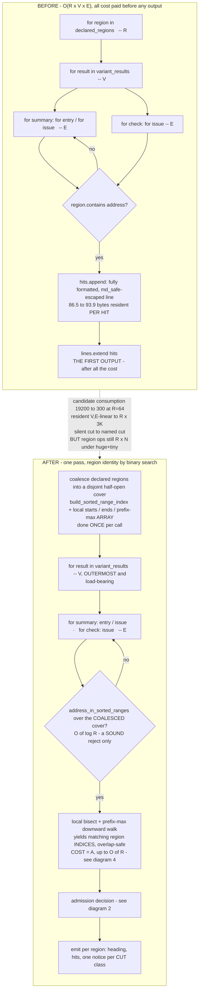
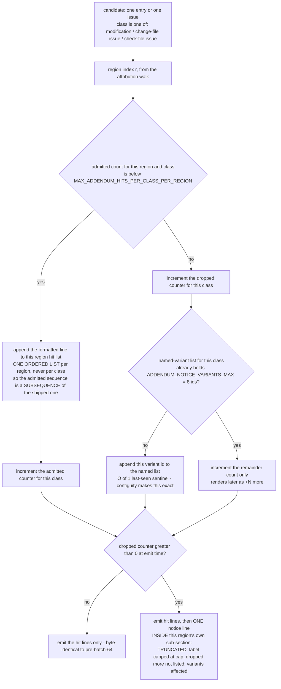
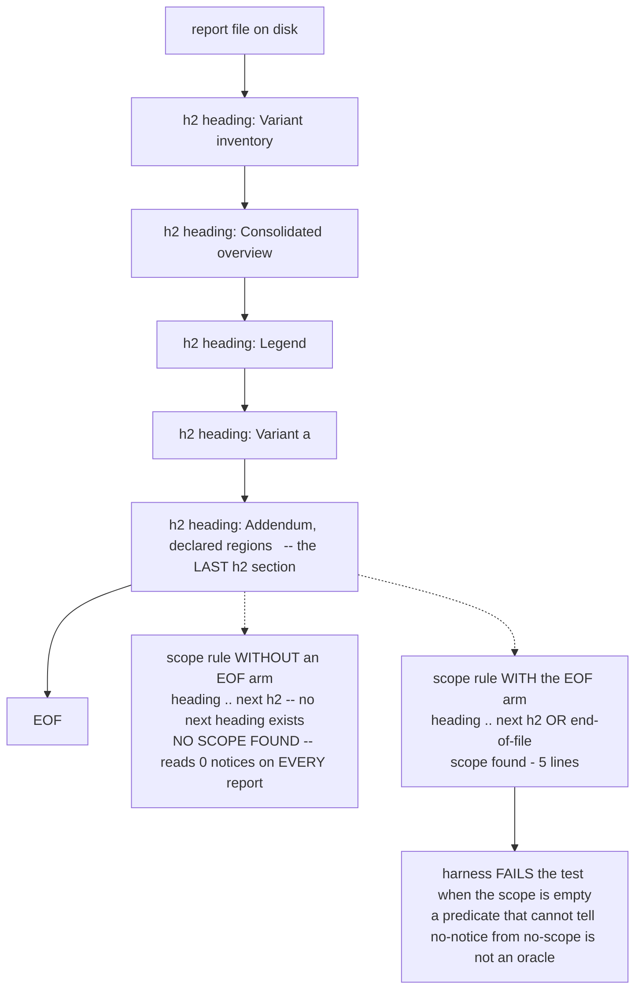

# batch-64 — diagrams

**Audience:** engineers reading the `_addendum_lines` rewrite.
**Purpose:** show the shape change, the per-candidate decision, and the boundary of what was bounded.

All figures are Mermaid. Every label is quoted, so no special character breaks the parse.

---

## 1. The shape change — `O(R x V x E)` nesting vs one pass

The defect is the *nesting order* plus the fact that the whole cost is paid before the first output
line exists. The fix removes the region loop from the traversal and replaces it with a binary search
performed per candidate.

**Two labels are load-bearing and easy to skim past.**

- `for result` is drawn **outermost on purpose**. That is the invariant the `V`-independence of the
  bound rests on: it makes each variant's dropped hits contiguous, so the `+N more` remainder is
  countable with an `O(1)` last-seen sentinel instead of an `O(V)` membership set. An implementer
  reorganising the loops breaks that silently.
- `range_index` appears **only on the reject edge**. It is boolean-only and unsound over unmerged
  overlapping ranges, so it can neither name a region nor be trusted on the raw declared set. It is
  sound over the coalesced cover, and only as a reject.

---

## 2. The admission and notice flow — one candidate, one region

This is the decision the cap makes, and the reason each branch exists. The right-hand branch is not
an error path: recording the drop **is** the feature.

**What each acceptance node pins on this figure**

| edge or box | node | what a wrong implementation would do |
|---|---|---|
| `C3` one ordered list, not per-class buckets | `AT-196`, `TC-494` | per-class buckets emit `mod, mod, issue, issue` where shipped emits `mod, issue, mod, issue` — arm `FIX-B` |
| `C2` cap on the **producer**, not on the output | `TC-481` | slicing `hits[:CAP]` at emit time bounds the document and not the memory — arm `FIX-C` |
| `C9` a class that was **not** cut is not named | `AT-201` | naming all three classes always — arm `FIX-G` |
| `C7` only variants that **lost** hits are named | `AT-202` | naming every *contributing* variant — arm `FIX-H`, which passes a containment check while telling the operator the flooding variant lost evidence |
| `C11` the notice sits under **this** region | `AT-203` | emitting every notice under the first region — arm `FIX-I` |
| no early exit on saturation | `AT-197`, `TC-488` | stopping when full: cannot report the dropped count or the variants at all — arm `FIX-A2` emits **no notice** |

---

## 3. Where the notice is counted, and why the scope rule has an EOF arm

The report already carries three unrelated `> TRUNCATED:` emitters. Counting notices report-wide is
wrong; counting them "between the addendum heading and the next `## ` heading" is **also** wrong,
because the addendum is the last `## ` section of a report.

Without both clauses, seven acceptance nodes read *zero notices on every report* — green on the
absence arms, red on everything else, regardless of what the producer does. The positive control is
`TC-499`: a report where a pre-existing emitter fires and no addendum cap does must read **0**
addendum notices.

---

## 4. What was bounded, and what was not

The single most important thing to take from this batch is the boundary. The change removed one
multiplier from one axis of one function. It is drawn here at the same scale as what it left alone.

```mermaid
flowchart LR
  subgraph closed["BOUNDED by batch-64"]
    K1["addendum candidate consumption<br/>R x V x E to V x E<br/>19200 to 300 at R=64"]
    K2["addendum resident allocation<br/>V,E-linear to O of R x 3K<br/>marginal delta ratio 1.00, threshold 1.30"]
    K3["silent truncation to a NAMED cut<br/>class, dropped count, dropped variants, region"]
    K4["byte identity below the cap<br/>6 of 6 shapes, 0 differing bytes"]
  end

  subgraph open["STILL OPEN - disclosed with numbers, carried to the code lane"]
    O1["memory-exhaustion DoS - NOT CLOSED<br/>_modifications_lines + _checklist_lines<br/>988 B per entry, uncapped, ~11x the addendum<br/>whole-report peak still x1.68 / x1.81 / x1.94 / x1.77"]
    O2["the R multiplier on the WORK axis - RELOCATED<br/>region ops 500 / 4000 / 32000 / 128000<br/>at R = 1 / 8 / 64 / 256 for ONE hit"]
    O3["B-3(b) REDUCED, not eliminated<br/>the single V x E pass survives"]
    O4["region cardinality R - NO CAP ANYWHERE<br/>11.6 to 20 kB per region, both lower bounds"]
    O5["intra-class and cross-variant eviction<br/>DISCLOSED by the notice, NOT prevented"]
    O6["the notice names at most 8 variants<br/>then +N more - exact count, bounded enumeration"]
  end

  closed -.->|"the addendum is ~1/11 of the per-entry cost<br/>and it is the part that no longer grows"| open
```

At ordinary region and variant counts the two uncapped tables **dominate** the addendum. `AT-194`
therefore measures the *marginal* delta attributable to the addendum, not the whole-report peak —
because a whole-report bound is **unsatisfiable today**, and writing one would have been a claim the
system does not honour.

---

*Sources: `01-requirements.md` rev 3 §14 and §10.1–§10.10 · `04-validation.md` §1–§7 ·
`REQUIREMENTS.md` `R-TUI-098` · `s19_app/tui/services/report_service.py` at `ba5f09a`.*
