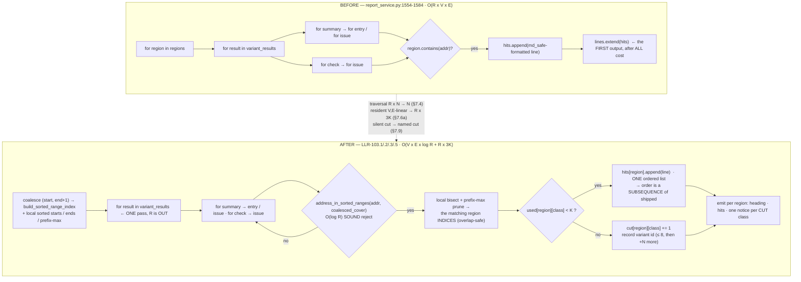

# Requirements Document — s19_app — Batch 64 (ARCHITECT lane)

> **Artifact language:** English (engineering-workflow default).
> **Normative keyword:** `shall`, only inside HLR/LLR **Statement** lines. `should` never appears in a
> normative statement.
> **Tree:** `claude/batch-65-addendum-producer-bound` @ `082ada9` (`git rev-parse --short HEAD` →
> `082ada9`). Every number below was **executed on this tree**; nothing is inherited from batch-63.

---

## 0. BLUF

**Recommendation: build the single-pass, region-indexed producer — with one correction the brief did
not anticipate, and one honest narrowing of what it delivers.**

1. **P-1 verdict — the `range_index` API is boolean-only AND silently wrong on overlapping ranges.**
   `address_in_sorted_ranges` inspects exactly one `bisect` candidate, so on `[(0x1000,0x9000),
   (0x2000,0x2010)]` it returns `False` for `0x5000` — **executed, §7.1.5**. Declared regions *do*
   overlap (**executed, §7.2**). The primitive is therefore usable **only** over a *coalesced*
   half-open cover, and **only** as a reject pre-filter — never for attribution. `range_index.py` is
   engine-frozen and is **not** modified; this is a consumer-side normalization.
2. **A per-CLASS-BUCKET design breaks byte identity below the bound.** The shipped emission order
   **interleaves** modifications and change-file issues (**executed, §7.3**), so three per-class lists
   concatenated in "shipped order" emit `mod, mod, issue, issue` where the shipped producer emits
   `mod, issue, mod, issue`. batch-63's standing design shape would have failed hard constraint 5.
   **Corrected design: ONE ordered hit list per region + per-class admission counters.** Executed
   byte-identity across 5 fixture shapes including exactly-at-cap: **IDENTICAL=True, 5/5** (§7.5, T-3).
3. **The traversal bound is narrower than "independent of R×V×E" and I state it as such.** Post-fix
   consumption is **exactly one pass** — `N = V×(entries + summary issues + check issues)` — for every
   `R ∈ {1, 8, 64}`; pre-fix it is `R × N` (measured `300 / 2400 / 19200` at `N=300`). **The `R`
   multiplier is eliminated. The single pass is the floor** and is not removable: the candidates are
   an unsorted list, so membership cannot be decided without looking at each one once. B-3(b) is
   **reduced from `R×V×E` to `V×E`, not eliminated** — §9.1.
4. **This requirement does not claim the memory-exhaustion DoS is closed.** Executed: with the
   addendum's marginal cost driven flat, the report's own baseline peak (declared_regions **empty**)
   still grows `x1.68` per E-doubling and `x1.81` per V-doubling (§7.6). Any acceptance keyed to
   `generate_project_report`'s whole-report peak is **unsatisfiable**. That is security F2, and it is
   recorded as a residual with its numbers in §9.2.
5. **Notice decision (owned here, §8):** **one `> TRUNCATED:` line per (region, *cut class*)**, emitted
   at the end of that region's hit list. It names the class label, the dropped count, and the affected
   variant ids. Not one line per region — a per-region line cannot bind three variant lists to three
   classes unambiguously, which is the exact evidence US-B64-2 asks for.

---

## 1. Introduction

### 1.1 Purpose

Bound the resident cost of the declared-region report addendum
(`s19_app/tui/services/report_service.py:1514` `_addendum_lines`) and make its truncation
**evidentiary** rather than silent. Backlog item **D1** (`.dev-flow/BACKLOG-CODE.md:16`), specced in
batch-63, BLOCKED at that batch's Phase-2 re-gate, returned to the backlog.

### 1.2 Scope

**IN:** `_addendum_lines` — its traversal, its resident allocation, its emission order, and a new
truncation notice.

**OUT (carries, must not be pulled in):** OB-4 / sec-F4 — `_modifications_lines`
(`report_service.py:970`) and `_checklist_lines` (`:1142`), measured 988 B/entry, unbounded. D2 — the
schema-legal address `ValueError`. OB-3 — `diff_report_service` text-mode writers. OB-2 — the AT/TC
registry. The `M-2` truncation-marker claim.

### 1.3 Definitions

| Term | Definition |
|---|---|
| `R` | `len(options.declared_regions)` — operator-declared region count. **Uncapped**; see §9.3. |
| `V` | variant count = `len(variant_results)`. |
| `E` | per-variant candidate count contributed by one leaf sequence. |
| `N` | total candidate leaves consumed by ONE pass = `Σ_v [ Σ_s (|entries| + |issues|) + Σ_c |issues| ]`. |
| `K` | `MAX_ADDENDUM_HITS_PER_CLASS_PER_REGION` — the per-(region, class) admission cap. **NEW.** |
| hit class | one of the three producing classes: `modification` (`summary.entries`), `change-file issue` (`summary.issues`), `check-file issue` (`check.issues`). All three are **document-derived**, i.e. attacker-authored (`changes/apply.py:363`, `changes/check.py:399`). |
| candidate | one leaf element examined for region membership. |
| admitted / cut | a candidate whose formatted line is stored / dropped by the per-class cap. |

### 1.4 References

- `.dev-flow/2026-07-28-batch-65/PLAN.md` — §"Inherited findings" (10 items), designed for below.
- `.dev-flow/2026-07-26-batch-63/02-review-rescoped-architect.md:118` (B-2), `:169` (B-3), `:211` (B-4).
- `.dev-flow/2026-07-26-batch-63/02-regate-security.md:52` (F1), `:134` (F2).
- `.dev-flow/BACKLOG-CODE.md:16` (D1), `:17` (OB-4), `:18` (F4).
- `~/.claude/templates/dev-flow/req-template.md` — structure followed.
- `docs/engineering-rules.md` — C-13…C-38. Draft-time controls applied here: **C-35** (execute the
  transform over real input), **C-15** (probe runtime identity), **C-39** (pre-execute every
  executable threshold), **C-26** (reverse census), **C-12** (output-then-consume).

---

## 2. Overall description

### 2.1 Product perspective

`generate_project_report` (`report_service.py:1589`) composes the Markdown project report. When
`options.declared_regions` is non-empty (`:1719`) it appends `_addendum_lines(...)` (`:1720`). The
addendum is **evidentiary**: an operator reads it to decide whether a change landed inside a
declared calibration/critical region.

### 2.2 The defect, restated

`_addendum_lines` nests `for region → for result → for summary → for entry/issue` and builds a local
`hits: List[str]` (`:1560`), appending one **fully formatted, `md_safe`-escaped** string per matching
`(region × variant × candidate)` at `:1565` / `:1571` / `:1579`, extending `lines` only at `:1584`.
The entire cost is paid **before any output exists**, so `_ByteBudget` and every row-cap design is
structurally blind to it (this is the finding OB-4 restates in `BACKLOG-CODE.md:17`).

Re-derived on this tree (§7.4, T-2): **86.5 – 93.2 B resident per emitted hit**, and pre-fix
traversal `= R × N` exactly (§7.4, T-1).

### 2.3 Constraints

| Constraint | Value | Source |
|---|---|---|
| Engine-frozen, must not be modified | `core.py`, `hexfile.py`, **`range_index.py`**, `validation/`, `tui/a2l.py`, `tui/mac.py`, `tui/color_policy.py` + `_ENGINE_TEST_FILES` | `tests/test_engine_unchanged.py:120`, `tests/test_tui_directionb.py:5443` — **executed**, `report_service.py` is NOT in either list |
| Files per increment | ≤ 5 | global CLAUDE.md |
| In-domain workload | 14 calls, max `R = 2`, max hits in ONE region = **2**, max candidates = **3** | §7.7, executed over the real suite |
| Existing cap precedent | `MAX_REPORT_ISSUES_PER_VARIANT = 200` (`report_service.py:90`) | grep |
| Region-count cap | **NONE ANYWHERE.** Only `DECLARED_REGION_NAME_MAX = 80` on the NAME (`report_addendum.py:26`) | §7.2b, executed: 5000 regions constructed with no rejection |
| Membership convention | `DeclaredRegion` is **inclusive** `[start, end]` (`report_addendum.py:15-16`, `:92-94`); `range_index` is **half-open** `[start, end)` (`range_index.py:15`) | §7.1.6, executed |

### 2.4 Assumptions and dependencies

- **A-1.** `variant_results` and its leaf sequences are re-iterable in-memory sequences, not one-shot
  iterators. Verified by the shipped producer, which re-iterates them `R` times today (§7.4, T-1).
  *If this fails, the batch is invalidated* — but it cannot fail, because the shipped code depends on it.
- **A-2.** `V` (variant count) is **operator**-scaled (project manifest), not attacker-scaled; `E` and
  the class mix are **attacker**-scaled (the change/check documents). This asymmetry is why the cap is
  per-(region, class) and not per-(region, class, variant) — see §8.3.
- **A-3.** `md_safe` is the escaping contract for every file-derived value reaching the addendum and is
  unchanged by this batch. Executed (§7.8): `>` **is** in `MD_ESCAPE`, and `_normalise` collapses
  `\r\n\t` to a space, so no attacker-controlled value can reach column 0 or forge a notice line.

### 2.5 Source user stories

| ID | User Story | Source | DoR |
|----|------------|--------|-----|
| **US-B64-1** | As an operator generating a project report over a manifest with declared regions, I get the report without the tool consuming memory proportional to (regions × variants × entries), so a large or hostile change document cannot exhaust my machine. | backlog D1 / batch-63 re-gate | **READY** (operator, Phase 0) |
| **US-B64-2** | As an operator reading an evidentiary report, when the addendum was truncated I can see WHICH hit classes (and which variants) were cut, so I can distinguish "there is no evidence" from "the evidence did not fit". | batch-63 sec-F1 §2.5 rec 2 + inherited finding #2 | **READY** (operator, Phase 0) |

Both stories arrived through Definition of Ready and are **not re-scoped here**.

---

## 3. High-level requirement

### R-TUI-098 — the declared-region addendum is a bounded, self-disclosing producer

> **Requirement text (for `REQUIREMENTS.md`).** The declared-region report addendum shall consume the
> candidate set in a single pass whose cost is independent of the declared-region count, shall bound
> its own resident allocation independently of the per-variant candidate count and of the variant
> count, shall be byte-identical to the pre-batch-65 output whenever no admission cap fires, and shall
> disclose every cap that does fire by naming the cut hit class, the dropped count, and the affected
> variants.
>
> **What this requirement deliberately does NOT claim** (executed evidence in §9):
> (a) it does **not** claim the project report's resident-memory exhaustion axis is closed —
> `_modifications_lines` (`:970`) and `_checklist_lines` (`:1142`) remain uncapped at a measured
> **988 B/entry**, and the report's baseline peak with `declared_regions=()` still grows **x1.68 per
> E-doubling / x1.81 per V-doubling** (§7.6); (b) it does **not** claim traversal below one pass —
> the `R` multiplier is removed, the `V×E` pass is not; (c) it does **not** claim the addendum's
> resident cost is independent of `R` — it is `O(R × 3K)` by construction and `R` has no cap
> anywhere; (d) it does **not** claim intra-class or cross-variant eviction is prevented — first-K in
> attacker-controlled document order still decides *what is shown*; the notice makes it *visible*.

### HLR-103 — bounded, order-preserving, self-disclosing addendum production

- **Traceability:** US-B64-1, US-B64-2
- **Statement:** When `generate_project_report` renders the declared-region addendum, the system
  shall traverse the candidate set exactly once regardless of the declared-region count, shall admit
  at most `MAX_ADDENDUM_HITS_PER_CLASS_PER_REGION` hits per (region, hit class), shall preserve the
  pre-batch-65 line sequence exactly while no cap has fired, and shall emit one truncation notice per
  (region, hit class) whose cap fired, naming that class, the dropped count, and the affected variant
  identifiers.
- **Rationale (informative):** the resident cost is paid before any output exists, so no output-side
  budget can reach it; and a bound that silently drops evidence turns an evidentiary document into a
  misleading one — which is the failure batch-63's `AT-165` proved a shape-check cannot detect.
- **Validation:** `test`
- **Executed verification:** `pytest -q tests/test_report_addendum_bound.py` (NEW — created in Phase 3)
  plus `pytest -q tests/test_report_service.py -k "addendum or region"` (7 collected today —
  `pytest --collect-only`, executed §7.7b).
- **Numeric pass threshold:** marginal-delta ratio over a 4x `E` sweep **≤ 2.5** (measured GREEN
  **1.52**, RED **5.54**, §7.6b); traversal `consumed ≤ N` at `R ∈ {1, 8, 64}` (measured GREEN
  `300/300/300`, RED `300/2400/19200`, §7.4 T-1/T-4); byte identity **5/5 fixture shapes** (§7.5);
  `0` regressions in the 5 addendum-adjacent test files (123 passed today, §7.7).
- **Priority:** high

#### Acceptance (black-box) — US-B64-1

- **Observable outcome:** the operator generates a report over a hostile change document (candidate
  count multiplied 4x) and the tool's **additional** memory attributable to the declared-region
  addendum stops growing with the candidate count; the addendum's traversal stops multiplying by the
  number of declared regions.
- **Shipped surface:** `s19_app.tui.services.report_service.generate_project_report(...)` invoked with
  a non-empty `options.declared_regions` — the same call the TUI makes at `app.py`'s report worker.
- **Deliverable + observation:** the report file at `<project>/reports/<UTC>-report.md` exists, is
  non-empty, and still carries the `## Addendum: declared regions` heading and its per-region
  sub-headings. The AT reads **the file**, and the memory/traversal observables are taken across the
  same shipped call. An AT that produced no file **fails**.
- **Acceptance test(s):** **`AT-194`** (marginal resident cost), **`AT-195`** (traversal, injected
  counting iterable), **`AT-196`** (byte identity below the bound). *(provisional-until-Phase-3, V-5.)*
- **Boundary catalog (QC-3):**
  - ☑ **empty** — `R ≥ 1` and `N = 0` (no candidates) → addendum renders `None.` per region, no
    notice. → `TC-484`.
  - ☑ **boundary** — per class exactly `K-1`, `K`, `K+1` candidates in one region. **Mandatory**: the
    in-domain maximum is **2** hits per region (§7.7), so *every in-domain test is green whether or
    not the cap works.* → `AT-198`, `TC-481`, `TC-482`, `TC-483`.
  - ☑ **invalid** — overlapping regions where a hit lies inside the outer region beyond the inner
    region's end (the exact `range_index` failure of §7.1.5) → `TC-486`. Duplicate-name /
    exactly-duplicated regions → `TC-487`.
  - ☑ **error** — `R = 0`: `_addendum_lines` is never called (`report_service.py:1719` guards it);
    asserted as a guard, not exercised as an addendum case → `TC-485`.

#### Acceptance (black-box) — US-B64-2

- **Observable outcome:** when an attacker floods one hit class in one region, the operator reading
  the generated report sees a line that **names the cut class**, **how many hits were dropped**, and
  **which variants' evidence was dropped** — so "there is no `CHG-COLLISION` in this region" is
  distinguishable from "a `CHG-COLLISION` existed and did not fit".
- **Shipped surface:** the same `generate_project_report` call; the notice is read out of the written
  report file.
- **Deliverable + observation:** the report file contains, inside the flooded region's sub-section,
  exactly one line per cut class matching `ADDENDUM_TRUNCATION_NOTICE_FMT`, whose `{label}` equals
  `ADDENDUM_CLASS_LABELS[<cut class>]`, whose `{dropped}` equals the count the test derives
  **independently from its own fixture**, and whose `{variants}` contains the variant ids the test
  knows were dropped. **The AT quotes the constants, never their values.**
- **Acceptance test(s):** **`AT-197`** (the evicted-evidence notice), **`AT-198`** (`K-1` → no notice
  anywhere; `K+1` → exactly one), **`AT-199`** (notice-forgery negative).
- **Why this is not `AT-165` again.** batch-63's `AT-165` asserted *"every producing hit-class is
  represented"* and was **GREEN through all three attacks** while the operator-relevant
  `CHG-COLLISION` was evicted — it tested the concatenation **shape**. `AT-197` asserts the **identity
  of what was lost**: it computes the expected `(class, dropped-count, variant-ids)` triple from its
  own fixture and requires the report to state it. Executed against the prototype (§7.9): at
  `flood = K` the notice reads `variants affected: v2, v3` — precisely the two variants whose
  `CHG-COLLISION` was dropped. A shape-check cannot produce that triple.
- **Boundary catalog (QC-3):**
  - ☑ **empty** — no cap fires → **no notice line exists anywhere in the report** (this is also what
    makes `AT-196`'s byte identity possible). → `AT-198` arm 1.
  - ☑ **boundary** — class **total** `K-1` / `K` / `K+1` in one region. Note the executed trap
    (§7.9): a *flood* of `K-1` still truncates once another variant contributes to the same class, so
    the predicate must be keyed on the class total, never on the flood size. → `AT-198`.
  - ☑ **invalid** — a variant id whose text *is* a notice line; an issue code containing `> TRUNCATED`.
    → `AT-199`.
  - ☑ **error** — more affected variants than `ADDENDUM_NOTICE_VARIANTS_MAX` → the notice appends
    `+N more` rather than growing with `V`. → `TC-490`.

---

## 4. Low-level requirements

### LLR-103.1 — single traversal, independent of the declared-region count

- **Traceability:** HLR-103 → US-B64-1
- **Statement:** `_addendum_lines` shall iterate `variant_results` and every leaf candidate sequence
  (`summary.entries`, `summary.issues`, `check.issues`) **exactly once per call**, with the
  declared-region loop moved **out** of the candidate traversal, so that the number of candidate
  elements consumed is independent of `len(regions)`.
- **Validation:** `test (unit)`
- **Executed verification:** `pytest tests/test_report_addendum_bound.py -k at195` — a re-iterable
  `list` subclass counting `__iter__` yields is substituted for each leaf sequence.
- **Numeric pass threshold:** `consumed <= N` for `R ∈ {1, 8, 64}` where `N` is computed by the test
  from its own fixture. Executed RED on this tree: `300 / 2400 / 19200` at `N = 300`
  (`consumed/N = 1.00 / 8.00 / 64.00`). Executed GREEN on the prototype: `300 / 300 / 300`
  (`1.00 / 1.00 / 1.00`). §7.4.
- **Acceptance criteria (informative):**
  - The fixture is **re-iterable** (inherited finding #5): the RED arm re-iterates every leaf `R`
    times, so a one-shot generator breaks the RED arm at `R ≥ 2`.
  - Peak memory and wall time **shall not** be used for this LLR — batch-63 measured cap-and-break vs
    cap-and-continue at `19019/19019` peak (ratio 1.00) and `1.00` vs `1.04` time (inherited finding #4).

### LLR-103.2 — sound membership over **overlapping**, inclusive regions

- **Traceability:** HLR-103 → US-B64-1
- **Statement:** `_addendum_lines` shall decide candidate membership using
  `range_index.build_sorted_range_index` / `range_index.address_in_sorted_ranges` applied to a
  **coalesced, half-open** cover built as `_coalesce([(r.start, r.end + 1) for r in regions])`, used
  **solely as a reject pre-filter**, and shall recover the matching region identities from a
  caller-local `bisect` structure; it shall emit one line per (matching region × candidate), thereby
  reproducing today's behaviour in which a candidate inside `M` overlapping regions is emitted `M`
  times.
- **Validation:** `test (unit)`
- **Executed verification:** `pytest tests/test_report_addendum_bound.py -k "tc486 or tc487"`.
- **Numeric pass threshold:** for regions `[(0x1000,0x9000), (0x2000,0x2010)]` and address `0x5000`,
  the produced addendum lists the hit under region 0 — i.e. **1 hit, not 0**. Executed pre-state
  (§7.1.5): `address_in_sorted_ranges(0x5000, build_sorted_range_index([(0x1000,0x9000),
  (0x2000,0x2010)])) = False` while ground truth is `True`. For three overlapping regions containing
  one entry, the report emits that entry **3 times** (executed today, §7.2).
- **Acceptance criteria (informative):**
  - **`range_index.py` is engine-frozen (`tests/test_engine_unchanged.py:122`) and is NOT modified.**
    Consuming it is permitted; `report_service.py` imports it **0 times** today (§7.1.7) — this is a
    `NEW` import.
  - The primitive is **boolean-only** (`-> bool`, executed §7.1.2/§7.1.4) and returns **no region
    identity**, so attribution must be local. It is also **incorrect on a raw overlapping range set**
    (§7.1.5) — the coalescing step is a **correctness** precondition, not an optimisation. Dropping
    it silently drops hits; `TC-486` is the guard that fires if a later change removes it.
  - The `+1` converts `DeclaredRegion`'s inclusive `[start, end]` to the primitive's half-open
    convention. Without it the **end address of every declared region is a false negative** —
    executed §7.1.6.
  - **Design note (informative, reversible):** the coalesced-cover reject is *subsumed for correctness*
    by the local prefix-max prune and is retained because `range_index` is the codebase's designated
    primitive for "many addresses against many ranges" (`CLAUDE.md`, Range/validation engine) and
    because the reject path is the hot path under the B-3(b) attack. It is **not load-bearing for the
    asymptotic bound**; dropping it is a spec-sanctioned, reversible Phase-3 choice if measurement
    shows the second binary search costs more than it saves. Nothing else in this spec changes if it
    is dropped **except** that the coalescing correctness precondition then moves onto the local
    structure, and `TC-486` still guards it.

### LLR-103.3 — per-(region, hit-class) admission cap, resident bound independent of V and E

- **Traceability:** HLR-103 → US-B64-1
- **Statement:** `_addendum_lines` shall maintain, per declared region, **one ordered hit list** and
  **three** independent admission counters — one per hit class — and shall append a formatted line to
  that region's list only while the candidate's class counter is `< MAX_ADDENDUM_HITS_PER_CLASS_PER_REGION`,
  so that the function's own resident allocation is at most
  `len(regions) × 3 × MAX_ADDENDUM_HITS_PER_CLASS_PER_REGION` hit lines plus
  `len(regions) × 3` notice lines plus `len(regions) × 3 × ADDENDUM_NOTICE_VARIANTS_MAX` variant
  identifiers, independent of the per-variant candidate count and of the variant count.
- **Validation:** `test (unit)` + `analysis`
- **Executed verification:** `pytest tests/test_report_addendum_bound.py -k "at194 or tc480"`; the
  analysis is the executed E-axis sweep of §7.6.
- **Numeric pass threshold:** direct `_addendum_lines` peak ratio per `E`-doubling at `R=1, V=1`
  **≤ 1.25** — executed GREEN `x1.02, x1.00, x1.00`; executed RED `x1.98, x2.00, x2.00` (§7.6a).
  Emitted-line count `<= 2 + R*(1 + 3K + 3 + 1)` at any `E`.
- **Acceptance criteria (informative):**
  - **ONE ordered list per region, not three per-class lists.** Executed counter-example (§7.3/§7.5):
    the shipped order **interleaves** `modification` and `change-file issue` lines, so a per-class
    concatenation emits `mod, mod, issue, issue` where shipped emits `mod, issue, mod, issue` and
    LLR-103.4 fails. **This corrects batch-63's standing design shape.**
  - The admitted sequence is a **subsequence** of the shipped sequence by construction, which is what
    makes LLR-103.4 provable rather than asserted.
  - `K = 200`, matching the existing `MAX_REPORT_ISSUES_PER_VARIANT = 200` (`report_service.py:90`).
    In-domain max hits per region is **2** (§7.7) → 100x margin, which is exactly why LLR-103.4's
    boundary fixtures at `K-1 / K / K+1` are mandatory and not optional.

### LLR-103.4 — byte identity below the bound

- **Traceability:** HLR-103 → US-B64-1
- **Statement:** While no admission counter has reached `MAX_ADDENDUM_HITS_PER_CLASS_PER_REGION` for
  any (region, hit class), the report bytes produced by `generate_project_report` shall be identical,
  under `tests/conftest.py::canonical_report_bytes`, to the bytes produced by the pre-batch-65
  producer over the same inputs.
- **Validation:** `test (integration)`
- **Executed verification:** `pytest tests/test_report_addendum_bound.py -k at196`, comparing against
  a golden captured at **Inc-1** from the SHIPPED producer (C-12: output produced first, consumed
  after) via `canonical_report_bytes(raw, run_root)` (`tests/conftest.py:970`).
- **Numeric pass threshold:** **byte equality**, 0 differing bytes, over 5 fixture shapes:
  `(R,V,E) = (1,1,1) · (3,2,5) · (2,3,66) · (1,1,0) · (1,1,200 == K)`. Executed against the
  prototype: **IDENTICAL = True, 5/5** (§7.5, T-3).
- **Acceptance criteria (informative):**
  - **batch-63 DROPPED this (its D-2) and it was the only observable both of its Phase-1 lanes
    independently converged on.** It is restored here as a required acceptance.
  - `_addendum_lines` has **ZERO direct references in `tests/`** (executed §7.7b) — nothing protects
    a structural rewrite except this arm.
  - The `(1,1,200)` shape sits **exactly at** `K` and must still be identical: the cap fires only when
    a candidate is *rejected*, i.e. at `K+1`.

### LLR-103.5 — the truncation notice names the cut class, the count, and the variants

- **Traceability:** HLR-103 → US-B64-2
- **Statement:** For each (region, hit class) whose admission counter reached
  `MAX_ADDENDUM_HITS_PER_CLASS_PER_REGION`, `_addendum_lines` shall emit exactly one line, formatted
  from `ADDENDUM_TRUNCATION_NOTICE_FMT`, immediately after that region's hit list and before the
  region's trailing blank line, stating that class's `ADDENDUM_CLASS_LABELS` label, the cap value, the
  number of dropped hits, and the `md_safe`-escaped identifiers of the variants that contributed at
  least one dropped hit, truncated at `ADDENDUM_NOTICE_VARIANTS_MAX` identifiers with an explicit
  `+N more` remainder; and where no counter reached the cap, `_addendum_lines` shall emit no notice
  line.
- **Validation:** `test (integration)`
- **Executed verification:** `pytest tests/test_report_addendum_bound.py -k "at197 or at198 or tc490"`.
- **Numeric pass threshold:** under the batch-63 A2/A3 attack (one variant floods
  `CHG-ADDRESS-SYNTAX`; variants `v2`,`v3` each carry one ERROR `CHG-COLLISION`), at `flood = K` the
  written report contains **exactly 1** notice line for the `change-file issue` class, its dropped
  count equals **2** (derived by the test from its fixture), and its variant list contains **both**
  `v2` and `v3`. Executed against the prototype (§7.9):
  `> TRUNCATED: change-file issue hits in this region were capped at 200; 2 more not listed (variants affected: v2, v3).`
  At `flood = 2K`: **1** notice, dropped `= 202`, variants `v1, v2, v3`.
  **The zero-notice arm is keyed on the class TOTAL, not on the flood size.** Executed §7.9 shows
  `flood = K-1` still emits **1** notice line, because `199 flood + 1 (v2 collision) = K` admitted and
  `v3`'s collision is the `K+1`-th candidate. The correct predicate is: *total candidates of that class
  in that region* `<= K` → **0** notice lines anywhere in the report; `= K+1` → **exactly 1**. That is
  what `AT-198` asserts, and it is also the precondition LLR-103.4's byte identity depends on.
- **Acceptance criteria (informative):**
  - The AT **quotes the constants** `MAX_ADDENDUM_HITS_PER_CLASS_PER_REGION`, `ADDENDUM_CLASS_LABELS`,
    `ADDENDUM_TRUNCATION_NOTICE_FMT` — never the literal `200` and never the literal notice text.
  - The notice **discloses** a residual it does not close: intra-class and cross-variant eviction in
    attacker-controlled document order still decide *what is shown* (§9.4).

### LLR-103.6 — the cap, the class labels, and the notice format are module constants

- **Traceability:** HLR-103 → US-B64-1, US-B64-2
- **Statement:** `report_service` shall define `MAX_ADDENDUM_HITS_PER_CLASS_PER_REGION`,
  `ADDENDUM_CLASS_LABELS`, `ADDENDUM_NOTICE_VARIANTS_MAX`, and `ADDENDUM_TRUNCATION_NOTICE_FMT` as
  module-level constants, and `_addendum_lines` shall read each cap and each label from the constant
  at call time rather than from an inline literal.
- **Validation:** `inspection`
- **Executed verification:** `rg -n "MAX_ADDENDUM_HITS_PER_CLASS_PER_REGION|ADDENDUM_CLASS_LABELS|ADDENDUM_TRUNCATION_NOTICE_FMT|ADDENDUM_NOTICE_VARIANTS_MAX" s19_app/ tests/`
  — **executed pre-state on this tree: 0 hits** (`grep -rn` over `s19_app/`, `tests/`), so all four
  are flagged **`NEW — created in Phase 3`**.
- **Numeric pass threshold:** post-change, `≥ 1` definition site in `s19_app/tui/services/report_service.py`
  and `≥ 1` import site in `tests/test_report_addendum_bound.py`; **0** occurrences of the bare literal
  `200` inside `_addendum_lines`'s body.
- **Acceptance criteria (informative):**
  - Placement is `report_service.py`, beside `MAX_REPORT_ISSUES_PER_VARIANT` (`:90`), not
    `report_addendum.py`: the caps that govern report composition already live in one place, and this
    keeps the source increment at ONE file. `report_addendum.py` stays the *domain object* module.
  - "An AT quotes the constant, never its value" is the batch-63 rule this discharges.

---

## 5. Validation strategy

### 5.1 Methods

- **Layer A (white-box, `TC-NNN`):** `test (unit)` / `test (integration)` / `inspection` against the
  HLR/LLR mechanism.
- **Layer B (black-box, `AT-NNN`):** drive `generate_project_report` and read the **written report
  file**; assert the story's outcome. No `AT` references a private symbol except the four **constants**
  of LLR-103.6, which are the public contract the AT is required to quote instead of a literal.

### 5.2 Dual-traceability

**Behavioral chain (black-box):**

| US | Observable outcome | Shipped surface | `AT-NNN` | Observed |
|----|--------------------|-----------------|----------|----------|
| US-B64-1 | additional memory attributable to the addendum stops growing with the candidate count | `generate_project_report` (regions vs no-regions, same fixture) | **AT-194** | delta ratio over a 4x `E` sweep ≤ 2.5 (RED 5.54 / GREEN 1.52) |
| US-B64-1 | the addendum stops re-reading the whole candidate set once per declared region | `generate_project_report` + injected re-iterable counting sequence | **AT-195** | `consumed ≤ N` at `R ∈ {1,8,64}` (RED 300/2400/19200, GREEN 300/300/300) |
| US-B64-1 | an untruncated report is unchanged | `generate_project_report` → report file → `canonical_report_bytes` | **AT-196** | byte equality vs Inc-1 golden, 5/5 shapes |
| US-B64-2 | the operator can name what was cut | `generate_project_report` → report file | **AT-197** | notice names class `change-file issue`, dropped `2`, variants `v2, v3` |
| US-B64-2 | no notice when nothing was cut; one notice when something was | `generate_project_report` → report file | **AT-198** | class total `K-1` and `K` → **0** notice lines anywhere; class total `K+1` → **exactly 1** |
| US-B64-2 | a notice cannot be forged from document-derived text | `generate_project_report` → report file | **AT-199** | 1 notice line, not 2; `md_safe` escapes the injected `>` |

**Functional chain (white-box):**

| Requirement | Method | `TC-NNN` | Notes |
|---|---|---|---|
| HLR-103 | test (integration) | TC-480 | end-to-end shape: heading + per-region sub-headings + hits + notices |
| LLR-103.1 | test (unit) | TC-488, TC-489 | counting sequence at `R=1` and `R=64`; re-iterability guard |
| LLR-103.2 | test (unit) | TC-486, TC-487 | nested-overlap correctness (§7.1.5 case); duplicate/identical regions |
| LLR-103.3 | test (unit) | TC-481, TC-482, TC-483 | `K-1` / `K` / `K+1` per class; line-count bound |
| LLR-103.3 | test (unit) | TC-484, TC-485 | `N = 0` → `None.`; `R = 0` guard at `:1719` |
| LLR-103.4 | test (integration) | TC-491 | golden capture + canonical comparison harness |
| LLR-103.5 | test (unit) | TC-490 | `> ADDENDUM_NOTICE_VARIANTS_MAX` affected variants → `+N more`, list length capped |
| LLR-103.6 | inspection | TC-492 | constants defined + no bare `200` in the function body |

**TC-480 … TC-492 allocated; `TC-493+` remains free.** `AT-194 … AT-199` allocated; `AT-200+` free.
batch-63's `AT-164..167` / `TC-440..454` / `R-TUI-095` / `HLR-100` are **RETIRED, not reused**.

### 5.3 Batch acceptance criteria

- Every LLR covered by ≥ 1 passing TC.
- Every user story covered by ≥ 1 passing `AT` observing the outcome through the written report file,
  with boundary + negative evidence.
- **Every `AT` shown RED against the pre-fix tree before the fix lands** (Inc-1 gate).
- 0 regressions across the 5 addendum-adjacent test files (**123 passed** today, `pytest -q` executed
  §7.7, 124.54 s).
- `pytest -q tests/test_engine_unchanged.py` → 1 passed (frozen-source guard).

---

## 6. Increment cut (≤ 5 files each)

| # | Files | Content | Gate |
|---|---|---|---|
| **Inc-1** | `tests/test_report_addendum_bound.py` **(NEW)** · `.dev-flow/2026-07-28-batch-65/goldens/addendum_below_cap.md` **(NEW)** | `AT-194…199` + `TC-480…492`, plus the byte-identity golden **captured from the SHIPPED producer** (C-12: produce the output, then consume it). **All ATs RED.** | every AT fails, with the recorded RED figures of §7 reproduced |
| **Inc-2** | `s19_app/tui/services/report_service.py` | the four constants (LLR-103.6) + the single-pass, region-indexed `_addendum_lines` (LLR-103.1/.2/.3/.5) + docstring in the mandated section order | Inc-1 tests GREEN; `pytest -q tests/test_report_service.py tests/test_tui_report_seam.py tests/test_report_field_census.py tests/test_manifest_writer.py tests/test_capped_text_area.py` → 123 passed; `tests/test_engine_unchanged.py` → 1 passed |
| **Inc-3** | `REQUIREMENTS.md` · `.dev-flow/BACKLOG-CODE.md` · `.dev-flow/2026-07-28-batch-65/PLAN.md` | `R-TUI-098` entry + traceability rows; D1 closed **with its residuals restated by number**; PLAN decision log | full non-slow suite; no requirement without a validation method |

**Rationale for putting the golden in Inc-1, not Inc-2:** if the golden is captured after the rewrite
it certifies the rewrite against itself. C-12.

**File-path/structural guard census (change-first, per the Census principle).** Planned touched files
checked against every test that asserts on path / module structure / import graph / git-diff:
`s19_app/tui/services/report_service.py` — **not** in `_ENGINE_PATHS` (`tests/test_engine_unchanged.py:120`,
`tests/test_tui_directionb.py:5443`, both read, executed); `tests/test_report_addendum_bound.py` —
**not** in `_ENGINE_TEST_FILES` (new file). The new `range_index` import is a **frozen-module consume**,
which the guards test by `git diff --name-only`, not by import graph — so it does not trip them.
This is a **best-effort census, gate-confirmed at Inc-2**, not a "VERIFIED COMPLETE" stamp.

---

## 7. Executed probes (verbatim output)

All commands run from the worktree root with
`PYTHONPATH=<worktree root>`; `python 3.14.4`; `HEAD = 082ada9`.

### 7.1 — P-1: `range_index` runtime identity (C-15). **THE HIGHEST-RISK UNKNOWN.**

```
=== P-1.1 module identity ===
module file : ...\s19_app\range_index.py
public names: ['List', 'RangeIndex', 'Tuple', 'address_in_sorted_ranges', 'annotations', 'bisect', 'build_sorted_range_index', 'range_in_sorted_ranges']
RangeIndex  : typing.Tuple[typing.List[int], typing.List[int]]

=== P-1.2 runtime signatures + return annotations ===
build_sorted_range_index(ranges: 'List[Tuple[int, int]]') -> 'RangeIndex'
    -> get_type_hints return = typing.Tuple[typing.List[int], typing.List[int]]
address_in_sorted_ranges(addr: 'int', index: 'RangeIndex') -> 'bool'
    -> get_type_hints return = <class 'bool'>
range_in_sorted_ranges(addr: 'int', length: 'int', index: 'RangeIndex') -> 'bool'
    -> get_type_hints return = <class 'bool'>

=== P-1.3 EXECUTED: what does build_sorted_range_index actually return? ===
input  : [(8192, 8448), (4096, 4352)]
output : ([4096, 8192], [4352, 8448])
type   : <class 'tuple'> len = 2
--> NAMES ARE DROPPED. The index is (starts, ends) only; there is no
    payload slot and no returned permutation, so identity of the input
    row is NOT recoverable from the returned object.

=== P-1.4 EXECUTED: address_in_sorted_ranges return VALUE, not just type ===
address_in_sorted_ranges(0x2050, idx) = True type: bool
--> BOOLEAN. No index, no region.

=== P-1.5 EXECUTED (DISQUALIFYING CHECK): overlap correctness ===
ranges: [('0x1000', '0x9000'), ('0x2000', '0x2010')] -> idx: ([4096, 8192], [36864, 8208])
  addr 0x01500: address_in_sorted_ranges=True   ground-truth=True   OK
  addr 0x02005: address_in_sorted_ranges=True   ground-truth=True   OK
  addr 0x05000: address_in_sorted_ranges=False  ground-truth=True   *** WRONG ***
  addr 0x08fff: address_in_sorted_ranges=False  ground-truth=True   *** WRONG ***

=== P-1.6 EXECUTED: half-open vs inclusive convention mismatch ===
DeclaredRegion('cal', 0x1000, 0x10FF).contains(0x10FF) = True
address_in_sorted_ranges(0x10FF, build([(0x1000,0x10FF)])) = False
--> The end address of EVERY declared region is a false negative unless
    the caller passes (start, end+1). Documented divergence:
    report_addendum.py:15-16 (INCLUSIVE) vs range_index.py:15 (half-open).

=== P-1.7 EXECUTED: does report_service import range_index today? ===
range_index in report_service namespace: []
```

**Verdict.** The API is **boolean-only** — it answers *whether*, never *which* — so per-region
attribution **cannot** come from it. Worse, and not anticipated by the brief: `address_in_sorted_ranges`
inspects **one** `bisect_right(starts, addr) - 1` candidate (`range_index.py:65-68`), which is only
sound for **disjoint** ranges. On an overlapping declared-region set it returns **False for an address
that is genuinely inside a region** — a silent hit-loss, i.e. a correctness regression in an
evidentiary document, which is strictly worse than the memory defect being fixed.

**This does not disqualify the design.** The frozen-safe construction, specced in LLR-103.2:

1. Normalize to half-open and **coalesce** the declared regions into a disjoint cover:
   `_coalesce([(r.start, r.end + 1) for r in regions])`. Over a disjoint cover the single-candidate
   bisect is correct, so `address_in_sorted_ranges` becomes a **sound O(log R) reject pre-filter**.
2. Recover region identity from a **caller-local** structure inside `report_service.py`: regions
   sorted by `start`, a parallel `end+1` vector, and a prefix-max-of-ends vector for pruning.
   `range_index.py` is **not modified** (engine-frozen); it is only consumed.

### 7.2 — P-2: overlap is real, and the shipped producer emits once **per matching region**

```
constructed overlapping regions OK: [('outer', '0x1000', '0x2000'), ('inner', '0x1500', '0x1600'), ('dup', '0x1000', '0x2000')]
  [ 2] ### outer (0x1000-0x2000)
  [ 3] - modification @ 0x1550 (variant v1)
  [ 5] ### inner (0x1500-0x1600)
  [ 6] - modification @ 0x1550 (variant v1)
  [ 8] ### dup (0x1000-0x2000)
  [ 9] - modification @ 0x1550 (variant v1)
--> the SINGLE entry at 0x1550 is emitted 3 times (once per matching region). Duplicate-name regions are also accepted.
```

Overlapping — and exactly duplicated — regions construct without error. `DeclaredRegion.__post_init__`
(`report_addendum.py:72-90`) validates `name` / `start >= 0` / `end >= start` only; there is no
cross-region check anywhere. **The single pass must therefore fan one candidate out to every matching
region**, which is what LLR-103.2 requires.

### 7.2b — P-2b: no cardinality cap on `options.declared_regions`

```
report_addendum caps: ['DECLARED_REGION_NAME_MAX']
  DECLARED_REGION_NAME_MAX = 80 (caps the NAME string, not the region COUNT)
constructed 5000 DeclaredRegions with no rejection: 5000
```

`grep -n "declared_regions\|len(regions)" s19_app/tui/services/report_service.py` → the only `len(...)`
uses are `:1369` / `:1375-1378`, which belong to `_hexdump_section`'s `REPORT_MAX_REGIONS_PER_VARIANT`
(a **different** notion of "region": modified memory windows, not declared regions). `:294` is a
per-element **type** check, not a count check. **No cardinality cap exists.** → §9.3.

### 7.3 — P-3: the CURRENT emission order, established by execution

```
  [ 2] ### whole (0x1000-0x1FFF)
  [ 3] - modification @ 0x1000 (variant v1)
  [ 4] - modification @ 0x1001 (variant v1)
  [ 5] - issue [S1A] @ 0x1002 (variant v1)
  [ 6] - modification @ 0x1010 (variant v1)
  [ 7] - modification @ 0x1011 (variant v1)
  [ 8] - issue [S2A] @ 0x1012 (variant v1)
  [ 9] - issue [C1A] @ 0x1020 (variant v1)
  [10] - issue [C1B] @ 0x1021 (variant v1)
  [11] - issue [C2A] @ 0x1030 (variant v1)
  [12] - modification @ 0x1040 (variant v2)
  [13] - issue [S3A] @ 0x1041 (variant v2)
  [14] - issue [C3A] @ 0x1050 (variant v2)
```

Fixture: 2 variants; `v1` has 2 change summaries (2 entries + 1 summary-issue each) and 2 check
results (2 + 1 issues); `v2` has 1 of each.

**Order, read off the output (per region):** `for result:` [ `for summary:` (that summary's ENTRY
hits, then that summary's ISSUE hits) ] **then** [ `for check:` its ISSUE hits ]. Region sub-sections
appear in the **caller's region order**, not sorted by address (§7.2 shows `outer, inner, dup` as
given). This confirms the brief's statement of the order **and adds the fact the brief's design shape
missed**: modifications and change-file issues **interleave**, so class-grouped output is not
byte-identical. See §7.5.

### 7.4 — P-5 T-1 / T-4: traversal, by injected **re-iterable** counting sequence

RED (shipped producer):

```
   R    V      E    N=V*3E   consumed  consumed/N  case
   1    1    100       300        300        1.00  all-match
   2    1    100       300        600        2.00  all-match
   4    1    100       300       1200        4.00  all-match
   8    1    100       300       2400        8.00  all-match
   1    2    100       600        600        1.00  all-match
   1    1    400      1200       1200        1.00  all-match
   1    1    100       300        300        1.00  ZERO-match (B-3(b) attack)
   4    1    100       300       1200        4.00  ZERO-match (B-3(b) attack)
   8    1    100       300       2400        8.00  ZERO-match (B-3(b) attack)
--> pre-fix consumption == R x V x 3E EXACTLY, and the ZERO-match region
    pays the identical full product for zero output. That is B-3(b).
```

RED vs GREEN, same counter, prototype patched in:

```
   R    V      E    N=V*3E    pre-fix     proto  proto/N  case
   1    1    100       300        300       300     1.00  all-match
   4    1    100       300       1200       300     1.00  all-match
   8    1    100       300       2400       300     1.00  all-match
  64    1    100       300      19200       300     1.00  all-match
   1    1    100       300        300       300     1.00  ZERO-match
   8    1    100       300       2400       300     1.00  ZERO-match
  64    1    100       300      19200       300     1.00  ZERO-match
```

**The `R` multiplier is gone.** One pass is the floor; see §9.1.

### 7.5 — P-5 T-2 / T-3: resident cost RED, and byte identity GREEN

```
=== T-2 PRE-FIX RESIDENT COST of _addendum_lines (bytes per emitted hit) ===
fixture is built BEFORE tracemalloc.start()   (inherited finding #7)
   R    V      E      hits       peak B     B/hit
   1    1    500      1500       139311      92.9
   1    1   1000      3000       279123      93.0
   1    1   2000      6000       559163      93.2
   1    2   1000      6000       559163      93.2
   2    1   1000      6000       532219      88.7
   4    1   1000     12000      1038379      86.5
```

**86.5 – 93.2 B/hit, re-derived on this tree.** (batch-63's 87–94 B/hit reproduces; it is re-derived,
not copied — the carried-number rule.)

```
=== T-3 BYTE-IDENTITY BELOW THE BOUND - prototype vs shipped, EXECUTED ===
  R=1 V=1 E=   1 (minimal               ) shipped==7L proto==7L IDENTICAL=True
  R=3 V=2 E=   5 (multi-region/variant  ) shipped==98L proto==98L IDENTICAL=True
  R=2 V=3 E=  66 (just under cap        ) shipped==1194L proto==1194L IDENTICAL=True
  R=1 V=1 E=   0 (empty                 ) shipped==5L proto==5L IDENTICAL=True
  R=1 V=1 E= 200 (AT cap boundary (K)   ) shipped==604L proto==604L IDENTICAL=True

  interleaving control - shipped order is NOT class-grouped:
      - modification @ 0x1000 (variant v1)
      - issue [S1] @ 0x1002 (variant v1)
      - modification @ 0x1010 (variant v1)
      - issue [S2] @ 0x1012 (variant v1)
      - issue [C1] @ 0x1020 (variant v1)
     ^ mod, issue, mod, issue -> three per-class lists concatenated
       would emit mod, mod, issue, issue and BREAK byte identity.
```

### 7.6 — P-5 T-5 / P-5b / P-5c / P-5d: the promoted thresholds (C-39)

**(a) direct `_addendum_lines` peak, E-axis, `R=1 V=1`:**

```
PROTOTYPE (GREEN)
  E=  200  candidates=   600  peak=   57574 B  lines=   604  vs prev -
  E=  400  candidates=  1200  peak=   58860 B  lines=   607  vs prev x1.02
  E=  800  candidates=  2400  peak=   58860 B  lines=   607  vs prev x1.00
  E= 1600  candidates=  4800  peak=   58864 B  lines=   607  vs prev x1.00
SHIPPED (RED)
  E=  200  peak=   56115 B  vs prev -
  E=  400  peak=  111291 B  vs prev x1.98
  E=  800  peak=  223019 B  vs prev x2.00
  E= 1600  peak=  446763 B  vs prev x2.00
```

→ LLR-103.3 threshold **≤ 1.25**. GREEN max **1.02** (23 % headroom); RED min **1.98** (fails by 58 %).
**This is the E axis, with `R` fixed at 1.** batch-63's `<1.5` false-failed because it was applied to
the **R** axis, where a per-region cap materialises `R × CAP` by construction; that mistake is not
repeated, and the R axis is measured separately in (c) and promoted to **no** threshold.

**(b) marginal delta through the SHIPPED surface — the isolation proposal, validated:**

```
P-5b  ISOLATION BY MARGINAL DIFFERENCE - generate_project_report (SHIPPED, RED)
  V      E  peak NO regions  peak WITH regions   DELTA (addendum)  delta vs prev
  1    250           211032             342212             131180              -
  1    500           248898             622718             373820          x2.85
  1   1000           418570            1183736             765166          x2.05
  2   1000           756784            2350690            1593906          x2.08

P-5c  same grid, PROTOTYPE patched in (GREEN)
  1    250           198480             304538             106058              -
  1    500           242562             385554             142992          x1.35
  1   1000           418570             547572             129002          x0.90
  2   1000           756784             916692             159908          x1.24
```

The adjacent-doubling ratio is **noisy** (whole-report peak is a process high-water mark polluted by
the other tables). The **4x sweep** is deterministic:

```
P-5d  4x E-SWEEP MARGINAL RATIO  delta(E=1000) / delta(E=250),  V=1
  SHIPPED (RED)      rep0: delta(250)=  143788  delta(1000)=  797117  ratio=  5.54
  SHIPPED (RED)      rep1: delta(250)=  143788  delta(1000)=  797166  ratio=  5.54
  SHIPPED (RED)      rep2: delta(250)=  143788  delta(1000)=  797114  ratio=  5.54
  PROTOTYPE (GREEN)  rep0: delta(250)=  106058  delta(1000)=  161051  ratio=  1.52
  PROTOTYPE (GREEN)  rep1: delta(250)=  106058  delta(1000)=  161051  ratio=  1.52
  PROTOTYPE (GREEN)  rep2: delta(250)=  106014  delta(1000)=  161002  ratio=  1.52
```

→ `AT-194` threshold **≤ 2.5**. GREEN **1.52** (64 % headroom, 3/3 reps identical); RED **5.54**
(fails by 2.2x). **Widening 2.0 → 2.5 does not make the threshold stop failing the shipped code** —
the RED is 5.54 — which is the specific move batch-63 was warned against.

**(c) R-axis, measured and DELIBERATELY NOT PROMOTED to a threshold:**

```
R-axis (E fixed >> cap): the prototype is STILL linear in R by construction
  R=  1  peak=    58860 B  vs prev -        B/region=    58860
  R=  2  peak=    70454 B  vs prev x1.20    B/region=    35227
  R=  4  peak=    93602 B  vs prev x1.33    B/region=    23400
  R=  8  peak=   140354 B  vs prev x1.50    B/region=    17544
```

Marginal ≈ **11.6 kB per additional region** at `K=200`. **Flagged as a LOWER BOUND, not a fact:** the
fixture's regions all match the same addresses, so the formatted line objects are **shared** across
region buckets; a fixture with disjoint hits per region costs more. This is exactly why no acceptance
keys on it — see §9.3.

**(d) the baseline that makes a whole-report acceptance unsatisfiable (hard constraint 1):** with
`declared_regions=()` the report's own peak is `248898 → 418570` for `E: 500 → 1000` (**x1.68**) and
`418570 → 756784` for `V: 1 → 2` (**x1.81**). **Executed. Nothing in this batch changes those.**

### 7.7 — P-4: `_addendum_lines` test census + the in-domain workload

`grep -rn "_addendum_lines" tests/` → **exit 1, zero hits.** Repo-wide:

```
./s19_app/tui/services/report_addendum.py:54   (docstring)
./s19_app/tui/services/report_addendum.py:61   (docstring)
./s19_app/tui/services/report_service.py:1514  (definition)
./s19_app/tui/services/report_service.py:1657  (docstring)
./s19_app/tui/services/report_service.py:1720  (the only call site)
```

**Confirmed: 0 direct tests.** The available byte-identity oracle is
`tests/conftest.py:970::canonical_report_bytes` plus the 5 files referencing `declared_regions`.
Instrumented run of those 5 files:

```
=== P-4 IN-DOMAIN CENSUS of _addendum_lines over the real suite ===
  calls observed          : 14
  max R (declared regions): 2
  max hits in ONE region  : 2
  max candidates (V*E)    : 3
  distinct (R, hits) seen : [(1, (0,)), (1, (1,)), (1, (2,)), (2, (1, 0))]

123 passed in 124.54s (0:02:04)
```

**Inherited finding #10 reproduced independently on this tree.** With `K = 200` every in-domain test
is green whether or not the cap works → `K-1 / K / K+1` fixtures are mandatory (LLR-103.3/.4).

### 7.7b — collected node ids for the regression baseline

```
tests/test_report_service.py::test_window_math_region_at_address_zero
tests/test_report_service.py::test_window_math_region_at_image_top
tests/test_report_service.py::test_region_cap_marker_exact_omitted_count
tests/test_report_service.py::test_addendum_lists_region_with_mods_and_issues
tests/test_report_service.py::test_addendum_region_with_no_hits_shows_none
tests/test_report_service.py::test_addendum_membership_inclusive_at_bounds
tests/test_report_service.py::test_addendum_and_issue_render_use_same_address
7/39 tests collected (32 deselected) in 0.24s
```

Plus `tests/test_report_field_census.py:186` and `:589` (both build reports with `declared_regions`),
`tests/test_tui_report_seam.py`, `tests/test_manifest_writer.py`, `tests/test_capped_text_area.py`.

### 7.8 — P-6: notice-forgery surface

```
MD_ESCAPE set: ('\\', '&', '|', '*', '_', '[', ']', '<', '>', '#', '~', '/', '.', '@', '`')
  in : 'v1\n> TRUNCATED: modification hits in this region were capped at 200'
  out: 'v1 \\> TRUNCATED: modification hits in this region were capped at 200'
       contains newline: False   can reach column 0: False
  in : '> TRUNCATED: everything was fine'
  out: '\\> TRUNCATED: everything was fine'
  in : 'v1\r\n- modification @ 0xDEAD (variant v9)'
  out: 'v1  - modification \\@ 0xDEAD (variant v9)'
```

`>` **is** in `MD_ESCAPE` and `_normalise` collapses `\r\n\t` to a space, so a document-derived
variant id or issue code can neither reach column 0 nor emit a literal `>`. `AT-199` pins this rather
than assuming it — the backlog's F7 carry ("in-band markers are forgeable") applies to markers whose
characters are *not* in `MD_ESCAPE`; `> TRUNCATED:` is **not** in that class, and `AT-199` is the
regression guard that keeps it out of it.

### 7.9 — the notice under the batch-63 attacks (prototype)

```
  syntax= 199 K=200: CHG-COLLISION survives 1/2 | notice lines=1
      > TRUNCATED: change-file issue hits in this region were capped at 200; 1 more not listed (variants affected: v3).
  syntax= 200 K=200: CHG-COLLISION survives 0/2 | notice lines=1
      > TRUNCATED: change-file issue hits in this region were capped at 200; 2 more not listed (variants affected: v2, v3).
  syntax= 400 K=200: CHG-COLLISION survives 0/2 | notice lines=1
      > TRUNCATED: change-file issue hits in this region were capped at 200; 202 more not listed (variants affected: v1, v2, v3).
```

The `CHG-COLLISION` **is still evicted** at `flood ≥ K`. **That residual is not closed by the bound —
it is disclosed by the notice**, which names the cut class and the variants whose evidence was
dropped. That is US-B64-2's whole point, and it is what `AT-165` could not observe.

---

## 8. The notice-wording decision (owned here, per PLAN R-3)

### 8.1 Decision

**One `> TRUNCATED:` line per (region, *cut* class)** — at most 3 per region, 0 when nothing was cut —
emitted after that region's hit list and before its trailing blank line, from the constant:

```python
ADDENDUM_CLASS_LABELS = ("modification", "change-file issue", "check-file issue")
ADDENDUM_NOTICE_VARIANTS_MAX = 8
ADDENDUM_TRUNCATION_NOTICE_FMT = (
    "> TRUNCATED: {label} hits in this region were capped at {cap}; "
    "{dropped} more not listed (variants affected: {variants})."
)
```

Rendered example (executed, §7.9):

```
> TRUNCATED: change-file issue hits in this region were capped at 200; 2 more not listed (variants affected: v2, v3).
```

### 8.2 Justification

| Candidate | Why rejected / chosen |
|---|---|
| **One line per region**, listing all cut classes | **Rejected.** It cannot bind three variant lists to three classes without inventing sub-syntax; the reader cannot tell *which* class lost *v3*'s evidence. US-B64-2 asks precisely for that binding. |
| **One line per region per class, always** (including uncut classes) | **Rejected.** It emits notice lines when nothing was cut, which destroys LLR-103.4's byte identity below the bound — the observable batch-63 dropped and this batch must restore. |
| **One line per (region, cut class)** | **CHOSEN.** Bounded (`≤ 3R`), unambiguous class↔variant binding, and structurally silent when no cap fires. |
| A **table** instead of lines | **Rejected.** A `\|`-delimited table in an evidentiary document raises the same escaping surface batch-62 spent a whole batch on (`md_code` is forbidden inside a table cell, D-6), for zero added information. |

**Blockquote (`> `) rather than a list item (`- `)**: the hit lines are `- ` items; a notice that is
also a `- ` item is visually a *hit*. `> ` renders as a call-out in every reader in the modelled
grammar and cannot be mistaken for evidence. It also matches the existing in-document convention
(`report_service.py:1381`, `:1401` use `TRUNCATED` markers).

**Naming the variants, and capping the list at 8 + `+N more`**: naming them is US-B64-2's explicit
ask. Capping the list is required so the notice itself does not become `O(V)` resident — otherwise the
fix reintroduces a `V` term into the very bound it establishes (LLR-103.3).

### 8.3 What the notice deliberately does **not** do

It does not prevent the eviction. `K` is a per-(region, class) budget shared across variants, so one
flooded change file still suppresses another variant's `CHG-COLLISION` (§7.9, `0/2` at `flood = K`).
A per-(region, class, **variant**) budget would prevent it — at a resident cost of `R × 3K × V`,
reintroducing `V` into the bound this requirement exists to establish. **Chosen: bound + disclose.**
Residual recorded in §9.4.

---

## 9. Residuals (explicit — each with its executed numbers)

### 9.1 B-3(b) — reduced, not eliminated

batch-63 architect B-3 named the residual: *"a region matching fewer than CAP entries still traverses
`O(V×E)`"*. Post-fix that cost is paid **once for all regions** instead of once **per** region:
executed `19200 → 300` at `R=64` (§7.4). **The `V×E` single pass survives and is not removable** —
`summary.entries` / `summary.issues` / `check.issues` are unsorted lists with no address index, so
membership cannot be decided for a candidate that has not been looked at. Closing it further would
require the E2/E4 engines to emit address-sorted candidate sets, which is a producer-side change to
`changes/apply.py` / `changes/check.py` and **out of scope**. → carry to `BACKLOG-CODE.md` as a
**named, bounded** residual, not a pointer.

### 9.2 F2 / OB-4 — the report's resident-memory axis is NOT closed

`_modifications_lines` (`report_service.py:970`) and `_checklist_lines` (`:1142`) remain uncapped at a
measured **988 B/entry marginal** — ~11x the addendum's 86.5–93.2 B/hit — giving ~99 MB for one change
document at `MF_ENTRY_COUNT_CEILING = 100_000` (`tui/changes/io.py:226`) and ~6.3 GB at 8 documents x
8 variants. Executed on this tree: with `declared_regions=()` the report's peak still grows **x1.68**
per `E`-doubling and **x1.81** per `V`-doubling (§7.6d). **Any acceptance keyed to
`generate_project_report`'s whole-report peak is unsatisfiable**, which is why `AT-194` keys on the
**marginal delta**. `R-TUI-098` asserts no whole-report bound, so F2 has nothing to attach to.
**Stays a carry in `BACKLOG-CODE.md:17` — batch-65 must not pull it in.**

### 9.3 Region cardinality — an uncapped multiplier this batch does not close

`options.declared_regions` has **no cardinality cap anywhere** (§7.2b; the only cap is
`DECLARED_REGION_NAME_MAX = 80` on the *name*, `report_addendum.py:26`). The bounded producer is still
`O(R × 3K)` resident — measured marginal **≈ 11.6 kB/region** at `K=200` under a shared-hit fixture,
which is a **lower bound** (§7.6c). batch-63 measured ~6.4 kB/region on its own fixture. `R` is
**operator**-supplied, not attacker-supplied (it comes from the report dialog / `project.json`), so
the exposure is self-inflicted rather than hostile — but it is real and it is uncapped. **New carry**
for `BACKLOG-CODE.md`: cap `R` (a `MAX_DECLARED_REGIONS` mirroring
`REPORT_MAX_REGIONS_PER_VARIANT = 128`), with a visible marker, in its own batch.

### 9.4 Intra-class and cross-variant eviction — disclosed, not prevented

`K` is a first-`K`-in-document-order cut inside each class, and the attacker authors the document
order (all three classes are document-derived: `changes/apply.py:363`, `changes/check.py:399`).
Executed §7.9: at `flood = K` the ERROR-severity `CHG-COLLISION` from **both** `v2` and `v3` is
evicted by 200 attacker-authored `CHG-ADDRESS-SYNTAX` warnings. The notice names the class and both
variants. **The control is disclosure, not prevention** (§8.3). Recorded in `R-TUI-098`'s "does NOT
claim" paragraph so no later batch can read a prevention claim into it.

### 9.5 `range_index` is wrong on overlapping ranges — worked around, not fixed

`address_in_sorted_ranges` returns **False** for an address genuinely inside an overlapping range
(§7.1.5). The module is **engine-frozen** (`tests/test_engine_unchanged.py:122`), so batch-65 does not
touch it and instead coalesces at the call site (LLR-103.2). **New carry** for `BACKLOG-CODE.md`: the
same latent defect exists for every other consumer — `validation/engine.py` and `tui/hexview.py`
(named in `range_index.py`'s own `Used by` docstrings) — and whether *their* range sets can overlap is
**unverified by this batch**. Fixing it needs an operator unfreeze + a re-freeze PR; auditing the two
consumers does not. **This is the highest-value thing batch-65 found that batch-65 is not fixing.**

### 9.6 M-2 truncation-marker claim

Unchanged; `R-TUI-098` makes no marker-completeness claim. Stays a carry.

---

## 10. Evidence checklist

Every row carries a re-runnable citation.

| # | Item | ✓/✗ | Evidence |
|---|---|---|---|
| 1 | Constraints stated explicitly | ✓ | §2.3 — each row cites a `file:line` or an executed probe |
| 2 | ≥ 2 alternatives considered | ✓ | §8.2 (4 notice shapes, 3 rejected); §0.2 + LLR-103.3 acceptance (per-class buckets **rejected** by execution §7.5); LLR-103.2 design note (coalesced-cover reject vs prefix-max-only); §8.3 (per-variant budget rejected with its cost) |
| 3 | Recommendation tied to constraints | ✓ | §0 items 1–5, each naming the executed constraint it follows from |
| 4 | Risks listed (operational, security, cost, lock-in) | ✓ | §9.1–§9.6, six residuals, each with numbers |
| 5 | Cost / latency estimated | ✓ | §7.4 (traversal `R×N → N`), §7.5 (86.5–93.2 B/hit), §7.6a–d (all four thresholds) |
| 6 | Diagram when flow is non-trivial | ✓ | §11 mermaid — the loop inversion is the whole change |
| 7 | What would change the recommendation | ✓ | §12 |
| 8a | Every story has a first-class Acceptance block + `AT-NNN` | ✓ | §3 "Acceptance (black-box) — US-B64-1" (`AT-194/195/196`) and "— US-B64-2" (`AT-197/198/199`) |
| 8b | Behavioral chain `US → AT → outcome` | ✓ | §5.2 table 1, 6 rows, each with its executed RED/GREEN figure |
| 8c | Functional chain `US → HLR → LLR → TC` | ✓ | §5.2 table 2, 8 rows; every LLR-103.x appears |
| 9 | P-1 executed | ✓ | §7.1 — 7 sub-probes, verbatim |
| 10 | P-2 executed | ✓ | §7.2, §7.2b |
| 11 | P-3 executed | ✓ | §7.3 |
| 12 | P-4 executed | ✓ | §7.7 (`grep` exit 1 = 0 hits), §7.7b (`--collect-only`, 7 node ids) |
| 13 | P-5 executed, every promoted number re-derived on this tree | ✓ | §7.4, §7.5, §7.6a–d, §7.9 — batch-63's `<1.5` and `2.0` are **not** reused (§7.6a rationale) |
| 14 | Notice wording decided + justified | ✓ | §8.1 (constant), §8.2 (matrix), §8.3 (what it does not do) |
| 15 | Increment cut proposed, ≤ 5 files each | ✓ | §6 — 2 / 1 / 3 files |
| 16 | Engine-frozen set untouched | ✓ | §6 census; `tests/test_engine_unchanged.py:120` and `tests/test_tui_directionb.py:5443` both read — `report_service.py` absent from both |
| 17 | Every `test`/`analysis` requirement has executed verification + numeric threshold | ✓ | HLR-103 and LLR-103.1…103.6 each carry both fields |
| 18 | NEW symbols flagged | ✓ | LLR-103.6 — 4 constants, `grep` pre-state **0 hits**, flagged `NEW — created in Phase 3`; `tests/test_report_addendum_bound.py` flagged NEW in §6 |
| 19 | No `should` inside a normative statement | ✓ | executed multiline census over the 7 `**Statement:**` blocks — `shall` counts `4/1/3/2/1/2/2`, `should` count **0/0/0/0/0/0/0**; repo-wide `grep -n "should" 01-requirements-architect.md` returns only line 4 (the preamble rule) and line 970 (this row) |
| 20 | Scope is D1 only | ✓ | §1.2; OB-4/F4 and D2 appear **only** in §9 as untouched carries |

---

## 11. The change, as a diagram



---

## 12. What would change the recommendation

1. **If `summary.entries` / `summary.issues` / `check.issues` were ever produced address-sorted** by
   the E2/E4 engines, the single pass could be replaced by `R` binary searches and the `V×E` floor of
   §9.1 would fall to `O(R log N + hits)`. Today they are document-ordered lists; changing that is a
   producer-side change and a different batch.
2. **If the operator caps `R`** (§9.3), the `R × 3K` resident term becomes bounded and `R-TUI-098`
   could then legitimately claim a *total* resident bound for the addendum instead of a conditional one.
3. **If `range_index.py` is unfrozen** for an overlap fix (§9.5), LLR-103.2's coalescing step could be
   deleted in favour of a correct primitive — and a `build_range_index_with_payload` variant would
   remove the local attribution structure entirely. Both are strictly simpler; neither is available
   without an operator unfreeze + a re-freeze PR.
4. **If the measured `+1` cost of the coalesced-cover reject exceeds the prefix-max-only path** in
   Phase 3, LLR-103.2's design note already authorises dropping the `range_index` call. The
   coalescing correctness precondition then moves onto the local structure and `TC-486` still guards it.
5. **If OB-4/F4 lands in the same release**, `AT-194` could be re-keyed from the marginal delta to the
   whole-report peak, which is a stronger and simpler observable. It is **unsatisfiable today** (§7.6d)
   and must not be written now.

---

## 13. Phase-1 reconciliation log

No reconciliation event yet — this is the initial draft. Any later change to an LLR's
`Numeric pass threshold` or `Statement` requires the per-decision audit table
(`Decision ID | What changed | Parent HLR re-read? | Body edit landed?`), body-edit-first.

### 13.1 Design decisions taken in this lane (for `PLAN.md` §Decision log)

| # | Decision | Rationale | Reversible? |
|---|---|---|---|
| A-1 | ONE ordered hit list per region + per-class **counters**, not three per-class **lists** | executed §7.5: shipped order interleaves; class-grouped output breaks LLR-103.4 | yes (but LLR-103.4 fails) |
| A-2 | `range_index` consumed over a **coalesced** cover, as a reject filter only | executed §7.1.4/§7.1.5: boolean-only **and** wrong on raw overlapping sets | yes — LLR-103.2 design note |
| A-3 | `K = MAX_ADDENDUM_HITS_PER_CLASS_PER_REGION = 200` | matches `MAX_REPORT_ISSUES_PER_VARIANT = 200` (`report_service.py:90`); 100x the in-domain max of 2 (§7.7) | yes |
| A-4 | Notice = one line per (region, **cut** class), blockquote | §8.2 matrix | yes |
| A-5 | Constants live in `report_service.py`, not `report_addendum.py` | caps already co-located at `:77-122`; keeps Inc-2 at one source file | yes |
| A-6 | `AT-194` keys on the **marginal delta over a 4x sweep**, threshold **2.5** | executed §7.6b/d: whole-report peak is unsatisfiable (F2); adjacent-doubling is noisy, 4x sweep is deterministic 3/3 | yes |
| A-7 | R-axis is **measured but not promoted** to any threshold | §7.6c: the number is fixture-dependent (shared line objects) — promoting it would be the batch-63 `1.89` mistake in a new place | — |
