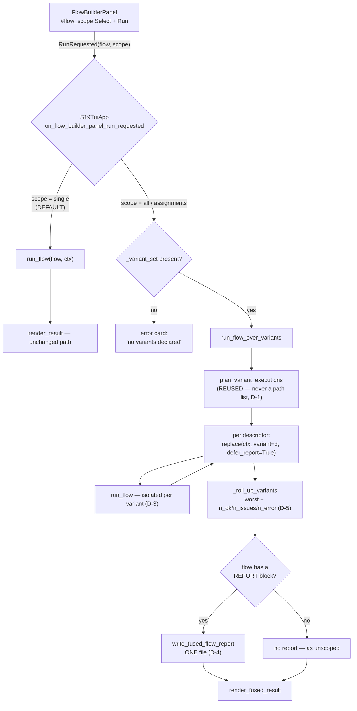
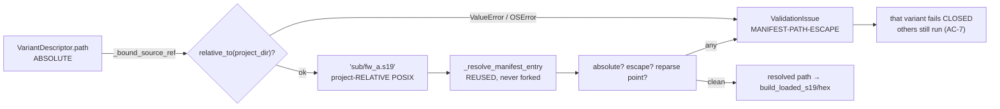
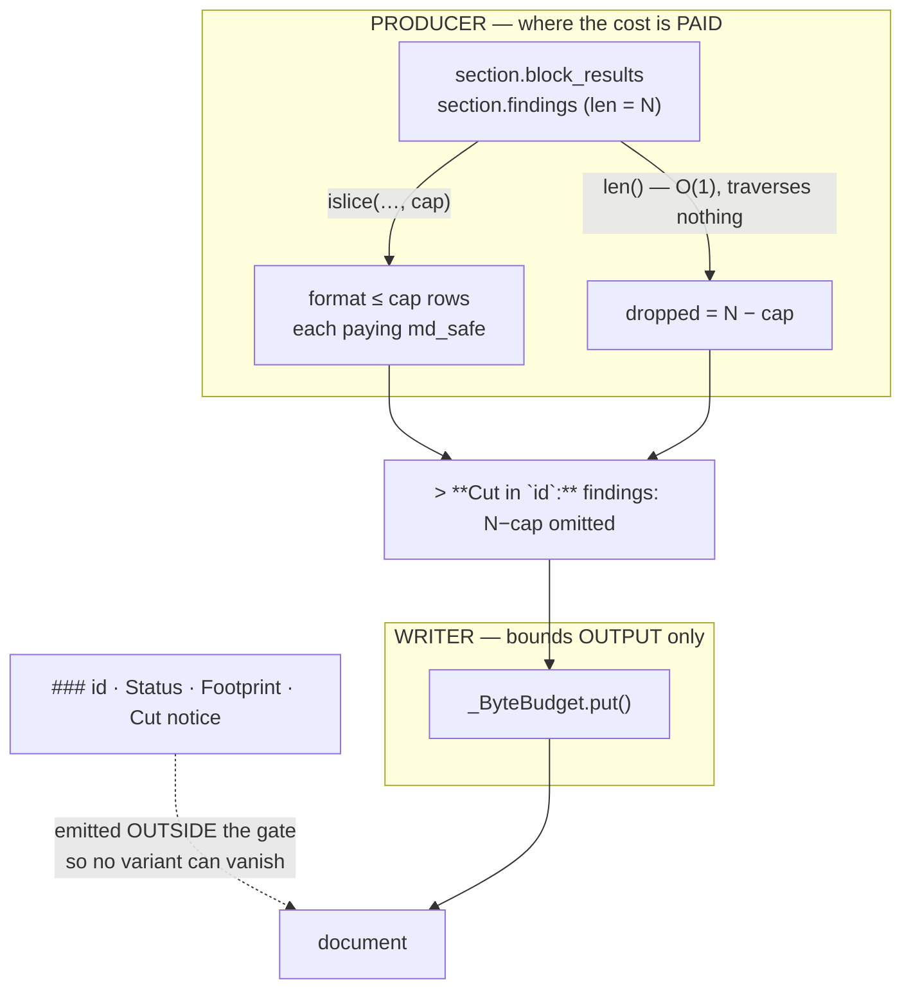

# batch-70 — FB-P2 architecture

## The run path, single vs fused

## The containment seam — why the ref is relative

> ⚠️ Passing the **absolute** path straight to `_resolve_manifest_entry` fails **every** variant —
> that seam rejects absolute refs by design. This was premise **P-2**, executed and FALSE, and it is
> the single most likely thing for a future editor to "simplify" back into a bug.

## Where the bound is charged (D-7)

**The distinction that matters:** capping at `E` (the writer) bounds what is *written*; capping at
`islice` (the producer) bounds what is *formatted*. batch-63's Phase-2 finding was precisely that
bounding output does not bound traversal — which is why `AT-209`'s oracle counts **formatting
operations**, not bytes, wall-clock or RSS.

## Module placement

| Module | Role | Edited? |
|---|---|---|
| `services/flow_model.py` | pure data — `FlowContext.variant`, `defer_report`, `FusedFlowRunResult`, `FLOW_SCOPE_*` | ✏️ |
| `services/flow_execution_service.py` | `_bound_source_ref`, `_roll_up_variants`, `run_flow_over_variants` | ✏️ |
| `services/flow_fused_report_service.py` | the fused composer + its per-variant bound | 🆕 |
| `services/flow_report_service.py` | the single-image composer | ⛔ **untouched — this is how AC-6 is structural rather than conditional** |
| `screens_directionb.py` | scope `Select`, `render_fused_result` | ✏️ |
| `app.py` | the one run call site dispatches on scope | ✏️ |
| engine-frozen set | `core.py`, `hexfile.py`, `range_index.py`, `validation/`, `tui/a2l.py`, `tui/mac.py` | ⛔ intersection with the edit set = ∅ |
