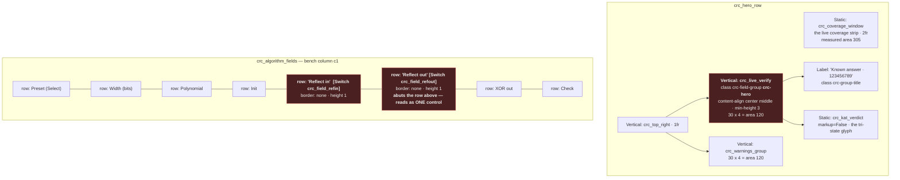
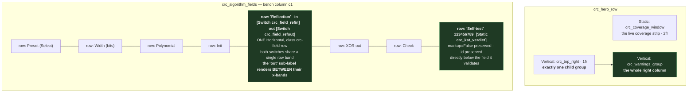
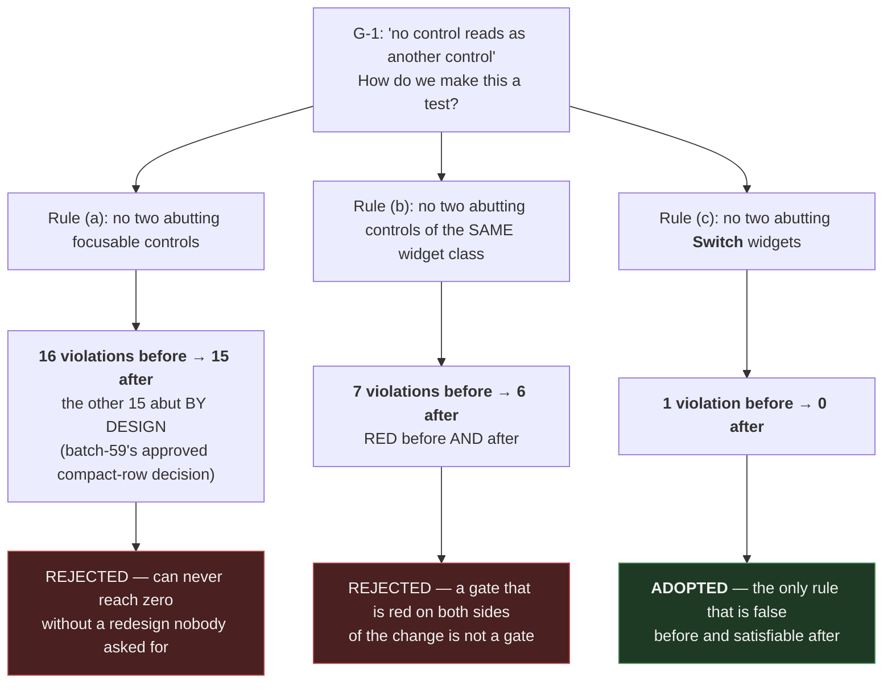

# CRC Designer bench — layout, before vs after

> Batch `2026-07-30-batch-72`, HLR-072-1 / HLR-072-2 / HLR-072-3 ·
> `s19_app/tui/crc_designer_view.py::CrcDesignerPanel.compose`
> Ids are shown without their leading `#` for diagram legibility.
> The bench shipped in batch-59 and was **never registered in `REQUIREMENTS.md`** — this batch adds
> `R-TUI-100`, the first requirement row the CRC Designer has ever had.

## The change in one sentence

**Two controls that read as one became a single labelled pair, and a verdict that had been given a
hero tile became an annotation of the field it validates** — freeing the hero row's right column for
Warnings alone.

---

## BEFORE — stacked switch rows and a verdict hero (shipped on `origin/main`)

**The two defects the operator reported, in the geometry.**

- **"Two switches look like one."** Two stacked single-row rows, each holding a `Switch` styled
  `border: none; height: 1`, with no row margin and no separator between them. `border: none`
  removes the only visual boundary Textual would otherwise draw, so the two 1-row borderless
  switches abut and read as one wider control. Measured on the shipped tree: `crc_field_refin` at
  `y=32 h=1`, `crc_field_refout` at `y=33 h=1` — exactly abutting.
- **"The known-answer verdict does not earn its placement."** It occupied a centre-aligned hero tile
  in the hero row's right column, at the same visual weight as the Warnings group, for a value that
  is a bench self-test rather than an operational result.

---

## AFTER — a paired Reflection row, a Self-test annotation, a Warnings-only right column

**What each change buys.**

| Change | What the operator now sees | What is guaranteed |
|---|---|---|
| One `Reflection` row with `in` / `out` sub-labels | A single labelled control that plainly contains two toggles | The two switches share one row band, and a `Label` renders **strictly between** their x-bands. Not co-location — separation |
| `Self-test` row under `Check` | The verdict sits with the field it validates, and names the reference vector `123456789` on screen | The id, the `markup=False` flag and the tri-state tokens (`✓ MATCH` / `✗ MISMATCH` / `○ NO-EXPECTED`) are all preserved; the verdict is still live, driven by a real edit to the Check field |
| `crc_top_right` holds Warnings only | The hero row's right column spends its space on the one thing that reports problems | Exactly one child group; the `crc_live_verify` wrapper is no longer composed at all |
| The per-toggle row helper deleted | *(nothing — invisible)* | Repo-wide grep for the helper name returns **zero** hits. It is removed, not left dead |

**The reference vector naming is load-bearing, not decoration.** The old hero tile's title was the
only on-screen occurrence of `123456789` in the entire repository. Without carrying it into the new
row, the row would read `Self-test ✓ MATCH` and never say *what* was self-tested.

---

## The separability guard, and why it is scoped the way it is

**Why this is a guard and not special-pleading for one pair.** The subject set is **derived from the
live screen** — every `Switch` with a non-zero render area — never hand-listed, so a third toggle
added to this screen is policed with no test edit. Its completeness rests on a separate, static fact
about the source: `Switch` is imported and constructed **only** in `crc_designer_view.py`, so every
`Switch` that can exist is composed by this view and is inside the scope the guard walks.

**A footnote that turned out to matter.** The specification pinned that fact as a *count* — "exactly
one construction site". That was true when it was measured, on `origin/main`. This batch then
**falsified it by succeeding**: deleting the per-toggle helper (one construction call invoked twice)
and inlining both toggles converted one site into two. The guard now asserts the invariant the count
stood for — single-module confinement — which survived the refactor untouched. A measured constant
is true of the tree it was measured on; when your own change *is* what moves that tree, prefer the
invariant to the number.
