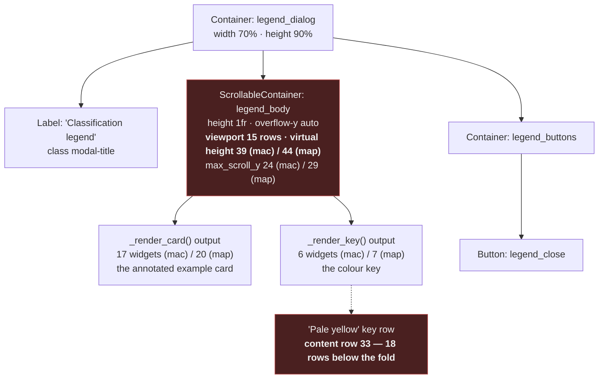
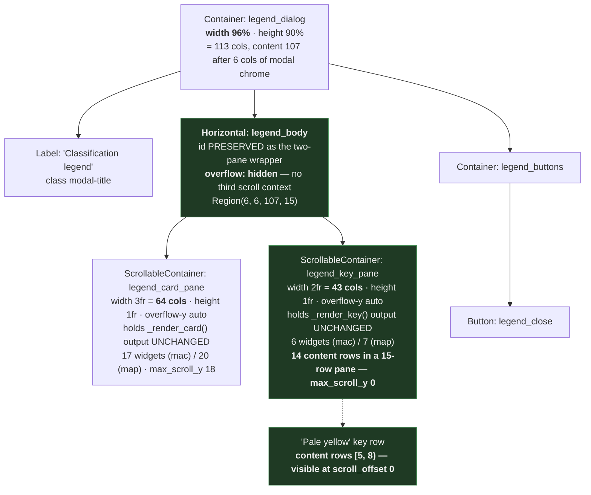
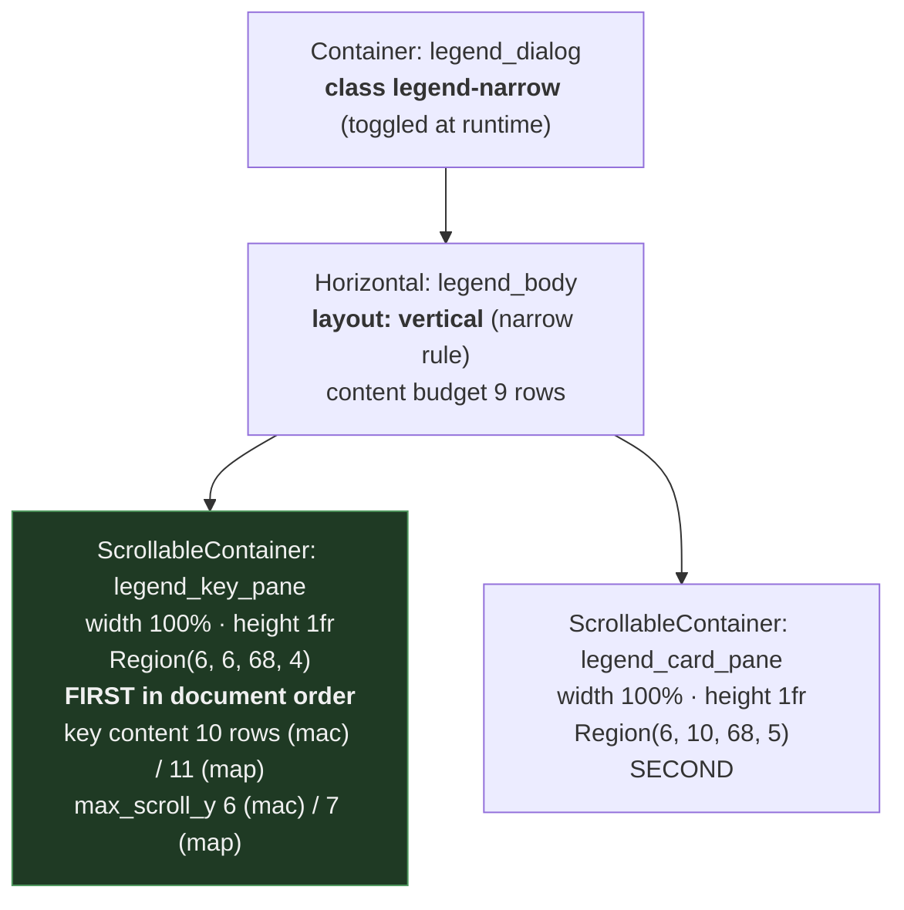
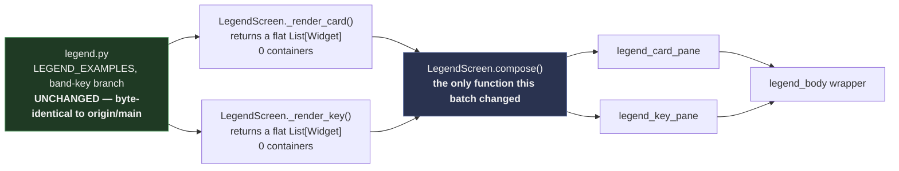

# Legend modal — widget tree, before vs after

> Batch `2026-07-30-batch-72`, HLR-072-5 / HLR-072-6 / HLR-072-7 · `s19_app/tui/screens.py::LegendScreen.compose`
> Ids are shown without their leading `#` for diagram legibility; in CSS and in the code they are
> `#legend_body`, `#legend_card_pane`, and so on.
> Every number below is measured — `00-measurements.md` M-2 (120x30), M-3 (80x24), M-6 (widget counts).

## The change in one sentence

**The body stopped being a single scrolling column and became a two-pane wrapper** — same id, same
data layer, same widgets, re-parented into two independently scrolling panes so the colour key is
beside the example card instead of ~18 content rows below it.

---

## BEFORE — one scrolling body (shipped on `origin/main`)

**What the reader is looking at.** `compose` concatenated the two widget lists — `body =
_render_card() + _render_key()` — and handed the whole thing to one scrolling container. The card
comes first, the key comes after it, and the key therefore begins below whatever the card happens to
occupy. At 120x30 that is content row 33 in a 15-row viewport. The operator's report is exactly this
geometry: **to read what a colour means you first scroll past the example card that uses it.**

---

## AFTER — two panes inside the preserved wrapper (wide regime, width ≥ 120)

**Three things to notice, because each was a deliberate decision.**

1. **`legend_body` kept its id.** It was a candidate for retirement, and retirement was measured
   **wrong**: nine descendant query sites across three test files select through it, and two
   `REQUIREMENTS.md` rows name it. It is now the wrapper rather than the scroller.
2. **The scroll context moved down one level.** `overflow-y: auto` came off the body and went onto
   the two panes; the body is `overflow: hidden`. Without that move there would be three nested
   scroll contexts and the panes' scrollbars would fight the body's.
3. **The data layer did not change at all.** `_render_card()` and `_render_key()` are called once
   each, exactly as before, and their returned widgets are **re-parented, never reconstructed**.
   `s19_app/tui/legend.py` is byte-identical to `origin/main` — asserted, not assumed.

---

## AFTER — the floor regime (width < 120)

At the 80-column floor there is no room for two columns. The panes stack, **key first**, and the key
becomes scroll-reachable rather than fully visible.

**Why "key first" is not a CSS property.** Textual 8.2.8 has no CSS ordering property, so **document
order is the stacking order**. The wide order is what `compose` yields (card, then key); the floor
order is produced at runtime by `#legend_body.move_child(...)`. CSS alone can stack the panes — it
cannot reorder them. That distinction was proven by mutation: replacing the `move_child` call with a
no-op leaves the `legend-narrow` class flipping correctly and the panes stacking correctly, and only
the **order** wrong.

**Why the key is not required to be fully visible at the floor.** Measured: 9 rows of budget against
a 10-or-11-row key. "Both panes visible" is unachievable under any non-degenerate layout, so the
requirement asks for the honest, testable property instead — the key is **reachable under scroll**,
which is one interaction, and the card is guaranteed at least 2 rows so a future layout cannot
satisfy "key first" by starving the card to a single line.

---

## Data flow — what is computed where

The split was cheap precisely because both render helpers already returned **flat widget lists with
no container of their own** — measured before the design was fixed, not discovered during
implementation. Had either returned a pre-wrapped container, the two-pane split would have required
a data-layer edit and this batch would have had a very different shape.
