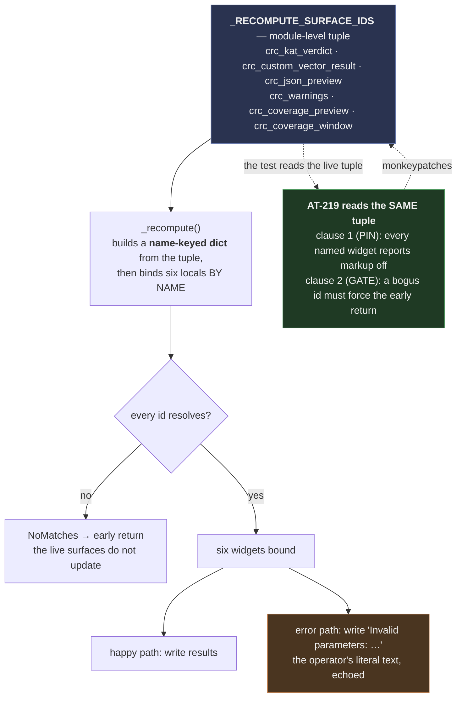

# Runtime mechanisms — the two flows that are not obvious from the widget trees

> Batch `2026-07-30-batch-72` · LLR-072-6.1 (the Legend width regime) and LLR-072-8.1 (the CRC
> recompute surface census). Both are behaviour, not structure, so neither is visible in
> [`legend-modal-widget-tree.md`](legend-modal-widget-tree.md) or
> [`crc-bench-layout.md`](crc-bench-layout.md).

---

## 1. The Legend width regime — why the modal has to do this itself

**Conclusion first: the app's existing responsive mechanism cannot reach this screen, so the modal
owns its own breakpoint.** The app applies a `width-narrow` class to `#workspace_shell` and
`#workspace_body`, both of which live in the **base screen**. `LegendScreen` is a modal pushed onto
the screen stack — a descendant of neither — and Textual 8.2.8 has no CSS media queries. There is no
selector that can reach the modal from the app's regime logic.

```mermaid
sequenceDiagram
    participant U as Operator
    participant App as S19TuiApp
    participant L as LegendScreen
    participant B as legend_body
    participant CSS as styles.tcss

    U->>App: press "k"
    App->>L: push_screen(LegendScreen)
    L->>L: compose() yields card pane, then key pane (the WIDE order)
    L->>L: on_mount()
    Note over L: reads self.app.size.width — NOT self.size.width,<br/>which is 2 smaller under a modal and would flip<br/>a 120-column terminal into the narrow regime
    L->>L: _apply_width_regime(width)
    alt width < 120 (floor)
        L->>CSS: set class "legend-narrow" on legend_dialog
        CSS-->>B: layout: vertical; both panes width 100%, height 1fr
        L->>B: move_child(key_pane, before=card_pane)
        Note over B: document order IS stacking order —<br/>Textual 8.2.8 has no CSS ordering property
    else width >= 120 (wide)
        L->>CSS: remove class "legend-narrow"
        CSS-->>B: layout: horizontal; card 3fr, key 2fr
        L->>B: move_child(card_pane, before=key_pane)
    end
    L->>L: focus legend_close

    U->>App: resize terminal
    App->>L: Resize event
    L->>L: on_resize() → _apply_width_regime(self.app.size.width)
    Note over L: idempotent — the move is skipped when the<br/>wanted pane is already first, so every resize<br/>can call this safely
```

### The two decisions inside this flow that were reached by measurement

| Decision | The obvious alternative | Why it was rejected |
|---|---|---|
| Read `self.app.size.width` | `self.size.width` | Under a modal, `Screen { padding: 1 }` makes the screen 2 columns smaller than the terminal: a 120-column terminal reports **118**, which is below the breakpoint and would render the wide case in the floor regime |
| Reorder with `move_child` | Let CSS do it | CSS can *stack* the panes; it cannot *order* them. Proven by mutation — with the reorder replaced by a no-op, the class still flips and the panes still stack, and only the order is wrong |
| Prefix every floor rule with `#legend_dialog.legend-narrow` | Write the floor rules unprefixed | Unprefixed, they have equal specificity to the wide rules and come later in source order, so they win in **both** regimes. The independent reviewer removed the three prefixes and the wide regime silently collapsed into the pre-batch defect shape — the key back under the card. That mutation is the reason the acceptance test gained an explicit side-by-side assertion |

---

## 2. The CRC recompute surface census — one declared id set, consumed by name

**Conclusion first: six live surfaces echo user-typed text, and until this batch only four of them
had their markup-safety flag pinned by any test — in a batch that rewrites the very function setting
those flags.**

The reachable failure path is short and real: a non-hex keystroke in any algorithm field raises a
`ValueError`, and the recompute path writes `f"Invalid parameters: {exc}"` — the operator's literal
text — into all six surfaces. There is no `try/except` around those writes. A stray `[` in a surface
that had lost its `markup=False` flag would corrupt or crash the message that exists to report the
bad parameter, on the UI thread.



### Two design points worth stating plainly

**Consumption is by name, never a positional unpack.** The six ids carry six distinct roles with
three different error-path strings. Under a positional unpack, the advertised benefit — "a seventh
surface added later is covered automatically" — becomes a `ValueError` raised on the UI thread the
moment a seventh id is declared, and the census test could not detect it.

**Only one of the two test clauses is a gate, and it is labelled as such.** All six surfaces were
*already* markup-safe before this batch, so the clause that checks them is a **regression pin**: it
protects the rewrite, it does not prove the rewrite landed. The clause that proves the rewrite
landed is the other one — put a bogus id in the tuple and the recompute path must take its early
return. That clause is false before the change and true after, which is what makes it the gate. A
counterfactual confirmed it: with the pre-batch function body re-bound onto the class, the bogus id
changes nothing at all and the verdict moves anyway, because the tuple would have been declared and
then ignored.
